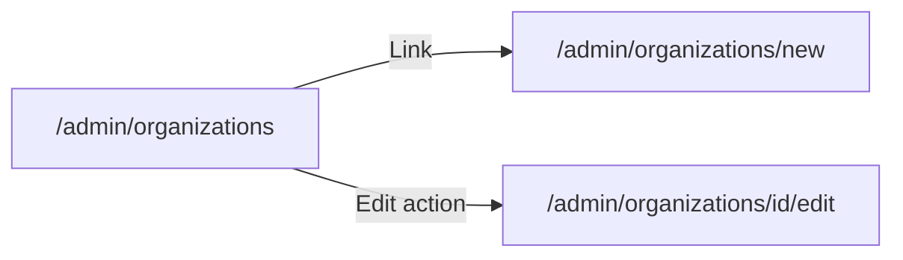

# Admin create UX + статусы + без градиентов

## Контекст

| Область | Сейчас | Цель |
|---------|--------|------|
| Организации | [`OrganizationDialog`](components/admin/crud/organization-dialog.tsx) (modal) на [`organizations-manager.tsx`](components/admin/organizations-manager.tsx) | Отдельные страницы create/edit, как у мер и поручений |
| Меры / поручения | [`measure-form.tsx`](components/admin/measure-form.tsx) и [`order-create-form.tsx`](components/admin/order-create-form.tsx) — `max-w-lg`/`max-w-2xl`, голые поля | Card-grid layout по образцу [`public-item-detail.tsx`](components/public/public-item-detail.tsx) |
| KPI на сводке | [`dashboard-stat-cards.tsx`](components/dashboard/dashboard-stat-cards.tsx): «Всего мер», «Просрочено», «Выполнено», «В работе» + градиенты | 4 карточки в порядке workflow: **К исполнению → В работе → Выполнено → Просрочено** |
| Начальный статус | `WORKFLOW_STATUS.NOT_STARTED = "Не начато"` в [`workflow.ts`](lib/statuses/workflow.ts) и seed | **«К исполнению»** (выбор пользователя) |
| Градиенты | KPI cards + public item cards | Plain `Card` без `bg-gradient-to-t from-primary/5` |

---

## 1. Переименование статуса «Не начато» → «К исполнению»

**Источник правды:** [`lib/statuses/workflow.ts`](lib/statuses/workflow.ts)

```ts
NOT_STARTED: "К исполнению"
```

Добавить константу порядка для UI/графиков:

```ts
export const STATUS_DISPLAY_ORDER = [
  WORKFLOW_STATUS.NOT_STARTED,
  WORKFLOW_STATUS.IN_PROGRESS,
  WORKFLOW_STATUS.COMPLETED,
  OVERDUE_LABEL,
] as const
```

**Миграция БД** в [`prisma/seed.ts`](prisma/seed.ts) (idempotent, по аналогии с `migrateLegacyOverdueStatus`):
- если есть статус `"Не начато"` — переименовать в `"К исполнению"` (или upsert нового + перенос `orderItem.statusId`)
- обновить `DEFAULT_STATUSES[0].name`

Логика `isNotStarted`, API `action: "start"`, seed — без изменений поведения, только новое имя.

---

## 2. KPI-счётчики и порядок статусов на графиках

### [`dashboard-stat-cards.tsx`](components/dashboard/dashboard-stat-cards.tsx)

- Заменить массив `cards` на 4 статусные карточки в порядке `STATUS_DISPLAY_ORDER`
- `buildSummary` → читать count из `stats.statusDistribution` по каждому статусу (overdue — computed label `OVERDUE_LABEL`)
- Убрать градиент с grid wrapper: заменить `*:data-[slot=card]:bg-gradient-to-t ...` на обычный `gap-4` grid (при необходимости оставить `shadow-xs` или border-only)
- Иконки: `ClockIcon` / `HourglassIcon` для «К исполнению», остальные без изменений

### [`lib/dashboard/stats.ts`](lib/dashboard/stats.ts)

- После `buildStatusDistribution` — сортировать по `STATUS_DISPLAY_ORDER` (неизвестные статусы — в конец)
- Зафиксировать `fill` по индексу в порядке workflow (chart-1..4), чтобы цвета не прыгали

[`scoped-dashboard-charts.tsx`](components/dashboard/scoped-dashboard-charts.tsx) — без логических изменений; порядок секторов pie подтянется из отсортированных данных.

---

## 3. Организации — убрать modal, перейти на страницы



**Новые файлы:**
- [`components/admin/organization-form.tsx`](components/admin/organization-form.tsx) — логика из `organization-dialog.tsx` (POST/PUT, `useCrudSubmit`, `FormErrorSlot`)
- [`app/(admin)/admin/(panel)/organizations/new/page.tsx`](app/(admin)/admin/(panel)/organizations/new/page.tsx) — `PageHeader` + `OrganizationForm`
- [`app/(admin)/admin/(panel)/organizations/[id]/edit/page.tsx`](app/(admin)/admin/(panel)/organizations/[id]/edit/page.tsx) — server fetch org + edit form

**Layout формы** (card-grid, full width `@container/main`):

```
┌─────────────────────────┬─────────────────────────┐
│ Card «Основное»         │ Card «Код»              │
│ Название                │ Краткий код             │
└─────────────────────────┴─────────────────────────┘
│ CardFooter: Сохранить / Отмена                      │
```

**Изменить [`organizations-manager.tsx`](components/admin/organizations-manager.tsx):**
- Кнопка «Добавить» → `<Link href="/admin/organizations/new">`
- Действие «Изменить» в таблице → `/admin/organizations/{id}/edit`
- Удалить `OrganizationDialog`, state `dialogOrg`
- Empty state CTA — тоже Link

**Удалить** [`organization-dialog.tsx`](components/admin/crud/organization-dialog.tsx) (единственный consumer).

> Подразделения остаются в `SubdivisionDialog` на странице org detail — в scope не входят.

---

## 4. Меры и поручения — card-based create/edit

### [`measure-form.tsx`](components/admin/measure-form.tsx)

- Убрать `max-w-lg`; full-width grid `lg:grid-cols-2`
- **Card «Основное»:** название, код ФСТЭК
- **Card «Описание»:** textarea с `text-muted-foreground leading-relaxed`
- **Card «Действия»** (full width): submit + cancel, `FormErrorSlot` вместо `<Alert variant="destructive">`
- Create и edit ([`measures/new`](app/(admin)/admin/(panel)/measures/new/page.tsx), [`measures/[id]/edit`](app/(admin)/admin/(panel)/measures/[id]/edit/page.tsx)) — без изменений маршрутов

### [`order-create-form.tsx`](components/admin/order-create-form.tsx)

- Убрать `max-w-2xl`
- **Card «Параметры поручения»:** title, org select, due date, subdivision
- **Card «Меры»:** `MeasurePicker` + счётчик выбранных
- **Card footer / actions row:** primary «Создать поручение»

Страница [`orders/new/page.tsx`](app/(admin)/admin/(panel)/orders/new/page.tsx) уже имеет `PageHeader` — форма подтягивается визуально.

---

## 5. Убрать градиенты

| Файл | Изменение |
|------|-----------|
| [`dashboard-stat-cards.tsx`](components/dashboard/dashboard-stat-cards.tsx) | убрать gradient utility classes с grid |
| [`public-item-detail.tsx`](components/public/public-item-detail.tsx) | Card «О мере» и «Отчёт» — plain `Card`; сохранить семантику через `border-destructive/40`, `border-primary/30`, `bg-destructive/5`, `bg-primary/5` (flat tint, не gradient) |

---

## 6. Проверка

```bash
npm run typecheck && npm run lint && npm run build
```

Ручная проверка:
- Admin: create/edit org, measure, order — card layout, без modal для org
- Public + admin dashboard: KPI 4 карточки в порядке К исполнению → В работе → Выполнено → Просрочено
- Pie chart: тот же порядок легенды/секторов
- Public item: «Взять в работу» видна для статуса «К исполнению»
- Sidebar badges показывают новое имя статуса
