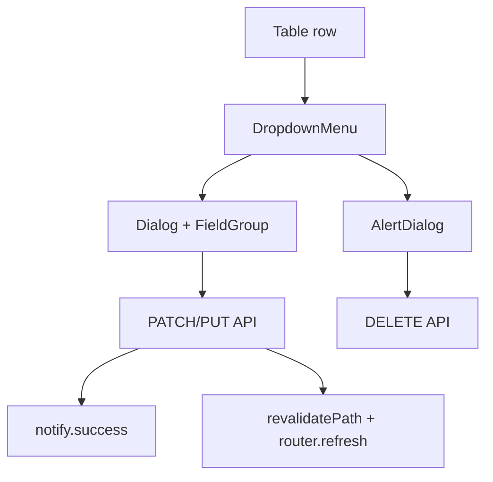

# Admin CRUD (shadcn max)

## Текущее состояние

| Таблица в UI | Create | Read | Update | Delete |
|--------------|--------|------|--------|--------|
| [Меры](app/(admin)/admin/(panel)/measures/page.tsx) | ✅ страница | ✅ | ✅ edit page | ❌ API есть, UI нет |
| [Статусы](components/admin/statuses-manager.tsx) | ✅ | ✅ | ✅ Dialog | ✅ AlertDialog |
| [ДЗО](components/admin/organizations-manager.tsx) | ✅ Card | ✅ | ❌ API есть | ❌ API есть |
| [Подразделения](components/admin/org-detail-client.tsx) | ✅ | ✅ | ❌ | ❌ API delete only |
| [Поручения](app/(admin)/admin/(panel)/orders/page.tsx) | ✅ wizard | ✅ detail | ❌ | ❌ |
| [Позиции поручения](components/admin/order-detail-client.tsx) | ✅ при create | ✅ | ❌ admin | ❌ |
| [Ссылки](components/admin/org-links-panel.tsx) | ✅ | ✅ | N/A | ✅ revoke |
| Dashboard matrix | — | ✅ | — | — (read-only сводка) |

**Цель:** одинаковый UX во всех таблицах — колонка «Действия» с `DropdownMenu`, редактирование в `Dialog`, удаление через `AlertDialog`, пустые списки через `Empty`.

---

## shadcn: что добавить

Установить недостающие компоненты ([skill](.agents/skills/shadcn/SKILL.md)):

```bash
npx shadcn@latest add alert-dialog dropdown-menu empty tooltip -y
```

Паттерны из skill:
- **Delete** → `AlertDialog` (не `Dialog`)
- **Row actions** → `DropdownMenu` + `DropdownMenuItem` внутри `DropdownMenuGroup`
- **Empty table** → `Empty` + `EmptyHeader` / `EmptyDescription` / `EmptyContent`
- **Forms in dialogs** → `FieldGroup` + `Field`, `DialogFooter`
- **Feedback** → существующий [`notify`](lib/ui/feedback.ts) + `revalidatePath`

---

## Общие компоненты (DRY)

Новые файлы в `components/admin/crud/`:

| Компонент | Назначение |
|-----------|------------|
| `table-row-actions.tsx` | `DropdownMenu` с пунктами «Изменить» / «Удалить» (+ иконки lucide, `data-icon`) |
| `confirm-delete-alert.tsx` | `AlertDialog` — title, description, destructive confirm |
| `edit-organization-dialog.tsx` | Dialog: name, shortCode |
| `edit-subdivision-dialog.tsx` | Dialog: name |
| `edit-order-dialog.tsx` | Dialog: title (org readonly после создания) |
| `edit-order-item-dialog.tsx` | Dialog: Select status, date dueAt, Select subdivision |
| `empty-table-state.tsx` | обёртка `Empty` для `DataTableShell` |

Все list-таблицы получают последнюю колонку `<TableHead className="w-[70px]" />` + `TableRowActions`.

---

## Phase 38 — API gaps

### 38a. Subdivisions

- Новый [`app/api/subdivisions/[id]/route.ts`](app/api/subdivisions/[id]/route.ts): `PUT` (rename), `DELETE` (перенести логику из [`app/api/subdivisions/route.ts`](app/api/subdivisions/route.ts))
- [`lib/organizations/index.ts`](lib/organizations/index.ts): `updateSubdivision(id, name)`
- [`lib/validations/organizations.ts`](lib/validations/organizations.ts): `subdivisionUpdateSchema`

### 38b. Orders

- Расширить [`app/api/orders/[id]/route.ts`](app/api/orders/[id]/route.ts):
  - `PUT` — `{ title }` (organizationId не меняем после создания)
  - `DELETE` — cascade items (Prisma `onDelete: Cascade` на items)
- [`lib/orders/index.ts`](lib/orders/index.ts): `updateOrder`, `deleteOrder`
- [`lib/validations/orders.ts`](lib/validations/orders.ts): `updateOrderSchema`

### 38c. Order items (admin)

- Новый [`app/api/orders/[id]/items/[itemId]/route.ts`](app/api/orders/[id]/items/[itemId]/route.ts):
  - `PATCH` — `{ statusId?, dueAt?, subdivisionId? }`
  - `DELETE` — удалить позицию из поручения
- [`lib/orders/index.ts`](lib/orders/index.ts): `updateOrderItem`, `deleteOrderItem`
- `orderItemUpdateSchema` в validations

Все mutations: `revalidatePath` для `/admin`, `/panel/orders`, `/panel/orders/[id]`.

---

## Phase 39 — CRUD UI: справочники

### Меры

[`app/(admin)/admin/(panel)/measures/page.tsx`](app/(admin)/admin/(panel)/measures/page.tsx) + client wrapper или [`measures-table.tsx`](components/admin/measures-table.tsx):

- `DropdownMenu`: Изменить (Link) / Удалить
- `ConfirmDeleteAlert` → `DELETE /api/measures/[id]`
- Ошибка если мера в поручениях → `notify.error` с текстом из API

### ДЗО

[`organizations-manager.tsx`](components/admin/organizations-manager.tsx):

- `DropdownMenu` на строке: Открыть / Изменить / Удалить
- `EditOrganizationDialog` → `PUT /api/organizations`
- `ConfirmDeleteAlert` → `DELETE /api/organizations` (блок если есть orders — Prisma FK или явная проверка)

[`org-detail-client.tsx`](components/admin/org-detail-client.tsx) — tab Подразделения:

- Колонка «Действия»: Изменить / Удалить
- `EditSubdivisionDialog` → `PUT /api/subdivisions/[id]`
- `ConfirmDeleteAlert` → `DELETE /api/subdivisions/[id]`

---

## Phase 40 — CRUD UI: поручения и позиции

### Поручения list

[`orders/page.tsx`](app/(admin)/admin/(panel)/orders/page.tsx) → client `OrdersTable`:

- Actions: Открыть / Изменить / Удалить
- `EditOrderDialog` (title)
- Delete order + all items с confirm

### Order detail — позиции

[`order-detail-client.tsx`](components/admin/order-detail-client.tsx):

- Новая колонка «Действия»
- `EditOrderItemDialog`: Select статус, Input date, Select подразделение (из org.subdivisions)
- Delete item с `AlertDialog`
- `PageHeader` actions: «Изменить поручение» (EditOrderDialog)



---

## Phase 41 — shadcn polish

- Заменить все «Нет данных» plain text на [`Empty`](components/ui/empty) в measures, orders, orgs, subdivisions, statuses, order items
- Статусы: мигрировать delete confirm с `Dialog` на `AlertDialog` (единый паттерн)
- Tooltips на icon-only кнопках (copy link в org-links-panel)
- Единый `min-w-[52px]` error slot в edit dialogs

**Dashboard matrix** — без CRUD (агрегация); только ссылка на поручение уже есть.

**Public cabinet** — вне scope (исполнитель, не admin CRUD).

---

## DoD

- `npm run typecheck && lint && build`
- Каждая admin-таблица: Create + Read + Update + Delete (кроме dashboard и links)
- Все delete через `AlertDialog`, все row menus через `DropdownMenu`
- Пустые таблицы через `Empty`
- После любой mutation — toast + обновление UI без F5

---

## Подфазы

| # | Branch | Scope |
|---|--------|-------|
| 38 | `fstec/phase-38-crud-api` | subdivisions/orders/order-items API + lib |
| 39 | `fstec/phase-39-crud-catalogs` | shadcn install, shared crud components, measures/orgs/subs |
| 40 | `fstec/phase-40-crud-orders` | orders list + order items edit/delete |
| 41 | `fstec/phase-41-crud-polish` | Empty, AlertDialog unify, tooltips |

Зависимости: 38 → 39 → 40 → 41.

Строится поверх уже выполненного [unified UX plan](.cursor/plans/fstec_unified_ux_5f45aad9.plan.md) (`PageHeader`, `DataTableShell`, `notify`).
