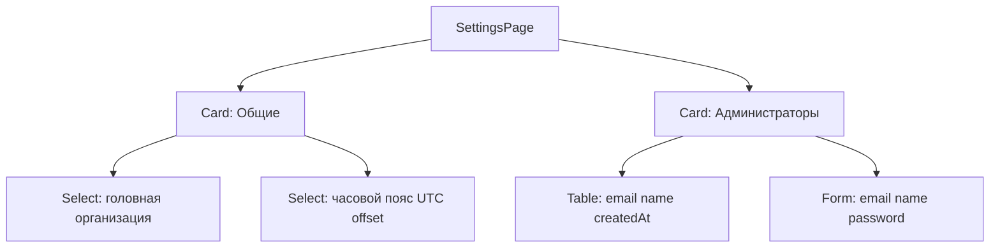

# Страница настроек админ-панели

## Контекст

Сейчас:
- Часовой пояс — **localStorage** ([`timezone-provider.tsx`](components/timezone-provider.tsx)), селектор в шапке ([`app-shell.tsx`](components/shell/app-shell.tsx))
- Админы — модель [`User`](prisma/schema.prisma) с `UserRole.ADMIN`, создаются только через seed/env
- «Головная организация» — **не хранится**; при создании поручения берётся первая org из списка ([`order-create-form.tsx`](components/admin/order-create-form.tsx): `o[0]`)
- Маршрута `/admin/settings` нет (упоминался в master plan только для statuses)

**Решение пользователя:** timezone — **глобально в БД**, один для всех.

---

## 1. Модель данных

Новая таблица-синглтон в [`prisma/schema.prisma`](prisma/schema.prisma):

```prisma
model AppSettings {
  id                 Int           @id @default(1)
  headOrganizationId Int?          @map("head_organization_id")
  timezone           String        @default("Europe/Moscow")
  updatedAt          DateTime      @updatedAt @map("updated_at") @db.Timestamptz()
  headOrganization   Organization? @relation(fields: [headOrganizationId], references: [id], onDelete: SetNull)

  @@map("app_settings")
}
```

- На `Organization` — обратная связь `appSettingsHead AppSettings?`
- Миграция + seed: `upsert` строки `id: 1`, `timezone: "Europe/Moscow"`

**Lib:** [`lib/settings/index.ts`](lib/settings/index.ts)
- `getAppSettings()` — include `headOrganization`
- `updateAppSettings({ headOrganizationId?, timezone? })`
- `getPublicTimezone()` — лёгкий read для провайдера

**Validations:** [`lib/validations/settings.ts`](lib/validations/settings.ts), [`lib/validations/users.ts`](lib/validations/users.ts)

---

## 2. API

| Endpoint | Auth | Назначение |
|----------|------|------------|
| `GET /api/settings` | нет (только `timezone`, `headOrganization: { id, name } \| null`) | провайдер дат + публичный контекст |
| `PUT /api/settings` | `requireAdminSession` | сохранение head org + timezone |
| `GET /api/users` | admin | список админов (`id`, `email`, `name`, `createdAt`) |
| `POST /api/users` | admin | создание админа (`email`, `name`, `password`) |

- POST: `hashPassword` из [`lib/auth/password.ts`](lib/auth/password.ts), `role: ADMIN`
- Защита: нельзя создать дубликат email (Prisma unique)
- `revalidatePath("/admin/settings")` после изменений

---

## 3. UI — `/admin/settings`

**Маршрут:** [`app/(admin)/admin/(panel)/settings/page.tsx`](app/(admin)/admin/(panel)/settings/page.tsx)

**Компонент:** [`components/admin/settings-client.tsx`](components/admin/settings-client.tsx) — три карточки (паттерн [`organization-form.tsx`](components/admin/organization-form.tsx)):



1. **Общие**
   - Select головной org из `listOrganizations()`
   - Select timezone из [`TIMEZONE_OPTIONS`](lib/datetime/timezones.ts) (уже с UTC offset в label)
   - Кнопка «Сохранить» → `PUT /api/settings`

2. **Администраторы**
   - Таблица существующих admin users
   - Форма «Добавить администратора» → `POST /api/users` → обновить список

**Навигация:**
- Пункт «Настройки» в [`app-sidebar.tsx`](components/app-sidebar.tsx) (`SettingsIcon`, `/admin/settings`)
- Crumb в [`admin-breadcrumb.tsx`](components/admin/admin-breadcrumb.tsx)

**UX головной org:**
- Бейдж «Головная» в [`organizations-manager.tsx`](components/admin/organizations-manager.tsx) для выбранной org
- Default org в [`order-create-form.tsx`](components/admin/order-create-form.tsx): `headOrganizationId` из settings, fallback — первая org

---

## 4. Timezone — убрать localStorage, перенести в настройки

Изменения в [`timezone-provider.tsx`](components/timezone-provider.tsx):
- Убрать `localStorage` / `TIMEZONE_STORAGE_KEY`
- При mount: `fetch("/api/settings")` → установить `timeZone`
- `setTimeZone` — обновляет локальный state (вызывается после успешного PUT на странице настроек)

Изменения в [`app-shell.tsx`](components/shell/app-shell.tsx):
- **Убрать** `<TimezoneSelect />` из header

[`timezone-select.tsx`](components/timezone-select.tsx) — переиспользовать на странице настроек (controlled через settings form, не через header)

---

## 5. Проверка (DoD)

```bash
npm run typecheck && npm run lint && npm run build
npx prisma migrate dev
```

**UI smoke:**
1. `/admin/settings` — сохранить головную org и timezone
2. Шапка — нет селектора timezone; даты в таблицах/filters отображаются в выбранном поясе
3. Создание поручения — org по умолчанию = головная
4. Создание нового админа → login под новым email
5. Список организаций — бейдж у головной

---

## Вне scope

- Удаление/блокировка админов
- `/admin/settings/statuses` (отдельная задача)
- Роли кроме `ADMIN`
