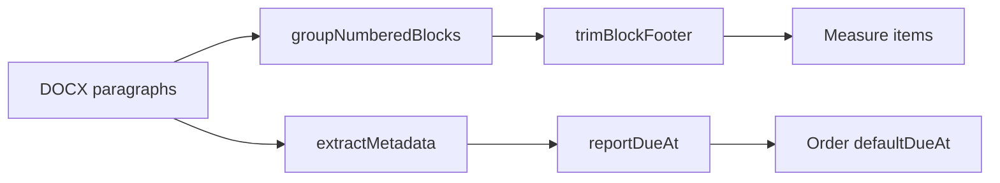

# Валидация канонического парсинга и фикс футера

## Диагностика (проверено)

**Пример 240/93/2616:**
- Парсер находит **16 BDU-мер** — это правильно
- `reportDueAt` = **20.06.2026** уже в БД и в [`loadOrderCreateContext`](lib/orders/order-create-context.ts) → `defaultDue` формы поручения
- Проблема: футер попадает **внутрь описания последней меры** (не отдельной мерой)

**Причина** в [`trimBlockFooter`](lib/measure-imports/parse-docx.ts):

```112:127:lib/measure-imports/parse-docx.ts
function trimBlockFooter(block: NumberedBlock): NumberedBlock {
  // обрезает только с КОНЦА блока, пока подряд идут footer-параграфы
  for (let i = block.paragraphs.length - 1; i >= 1; i--) {
    if (isLetterFooterParagraph(block.paragraphs[i]!)) {
      cutIndex = i
    } else {
      break  // ← ломается на «В случае направления данных рекомендаций…»
    }
  }
}
```

У 2616 блок `16.` содержит меру + компенсирующие пункты + 2 футерных абзаца. Второй абзац не распознаётся как футер → обрезка не срабатывает.

**Масштаб:** скан 221 письма → **98 с утечкой футера**, **0** без `reportDueAt` при наличии даты в тексте.



---

## Фаза 1 — Исправить обрезку футера

Файл: [`lib/measure-imports/parse-docx.ts`](lib/measure-imports/parse-docx.ts)

### 1a. Расширить `isLetterFooterParagraph`
Добавить паттерны:
- `В случае направления данных рекомендаций`
- `просим направлять их в редактируемом формате`
- `просим проинформировать ФСТЭК` (на случай склейки в один абзац)

### 1b. Переписать `trimBlockFooter`
Обрезать с **первого** футерного параграфа внутри блока (индекс ≥ 1), а не только хвост подряд:

```typescript
for (let i = 1; i < block.paragraphs.length; i++) {
  if (isLetterFooterParagraph(block.paragraphs[i]!)) {
    return { ...block, paragraphs: block.paragraphs.slice(0, i) }
  }
}
```

### 1c. Страховка в `splitBlockContent`
Если футер всё же остался в склеенном тексте — отрезать по regex `\n\nПо результатам выполнения[\s\S]*$` перед возвратом `description`.

### Тесты: [`lib/measure-imports/__tests__/parse-docx.test.ts`](lib/measure-imports/__tests__/parse-docx.test.ts)
- Кейс как у 2616: нумерованный блок + компенсирующие абзацы + 2 футерных → описание без «По результатам…»
- Интеграционный тест на реальный файл `.external/240 93 6837/240 93 2616/240 93 2616.docx`

После фикса повторный скан должен дать `footerLeak: 0` (или близко к 0).

---

## Фаза 2 — Скрипт валидации канонических писем

Новый [`scripts/validate-canonical-parse.mjs`](scripts/validate-canonical-parse.mjs) + `npm run corpus:validate-parse`.

Для каждого письма из [`prisma/seed-manifest.generated.json`](prisma/seed-manifest.generated.json) (`240 93 NNNN.docx`):

| Проверка | Условие FAIL |
|----------|--------------|
| `itemCount` | 0 мер и не routing с canonical appendix |
| `footerLeak` | любая мера содержит `По результатам выполнения` / `просим проинформировать ФСТЭК` |
| `reportDueAt` | в тексте есть `до N месяца YYYY`, но `extractMetadata` вернул `null` |
| `dueInFooter` | дата только в футере — убедиться что всё равно извлекается |

Выход: `canonical-parse-report.json` + summary в stdout, exit code 1 при ошибках.

---

## Фаза 3 — Срок отчёта в поручение (верификация)

Уже работает:
- [`extractReportDueAt`](lib/measure-imports/extract-metadata.ts) — `до 20 июня 2026`
- Import: `MeasureImport.reportDueAt`
- Order create: [`defaultDueFromDate(record.reportDueAt)`](lib/orders/order-create-context.ts) → поле срока в [`order-create-client.tsx`](components/platform/order-create-client.tsx)

Добавить тест в [`lib/measure-imports/__tests__/extract-metadata.test.ts`](lib/measure-imports/__tests__/extract-metadata.test.ts) на фразу из футера 2616:
`до 20 июня 2026 г. в форме письма…`

Опционально (минимально): в карточке импорта [`measure-import-detail-header.tsx`](components/platform/measure-import-detail-header.tsx) срок уже показывается — без изменений, если тесты зелёные.

---

## Фаза 4 — Перепарсить БД

После мержа фикса парсера:

```bash
npm run corpus:validate-parse    # должно быть 0 footerLeak
# перепарсить существующие импорты без полного reset:
npx tsx --env-file=.env.local scripts/reparse-imports.mjs
```

Новый лёгкий скрипт [`scripts/reparse-imports.mjs`](scripts/reparse-imports.mjs):
- Для всех `MeasureImport` со статусом `IMPORTED` или `PARSED` (LETTER)
- Вызвать логику `parseMeasureImport` + обновить items + re-commit measures (или `SEED_PURGE_IMPORTS=1` + `db:seed:corpus:full` если проще)

Для 2616: после reparse последняя мера — только BDU-текст, без футера; `reportDueAt` сохраняется.

---

## Критерии готовности

1. `corpus:validate-parse` — 0 `footerLeak` по 221 письму
2. 240/93/2616 — 16 мер, ни одна без футерного текста
3. `reportDueAt` = 20.06.2026 → `defaultDue` в форме поручения
4. Тесты `parse-docx`, `extract-metadata` проходят
