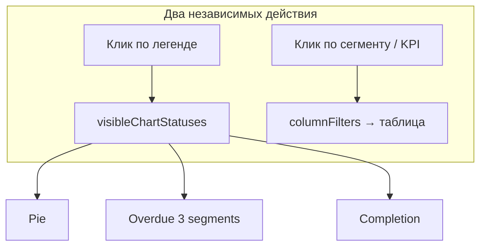

# Категории на графиках: легенда-переключатель

## Что меняется относительно старого плана

| Было | Стало |
|------|-------|
| Отдельный Switch «Выполнено на графиках» | **Легенда на каждом графике** — клик вкл/выкл любой категории |
| Скрыть только «Выполнено» | Скрыть **любой** из `DASHBOARD_STATUS_ORDER` |
| Легенда фильтрует таблицу | Легенда = **видимость на графиках**; клик по сегменту/слайсу = фильтр таблицы |

KPI-карточки и таблица по-прежнему работают со всеми данными; меняется только отрисовка графиков.



---

## 1. Состояние видимости

В [`dashboard-interactive.tsx`](components/dashboard/dashboard-interactive.tsx):

```ts
const [visibleChartStatuses, setVisibleChartStatuses] = useState(
  () => new Set(DASHBOARD_STATUS_ORDER)
)
```

Пробросить `visibleChartStatuses` + `onToggleChartCategoryVisibility` через [`scoped-dashboard-view.tsx`](components/dashboard/scoped-dashboard-view.tsx) → [`scoped-dashboard-charts.tsx`](components/dashboard/scoped-dashboard-charts.tsx) → три chart-section.

---

## 2. Логика переключения (чистые функции)

Новый [`lib/dashboard/chart-visibility.ts`](lib/dashboard/chart-visibility.ts):

- `isChartStatusVisible(visible, status): boolean`
- `toggleChartCategoryVisibility(visible, status, order): Set<string>` — **no-op**, если пытаемся скрыть последнюю видимую категорию
- `canHideChartCategory(visible): boolean` — `visible.size > 1`
- `filterStatusDistribution(dist, visible): StatusDistribution[]` — только видимые; пересчёт не нужен для count
- `visibleStatusesInOrder(order, visible): string[]` — порядок для stacked bars
- `sumVisibleBreakdown(row, visible): number` — denominator для процентов в легенде

Тесты: [`lib/dashboard/__tests__/chart-visibility.test.ts`](lib/dashboard/__tests__/chart-visibility.test.ts) — особенно «нельзя скрыть последнюю» и пересчёт totals.

---

## 3. Легенда: два визуальных состояния

Доработать [`DashboardChartLegend`](components/dashboard/dashboard-chart-shared.tsx):

| Prop | Смысл |
|------|-------|
| `visible?: boolean` | категория на графике (false → opacity + line-through) |
| `active?: boolean` | фильтр таблицы подсвечен (как сейчас) |
| `disabled?: boolean` | последняя видимая — нельзя скрыть (`cursor-not-allowed`) |

**Клик по легенде** → только `onToggleChartCategoryVisibility(key)`.

Убрать привязку легенды к фильтру таблицы:
- Pie: `onStatusClick` убрать с легенды, оставить на `Pie` slice click
- Completion: `onCompletionLegendClick` заменить на visibility toggle
- Overdue: `onOverdueLegendClick` заменить на visibility toggle

Фильтр таблицы остаётся через: клик сегмента stacked bar, клик слайса pie, KPI-карточки, клик по оси (breakdown).

---

## 4. График просрочки — 3 сегмента

Переработать [`overdue-breakdown-chart-section.tsx`](components/dashboard/overdue-breakdown-chart-section.tsx):

- Данные из `statusBreakdown` (передать из [`scoped-dashboard-charts.tsx`](components/dashboard/scoped-dashboard-charts.tsx))
- Stacked bar снизу вверх: **Просрочено → В работе → Выполнено**
- Легенда: все 3 статуса из `DASHBOARD_STATUS_ORDER` (как completion), с учётом `visibleChartStatuses`
- Клик по сегменту bar → `onStatusBreakdownClick(label, status)` (фильтр таблицы)

Обновить [`chart-filters.ts`](lib/dashboard/chart-filters.ts):

- `OverdueChartSegment`: `"overdue" | "inProgress" | "completed"` (убрать `"nonOverdue"`)
- Удалить `NON_OVERDUE_STATUSES`
- Обновить [`chart-filters.test.ts`](lib/dashboard/__tests__/chart-filters.test.ts)

`toggleOverdueSegmentFilter` / `isOverdueSegmentHighlighted` — по одному статусу на сегмент (как `toggleStatusBreakdownFilter`).

---

## 5. Применение видимости в графиках

**Pie** ([`status-pie-chart-section.tsx`](components/dashboard/status-pie-chart-section.tsx)):
- `filterStatusDistribution` перед рендером
- Центральный total и % в легенде — по видимым
- Если видимые категории все с count=0 → `ChartEmptyState` или центр «0»

**Completion** ([`completion-breakdown-chart-section.tsx`](components/dashboard/completion-breakdown-chart-section.tsx)):
- Рендерить `Bar` только для `visibleStatusesInOrder(...)`
- Legend totals / % — denominator только по видимым
- Сегменты с count=0 не ломают layout (recharts `minPointSize` уже есть)

**Overdue** — аналогично completion.

Подсветка dimmed при `columnFilters` (фильтр таблицы) **не зависит** от `visibleChartStatuses`.

---

## 6. Синхронизация между графиками

Одно состояние `visibleChartStatuses` на весь дашборд: скрыли «Выполнено» на pie — оно скрывается и на bar-графиках. Это согласуется с общим слайдером периода.

Опционально (не в первом PR): `localStorage` `dashboard:visibleChartStatuses`.

---

## Проверка вручную

1. `/panel` — три графика, на просрочке три цветных сегмента (не «Не просрочено»).
2. Клик по «Выполнено» в легенде любого графика — сегмент исчезает **на всех** графиках; KPI и таблица без изменений.
3. Можно скрыть 2 из 3 категорий; при одной оставшейся она **не скрывается** повторным кликом (disabled в легенде).
4. Клик по сегменту bar / слайсу pie — фильтрует таблицу; легенда при этом показывает `active`, видимость не меняется.
5. Период слайдером + скрытие категорий — графики пересчитываются, пустые срезы не ломают UI.
