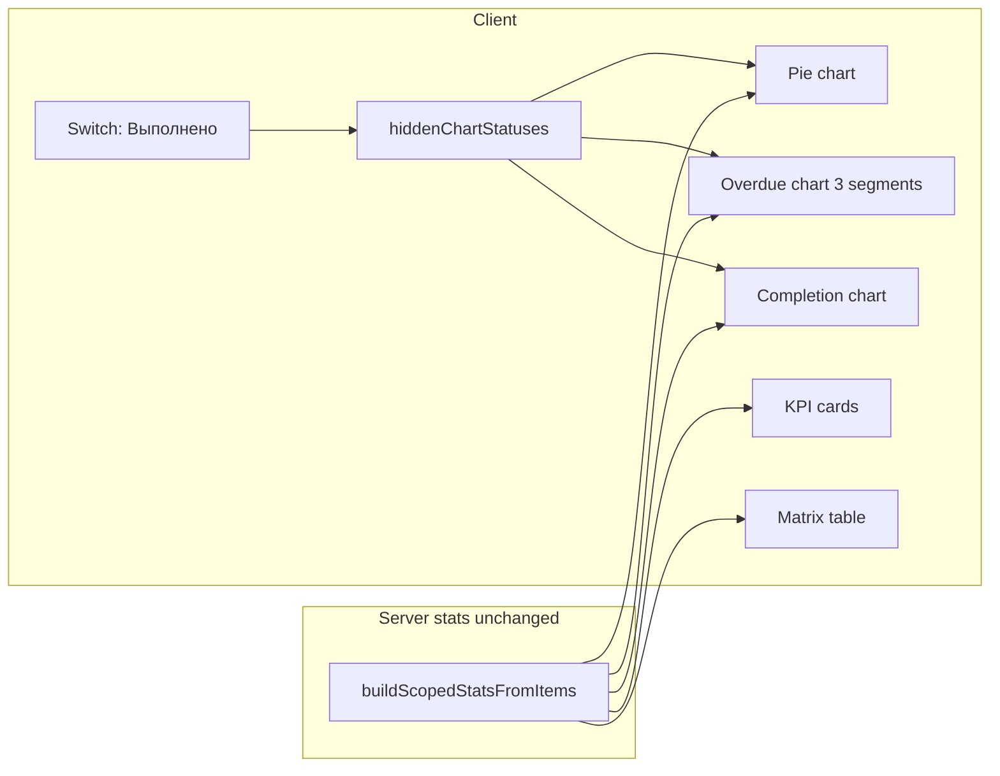

# «Выполнено» на графиках + переключатель видимости

## Контекст

Сейчас на дашборде три графика ([`scoped-dashboard-charts.tsx`](components/dashboard/scoped-dashboard-charts.tsx)):

| График | «Выполнено» сейчас |
|--------|-------------------|
| Круговая ([`status-pie-chart-section.tsx`](components/dashboard/status-pie-chart-section.tsx)) | Есть, если count > 0 |
| Stacked «Выполнение» ([`completion-breakdown-chart-section.tsx`](components/dashboard/completion-breakdown-chart-section.tsx)) | Есть как 3-й сегмент |
| «Просроченные» ([`overdue-breakdown-chart-section.tsx`](components/dashboard/overdue-breakdown-chart-section.tsx)) | **Нет** — сегмент «Не просрочено» = «В работе» + «Выполнено» |

Легенды сейчас **фильтруют таблицу** через `columnFilters` ([`chart-filters.ts`](lib/dashboard/chart-filters.ts)), а не скрывают категорию на графике. Нужен отдельный механизм видимости только для графиков (KPI и таблица без изменений, по умолчанию «Выполнено» видно).



---

## 1. Состояние видимости (client-only)

В [`dashboard-interactive.tsx`](components/dashboard/dashboard-interactive.tsx):

- `useState<Set<string>>` для скрытых статусов на графиках (начально пустой = всё видно).
- `toggleChartStatusVisibility(status)` — добавляет/убирает `WORKFLOW_STATUS.COMPLETED`.
- Пробросить `hiddenChartStatuses` и `onToggleChartStatusVisibility` в `ScopedDashboardView` → `ScopedDashboardCharts`.

Опционально (не обязательно в первом PR): `localStorage` ключ `dashboard:chartHiddenStatuses` для запоминания выбора между визитами.

---

## 2. UI-переключатель

В [`scoped-dashboard-charts.tsx`](components/dashboard/scoped-dashboard-charts.tsx) — компактный `Switch` + label **«Выполнено на графиках»** над сеткой графиков (или в одной строке с заголовком первой карточки):

- `checked` = статус **не** в `hiddenChartStatuses`
- `onCheckedChange` → `toggleChartStatusVisibility(WORKFLOW_STATUS.COMPLETED)`

KPI ([`dashboard-stat-cards.tsx`](components/dashboard/dashboard-stat-cards.tsx)) и таблица не получают этот prop.

---

## 3. График просрочки — 3 сегмента вместо 2

Переработать [`overdue-breakdown-chart-section.tsx`](components/dashboard/overdue-breakdown-chart-section.tsx):

- Использовать уже доступный `statusBreakdown` (поля `В работе` / `Выполнено` / `Просрочено` из [`stats.ts`](lib/dashboard/stats.ts)) вместо бинарного `count` + `remainder`.
- Stacked bar снизу вверх: **Просрочено** → **В работе** → **Выполнено** (цвета из `statusDistribution`).
- Легенда: 3 пункта вместо «Просрочено / Не просрочено».
- При скрытом «Выполнено»: не рендерить соответствующий `Bar`, пересчитать totals в легенде без этой категории.

Обновить [`chart-filters.ts`](lib/dashboard/chart-filters.ts):

- Расширить `OverdueChartSegment`: `"overdue" | "inProgress" | "completed"` (заменить `"nonOverdue"`).
- `overdueSegmentStatuses(segment)`:
  - `overdue` → `[OVERDUE_LABEL]`
  - `inProgress` → `[WORKFLOW_STATUS.IN_PROGRESS]`
  - `completed` → `[WORKFLOW_STATUS.COMPLETED]`
- Удалить/заменить `NON_OVERDUE_STATUSES` и обновить тесты в [`chart-filters.test.ts`](lib/dashboard/__tests__/chart-filters.test.ts).

Пробросить `statusBreakdown` в `OverdueBreakdownChartSection` из [`scoped-dashboard-charts.tsx`](components/dashboard/scoped-dashboard-charts.tsx) (сейчас туда не передаётся).

---

## 4. Фильтрация данных для скрытого «Выполнено»

Новый хелпер в [`lib/dashboard/chart-visibility.ts`](lib/dashboard/chart-visibility.ts) (чистые функции, легко тестировать):

```ts
export function isChartStatusVisible(hidden: ReadonlySet<string>, status: string): boolean
export function filterStatusDistribution(dist, hidden): StatusDistribution[]
export function applyChartVisibilityToBreakdown(row, hidden): StatusBreakdownRow
```

Применение:

- **Pie**: перед рендером — `filterStatusDistribution`; центральный total и проценты в легенде — по отфильтрованным данным.
- **Completion**: не рендерить `Bar` для скрытых статусов; legend totals — без скрытых.
- **Overdue**: аналогично completion.

Легенды по-прежнему кликабельны для **фильтра таблицы** (`columnFilters`); переключатель Switch — только видимость на графиках. Два механизма не смешивать.

---

## 5. Лёгкая доработка легенды (опционально)

В [`dashboard-chart-shared.tsx`](components/dashboard/dashboard-chart-shared.tsx) — prop `hidden?: boolean` на item: зачёркивание / пониженная opacity, если категория скрыта переключателем (визуальная связь Switch ↔ легенда). Клик по «Выполнено» в легенде **не** меняет видимость (только фильтр таблицы, как сейчас).

---

## 6. Тесты

- [`lib/dashboard/__tests__/chart-visibility.test.ts`](lib/dashboard/__tests__/chart-visibility.test.ts) — фильтрация distribution/breakdown.
- [`chart-filters.test.ts`](lib/dashboard/__tests__/chart-filters.test.ts) — новые сегменты overdue (`inProgress`, `completed` вместо `nonOverdue`).

---

## Проверка вручную

1. `/panel` — на всех трёх графиках видны «В работе», «Выполнено», «Просрочено» (при наличии данных).
2. График просрочки — три цветных сегмента, не один серый «Не просрочено».
3. Switch «Выполнено на графиках» OFF — сегмент исчезает на всех графиках, проценты пересчитываются; KPI и таблица без изменений.
4. Switch ON — сегмент возвращается.
5. Клик по легенде «Выполнено» — фильтрует таблицу, график остаётся видимым (если Switch ON).
