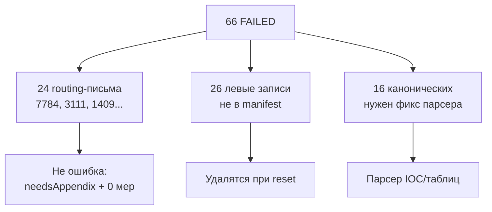

# Очистка импортов корпуса и исправление ошибок

## Текущее состояние БД (проверено)

| Метрика | Значение |
|---------|----------|
| Всего `measure_imports` | 358 |
| IMPORTED / FAILED | 291 / 66 |
| Все FAILED → `parseError` | `NO_ITEMS_FOUND` |
| Дубли (одинаковые kind + originalName) | 26 ключей, ~62 лишних строки |
| Источник мусора | 3+ повторных `db:seed:corpus:full` без идемпотентности |
| «Левак» | Файлы **не из** [`prisma/seed-manifest.generated.json`](prisma/seed-manifest.generated.json) — `240 93 909.docx`, generic `Приложение.docx` не к тому письму, дубли ДКИТИ/ДЦОД с `documentNumber: null` |
| Поручения | 13 (2 привязаны к импортам) — **сотрутся при reset** (вы выбрали ядерный путь) |

### Классификация 66 FAILED



**Routing-письма** (ваши примеры 7784, 3111): тело письма пустое по дизайну, меры в приложении (`Приложение 240 93 7784 ДИТСБ.docx` → IMPORTED, 132 меры). Сейчас письмо ошибочно получает `FAILED` из-за логики в [`lib/measure-imports/index.ts`](lib/measure-imports/index.ts) и [`prisma/seed-corpus.ts`](prisma/seed-corpus.ts):

```typescript
status: parsedItems.length > 0 ? "PARSED" : "FAILED"
parseError: parsedItems.length > 0 ? null : "NO_ITEMS_FOUND"
```

**Канонические FAILED-приложения** (15 шт., напр. `Приложение 240 93 1713 ДКИТИ.docx`): domain-only IOC — домены вида `seychaspozzhe[.]com`, без SHA256. [`parseIocHashMeasures`](lib/measure-imports/parse-unnumbered.ts) требует хеши и возвращает `[]`.

---

## Фаза 1 — Выгрузка отчёта об ошибках

Новый скрипт [`scripts/export-import-errors.mjs`](scripts/export-import-errors.mjs):

- Читает manifest, строит allowlist: `letterFile` + `appendixFile` для каждого `documentNumber` (при `SEED_IMPORT_ALL` — все 221 пары)
- Запрашивает БД через Prisma
- Классифицирует каждую запись: `canonical` | `duplicate` | `junk` | `routing_letter` | `real_failure`
- Пишет `import-errors-report.json` + `import-errors-report.csv` с полями: `id`, `documentNumber`, `kind`, `originalName`, `title`, `status`, `parseError`, `itemsCount`, `measuresCount`, `parentDocumentNumber`, `inManifest`, `classification`, `createdAt`

Команда: `npm run corpus:export-errors` (добавить в [`package.json`](package.json))

**Запустить до reset**, чтобы сохранить снимок текущих проблем.

---

## Фаза 2 — Исправления парсера и статусов (до пересидирования)

### 2a. Routing-письма не должны быть «Ошибка»

В [`lib/measure-imports/index.ts`](lib/measure-imports/index.ts) `parseMeasureImport` и дублирующей `parseImport` в [`prisma/seed-corpus.ts`](prisma/seed-corpus.ts) — вынести общую логику статуса:

```typescript
function resolveParseStatus(input: {
  parsedItems: unknown[]
  needsAppendix: boolean
  parentImportId: number | null
}) {
  if (input.parsedItems.length > 0) return { status: "PARSED", parseError: null }
  if (input.parentImportId == null && input.needsAppendix) {
    return { status: "PARSED", parseError: null } // routing shell
  }
  return { status: "FAILED", parseError: "NO_ITEMS_FOUND" }
}
```

- Письмо остаётся без мер и **не коммитится** (`commitImport` требует items) — это ок
- В таблице [`measure-imports-table.tsx`](components/platform/measure-imports-table.tsx): для `LETTER + PARSED + needsAppendix + 0 items` показывать бейдж **«Маршрутизация»** (не «Ошибка»)

### 2b. Domain-only IOC в приложениях

В [`lib/measure-imports/parse-unnumbered.ts`](lib/measure-imports/parse-unnumbered.ts):

- Расширить `DOMAIN_LINE_RE` на формат `domain[.]tld`
- Добавить `parseIocDomainMeasures(paragraphs)` — срабатывает без SHA256, если ≥N доменов или есть заголовок про индикаторы
- Вызвать из `parseUnnumberedMeasures` **до** или **после** hash-пути

Покрыть тестами на реальном буфере из `.external/240 93 6837/240 93 1713/`.

### 2c. Проставлять `documentNumber` из manifest при seed

В `importDocx` ([`prisma/seed-corpus.ts`](prisma/seed-corpus.ts)) после parse — если `metadata.documentNumber == null`, подставить `job.documentNumber`. Убирает пустые номера у приложений вида `Приложение 1555.docx`.

### 2d. Идемпотентность seed (защита от повторных дублей)

В [`prisma/seed-corpus.ts`](prisma/seed-corpus.ts) перед `createImportUpload`:

- Искать существующий импорт по `(kind, originalName, parent.documentNumber)` из manifest
- Если найден IMPORTED/PARSED — **skip** (лог `already imported`)
- Опционально: `SEED_PURGE_IMPORTS=1` — удалить все `measure_imports` перед импортом (для dev)

---

## Фаза 3 — Ядерная очистка БД (выбранный путь)

```bash
npm run corpus:export-errors          # снимок до reset
npm run db:reset                      # чистая схема + базовый seed
npm run db:seed:corpus:full           # один прогон, ~442 job (221 письмо + 221 приложение)
npm run corpus:export-errors          # проверка: FAILED ≈ 0–5 реальных
```

Ожидаемый результат после фиксов:
- ~221 уникальных писем + ~200 приложений (не у всех есть appendix в manifest)
- Routing-письма: статус **PARSED** / бейдж «Маршрутизация», приложения **IMPORTED**
- Нет дублей 4164/6837/7784
- Нет записей с `documentNumber: null` для канонических файлов

---

## Фаза 4 — Верификация

1. `import-errors-report.json`: `junk=0`, `duplicate=0`, `routing_letter` без `FAILED`
2. UI `/panel/measures/imports`: 7784, 3111 — не «Ошибка»
3. `npm test` — тесты `parse-unnumbered`, `index.test`, новый тест routing status
4. `npx tsx scripts/corpus-gap-report.mjs` — сравнить с парсером на диске

---

## Файлы

| Действие | Файл |
|----------|------|
| Новый | `scripts/export-import-errors.mjs` |
| Изменить | `lib/measure-imports/index.ts` |
| Изменить | `lib/measure-imports/parse-unnumbered.ts` |
| Изменить | `prisma/seed-corpus.ts` |
| Изменить | `components/platform/measure-imports-table.tsx` |
| Тесты | `lib/measure-imports/__tests__/parse-unnumbered.test.ts`, routing status test |
| npm script | `package.json` → `corpus:export-errors` |
