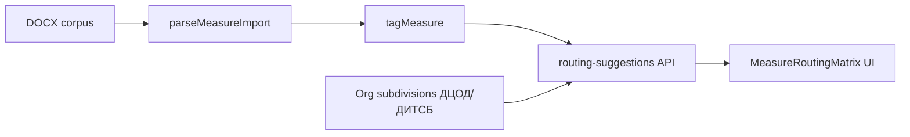

# Убрать моки и засеять корпус для теста routing

## Ответ на главный вопрос

**Рекомендации по подразделениям уже реализованы** — это не «только в планах»:

| Слой | Файл | Что делает |
|------|------|------------|
| Теги мер | [`lib/measure-imports/tag-measure.ts`](lib/measure-imports/tag-measure.ts) | `network`, `siem`, `email`, … |
| Правила | [`lib/measure-imports/suggest-routing.ts`](lib/measure-imports/suggest-routing.ts) | score по static + generated профилям |
| Профили | [`lib/measure-imports/routing-profiles.ts`](lib/measure-imports/routing-profiles.ts) | ДЦОД→network, ДИТСБ→siem + [`routing-profiles.generated.json`](lib/measure-imports/routing-profiles.generated.json) |
| API | [`app/api/measure-imports/[id]/routing-suggestions/route.ts`](app/api/measure-imports/[id]/routing-suggestions/route.ts) | GET с `organizationId` |
| UI | [`components/platform/order-create-client.tsx`](components/platform/order-create-client.tsx) + [`measure-routing-matrix.tsx`](components/platform/measure-routing-matrix.tsx) | матрица мера×подразделение при `?importId=` |

**Почему сейчас не видно пользы:** мок-сид ([`prisma/mock-data.ts`](prisma/mock-data.ts)) создаёт подразделения вроде «IT-блок», «Цифровые сервисы» ([`prisma/generators.ts`](prisma/generators.ts) `SUBDIVISION_TEMPLATES`), а routing матчится только на реальные имена **ДЦОД**, **ДИТСБ**, **ДКИТИ** и т.д.



---

## Что сделаем

### 1. Отключить мок по умолчанию

В [`prisma/seed.ts`](prisma/seed.ts):
- `SEED_MOCK` по умолчанию **`false`** (сейчас мок грузится всегда, кроме явного `SEED_MOCK=false`)
- оставить `npm run db:seed:mock` (`SEED_MOCK=force`) для редких демо-сценариев workflow

### 2. Полный reset dev-БД (выбранный вариант)

Добавить в [`package.json`](package.json):

```json
"db:reset": "sh -c '. ./scripts/load-env.sh && prisma migrate reset --force'"
"db:seed:corpus": "tsx --env-file=.env.local prisma/seed-corpus.ts"
"db:boot:corpus": "npm run db:reset && npm run db:seed:corpus"
```

`prisma migrate reset --force` → базовый сид (статусы + admin) → затем corpus-сид.

### 3. Новый `prisma/seed-corpus.ts`

Один скрипт, идемпотентный после reset:

**Источник DOCX — только локально, не в git**

Сид **не читает** файлы из tracked-путей репозитория. Приоритет путей:

1. **Основной:** `.external/240 93 6837/{folder}/` — уже под `.external/*` в gitignore
2. **Опциональный слайс:** `.external/docx_examples/corpus/` — тоже gitignore (см. §6)
3. Если папки нет — понятная ошибка: «положите корпус локально, запустите `npm run corpus:prepare-slice`»

Документы для импорта (по номеру папки/файла):
- `240/93/6837` — composite, network/siem (ключевой для routing)
- `240/93/4164` — nested letter
- `240/93/1409` + appendix — RECOMMENDATIONS

[`createMeasureImportUpload`](lib/measure-imports/index.ts) → `parseMeasureImport` → `commitMeasureImport`. Требует **Postgres + MinIO** (`make dev-infra`).

**Организации**
- **Головная:** `ФСТЭК` — записать в `app_settings.head_organization_id`
- **Подведомственная (для batch/routing):** `Тестовое ДЗО` с подразделениями из generated-профилей:
  - `ДЦОД`, `ДИТСБ`, `ДКИТИ`, `ДИТСС`, `СЭПС`, `ДИТСУП` (+ 1–2 из top keys в [`routing-profiles.generated.json`](lib/measure-imports/routing-profiles.generated.json))
- Минимальные `accessLink` + `contactPerson` (без 120 мер и 30 поручений на орг)

**Вывод в консоль** после сида — готовые URL:
- `/panel/measures/imports/{id}` — теги на строках
- `/panel/orders/new?importId={id}` — матрица routing

### 4. Обновить Makefile

В [`Makefile`](Makefile) добавить цель:

```makefile
dev-corpus:
	make dev-infra && npm run db:boot:corpus && npm run dev
```

Полный цикл: infra → reset → corpus seed → dev.

### 5. Документация в README (короткий блок)

В [`README.md`](README.md) — как поднять dev с корпусом, где смотреть routing, и что **DOCX/корпус не коммитятся**.

### 6. Git hygiene — корпус не уходит на GitHub

**Проблема сейчас:** в [`.gitignore`](.gitignore) есть whitelist:

```gitignore
.external/*
!.external/docx_examples/
!.external/docx_examples/**
```

Из-за `!.external/docx_examples/**` папка `corpus/` и любые docx **могут попасть в git**. Уже tracked: `240 93 4164.docx`, `4165.docx`, `Приложение 4164.docx`.

**Правки `.gitignore`:**

```gitignore
.external/*
!.external/docx_examples/
!.external/docx_examples/README.md

# Чувствительные данные — только локально
.external/240 93 6837/
.external/docx_examples/**/*.docx
.external/docx_examples/corpus/

# Offline pipeline (уже есть, оставить)
labels-dataset.jsonl
audit-report.json
routing-model.cbm
```

**Опционально** (если не хотим ФИО из отчётов в репо): `lib/measure-imports/routing-profiles.generated.json` — генерировать локально через `npm run corpus:profiles`, добавить в gitignore; в репо оставить только static fallback в [`routing-profiles.ts`](lib/measure-imports/routing-profiles.ts).

**Скрипт нарезки (локальный):** `scripts/prepare-corpus-slice.mjs` — копирует 3–5 писем из `.external/240 93 6837/` в `.external/docx_examples/corpus/`; вызывается вручную, артефакты не коммитятся.

**Очистка индекса git** (при реализации):

```bash
git rm -r --cached .external/docx_examples/corpus/ 2>/dev/null || true
git rm --cached ".external/docx_examples/"*.docx 2>/dev/null || true
```

**Тесты:** [`parse-docx.test.ts`](lib/measure-imports/__tests__/parse-docx.test.ts) уже использует `describe.skipIf(!hasCorpus6837)` — CI без локального корпуса не падает.

**Проверка перед push:** `git status` не должен показывать `.external/**/*.docx`; можно добавить в README одну команду `git check-ignore -v .external/docx_examples/corpus/`.

---

## Как тестировать routing после сида

1. Открыть импорт `6837` → убедиться, что у мер есть бейджи `network` / `siem`
2. «Создать поручение» или `/panel/orders/new?importId={id}`
3. Выбрать цели **Тестовое ДЗО → ДЦОД / ДИТСБ**
4. В `MeasureRoutingMatrix` network-меры должны предлагаться в **ДЦОД** (confidence ~0.85), siem — в **ДИТСБ**

Прямой API-smoke:

```bash
curl -b cookies.txt \
  "/api/measure-imports/{id}/routing-suggestions?organizationId={dzoId}"
```

---

## Риски и ограничения

- **Корпус только локально** — без `.external/240 93 6837/` сид импортов не сработает; это намеренно
- **MinIO обязателен** для upload storage при corpus seed
- **Полный reset** удалит все текущие поручения/ответы в dev-БД (по вашему выбору)
- Routing работает для **подразделений выбранной подведомственной org**; имена должны совпадать с профилями (поэтому моки бесполезны)
- CatBoost ([`scripts/train-routing-model.py`](scripts/train-routing-model.py)) остаётся опциональным; для теста достаточно rule-based

---

## Файлы в diff (~8)

| Файл | Изменение |
|------|-----------|
| [`.gitignore`](.gitignore) | corpus + docx вне git; убрать широкий `docx_examples/**` whitelist |
| `.external/docx_examples/README.md` | **новый** — куда положить корпус локально |
| `scripts/prepare-corpus-slice.mjs` | **новый** — локальная нарезка в ignored `corpus/` |
| [`prisma/seed.ts`](prisma/seed.ts) | `SEED_MOCK=false` по умолчанию |
| `prisma/seed-corpus.ts` | **новый** — org + DOCX imports из ignored paths |
| [`package.json`](package.json) | `db:reset`, `db:seed:corpus`, `corpus:prepare-slice` |
| [`Makefile`](Makefile) | `dev-corpus` |
| [`README.md`](README.md) | инструкция + предупреждение про git |
