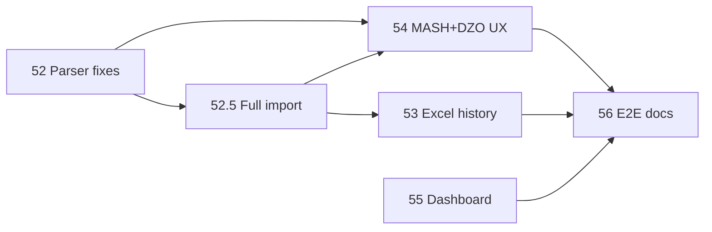

# Мастер-план: корпус, воркфлоу МАШ+ДЗО, Excel-история, дашборд

## Диагноз (почему сейчас «не работает»)

```mermaid
flowchart TB
  subgraph broken [Текущий разрыв]
    Import[Commit import 6837]
    OrderCreate[order-create-client]
    HeadExcl["listSupervisedOrganizations() исключает head"]
    DZOPrefill[Prefill: только 6 ДЗО]
    RoutingHidden["Routing matrix: subdivisionId=null → скрыта"]
    NoConf["confidence/reason не рендерятся"]
    Import --> OrderCreate
    OrderCreate --> HeadExcl
    HeadExcl --> DZOPrefill
    DZOPrefill --> RoutingHidden
    RoutingHidden --> NoConf
  end
  subgraph expected [Ожидаемый поток]
    Parse[Разбор письма]
  Parse --> Commit[Импорт мер]
  Commit --> Select["Выбор: МАШ подразделения + все ДЗО"]
  Select --> Route["Матрица: кому какая мера + %"]
  Route --> Batch["POST /api/orders/batch"]
  end
```

| Проблема | Где | Следствие |
|----------|-----|-----------|
| Head org не в списке целей | [`lib/organizations/index.ts`](lib/organizations/index.ts) `listSupervisedOrganizations` | Нельзя назначить поручение на АО МАШ / ДЦОД |
| Routing fetch по первому DZO | [`order-create-client.tsx`](components/platform/order-create-client.tsx) L136+ | API вызывается для org без subdivisions → пустые suggestions |
| Matrix скрыта для org-level | [`measure-routing-matrix.tsx`](components/platform/measure-routing-matrix.tsx) `visibleTargets` | Нет UI даже если routing есть |
| Confidence не показан | тот же файл | Пользователь не видит вероятности |
| Default seed: 11/221 писем | [`seed-corpus.ts`](prisma/seed-corpus.ts) | 210 писем не в БД |
| **108 misKind** | [`parse-docx.ts`](lib/measure-imports/parse-docx.ts) + commit path | При полном импорте N мер → 1 IOC item |
| Excel `result` не импортируется | [`extract-labels-dataset.mjs`](scripts/extract-labels-dataset.mjs) col G | История выполнения только offline |
| Дашборд: 4 статуса, all-time | [`lib/dashboard/stats.ts`](lib/dashboard/stats.ts) | «Выполнено» растёт бесконечно; «К исполнению» виден |

**Целевой воркфлоу после фаз 54.x:**

1. Загрузить/разобрать письмо → commit import
2. `/panel/orders/new?importId=…` — **по умолчанию**: все 6 подразделений МАШ + все 6 ДЗО
3. Матрица routing **только для МАШ** (ДЦОД 85%, ДИТСБ 75%, …) — редактируемая
4. ДЗО: org-level, все меры на организацию (без матрицы)
5. Batch → N поручений (до 6 subdivision + 6 org-level)

---

## Фаза 52 — Парсер и полнота корпуса (блокер для импорта)

Каждая подфаза — отдельный маленький PR.

### 52.1 Актуализировать gap-отчёт и triage-лист
- Запуск `corpus:build-seed-manifest` + `corpus:gap-report`
- Новый артефакт `corpus-triage.json` (или секция в gap-report): **P0** = 3 zero + 2019; **P1** = 108 misKind; **P2** = 3 xlsx undercount (2616, 2993, 3289)
- **DoD:** JSON с приоритетами; консольный summary

### 52.2 Исправить mis-kind commit (108 писем)
- В [`lib/measure-imports/index.ts`](lib/measure-imports/index.ts) и [`seed-corpus.ts`](prisma/seed-corpus.ts) `buildParsedItems`: если `detectImportKind=APPENDIX` **и** `parseMeasureItemsFromParagraphs` вернул N>0 **и** это не recommendations-appendix → трактовать как LETTER (сохранить N мер)
- Тест: fixture из misKind bucket (1 bdu_flat письмо)
- **DoD:** misKind count → 0 в gap-report после re-scan; commit даёт N items, не 1 IOC

### 52.3 Zero-парсер: 1569, 2026, 2387
- Разбор 3 папок вручную → добавить table-only / unnumbered fallback в [`parse-unnumbered.ts`](lib/measure-imports/parse-unnumbered.ts) или [`parse-docx-tables.ts`](lib/measure-imports/parse-docx-tables.ts)
- Тест на каждое письмо
- **DoD:** zero count = 0; письма попадают в manifest `withMeasures`

### 52.4 Xlsx undercount (2616, 2993, 3289) + 6837 granularity
- Сверка строк `Отчет*.xlsx` col A/B vs parser output
- 6837: задокументировать политику (19 parsed vs 7 xlsx rows — composite split vs агрегация в отчёте); при необходимости флаг `aggregateForReport` в metadata
- **DoD:** undercount folders ≤ 1; 6837 policy в README/gap-report comment

### 52.5 Полный импорт корпуса
- `SEED_IMPORT_ALL=1 npm run db:seed:corpus` (или отдельный `db:seed:corpus:full`)
- Post-check: `MeasureImport` status=IMPORTED count ≈ 218 letters + appendices; routing 2019 = FAILED (принять)
- **DoD:** в БД все разбираемые письма; gap summary в консоли

---

## Фаза 53 — Excel-история как опора (не продуктовый xlsx-import)

Используем ~1345 `Отчет*.xlsx` из [`.external/240 93 6837`](.external/240%2093%206837) как ground truth для routing и статусов. Продуктовый импорт форм — позже ([`xlsx_report_forms.plan.md`](.cursor/plans/xlsx_report_forms.plan.md)).

### 53.1 Расширить extract-labels → history dataset
- [`scripts/extract-labels-dataset.mjs`](scripts/extract-labels-dataset.mjs): уже читает col B/D/G (мера, подразделение, result)
- Добавить `npm run corpus:history` → `corpus-history.jsonl` с полями: `documentNumber`, `subdivisionName`, `measureTextSnippet`, `result`, `reportFile`
- **DoD:** >0 строк; sample по 6837/4164 валиден

### 53.2 Сверка history vs модель (что потеряли)
- Новый `scripts/reconcile-xlsx-history.mjs` → `corpus-history-reconcile.json`:
  - measure text match (fuzzy) parser item ↔ xlsx row
  - subdivision в xlsx, но нет в routing-profiles
  - result values (выполнено/не выполнено/…) не покрытые `WORKFLOW_STATUS`
  - строки xlsx без соответствующей меры в БД после full import
- **DoD:** отчёт с counts: `matched`, `unmatchedMeasures`, `unknownSubdivisions`, `unknownResults`

### 53.3 Пересобрать routing profiles из полной истории
- `npm run corpus:labels && npm run corpus:profiles` на полном корпусе
- [`routing-profiles.generated.json`](lib/measure-imports/routing-profiles.generated.json) — локально, gitignored
- **DoD:** `suggest-routing` на 6837 network → ДЦОД; generated profile hit rate в reconcile report

### 53.4 Dev-seed исторических статусов (опционально, маленький diff)
- Скрипт `scripts/seed-xlsx-history.mjs`: для committed import создать `Order`+`OrderItem` с `status` из xlsx `result` (маппинг: выполнено→Выполнено, в работе→В работе, …)
- Только при `SEED_XLSX_HISTORY=1`; не трогать prod path
- **DoD:** на 6837 в БД есть items со статусами из отчёта; reconcile `matched` > 80%

---

## Фаза 54 — Воркфлоу: МАШ + ДЗО + вероятности (главный UX-фикс)

### 54.1 Включить head org в batch targets
- Новая функция `listBatchOrganizations()` в [`lib/organizations/index.ts`](lib/organizations/index.ts): head (с subdivisions) + supervised DZO
- [`lib/orders/order-create-context.ts`](lib/orders/order-create-context.ts): загружать оба типа
- **DoD:** в order-create видны «АО МАШ» (6 строк подразделений) + 6 ДЗО

### 54.2 Prefill: МАШ subdivisions + все ДЗО
- [`order-create-client.tsx`](components/platform/order-create-client.tsx): при `importId` выбирать `expandBatchTargets(allOrgs)` — head → 6 subdivision rows, DZO → org-level
- Кнопки: «Выбрать МАШ», «Выбрать все ДЗО», «Выбрать всё»
- **DoD:** после commit import все 12 целей отмечены

### 54.3 Routing API для head org
- `useEffect` fetch: если среди selected есть subdivision targets head org → `organizationId=head.id`
- Не использовать `selectedTargets[0]` для DZO
- **DoD:** network → ДЦОД 0.85 в Network tab; matrix не null

### 54.4 Показать confidence % и reason в UI
- [`measure-routing-matrix.tsx`](components/platform/measure-routing-matrix.tsx): badge `85%` рядом с чекбоксом; tooltip `reason`
- Подсветка low-confidence (&lt;35%) — muted, но checked по текущей логике
- **DoD:** пользователь видит вероятности для каждой пары мера×подразделение

### 54.5 Два блока UI: «МАШ — маршрутизация» и «ДЗО — все меры»
- Секция 1: matrix только head subdivisions
- Секция 2: таблица DZO (org-level, все меры, без matrix)
- **DoD:** соответствует описанному воркфлоу; batch submit создаёт 12 orders max

### 54.6 Тесты batch + validate
- [`validate-batch-targets.ts`](lib/orders/validate-batch-targets.ts): mixed head subdivisions + DZO org-level — разрешено
- Unit: `expandBatchTargets` с head+DZO; e2e smoke в vitest
- **DoD:** `POST /api/orders/batch` с head subdivision + DZO проходит

---

## Фаза 55 — Дашборд: убрать «К исполнению», срезы по issuedAt

Требования из [`mark.md`](mark.md): показывать **в работе / выполнено / просрочено**; срез по **дате выдачи поручения** (`Order.issuedAt`).

### 55.1 Отдельный набор статусов для дашборда
- [`lib/statuses/workflow.ts`](lib/statuses/workflow.ts): `DASHBOARD_STATUS_ORDER = [В работе, Выполнено, Просрочено]`
- `NOT_STARTED` в stats **маппится в «В работе»** (DB default сохраняется для новых items)
- **DoD:** `buildStatusDistribution` не отдаёт «К исполнению»

### 55.2 Обновить KPI и графики (3 сегмента)
- [`dashboard-stat-cards.tsx`](components/dashboard/dashboard-stat-cards.tsx), [`status-pie-chart-section.tsx`](components/dashboard/status-pie-chart-section.tsx), [`completion-breakdown-chart-section.tsx`](components/dashboard/completion-breakdown-chart-section.tsx), [`chart-filters.ts`](lib/dashboard/chart-filters.ts)
- **DoD:** 3 карточки/сегмента; фильтры таблицы согласованы

### 55.3 Фильтр диапазона issuedAt
- Query param `?from=YYYY-MM-DD&to=YYYY-MM-DD` на dashboard pages
- [`fetch-scoped-items.ts`](lib/dashboard/fetch-scoped-items.ts): `order.issuedAt` between from/to
- UI: date range picker в [`dashboard-interactive.tsx`](components/dashboard/dashboard-interactive.tsx)
- **DoD:** график меняется при смене периода; без параметра — all-time (или последние 90 дней — уточнить в 55.3b)

### 55.4 Кеш и тесты дашборда
- [`lib/dashboard/cache.ts`](lib/dashboard/cache.ts): ключ включает from/to
- Тесты [`lib/dashboard/__tests__/`](lib/dashboard/__tests__/): remap NOT_STARTED, date filter
- **DoD:** `npm run test` green для dashboard

---

## Фаза 56 — Документация и проверка end-to-end

### 56.1 README: воркфлоу + gap/history отчёты
- Блок: parse → import → МАШ routing + DZO batch
- Команды: `corpus:gap-report`, `corpus:history`, `SEED_IMPORT_ALL`, `SEED_XLSX_HISTORY`

### 56.2 Smoke checklist (ручной DoD)
- [ ] 6837 imported, 19 measures committed
- [ ] Order create: 6 МАШ subdivisions + 6 DZO selected
- [ ] Routing matrix shows ДЦОД 85% for network
- [ ] Batch creates 12 orders
- [ ] Dashboard: 3 статуса, фильтр issuedAt работает
- [ ] `corpus-history-reconcile.json`: unmatchedMeasures documented

---

## Порядок и зависимости

**Критический путь:** 52.2 mis-kind → 52.5 full import → 54.1–54.5 UX → smoke.

**Параллельно:** фаза 55 (дашборд) независима от 52–54.

---

## Оценка diff по подфазам

| Подфаза | ~файлов | Риск |
|---------|---------|------|
| 52.2 mis-kind | 3–4 | высокий (ядро парсера) |
| 54.1–54.3 head targets | 4–5 | средний |
| 54.4 confidence UI | 1–2 | низкий |
| 55.1–55.2 dashboard statuses | 5–6 | низкий |
| 55.3 date filter | 4–5 | средний |
| 53.4 xlsx history seed | 2–3 | средний (маппинг result) |

**Не в скоупе сейчас** (из mark.md): сроки 14д/3д/7д для ДЗО — «это пока не надо».
