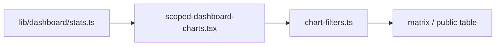

# Dashboard charts: все статусы + Power BI callouts

## Контекст

Три чарта в [`components/dashboard/scoped-dashboard-charts.tsx`](components/dashboard/scoped-dashboard-charts.tsx):

| Позиция | Сейчас | Проблема |
|---------|--------|----------|
| Левый | Donut «Распределение по статусам» | OK, 4 статуса |
| **Центральный** | Гориз. bar «Просроченные по организациям» | Один цвет, плоские столбики, цифры `LabelList position="right"` — выглядит скучно |
| Правый | Stacked bar «Выполнение по …» | Только 2 сегмента: `completed` / `active` (всё нетерминальное в одной куче) |

Данные собираются в [`lib/dashboard/stats.ts`](lib/dashboard/stats.ts): `completionBreakdown` агрегирует через `isTerminal`, а не через `getDisplayStatusName` — поэтому теряются «К исполнению», «В работе», «Просрочено» по отдельности.

Фильтры: [`lib/dashboard/chart-filters.ts`](lib/dashboard/chart-filters.ts) — `toggleCompletionSegmentFilter` нужно заменить на клик по конкретному статусу в стеке.



---

## 1. Данные: полный breakdown по статусам (правый чарт)

**Файл:** [`lib/dashboard/stats.ts`](lib/dashboard/stats.ts)

- Заменить `CompletionRow { completed, active }` на `StatusBreakdownRow`:
  ```ts
  type StatusBreakdownRow = {
    label: string
    [statusName: string]: number | string  // label + counts per STATUS_DISPLAY_ORDER
  }
  ```
- В `buildGlobalStats` / `buildOrganizationStats` / `buildSubdivisionStats` вместо `completionBy*` считать `statusBy*` через **`getDisplayStatusName(item, now)`** — те же 4 статуса, что в donut и KPI-карточках.
- Переименовать поле в `ScopedDashboardStats`: `statusBreakdown` + заголовки:
  - global: «Статусы по организациям»
  - organization: «Статусы по подразделениям»
  - subdivision: «Статусы по поручениям»
- Обновить deprecated `getDashboardStats()` mapping.

---

## 2. Центральный чарт: bullet + callout (Power BI feel)

**Цель:** не просто «94», а визуально богаче — просрочка в контексте объёма организации.

**Данные:** расширить `BreakdownRow` для overdue:
```ts
{ label: string; count: number; total: number }
```
`count` = просроченные, `total` = все меры в этой группе (org / subdivision / order). Считать в тех же циклах `build*Stats`.

**Визуал (Recharts, layout vertical):**

```
[Org A]  ████████░░░░░░░░  ┌──┐
                          └──┘ 14
                            ╲  (leader line)
```

- **Background bar** (`total`, `fill: muted`, `radius`) — «ёмкость» группы
- **Foreground bar** (`count`, `fill: var(--chart-1)`, stacked/stackId) — просроченные
- **Callout** справа от foreground — pill с числом + опционально `%` (`Math.round(count/total*100)`)
- Сортировка: по `count` desc (как сейчас)
- Клик/highlight/dim — сохранить через существующий `onOverdueBarClick` + `isBreakdownFilterActive`
- Увеличить `margin.right` (~56–64px) под выноски; `YAxis width` ~120px для длинных имён

**Почему bullet, а не lollipop/treemap:** даёт контекст «14 из 120» без второго графика; типичный паттерн Power BI KPI bars.

---

## 3. Общий компонент callout-меток

**Новый файл:** `components/dashboard/chart-callout-label.tsx`

Custom `LabelList` content для Recharts:

- SVG: короткая линия от `(x, y)` bar-end → pill
- Pill: `rect` с `rx`, фон `background` / border `border`, текст tabular-nums
- Формат: **`94`** или **`94 · 12%`** (count + share от total/bar stack)
- Пропсы: `showPercent?`, `minWidth?` — скрывать callout если сегмент &lt; ~8px (не лезть в мусор)
- Переиспользовать на:
  - центральном bullet (count + % от total)
  - правом stacked bar (count на сегменте, % от суммы строки)
  - опционально pie (внешние callouts вместо `position="inside"` — если сектор маленький)

Стиль близкий к Power BI: число в «карточке», тонкая соединительная линия, не plain text.

---

## 4. Правый чарт: stacked bar по 4 статусам

**Файл:** [`scoped-dashboard-charts.tsx`](components/dashboard/scoped-dashboard-charts.tsx)

- Один `Bar` на каждый статус из `STATUS_DISPLAY_ORDER`, общий `stackId`
- Цвета — из того же `CHART_COLORS` / `statusDistribution.fill` (консистентность с donut)
- `ChartLegend` с кликом → фильтр статуса (как pie)
- Callout на сегментах через `chart-callout-label` (только если сегмент достаточно широкий)
- Заменить `onCompletionSegmentClick` → `onStatusBreakdownClick(label, status)`

**Фильтры:** [`chart-filters.ts`](lib/dashboard/chart-filters.ts)

- Удалить `toggleCompletionSegmentFilter` / `isCompletionSegmentActive`
- Добавить `toggleStatusBreakdownFilter(filters, scope, label, status)`:
  - toggle: если уже `[label]` + `[status]` → снять оба
  - иначе: breakdown column + `status: [status]` (один статус, не группа)
- Обновить [`scoped-dashboard-view.tsx`](components/dashboard/scoped-dashboard-view.tsx) wiring

---

## 5. Левый donut — лёгкая полировка

Минимально: заменить inside `LabelList` на внешние callouts для крупных секторов (через тот же компонент). Центральный total overlay оставить. Не трогать логику фильтров.

---

## Файлы (scope)

| Файл | Изменение |
|------|-----------|
| [`lib/dashboard/stats.ts`](lib/dashboard/stats.ts) | `statusBreakdown`, overdue `total`, titles |
| [`lib/dashboard/chart-filters.ts`](lib/dashboard/chart-filters.ts) | status breakdown toggle |
| [`components/dashboard/chart-callout-label.tsx`](components/dashboard/chart-callout-label.tsx) | **new** |
| [`components/dashboard/scoped-dashboard-charts.tsx`](components/dashboard/scoped-dashboard-charts.tsx) | bullet overdue, 4-status stack, callouts |
| [`components/dashboard/scoped-dashboard-view.tsx`](components/dashboard/scoped-dashboard-view.tsx) | новые callbacks |

Публичный дашборд использует те же компоненты — изменения автоматически там тоже.

---

## DoD (проверка)

1. Центральный чарт: серый фон = total, красный = overdue, callout «N · X%», клик фильтрует таблицу
2. Правый чарт: 4 цветных сегмента (К исполнению / В работе / Выполнено / Просрочено), клик сегмента = org + status
3. Цвета статусов совпадают между donut, правым стеком и KPI-карточками
4. `npm run typecheck && npm run lint && npm run build`
5. UI smoke: `/panel` — KPI ↔ pie ↔ overdue bullet ↔ status stack ↔ таблица синхронно
