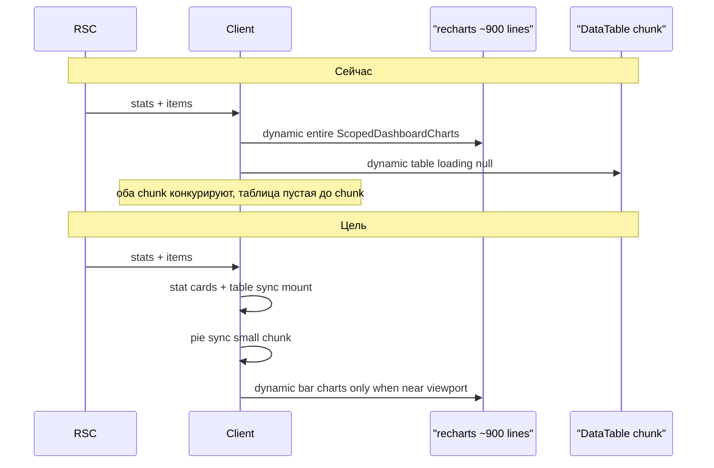

# Dashboard: last try — безопасная оптимизация чартов

## Цель

Ускорить **first paint** (stat cards + pie + таблица), не трогая data flow и фильтры. Scope: **только чарты + sync table chunk** — SQL stats **не включаем**.

## Guardrails (не нарушать)

| Запрещено | Почему ломалось |
|-----------|-----------------|
| Client matrix API / `useDashboardMatrix` | Waterfall, таблица ждёт fetch |
| Defer table / `enabled` / IntersectionObserver на таблице | Skeleton вместо данных |
| URL `?status=&label=` + RSC refetch | Remount чартов, latency на клик |
| `dashboard-client` island вместо `DashboardInteractive` | Гибрид сломал first paint |
| SQL split stats/items в этом PR | Отложено; риск cold load без выигрыша для чартов |
| Outer `Suspense` вокруг всего dashboard | Двойной skeleton |

**Не трогаем:** [`lib/dashboard/cache.ts`](lib/dashboard/cache.ts), [`get-scoped-dashboard.ts`](lib/dashboard/get-scoped-dashboard.ts), [`dashboard-matrix-section.tsx`](lib/dashboard/matrix-section.tsx) data fetching, client filters в [`scoped-dashboard-view.tsx`](components/dashboard/scoped-dashboard-view.tsx).

---

## Текущее vs целевое



---

## Phase 1 — Sync table (быстрый win, 5 мин риска)

**Файл:** [`components/dashboard/scoped-dashboard-view.tsx`](components/dashboard/scoped-dashboard-view.tsx)

- Убрать `dynamic()` для `DashboardMatrixTable` и `MeasuresDataTable`
- Прямой import — items уже в props, defer chunk не нужен
- `loading: () => null` сейчас = пустое место до chunk; sync = таблица сразу после hydrate

**DoD:** Network tab — нет отдельного lazy chunk для matrix table на first navigation (или он в основном bundle dashboard island).

---

## Phase 2 — Progressive charts (основная работа)

### 2.1 Split Recharts bundle

Разбить [`scoped-dashboard-charts.tsx`](components/dashboard/scoped-dashboard-charts.tsx) (~930 строк):

| Файл | Recharts | Загрузка |
|------|----------|----------|
| `status-pie-chart-section.tsx` | Pie only | **sync** import |
| `overdue-breakdown-chart-section.tsx` | Bar | `dynamic()` |
| `completion-breakdown-chart-section.tsx` | Bar | `dynamic()` |
| `dashboard-chart-shared.tsx` | helpers | shared sync |
| `scoped-dashboard-charts.tsx` | orchestrator | thin ~80 lines |

Shared helpers вынести из монолита: `DashboardChartLayout`, `PieSliceLabel`, `WrappedXAxisTick`, legend, `formatChartLegendLabel`, etc.

### 2.2 Убрать outer dynamic на всём charts

**Файл:** [`scoped-dashboard-view.tsx`](components/dashboard/scoped-dashboard-view.tsx)

```tsx
// Удалить:
const ScopedDashboardCharts = dynamic(..., { ssr: false, loading: DashboardChartsSkeleton })

// Заменить на:
import { ScopedDashboardCharts } from "./scoped-dashboard-charts"
```

Сейчас весь charts island ждёт один fat chunk + показывает 3-card skeleton. После split pie рисуется сразу.

### 2.3 Lazy boundary только для bar charts

**Новый:** [`charts-lazy-boundary.tsx`](components/dashboard/charts-lazy-boundary.tsx)

- `useInView({ rootMargin: "200px" })` — mount bar sections когда близко
- Placeholder: [`DashboardChartCardSkeleton`](components/dashboard/dashboard-chart-card-skeleton.tsx) фиксированной высоты (нет layout shift)

В orchestrator:

```tsx
<StatusPieChartSection ... />  // sync, always mount

<ChartsLazyBoundary fallback={<DashboardChartCardSkeleton />}>
  <DashboardChartCard>... OverdueBreakdownChartSection dynamic ...</DashboardChartCard>
</ChartsLazyBoundary>

<ChartsLazyBoundary fallback={<DashboardChartCardSkeleton className="col-span-2..." />}>
  <DashboardChartCard>... CompletionBreakdownChartSection dynamic ...</DashboardChartCard>
</ChartsLazyBoundary>
```

**Важно:** lazy boundary только на bar cards, **не** на pie, **не** на table.

### 2.4 Skeleton stacking

- Убрать full-grid `DashboardChartsSkeleton` как fallback всего charts block
- Skeleton только на lazy bar cards + существующий outer `Suspense` в [`dashboard-page-shell.tsx`](components/dashboard/dashboard-page-shell.tsx) можно оставить (RSC streaming) — **не** добавлять второй Suspense вокруг charts

---

## Phase 3 — Verify + rollback gate

### Авто

- `npm run typecheck`
- `npm run build`
- Убедиться что routes **не** содержат `/api/dashboard/matrix`

### Ручной smoke (3 surface: panel, public, report)

| Check | Expected |
|-------|----------|
| First paint | Stat cards + **таблица с данными** видны до bar charts |
| Pie chart | Появляется без ожидания bar charts |
| Bar charts | Skeleton → chart при scroll/near viewport |
| Chart click filter | Таблица фильтруется **без** network refetch |
| `?overdue=1` | RSC refetch только overdue toggle |
| Full pagination | 50/page, full dataset |

### Rollback (если хуже)

```bash
git revert <this-commit>
# или checkout scoped-dashboard-view.tsx + scoped-dashboard-charts.tsx from HEAD~1
```

**Critic gate:** если таблица не видна в первые 2 сек cold load или фильтр чарта триггерит fetch — **revert без Phase 2 SQL**.

---

## Файлы (touch list)

**Новые:**
- `components/dashboard/charts-lazy-boundary.tsx`
- `components/dashboard/dashboard-chart-shared.tsx`
- `components/dashboard/status-pie-chart-section.tsx`
- `components/dashboard/overdue-breakdown-chart-section.tsx`
- `components/dashboard/completion-breakdown-chart-section.tsx`

**Изменить:**
- `components/dashboard/scoped-dashboard-charts.tsx` (orchestrator)
- `components/dashboard/scoped-dashboard-view.tsx` (sync table + sync charts import)

**Не трогать:**
- `lib/dashboard/*` (cache, fetch, stats)
- `app/api/**`
- pages searchParams / overdueOnly
- `dashboard-interactive.tsx` filter logic

---

## Definition of Done

- Таблица: sync mount, данные из RSC props, без defer/API
- Pie: visible на first chart paint без bar chart chunks
- Bar charts: lazy dynamic chunks + IO boundary
- Фильтры: client-only, charts не remount на filter click
- `typecheck` + `build` green
- Tier 3 rebuild smoke OK

## Порядок реализации

1. Sync table imports (Phase 1) — commit checkpoint
2. Extract shared + pie section (Phase 2.1)
3. Bar sections + dynamic + lazy boundary (Phase 2.2–2.3)
4. Verify + tier 3 `--build` (Phase 3)
