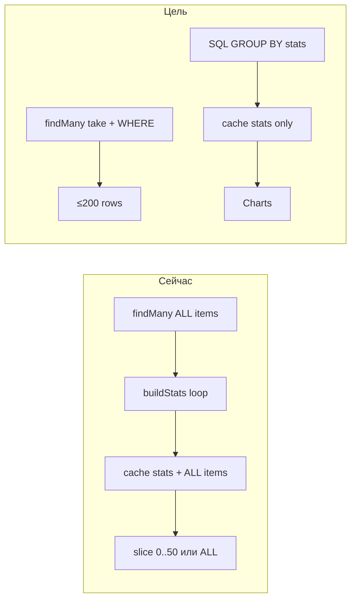

# Оптимизация dashboard: SQL stats + paginated matrix

## Диагноз

Сейчас [`getScopedDashboard`](lib/dashboard/get-scoped-dashboard.ts) на каждый cache miss:

1. `fetchScopedItems` — **`findMany` без `take`** (для panel `scope: global` — **все** `order_items` в системе).
2. `buildScopedStatsFromItems` — перебор в JS.
3. Redis кэширует **полный** `{ stats, items[] }` ([`lib/dashboard/cache.ts`](lib/dashboard/cache.ts)).
4. `itemLimit: 50` на [`panel/page.tsx`](app/(platform)/panel/page.tsx) режет только **ответ**, не запрос.
5. При `?overdue=1` лимит **снимается** → на клиент уходит весь массив; `DataTable` лишь клиентски paginate `pageSize=50`.



---

## Целевая архитектура

| Слой | Что грузим | Кэш | Лимит |
|------|------------|-----|-------|
| **Charts / stat cards** | Агрегаты (`statusDistribution`, `overdueBreakdown`, `statusBreakdown`) | Redis `dashboard:stats:{scope}`, TTL 300s | N/A |
| **Matrix table** | Только строки для текущего view | без полного blob; per-request | default **50**, при активных chart-filters **200** |
| **Chart click** | URL searchParams → SQL `WHERE` | — | server-side filter |

Фильтры чартов → **серверная фильтрация** (выбрано): клик обновляет URL, RSC перечитывает params и делает targeted query.

---

## 1. SQL-агрегаты для stats

Новый модуль [`lib/dashboard/fetch-scoped-stats.ts`](lib/dashboard/fetch-scoped-stats.ts):

- `fetchScopedStats(scope, now)` через `prismaRead.$queryRaw` (или 2–3 запроса).
- Логика display status **как в** [`getDisplayStatusName`](lib/statuses/workflow.ts):

```sql
CASE
  WHEN NOT s.is_terminal AND oi.due_at < $now THEN 'Просрочено'
  ELSE s.name
END
```

- **Global**: GROUP BY `organization.name` для overdue/status breakdown + общий status pie.
- **Organization**: GROUP BY `subdivision.name` (fallback «Без подразделения»).
- **Subdivision**: GROUP BY `order.title`.

Вернуть тот же контракт `ScopedDashboardStats` ([`lib/dashboard/stats.ts`](lib/dashboard/stats.ts)) — UI не меняется.

**Parity check**: оставить `buildScopedStatsFromItems` и добавить dev-only test / script сравнения на seed-данных (или один unit test на фикстуру ~20 items).

---

## 2. Ограниченный fetch items + server filters

Расширить [`lib/dashboard/fetch-scoped-items.ts`](lib/dashboard/fetch-scoped-items.ts):

```typescript
type MatrixItemQuery = {
  limit: number          // default 50, max 200
  overdueOnly?: boolean
  displayStatus?: string // один статус из chart
  breakdownLabel?: string // org / subdivision / order title
}
```

- `buildMatrixItemWhere(scope, query, now)` — Prisma `where` + scope filter.
- Display status → compound condition (overdue vs workflow name), зеркалит `getDisplayStatusName`.
- `findMany({ where, take: limit, orderBy, select: ... })` — тот же `select`, что сейчас.

Refactor [`lib/dashboard/get-scoped-dashboard.ts`](lib/dashboard/get-scoped-dashboard.ts):

- `getScopedDashboardStats(scope)` → только SQL stats.
- `getScopedDashboardItems(scope, query)` → limited fetch + `buildMatrixFromItems`.
- Deprecated monolith `getScopedDashboard` — thin wrapper или удалить после миграции callers.

---

## 3. Split cache

[`lib/dashboard/cache.ts`](lib/dashboard/cache.ts):

- `getCachedScopedDashboardStats(scope)` — кэширует **только stats** (маленький JSON).
- Убрать items из Redis blob.
- Новый `getScopedDashboardItems(scope, query)` — **без** кэша полного списка (опционально позже: cache key по hash query).

Обновить [`lib/orders/index.ts`](lib/orders/index.ts) `getScopedDashboardMatrix` → limited fetch с default limit.

---

## 4. Chart filters через searchParams

Новый [`lib/dashboard/dashboard-query.ts`](lib/dashboard/dashboard-query.ts):

- `parseDashboardSearchParams(searchParams)` → `{ overdueOnly, displayStatus?, breakdownLabel? }`
- `buildDashboardHref(baseHref, filters)` — для chart clicks и overdue toggle
- Сериализация совместима с существующим `?overdue=1`

**Server**: [`components/dashboard/dashboard-matrix-section.tsx`](components/dashboard/dashboard-matrix-section.tsx)

- Принимает parsed query (pages передают searchParams).
- Parallel fetch: `getCachedScopedDashboardStats(scope)` + `getScopedDashboardItems(scope, query)`.
- Убрать prop `itemLimit` — лимит определяется query (50 / 200).

**Client**: [`components/dashboard/dashboard-interactive.tsx`](components/dashboard/dashboard-interactive.tsx) + [`scoped-dashboard-view.tsx`](components/dashboard/scoped-dashboard-view.tsx)

- Chart click handlers → `router.push(buildDashboardHref(...))` вместо только `setColumnFilters`.
- Initial `columnFilters` синхронизировать из searchParams (для подсветки чартов / active filters).
- `DataTable` остаётся client paginate внутри **уже отфильтрованного** server set (50/200).

**Pages** ([`panel/page.tsx`](app/(platform)/panel/page.tsx), [`p/[token]/page.tsx`](app/(public)/p/[token]/page.tsx), [`report/[token]/page.tsx`](app/(public)/report/[token]/page.tsx)):

- Передавать `searchParams` в shell / matrix section.
- Удалить `itemLimit={overdueOnly ? undefined : 50}` — overdue = SQL filter, не unbounded load.

---

## 5. UX детали

- Если filtered query вернул `limit` строк — показать subtle hint под таблицей: «Показаны первые N мер. Уточните фильтр.» (только когда `rows.length === limit`).
- `dashboardShowsEmptyInteractive` — для matrix: empty когда filtered query = 0, charts всё равно из полных stats.
- Invalidation: [`invalidateDashboardCache`](lib/dashboard/cache.ts) инвалидирует только stats keys (поведение сохраняется).

---

## 6. Индексы (минимально)

Проверить/добавить migration при необходимости:

- `order_items(due_at)` — overdue filter
- `order_items(subdivision_id)` — уже есть
- `orders(organization_id)` — уже есть

Без новых индексов лимитированный `take` уже даст выигрыш vs full scan + JS.

---

## Порядок реализации

1. `fetch-scoped-stats.ts` + unit parity test
2. `fetch-scoped-items` query builder + `getScopedDashboardItems`
3. Split `cache.ts` (stats-only)
4. `dashboard-query.ts` + wire searchParams on 3 dashboard pages
5. Client chart handlers → router.push
6. Remove `itemLimit` prop chain; fix `getScopedDashboardMatrix`
7. `typecheck`, `lint`, `build`
8. Запустить `npm run dev` для проверки

---

## Definition of Done

- Panel `/panel`: Network/RSC payload matrix **≤200 rows**, не thousands.
- Cache miss: **нет** full-table `findMany` для stats; stats = SQL aggregate.
- `?overdue=1` не снимает лимит — overdue фильтр в SQL.
- Клик по чарту обновляет URL и таблица показывает server-filtered rows.
- Charts/stats отражают **полный** scope (не обрезаны limit таблицы).
- Dev server запущен на `http://localhost:3000` для ручной проверки.
