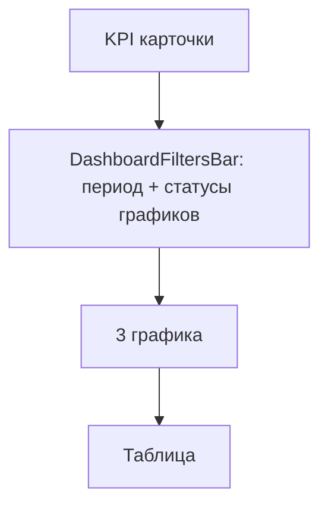

# Панель фильтров дашборда + faceted-статусы

## Проблемы

1. **Категории на графиках** — сейчас переключаются кликом по легенде ([`status-pie-chart-section.tsx`](components/dashboard/status-pie-chart-section.tsx), completion, overdue). Нужен UI как у таблиц: кнопка с `ListFilterIcon` + popover с чекбоксами ([`data-table-faceted-filter.tsx`](components/data-table/data-table-faceted-filter.tsx)).

2. **Слайдер дат пропал** — блок [`DashboardPeriodControl`](components/dashboard/dashboard-period-control.tsx) рендерится только внутри [`scoped-dashboard-view.tsx`](components/dashboard/scoped-dashboard-view.tsx) между графиками и таблицей, и слайдер скрыт при:
   - пресете **«Всё»** (`activePreset === "all"`, строка 125)
   - **одном дне** данных (`minDate === maxDate`)
   - **public** с `itemCount === 0` — весь `DashboardInteractive` не рендерится ([`interactive-props.ts`](lib/dashboard/interactive-props.ts) L112)

## Целевой UX



| Действие | Эффект |
|----------|--------|
| Faceted «Статусы на графиках» | `visibleChartStatuses` — только отрисовка графиков |
| Клик сегмента / KPI | `columnFilters` — фильтр таблицы (без изменений) |
| Пресеты + слайдер периода | URL `from`/`to`/`period` — серверный срез данных |

---

## 1. Новая панель фильтров

Создать [`components/dashboard/dashboard-filters-bar.tsx`](components/dashboard/dashboard-filters-bar.tsx):

- Обёртка `rounded-lg border bg-card p-4` с двумя зонами в одной строке (wrap на mobile):
  - **Слева:** существующий `DashboardPeriodControl` (без своей внешней карточки — убрать дублирующий border из period-control или передать `variant="embedded"`)
  - **Справа:** новый `DashboardChartStatusFacetedFilter`

Размещение в [`dashboard-interactive.tsx`](components/dashboard/dashboard-interactive.tsx) **между KPI и `ScopedDashboardView`** (пользователь выбрал «над графиками»).

Убрать рендер `DashboardPeriodControl` из [`scoped-dashboard-view.tsx`](components/dashboard/scoped-dashboard-view.tsx).

---

## 2. Faceted-фильтр статусов графиков

Создать [`components/dashboard/dashboard-chart-status-faceted-filter.tsx`](components/dashboard/dashboard-chart-status-faceted-filter.tsx):

- UI по образцу [`DataTableFacetedFilter`](components/data-table/data-table-faceted-filter.tsx): `Popover` + `Command` + `Checkbox` + счётчики
- Опции: `DASHBOARD_STATUS_ORDER`, counts из `stats.statusDistribution`
- `selected = visibleChartStatuses` (мультивыбор)
- При снятии галочки: если осталась 1 категория — **disabled** (логика из [`chart-visibility.ts`](lib/dashboard/chart-visibility.ts) `canHideChartCategory`)
- Кнопки «Выбрать все» / «Сбросить» → все 3 статуса видимы
- Badge на иконке: число **скрытых** или невыбранных категорий

Добавить в [`chart-visibility.ts`](lib/dashboard/chart-visibility.ts):

```ts
export function setVisibleChartStatuses(
  selected: ReadonlySet<string>,
  order: readonly string[]
): Set<string>
```

— нормализация с guard «минимум 1».

Props: `visibleChartStatuses`, `onVisibleChartStatusesChange`, `statusDistribution`.

---

## 3. Легенды — только отображение

В трёх chart-section убрать `onItemClick={onToggleChartCategoryVisibility}`:

- [`status-pie-chart-section.tsx`](components/dashboard/status-pie-chart-section.tsx)
- [`completion-breakdown-chart-section.tsx`](components/dashboard/completion-breakdown-chart-section.tsx)
- [`overdue-breakdown-chart-section.tsx`](components/dashboard/overdue-breakdown-chart-section.tsx)

Легенда остаётся информативной: цвет, count, %, `active` при фильтре таблицы. Props `visible`/`disabled` можно упростить (только `opacity` для скрытых на графике, без клика).

Убрать проброс `onToggleChartCategoryVisibility` из chart-section → оставить только `visibleChartStatuses`.

---

## 4. Починка слайдера дат

В [`dashboard-period-control.tsx`](components/dashboard/dashboard-period-control.tsx):

| Было | Станет |
|------|--------|
| Слайдер скрыт при `preset === "all"` | Слайдер **всегда** при `!isSingleDay`; для «Всё» — полный диапазон `[0, totalDays]` |
| Вложенная карточка border | `embedded` режим без внешнего border (border на `DashboardFiltersBar`) |

В [`interactive-props.ts`](lib/dashboard/interactive-props.ts):

- Для `public`: рендерить панель фильтров **даже при `itemCount === 0`** — вынести `DashboardFiltersBar` из условия `dashboardShowsEmptyInteractive` или изменить gate: public показывает empty alert + filters, без графиков/таблицы при 0 items.

Минимальный fix в [`dashboard-matrix-section.tsx`](components/dashboard/dashboard-matrix-section.tsx):

```tsx
// periodBounds + overdueOnly → FiltersBar всегда (если bounds есть)
// charts/table — только при itemCount > 0
```

---

## 5. Тесты

- [`chart-visibility.test.ts`](lib/dashboard/__tests__/chart-visibility.test.ts) — добавить `setVisibleChartStatuses`
- Опционально: unit-тест guard «нельзя выбрать 0 категорий»

---

## Проверка вручную

1. `/panel` — после KPI видна панель: пресеты + **слайдер** + кнопка-фильтр «Статусы»
2. Пресет «Всё» — слайдер на полном диапазоне, не исчезает
3. Faceted-фильтр — снять «Выполнено» → пропадает на всех графиках; KPI/таблица без изменений
4. Нельзя снять последнюю галочку
5. Легенда графиков не кликабельна для видимости; клик по сегменту — фильтр таблицы
6. Public `/p/{token}` с пустым срезом по датам — панель периода всё равно видна
