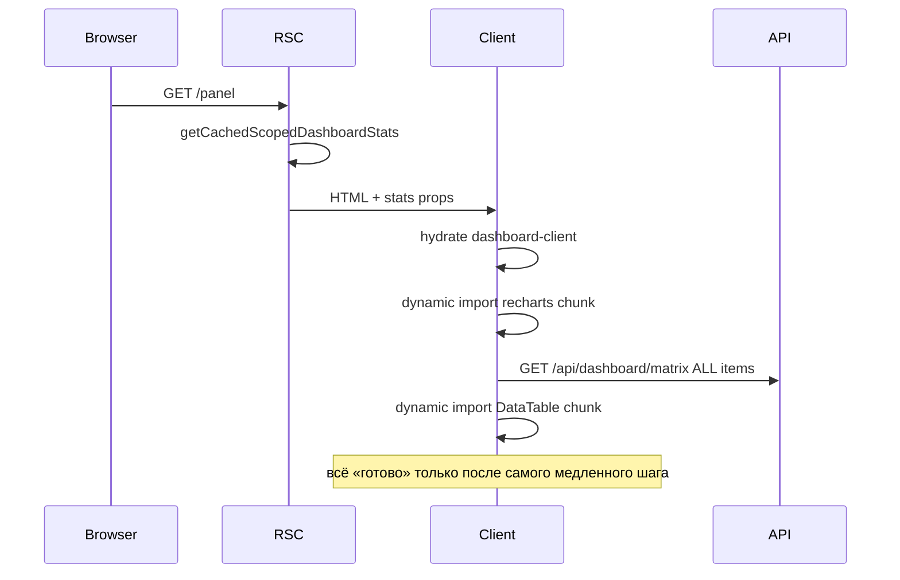

# Dashboard: быстрее первое открытие (single user)

## Диагноз: почему «стало медленнее»



| Было (до hybrid) | Стало (сейчас) |
|------------------|----------------|
| Один RSC: stats + items в одном round-trip | RSC только stats |
| Charts `dynamic(ssr:false)` — skeleton | То же + **второй** HTTP (matrix API) |
| Тяжёлый RSC payload, но без client fetch | Легче RSC, но **waterfall** hydrate → API → chunks |

**Вывод:** сервер стал умнее (SQL stats, стабильные charts при фильтрах), но **critical path для первого экрана** удлинился: matrix fetch + 2–3 JS-chunk'а грузятся последовательно/конкурируют. Это не «хуже навсегда» — это trade-off, который можно поправить progressive loading.

Charts — не главное горлышко сейчас; **matrix API (полный список) + Recharts bundle + TanStack Table** блокируют ощущение «готово».

---

## Целевой UX (выбрано: defer table)


Пользователь видит **живой dashboard за ~1–2 сек**, таблица догружaется ниже без блокировки charts.

---

## Phase 1 — Progressive charts (быстрый win)

### 1.1 Разбить [`scoped-dashboard-charts.tsx`](components/dashboard/scoped-dashboard-charts.tsx)

| Компонент | Приоритет | Загрузка |
|-----------|-----------|----------|
| `StatusPieSection` | above-the-fold | sync import или `dynamic` без skeleton delay |
| `OverdueBreakdownChart` | below | `dynamic` + `IntersectionObserver` wrapper |
| `CompletionBreakdownChart` | below | то же |

Новый [`components/dashboard/dashboard-charts-lazy.tsx`](components/dashboard/charts-lazy-boundary.tsx):
- `useInView({ rootMargin: "200px" })` — mount heavy charts только когда секция близко
- Placeholder = [`DashboardChartCard` skeleton](components/dashboard/dashboard-chart-card-skeleton.tsx) фиксированной высоты (нет layout shift)

### 1.2 Убрать двойной skeleton

Сейчас: `Suspense` в [`dashboard-matrix-section.tsx`](components/dashboard/dashboard-matrix-section.tsx) + `dynamic loading` на charts.

- Убрать outer `Suspense fallback={<DashboardChartsSkeleton />}` вокруг всего `DashboardClient`
- Skeleton только у lazy chart sections и у таблицы

---

## Phase 2 — Defer matrix table (critical path)

### 2.1 Lazy matrix island

Новый [`components/dashboard/dashboard-matrix-lazy.tsx`](components/dashboard/dashboard-matrix-lazy.tsx):

```tsx
// IntersectionObserver rootMargin 400px OR requestIdleCallback fallback
{inView ? <DashboardMatrixTable ... /> : <TableSkeleton rows={8} />}
```

- [`useDashboardMatrix`](lib/dashboard/use-dashboard-matrix.ts): **не fetch на mount**, пока `enabled === false`
- Когда секция in-view → `enabled=true` → один fetch `/api/dashboard/matrix`

Filter clicks: `enabled` уже true → fetch как сейчас (hybrid сохранён).

### 2.2 Не блокировать charts на matrix

В [`dashboard-client.tsx`](components/dashboard/dashboard-client.tsx):
- Stat cards + charts рендерятся **без** ожидания `isLoading` matrix
- Opacity/spinner только на lazy matrix wrapper

---

## Phase 3 — Оптимизация matrix fetch (когда таблица всё же нужна)

Полная client pagination сохраняется, но первый fetch легче:

### 3.1 Slim API response (optional field)

В [`lib/dashboard/serialize-dashboard.ts`](lib/dashboard/serialize-dashboard.ts) добавить `serializeMatrixItemSlim` для dashboard table:
- убрать `measure.description`, `order.issuedAt` если не в колонках
- меньше JSON → быстрее parse/hydrate DataTable

Проверить колонки в [`dashboard-matrix-table.tsx`](components/dashboard/dashboard-matrix-table.tsx) — оставить только используемые поля.

### 3.2 Prefetch matrix on idle (optional)

После charts paint: `requestIdleCallback(() => prefetchMatrix())` если таблица ещё не in-view — таблица появится мгновенно при скролле.

---

## Phase 4 — Charts bundle

### 4.1 Split Recharts imports

[`scoped-dashboard-charts.tsx`](components/dashboard/scoped-dashboard-charts.tsx) (~900 строк) → 3 файла:
- `status-pie-chart.tsx` — Pie only
- `overdue-breakdown-chart.tsx` — Bar
- `completion-breakdown-chart.tsx` — Bar

Next.js code-splitting: pie chunk маленький, bar charts — отдельные lazy chunks.

### 4.2 Убрать `ssr: false` у pie (если feasible)

Pie chart из stats — попробовать render без `dynamic` (client component, но в initial bundle dashboard-client). Bar charts остаются lazy.

Fallback: оставить `dynamic`, но только для bar charts.

---

## Phase 5 — Verify & benchmark

| Метрика | Как мерить |
|---------|------------|
| Time to stat cards | Performance tab: first paint после navigation |
| Time to pie visible | mark `dashboard-charts-pie-ready` |
| Time to table | mark `dashboard-matrix-ready` |
| Filter click | Network: только `/api/dashboard/matrix`, charts DOM stable |

Smoke: `/panel`, `/p/[token]`, `/report/[token]` — cold + warm Redis.

Prod tier 3: `npm run build` + ручной замер на `https://localhost:8443/panel`.

---

## Что НЕ делаем (scope)

- 16 app replicas — не про first-load
- Server pagination matrix — user выбрал full set + client pages
- Возврат `searchParams` на page RSC — сломает stable charts при фильтрах
- SSR full matrix в RSC — против defer table strategy

---

## Definition of Done

- Первый экран: **stat cards + status pie** без ожидания matrix API
- Breakdown charts: lazy, без блокировки pie
- Таблица: fetch + mount только in-view/idle; skeleton до появления
- Фильтры: charts не remount, matrix через API
- `typecheck` + `build` green

## Порядок реализации

1. Lazy boundary + split charts (Phase 1 + 4.1)
2. Defer matrix fetch + lazy table wrapper (Phase 2)
3. Убрать лишний Suspense / skeleton stacking
4. Slim serialize (Phase 3.1) + idle prefetch (3.2) если нужно после замера
5. Benchmark smoke
