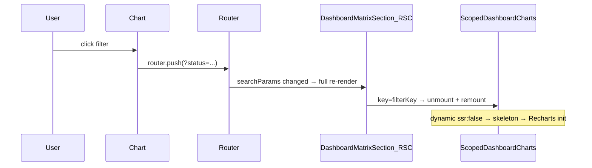
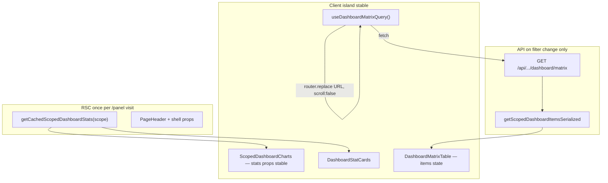

# Dashboard hybrid: charts без remount, matrix через API

## Проблема сейчас



Три слоя проблемы:
1. [`panel/page.tsx`](app/(platform)/panel/page.tsx) **await searchParams** → App Router перезапускает Server Component при каждом фильтре
2. [`key={filterKey}`](components/dashboard/dashboard-matrix-section.tsx) → принудительный remount всего `DashboardInteractive`
3. [`ScopedDashboardCharts`](components/dashboard/scoped-dashboard-view.tsx) — `dynamic(..., { ssr: false })` → после remount виден skeleton

Stats при этом **не меняются** (Redis cache), но charts всё равно пересоздаются.

## Целевая архитектура



**Ключевой трюк Next.js App Router:** если page **не** принимает `searchParams`, то `router.replace(href, { scroll: false })` обновляет URL и client `useSearchParams()`, но **не** re-execute RSC страницы. Charts остаются смонтированы.

Выбор по matrix: **весь отфильтрованный набор** + существующая client pagination в [`DataTable`](components/data-table/data-table.tsx) (50/стр).

---

## 1. API для matrix (3 варианта)

Общий handler в [`lib/dashboard/matrix-api.ts`](lib/dashboard/matrix-api.ts):

```typescript
// parse query string → DashboardMatrixQuery
// getScopedDashboardItemsSerialized(scope, query)
// return { items: SerializedMatrixItem[] }
```

Route handlers (тонкие):

| Variant | Route | Auth |
|---------|-------|------|
| platform | [`app/api/dashboard/matrix/route.ts`](app/api/dashboard/matrix/route.ts) | session cookie (`getSession` + login check) |
| public | [`app/api/public/[token]/dashboard/matrix/route.ts`](app/api/public/[token]/dashboard/matrix/route.ts) | `validateAccessLink` + `assertPublicRateLimit` |
| report | [`app/api/report/[token]/dashboard/matrix/route.ts`](app/api/report/[token]/dashboard/matrix/route.ts) | `validateReportToken` |

Query params: `overdue`, `status`, `label` — те же, что [`parseDashboardSearchParams`](lib/dashboard/dashboard-query.ts).

Public variant: после fetch — `mapSerializedMatrixToPublicItems` в ответе (или отдельное поле `items` как `PublicItem[]`).

Reuse без дублирования SQL: [`getScopedDashboardItemsSerialized`](lib/dashboard/get-scoped-dashboard.ts) + [`buildMatrixItemWhere`](lib/dashboard/fetch-scoped-items.ts) (без `take`, как сейчас после fix pagination).

---

## 2. Client hook: URL + fetch

Новый [`lib/dashboard/use-dashboard-matrix.ts`](lib/dashboard/use-dashboard-matrix.ts) (client):

- `useSearchParams()` → initial `matrixQuery`
- `applyMatrixQuery(nextQuery)`:
  - `router.replace(buildDashboardHref(baseHref, nextQuery), { scroll: false })`
  - `startTransition(() => fetchMatrix(...))`
- State: `{ items, isPending, error }`
- `columnFilters` = `matrixQueryToColumnFilters(scope, matrixQuery)` (уже есть)
- `popstate` не нужен — Next router sync

Chart click handlers и stat cards вызывают `applyMatrixQuery(toggleMatrix*...)` вместо `router.push`.

---

## 3. Split RSC / client components

### Pages — убрать `searchParams`

[`app/(platform)/panel/page.tsx`](app/(platform)/panel/page.tsx), [`app/(public)/p/[token]/page.tsx`](app/(public)/p/[token]/page.tsx), [`app/(public)/report/[token]/page.tsx`](app/(public)/report/[token]/page.tsx):

- удалить `parseDashboardSearchParams` / `matrixQuery` prop
- RSC передаёт только: `scope`, `baseHref`, `variant`, token/statuses

### RSC shell — только stats

[`components/dashboard/dashboard-matrix-section.tsx`](components/dashboard/dashboard-matrix-section.tsx) → переименовать/разделить:

- **Server:** `getCachedScopedDashboardStats(scope)` only
- **Client:** новый [`components/dashboard/dashboard-client.tsx`](components/dashboard/dashboard-client.tsx) — единый island:
  - props: `stats`, `scope`, `variant`, `baseHref`, …
  - внутри: `useDashboardMatrix` + stat cards + charts + table
  - **без `key={filterKey}`**

Удалить server-side `getScopedDashboardItems` из matrix section.

### Overdue toggle

[`components/dashboard/overdue-filter-actions.tsx`](components/dashboard/overdue-filter-actions.tsx) → client component с `onFilterChange` / hook вместо `<Link href>` (иначе снова full navigation).

---

## 4. UX polish

- **`useTransition` + `isPending`:** opacity/spinner только на таблице, charts не трогаем
- **Убрать Suspense skeleton вокруг всего interactive** — charts уже client; skeleton только для matrix loading state
- **Deep link** `/panel?status=Просрочено`: client читает URL на mount → первый fetch; stats уже SSR
- **Back/forward:** `useSearchParams` + effect на query change → refetch matrix

---

## 5. Что не меняем

- SQL stats ([`fetch-scoped-stats.ts`](lib/dashboard/fetch-scoped-stats.ts)) + Redis cache — без изменений
- Toggle helpers в [`dashboard-query.ts`](lib/dashboard/dashboard-query.ts) — reuse as-is
- DataTable client pagination (50/стр, full filtered set) — без изменений
- Chart highlight logic (`columnFilters` from `matrixQuery`) — без изменений

---

## Definition of Done

- Клик по чарту / «Просроченные»: **charts не мигают**, не показывают skeleton
- URL обновляется (`?status=`, `?label=`, `?overdue=1`) — shareable, refresh страницы работает
- Network: при фильтре — только `GET .../dashboard/matrix`, **нет** full RSC document request
- Stats/charts отражают полный scope; table — отфiltered SQL set + client pages
- Все 3 dashboard variants (panel, public, report) работают одинаково
- `typecheck` + smoke на `/panel`: filter → charts stable, table updates

## Порядок реализации

1. `lib/dashboard/matrix-api.ts` + 3 route handlers
2. `use-dashboard-matrix.ts` hook
3. `dashboard-client.tsx` — собрать charts + table + hook
4. Упростить RSC chain (pages → shell → stats-only section)
5. Client `OverdueFilterActions`
6. Удалить `key={filterKey}`, dead server matrix fetch from section
7. Verify all variants + typecheck
