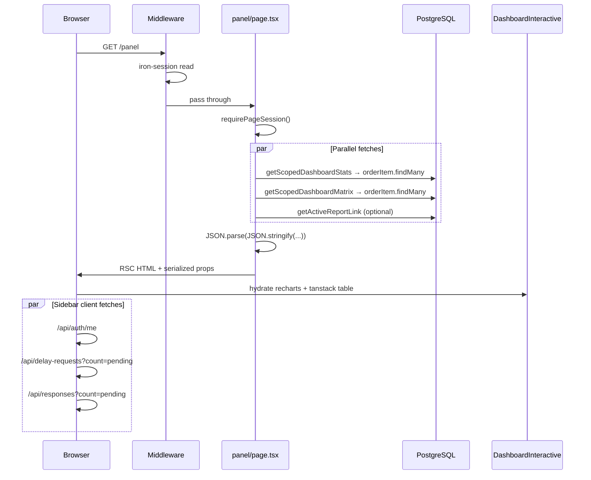
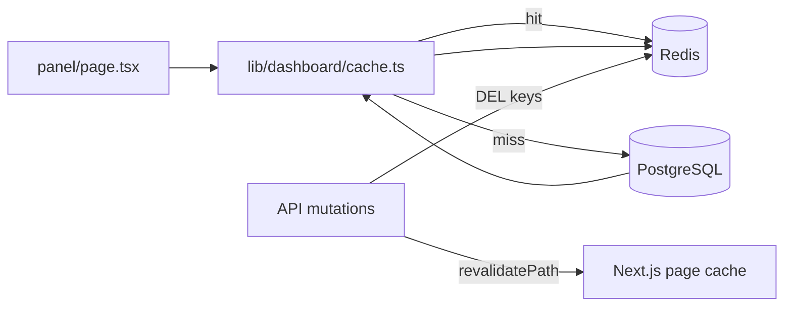

# Анализ скорости дашборда `/panel`

## Короткий ответ

**И dev, и оптимизация — оба фактора.**

- В `next dev` страница всегда будет ощущаться медленнее: on-demand компиляция, отсутствие production-бандла, нет полноценного server cache, dev-only overhead RSC.
- Но **даже в production** дашборд сейчас делает лишнюю работу: два тяжёлых запроса к одной таблице, нет кеширования, весь интерактив (recharts + data-table) грузится и гидратируется сразу.

Перед оптимизацией стоит **сравнить prod vs dev**:
```bash
npm run build && npm run start
# открыть /panel и замерить TTFB + появление контента
```
Если в prod уже быстро — основная боль была dev. Если в prod всё ещё 1–3+ сек — нужны изменения ниже.

---

## Текущий pipeline загрузки



---

## Где теряется время (по приоритету)

### 1. Дублирующиеся запросы к БД — главная server-side проблема

В [`app/(platform)/panel/page.tsx`](app/(platform)/panel/page.tsx) параллельно вызываются:

```ts
getScopedDashboardStats({ type: "global" })
getScopedDashboardMatrix({ type: "global" })
```

Обе функции делают **отдельный** `prisma.orderItem.findMany` с тяжёлыми `include`:

- [`lib/dashboard/stats.ts`](lib/dashboard/stats.ts) — `fetchScopedItems()` (status, subdivision, order+organization)
- [`lib/orders/index.ts`](lib/orders/index.ts) — `getScopedDashboardMatrix()` (+ measure, другой orderBy)

Итог: **2 полных скана `order_items` + joins** на каждый заход на дашборд. Stats можно посчитать из тех же строк, что и matrix.

**Ожидаемый выигрыш:** ~40–50% server time на дашборде (один запрос вместо двух).

### 2. Нет кеширования server data — нужен Redis

- [`next.config.ts`](next.config.ts) пустой — нет `cacheComponents`, нет `use cache`
- В `lib/dashboard/` нет кеш-слоя
- `unstable_cache` / in-memory Next.js cache **не подходят для production** при нескольких инстансах (Docker replicas, rolling deploy) — каждый процесс держит свой кеш, инвалидация через `revalidatePath` не шарится
- В проекте **нет Redis** ([`docker-compose.yml`](docker-compose.yml) — только Postgres + MinIO)

Каждая навигация на `/panel` = свежий full DB fetch.

**Решение: Redis как shared cache layer**



| Подход | Когда | Минус |
|--------|-------|-------|
| `unstable_cache` | single-instance dev/prototype | не шарится между pod'ами |
| **Redis (рекомендуем)** | production, docker-compose dev | +1 сервис, но уже есть паттерн (postgres, minio) |
| `'use cache'` + cache handler | Next 16 multi-instance ISR | сложнее; Redis handler — Phase C |

**Ключи кеша (пример):**
- `dashboard:global` — `/panel`
- `dashboard:org:{id}` — public/report scoped
- `dashboard:sub:{orgId}:{subId}`

**TTL:** 60s default + явная инвалидация при мутациях (orders, responses, delay-requests, report-links и т.д. — там уже есть `revalidatePath("/panel")`).

**Dev fallback:** если `REDIS_URL` не задан — прямой DB fetch (без падения). Локально Redis поднимается через `docker compose up redis`.

**Ожидаемый выигрыш:** повторные заходы < 200ms TTFB; cache hit не трогает Postgres.

### 3. Тяжёлый client bundle — recharts без lazy load

Цепочка client components:
- [`dashboard-page-shell.tsx`](components/dashboard/dashboard-page-shell.tsx) → [`dashboard-interactive.tsx`](components/dashboard/dashboard-interactive.tsx) → [`scoped-dashboard-view.tsx`](components/dashboard/scoped-dashboard-view.tsx) → [`scoped-dashboard-charts.tsx`](components/dashboard/scoped-dashboard-charts.tsx) (recharts, ~800 строк)

В проекте **нет ни одного** `dynamic()` import. Recharts грузится синхронно при гидратации.

**Ожидаемый выигрыш:** быстрее First Contentful Paint / Time to Interactive, особенно на слабых машинах.

### 4. Блокирующий SSR без streaming

Страница ждёт **все** данные в `Promise.all` перед отдачей контента. Нет `Suspense` границ для:
- stat cards (лёгкие, можно показать раньше)
- charts (тяжёлые)
- matrix table

Скелетон [`panel/loading.tsx`](app/(platform)/panel/loading.tsx) показывается только при **client navigation**; при hard refresh skeleton не спасает — ждём полный SSR.

**Ожидаемый выигрыш:** воспринимаемая скорость (контент появляется частями).

### 5. Лишняя сериализация

```ts
stats={JSON.parse(JSON.stringify(stats))}
items={JSON.parse(JSON.stringify(matrixItems))}
```

Двойная сериализация большого payload на сервере. Нужна только если Prisma возвращает `Date` — лучше явный mapper в serializable DTO, один проход.

### 6. Dev-only и layout overhead (меньший, но заметный)

| Фактор | Dev | Prod |
|--------|-----|------|
| Компиляция route | каждый cold start | prebuilt |
| JS bundle | unminified | minified + split |
| Server cache | почти нет | partial |
| React dev checks | да | нет |

Дополнительно на каждой panel-странице:
- [`middleware.ts`](middleware.ts) — `iron-session` read
- [`app-sidebar.tsx`](components/app-sidebar.tsx) — 3 client fetch (`/api/auth/me`, delays count, responses count) — не блокируют дашборд, но добавляют сетевой шум

---

## Что НЕ является основной проблемой

- **Рендер React** сам по себе — stats считаются в памяти быстро; узкое место — DB + payload size + hydration
- **Route loading skeleton** — уже сделан, помогает только при SPA-навигации
- **CDN** — не нужен на текущем масштабе; Redis закрывает server-side cache

---

## Рекомендуемый план оптимизации

**Принцип мелких diff:** каждая подфаза = отдельный коммит/PR, 1–3 файла, `typecheck + build` green. Старые функции остаются thin wrappers до полного переключения. Не смешивать infra (Redis) с UI (Suspense) в одном PR.

---

### Phase A — data layer

#### A0 — baseline (только замер, 0 code)

| Подфаза | Файлы | Действие |
|---------|-------|----------|
| A0 | — | `npm run build && npm run start`; замерить TTFB `/panel` cold + warm; сравнить с `next dev`; записать цифры в комментарий к PR |

#### A1 — extract fetch (lib only)

| Подфаза | Файлы | Diff |
|---------|-------|------|
| A1 | `lib/dashboard/fetch-scoped-items.ts` (new), `lib/dashboard/stats.ts` | Перенести `fetchScopedItems` + `DashboardScope` where из stats; `stats.ts` импортирует оттуда. **Страницы не трогаем.** |

#### A2 — unified function (lib only)

| Подфаза | Файлы | Diff |
|---------|-------|------|
| A2a | `lib/dashboard/build-matrix.ts` (new) | `buildMatrixFromItems(items)` — логика из `getScopedDashboardMatrix` |
| A2b | `lib/dashboard/get-scoped-dashboard.ts` (new) | `getScopedDashboard(scope)` → один `fetchScopedItems` → `{ stats, items }` |
| A2c | `lib/dashboard/stats.ts`, `lib/orders/index.ts` | Thin wrappers: `getScopedDashboardStats` / `getScopedDashboardMatrix` делегируют в `getScopedDashboard` (обратная совместимость) |

#### A3 — DTO mapper (lib only)

| Подфаза | Файлы | Diff |
|---------|-------|------|
| A3 | `lib/dashboard/serialize-dashboard.ts` (new) | `serializeDashboardDto({ stats, items })` — явный mapper `Date` → ISO string; заменяет `JSON.parse(JSON.stringify(...))` |

#### A4 — wire pages (по одной странице)

| Подфаза | Файлы | Diff |
|---------|-------|------|
| A4a | `app/(platform)/panel/page.tsx` | `getScopedDashboard` + `serializeDashboardDto`; убрать двойной `Promise.all` stats/matrix |
| A4b | `app/(public)/report/[token]/page.tsx` | То же для report dashboard |
| A4c | — | `p/[token]/page.tsx` **не трогаем** в Phase A: там данные из `validateAccessToken`, не дубль findMany |

**DoD Phase A:** один SQL на `/panel`; поведение UI без изменений; wrappers можно удалить в отдельном cleanup-PR позже.

---

### Phase A2 — Redis cache

#### A2.1 — infra (без app logic)

| Подфаза | Файлы | Diff |
|---------|-------|------|
| A2.1a | `docker-compose.yml` | Сервис `redis:7-alpine`, port 6379, volume, healthcheck |
| A2.1b | `.env.example` | `REDIS_URL=redis://localhost:6379` |
| A2.1c | `package.json` | `ioredis` dependency |

#### A2.2 — redis client (изолированный модуль)

| Подфаза | Файлы | Diff |
|---------|-------|------|
| A2.2 | `lib/cache/redis.ts` (new) | `getRedis()`, `isRedisEnabled()`; если `REDIS_URL` пуст — `null`, без throw |

#### A2.3 — cache layer (lib only)

| Подфаза | Файлы | Diff |
|---------|-------|------|
| A2.3a | `lib/dashboard/cache-keys.ts` (new) | `dashboardCacheKey(scope)` → `dashboard:global` / `dashboard:org:N` / `dashboard:sub:N:M` |
| A2.3b | `lib/dashboard/cache.ts` (new) | `getCachedScopedDashboard`, `invalidateDashboardCache`; miss → `getScopedDashboard` + SETEX 60 |

#### A2.4 — wire cache (по одной точке входа)

| Подфаза | Файлы | Diff |
|---------|-------|------|
| A2.4a | `panel/page.tsx` | Заменить `getScopedDashboard` на `getCachedScopedDashboard` (1 import + 1 call) |
| A2.4b | `report/[token]/page.tsx` | То же для report scope |

#### A2.5 — invalidation (батчами по API-группам)

| Подфаза | Файлы | Diff |
|---------|-------|------|
| A2.5a | `lib/dashboard/invalidate-on-mutation.ts` (new) | `revalidateDashboardPaths()` = `invalidateDashboardCache()` + существующий `revalidatePath("/panel")` |
| A2.5b | `app/api/orders/route.ts`, `app/api/orders/[id]/route.ts` | +1 вызов helper рядом с `revalidatePath` |
| A2.5c | `app/api/orders/[id]/items/[itemId]/route.ts`, `.../responses/route.ts` | То же |
| A2.5d | `app/api/responses/route.ts`, `app/api/delay-requests/route.ts`, `app/api/report-links/route.ts` | То же |
| A2.5e | `app/api/public/[token]/items/[id]/status/route.ts`, `.../delays/route.ts` | Scope-specific `invalidateDashboardCache(scope)` |

**DoD Phase A2:** повторный `/panel` без Postgres (Redis MONITOR / query log); после POST order — cache miss; app стартует без `REDIS_URL`.

---

### Phase B — воспринимаемая скорость (UI, без data changes)

#### B1 — lazy recharts (1 файл, самый маленький win)

| Подфаза | Файлы | Diff |
|---------|-------|------|
| B1 | `components/dashboard/scoped-dashboard-view.tsx` | `dynamic(() => import('./scoped-dashboard-charts'), { ssr: false, loading: () => <ChartsSkeleton /> })` — **только этот файл** |

#### B2 — Suspense fallback

| Подфаза | Файлы | Diff |
|---------|-------|------|
| B2a | `components/dashboard/dashboard-charts-skeleton.tsx` (new) | 3 chart card placeholders (reuse `DashboardChartCard` layout) |
| B2b | `components/dashboard/dashboard-page-shell.tsx` | Обернуть `DashboardInteractive` в `<Suspense fallback={<DashboardChartsSkeleton />}>` — data fetch остаётся в page, без split |

#### B3 — streaming split (опционально, если B1–B2 мало)

| Подфаза | Файлы | Diff |
|---------|-------|------|
| B3a | `components/dashboard/dashboard-stats-section.tsx` (new, RSC) | Header + stat cards из props |
| B3b | `components/dashboard/dashboard-charts-section.tsx` (new, RSC wrapper) | Charts + table в client child |
| B3c | `panel/page.tsx` | Два `<Suspense>` блока с общим `getCachedScopedDashboard` через `cache()` dedup в рамках request |

**Порядок:** B1 → B2 → B3. B3 делать только если нужен hard-refresh streaming.

**DoD Phase B:** recharts не в initial JS chunk; skeleton виден при slow hydration.

---

### Phase C — по мере роста данных (отложено)

| Подфаза | Файлы | Diff |
|---------|-------|------|
| C1 | `lib/dashboard/fetch-scoped-items.ts` | `include` → `select` только нужных полей |
| C2 | `prisma/migrations/...` | `@@index` на `order_items.subdivision_id`, `orders.organization_id` |
| C3 | `cache-handler.js`, `next.config.ts` | Next.js ISR cache handler на Redis ([self-hosting](.agents/skills/next-best-practices/self-hosting.md)) — только при multi-instance ISR |

Каждая подфаза C — отдельный PR, не блокирует A/A2/B.

---

### Порядок выполнения (рекомендуемый)

```
A0 → A1 → A2a → A2b → A2c → A3 → A4a → A4b
  → A2.1a → A2.1b → A2.1c → A2.2 → A2.3a → A2.3b → A2.4a → A2.4b
  → A2.5a → A2.5b → A2.5c → A2.5d → A2.5e
  → B1 → B2a → B2b → (B3 по необходимости)
  → C1 / C2 / C3 по метрикам
```

---

## DoD для проверки

- Prod build: cold load `/panel` < 1s TTFB на dev seed данных
- Повторный заход < 200ms TTFB (Redis hit, Postgres не вызывается)
- После мутации (создание поручения / review response) — cache invalidated, дашборд показывает свежие данные
- Один SQL query на dashboard cache miss (Prisma query log)
- Redis поднимается `docker compose up -d redis`, app стартует без Redis если `REDIS_URL` пуст
- Charts появляются после stat cards (streaming)
- `npm run typecheck && npm run build` green
