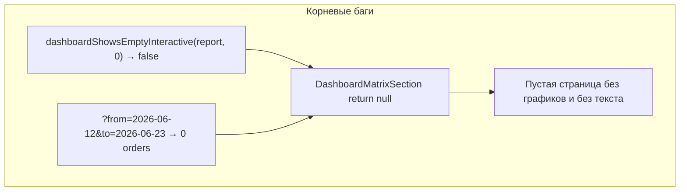
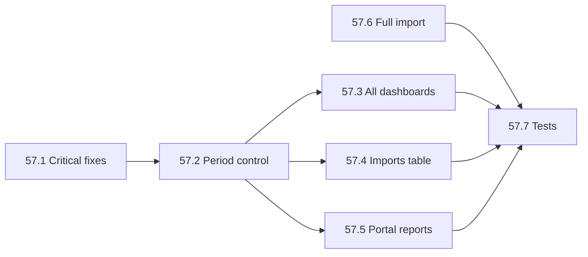

# Починка дашборда, репортов, слайдер периода, полный импорт

## Диагноз: почему «сломано»



| Симптом | Причина | Файл |
|---------|---------|------|
| `/panel` с датами — пусто | Фильтр `issuedAt` отсекает все поручения + при `itemCount=0` секция **не рендерится** | [`dashboard-matrix-section.tsx`](components/dashboard/dashboard-matrix-section.tsx) L82–84 |
| `/report/{token}` — «не работает» | Тот же gate: report при 0 items → `return null`, нет «Нет данных» | [`interactive-props.ts`](lib/dashboard/interactive-props.ts) L108–112 |
| Пресеты дат сбрасываются | «Просроченные» ведёт на `?overdue=1` без `from`/`to` | [`overdue-filter-actions.tsx`](components/dashboard/overdue-filter-actions.tsx) |
| Карточка «В работе» не подсвечивается | Фильтр ставит 3 статуса, active проверяет только 1 | [`dashboard-interactive.tsx`](components/dashboard/dashboard-interactive.tsx) L17–21 |
| Репорт устаревший после мутаций | Инвалидируется только `dashboard:global`, не `dashboard:organization:*` и не dated keys | [`cache.ts`](lib/dashboard/cache.ts) L45–48 |
| Слайдер только на `/panel` | Org/sub/report pages не передают `issuedFrom`/`issuedTo` | org/sub/report `page.tsx` |
| Письма без среза | [`measure-imports-table.tsx`](components/platform/measure-imports-table.tsx) — нет фильтра по дате | — |
| Корпус неполный | Default seed = 11 писем; full = `db:seed:corpus:full` не запускался | [`package.json`](package.json) |

Терминал: `GET /report/... 200` — маршруты живы, ломается **отображение** (пустой UI / устаревший кеш), не 404.

---

## Фаза 57.1 — Критические фиксы дашборда (маленький diff)

### 57.1a Empty state для platform + report
- [`dashboard-matrix-section.tsx`](components/dashboard/dashboard-matrix-section.tsx): убрать ранний `return null` для `platform`/`report`; всегда показывать `Alert` при `itemCount === 0`, графики — при `itemCount > 0` **или** показывать KPI с нулями (пустой `statusDistribution` → 3 карточки с 0)
- [`interactive-props.ts`](lib/dashboard/interactive-props.ts): `dashboardShowsEmptyInteractive` — `report` ведёт себя как `platform` (показывать shell)

### 57.1b Фильтры и подсветка
- [`overdue-filter-actions.tsx`](components/dashboard/overdue-filter-actions.tsx): строить URL с сохранением `from`, `to`, `overdue`
- [`dashboard-interactive.tsx`](components/dashboard/dashboard-interactive.tsx): `activeStatus` через `isDashboardStatusFilterActive` (multi-value для «В работе»)
- [`chart-filters.ts`](lib/dashboard/chart-filters.ts): добавить `isDashboardStatusFilterActive`

### 57.1c Кеш
- [`cache.ts`](lib/dashboard/cache.ts) + [`json-cache.ts`](lib/cache/json-cache.ts): `invalidateKeysByPrefix("dashboard:")` при мутациях
- [`cache-invalidate.test.ts`](lib/dashboard/__tests__/cache-invalidate.test.ts): обновить ожидания на `dashboard:organization:5` / `dashboard:subdivision:1:2`

**DoD:** `/panel?from=...&to=...` с пустым результатом показывает сообщение; `/report/{token}` с 0 items — текст «Нет данных», не белый экран.

---

## Фаза 57.2 — Единый контрол периода (пресеты + слайдер)

Заменить [`dashboard-date-filter.tsx`](components/dashboard/dashboard-date-filter.tsx) на **`DashboardPeriodControl`**:

| Пресет | Период |
|--------|--------|
| 30 дней | `today - 30d` … `today` |
| 90 дней | default при первом заходе |
| Год | `today - 365d` … `today` |
| Всё | без `from`/`to` |

+ **dual-range slider** (shadcn `Slider` range) для точной подстройки `from`/`to` по `Order.issuedAt`.

Новые файлы:
- [`lib/dashboard/period-range.ts`](lib/dashboard/period-range.ts) — parse/preset/serialize URL (`from`, `to`, опционально `period=30d|90d|1y|all`)
- [`components/dashboard/dashboard-period-control.tsx`](components/dashboard/dashboard-period-control.tsx) — client UI

Границы слайдера: `min(issuedAt)` … `max(issuedAt, today)` — один server query в shell или передача bounds с page.

**DoD:** смена пресета/слайдера обновляет URL и перезагружает графики + таблицу.

---

## Фаза 57.3 — Период на всех дашбордах + share-репорты

Подключить `parseDashboardDateRange` + `mergeDashboardScope` + `DashboardPeriodControl` в:

| Страница | Файл |
|----------|------|
| Global panel | [`app/(platform)/panel/page.tsx`](app/(platform)/panel/page.tsx) — заменить DateFilter |
| Org dashboard | [`organizations/[id]/dashboard/page.tsx`](app/(platform)/panel/organizations/[id]/dashboard/page.tsx) |
| Sub dashboard | [`subdivisions/[subId]/dashboard/page.tsx`](app/(platform)/panel/organizations/[id]/subdivisions/[subId]/dashboard/page.tsx) |
| Report global | [`app/(public)/report/[token]/page.tsx`](app/(public)/report/[token]/page.tsx) |
| Report org/sub | `report/.../dashboard/page.tsx` |

Для report URL: `?from=&to=` на том же token-path; `baseHref` в shell сохраняет query.

[`dashboard-page-shell.tsx`](components/dashboard/dashboard-page-shell.tsx): `beforeContent` = period control на всех вариантах.

**DoD:** share-link `/report/{token}?from=2024-01-01&to=2024-12-31` фильтрует данные; org/sub panel тоже.

---

## Фаза 57.4 — Срез в таблице писем

[`app/(platform)/panel/measures/imports/page.tsx`](app/(platform)/panel/measures/imports/page.tsx):
- Добавить `DashboardPeriodControl` (или shared `PeriodControl`) в header
- [`measure-imports-table.tsx`](components/platform/measure-imports-table.tsx): client filter по `createdAt` (или `reportDueAt` если есть) в выбранном диапазоне
- Счётчик «Показано N из M»

Опционально: колонка `issuedAt` поручений по `sourceImportId` — не в первом diff.

**DoD:** слайдер на `/panel/measures/imports` фильтрует строки синхронно с периодом дашборда (общие `from`/`to` в URL или local state).

---

## Фаза 57.5 — Портал отчётов `/p/{token}/reports`

[`lib/public/reports.ts`](lib/public/reports.ts) `fetchPublicReportItems`:
- Добавить фильтр `submittedAt` between `from`/`to` (аналог `issuedAt` на дашборде)
- [`public-reports-page-client.tsx`](components/public/public-reports-page-client.tsx) или page: `DashboardPeriodControl`
- Кнопки статуса (Все / На проверке / …) сохраняют `from`/`to` в query

**DoD:** исполнитель видит отчёты за выбранный период; фильтры статуса не сбрасывают даты.

---

## Фаза 57.6 — Полный импорт корпуса

```bash
npm run corpus:build-seed-manifest
npm run db:seed:corpus:full   # SEED_IMPORT_ALL=1
```

Post-check скрипт или консольный summary в seed:
- `MeasureImport` status=IMPORTED ≈ 218 letters + appendices
- routing 2019 = FAILED (принять)
- `corpus:gap-report` — zero=0

Опционально после импорта: `SEED_XLSX_HISTORY=1` для dev-истории статусов.

**DoD:** в UI `/panel/measures/imports` сотни писем; дашборд и репорты с периодом «Всё» показывают данные.

---

## Фаза 57.7 — Тесты и документация

- Тесты: `fetch-scoped-items` + `issuedFrom`/`issuedTo`; `period-range.ts` presets; `isDashboardStatusFilterActive`
- Починить [`stats-legacy.test.ts`](lib/dashboard/__tests__/stats-legacy.test.ts) под `IN_PROGRESS` breakdown
- README: период-контрол, `db:seed:corpus:full`, оба типа репортов

---

## Порядок работ



**Сначала 57.1** — без этого любой date filter выглядит как «сломанный дашборд». Параллельно можно запустить **57.6** (долгий импорт).
