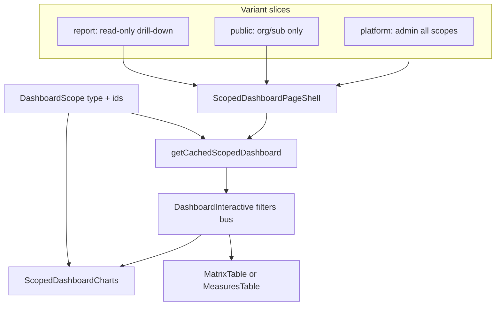
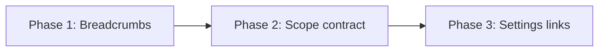

# Унификация сводки, breadcrumbs и управление ссылками

## Текущее состояние

Сводка **уже построена на общем стеке** — 9 маршрутов используют один [`ScopedDashboardPageShell`](components/dashboard/dashboard-page-shell.tsx) → [`DashboardMatrixSection`](components/dashboard/dashboard-matrix-section.tsx) → [`DashboardInteractive`](components/dashboard/dashboard-interactive.tsx) → [`ScopedDashboardView`](components/dashboard/scoped-dashboard-view.tsx). Данные всегда идут через `getCachedScopedDashboard(scope)`.



**Матрица «срезов»** (одна логика, разный scope):

| Scope | Platform | Public | Report |
|-------|----------|--------|--------|
| global | `/panel` | — | `/report/{token}` |
| organization | `/panel/organizations/{id}/dashboard` | `/p/{token}` | `/report/{token}/organizations/{id}/dashboard` |
| subdivision | `.../subdivisions/{subId}/dashboard` | `/p/{token}/subdivisions/{subId}` | `.../subdivisions/{subId}/dashboard` |

Charts/filters уже scope-aware через [`chart-filters.ts`](lib/dashboard/chart-filters.ts) (`organization` / `subdivisionName` / `orderTitle`).

**Оставшиеся разрывы:** breadcrumbs не подключены к dashboard-страницам, дублирование props (`chartScope` / `publicScope`), inline public-ссылки, 9 copy-paste `page.tsx`, нет централизованного UI для ссылок.

---

## Фаза 1 — Breadcrumbs (быстрый фикс)

### Причина бага

[`buildPlatformCrumbs`](components/platform/platform-breadcrumb.tsx) не знает про `/dashboard`:

- **`/panel/organizations/7/dashboard`** — попадает в generic-ветку (стр. 95–97), `dynamicLabel` не задан → fallback `"Организация"`.
- **`/panel/organizations/7/subdivisions/49/dashboard`** — ветка `/subdivisions/` (стр. 81–88) не добавляет финальный crumb для `/dashboard`, `middleCrumbs` пуст → на мобиле видно только «Организации».

Dashboard-страницы **не регистрируют** breadcrumb context (в отличие от [`OrgBreadcrumb`](components/platform/org-breadcrumb.tsx) на edit/detail).

### Исправление

**1. Расширить `buildPlatformCrumbs`:**

```typescript
// org dashboard: /panel/organizations/:id/dashboard
if (pathname.match(/^\/panel\/organizations\/\d+\/dashboard$/)) {
  crumbs.push(...middleCrumbs)
  crumbs.push({ label: dynamicLabel ?? "Сводка" })
  return crumbs
}

// subdivision dashboard — внутри блока /subdivisions/, перед return:
else if (pathname.endsWith("/dashboard")) {
  crumbs.push({ label: dynamicLabel ?? "Сводка" })
}
```

**2. Новый client-компонент** [`components/platform/dashboard-breadcrumb-effect.tsx`](components/platform/dashboard-breadcrumb-effect.tsx):

- **Org dashboard:** `<OrgBreadcrumb />` + `usePlatformBreadcrumbLabel("Сводка")`
- **Subdivision dashboard:** `middleCrumbs` = org (→ org detail) + subdivision (→ subdivision dashboard) + label `"Сводка"`

**3. Подключить в:**
- [`app/(platform)/panel/organizations/[id]/dashboard/page.tsx`](app/(platform)/panel/organizations/[id]/dashboard/page.tsx)
- [`app/(platform)/panel/organizations/[id]/subdivisions/[subId]/dashboard/page.tsx`](app/(platform)/panel/organizations/[id]/subdivisions/[subId]/dashboard/page.tsx)

**4. Аудит report breadcrumbs** — при необходимости аналогичный effect для `/report/{token}/organizations/.../dashboard` (сейчас та же дыра).

Ожидаемый результат:
- Org: `Сервис… → Организации → {org.name} → Сводка`
- Sub: `Сервис… → Организации → {org.name} → {sub.name} → Сводка`

---

## Фаза 2 — Унификация scope-контракта сводки

Цель: **один переиспользуемый компонент**, routes — тонкие обёртки (auth + entity lookup).

### 2.1 Единый scope → chartScope

Убрать дублирование `chartScope` / `publicScope` из shell props. Добавить в [`lib/dashboard/stats.ts`](lib/dashboard/stats.ts) или [`variant-config.ts`](lib/dashboard/variant-config.ts):

```typescript
function chartScopeFromDashboardScope(scope: DashboardScope): ChartFilterScope {
  return scope.type // "global" | "organization" | "subdivision"
}
```

Использовать внутри [`dashboard-matrix-section.tsx`](components/dashboard/dashboard-matrix-section.tsx) и [`interactive-props.ts`](lib/dashboard/interactive-props.ts). Routes передают только `scope: DashboardScope`.

### 2.2 Единые link targets для всех variant

Расширить [`lib/dashboard/link-targets.ts`](lib/dashboard/link-targets.ts):

```typescript
export function dashboardLinkTargets(
  variant: DashboardVariant,
  token?: string
): DashboardMatrixLinkTargets | PublicLinkTargets
```

- **platform** — как сейчас
- **report** — как сейчас
- **public** — org/subdivision/measure/order/baseHref (сейчас inline в [`scoped-dashboard-view.tsx`](components/dashboard/scoped-dashboard-view.tsx) стр. 122–126)

Убрать inline href из `ScopedDashboardView`; table получает targets из одного места.

### 2.3 Route factory

Новый [`lib/dashboard/build-dashboard-page-props.ts`](lib/dashboard/build-dashboard-page-props.ts):

```typescript
buildDashboardPageProps({
  variant, scope, token?, title, description,
  overdueOnly, emptyMessage, headerActions?, statuses?, showSubdivisionColumn?
})
```

Вычисляет `baseHref`, `emptyMessage`, variant-specific fields. Каждый `page.tsx` сокращается до ~15 строк: guard → resolve entity → `return <Shell {...buildDashboardPageProps(...)} />`.

### 2.4 Shell slots для public-обёрток

Добавить в [`ScopedDashboardPageShell`](components/dashboard/dashboard-page-shell.tsx) optional props:

- `beforeContent?: ReactNode` — для [`PublicReportsRevisionBanner`](components/public/public-reports-revision-banner.tsx)
- `breadcrumbEffect?: ReactNode` — для [`PublicBreadcrumbMiddle`](components/public/public-breadcrumb-effect.tsx)

Public subdivision page перестаёт быть structurally особенным — всё через shell.

### 2.5 Table adapter (без слияния двух таблиц)

[`MeasuresDataTable`](components/shared/measures-data-table.tsx) и [`DashboardMatrixTable`](components/dashboard/dashboard-matrix-table.tsx) **намеренно разные** (public: «Заполнить», другой row type). Но dispatch и link wiring — в одном месте:

- Новый `DashboardScopedTable` в [`scoped-dashboard-view.tsx`](components/dashboard/scoped-dashboard-view.tsx) или отдельный файл
- Переиспользовать [`createSubdivisionColumn`](lib/data-table/columns/subdivision-column.tsx) в обеих таблицах (единый filter id `subdivisionName`)
- Удалить dead fallback `internalFilters` в `ScopedDashboardView` (filters всегда controlled из `DashboardInteractive`)

### 2.6 Документ scope-матрицы

Краткий комментарий в [`lib/dashboard/stats.ts`](lib/dashboard/stats.ts) (`DashboardScope`) + обновление [`AGENTS.md`](AGENTS.md): «сводка = один компонент, три variant-slice, scope определяет данные и breakdown».

**URL public subdivision (`/p/.../subdivisions/{id}` без `/dashboard`) — не менять** (breaking change для email-ссылок); унификация на уровне компонентов, не URL.

---

## Фаза 3 — Настройки: вкладка «Публичные ссылки»

По вашему уточнению: **не одна кнопка «сбросить всё»**, а datatable с выбором.

### 3.1 Модель «LinkScope»

```typescript
type LinkScopeRow = {
  key: string                    // "report" | "org:7" | "sub:49"
  kind: "report" | "organization" | "subdivision"
  organizationId?: number
  organizationName?: string
  subdivisionId?: number
  subdivisionName?: string
  activeLink?: { id, token, createdAt, url }
  status: "active" | "missing" | "revoked"
}
```

### 3.2 Backend

**Новый lib:** [`lib/public-links/list-scopes.ts`](lib/public-links/list-scopes.ts)
- Все org + subdivisions (Prisma join)
- Active link per scope через `getActiveOrgLink` / `getActiveSubdivisionLink` / `getActiveReportLink`
- Одна строка для global report link

**API:**
- `GET /api/settings/public-links` — список scopes (permission: `settingsWrite`)
- `POST /api/settings/public-links/regenerate` — body `{ keys: string[] }` — для каждого key вызывает существующие `createReportLink` / `createOrganizationAccessLink` / `createSubdivisionAccessLink` (revoke + new token + cache invalidation уже внутри)
- Опционально `POST .../revoke` для выбранных без регенерации

### 3.3 UI

**Новая страница:** [`app/(platform)/panel/settings/public-links/page.tsx`](app/(platform)/panel/settings/public-links/page.tsx)

**Nav item** в [`components/platform/settings-nav.tsx`](components/platform/settings-nav.tsx):
- «Публичные ссылки» — управление portal/report токенами
- Permission: `settingsWrite`

**Client component** [`components/platform/public-links-manager.tsx`](components/platform/public-links-manager.tsx):
- DataTable (reuse [`DataTable`](components/data-table/data-table.tsx) + row selection)
- Колонки: тип, организация, подразделение, статус, URL (copy), дата создания
- Toolbar: «Регенерировать выбранные», «Регенерировать все активные», confirm dialog с предупреждением что старые URL перестанут работать
- Результат операции: toast + обновление таблицы

Per-org UI ([`OrgLinksPanel`](components/platform/org-links-panel.tsx)) **оставить** для day-to-day на странице организации; settings — для ops/incident response.

---

## Порядок работ и риски



| Риск | Митигация |
|------|-----------|
| Регенерация ломает ссылки в отправленных письмах | Confirm dialog + явное предупреждение; выборочная регенерация |
| Public URL mismatch | Не трогаем URL, только internal wiring |
| Regression в chart filters | Существующие тесты [`chart-filters.test.ts`](lib/dashboard/__tests__/chart-filters.test.ts), [`serialize-dashboard.test.ts`](lib/dashboard/__tests__/serialize-dashboard.test.ts) — прогон после Phase 2 |

## Definition of Done

- Breadcrumbs корректны на org/sub dashboard platform (+ report если аудит показал gap)
- Все 9 dashboard routes используют `buildDashboardPageProps`, передают только `scope` + variant-specific auth
- Link targets — единый модуль для platform/public/report
- Settings → «Публичные ссылки»: таблица всех scopes, multi-select, регенерация выбранных
- Тесты: breadcrumb paths (unit), `list-scopes`, regenerate API (403/200)
