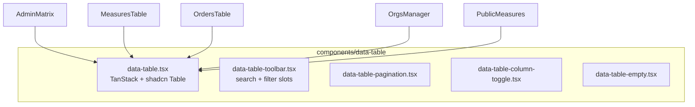

# Dashboard template + unified tables + public measure UX

## Проблема

| Область | Сейчас | Жалоба |
|---------|--------|--------|
| Таблицы | [`DataTableShell`](components/admin/data-table-shell.tsx) — только border + optional toolbar; логика размазана | В public есть поиск/фильтры ([`public-measures-table.tsx`](components/public/public-measures-table.tsx)), в admin dashboard / orders / measures / orgs — нет |
| Shell | Базовый [`AppShell`](components/shell/app-shell.tsx) | Шаблон [`.external/dashboard`](.external/dashboard) богаче: inset sidebar, KPI cards, container queries |
| Public sidebar | Один пункт «Сводка» | Нужна навигация **по поручениям → мерам** |
| Страница меры | [`public-item-detail.tsx`](components/public/public-item-detail.tsx) — `max-w-2xl`, узкая колонка | Выглядит «сплющенно» в новом shell |

**Не портируем целиком:** 808-строчный demo [`data-table.tsx`](.external/dashboard/components/data-table.tsx) с dnd-kit drag-reorder, пустые Tabs, `@tabler/icons-react`, demo Drawer. Берём **паттерны**, не демо-данные.

---

## Phase 1 — Зависимости и UI primitives

```bash
npm install @tanstack/react-table
npx shadcn@latest add toggle-group  # для chart filters (если понадобится позже)
```

Проверить наличие в [`components/ui/card.tsx`](components/ui/card.tsx): `CardAction`, `CardFooter` уже есть — KPI cards можно делать сразу.

---

## Phase 2 — Единый DataTable (реюзабельность)

Новая папка `components/data-table/`:



### API (минимальный, domain-agnostic)

```tsx
<DataTable
  columns={ColumnDef<T>[]}
  data={T[]}
  toolbar={<DataTableToolbar searchKey="name" filters={...} />}
  pagination={{ pageSize: 20 }}
  empty={<EmptyTableState ... />}
/>
```

**Toolbar** (из шаблона, упрощённо):
- Text search (global filter по заданным колонкам)
- Slot `filters` — Select/Badge для статуса, overdue и т.д.
- Column visibility dropdown (иконка `Columns`, lucide)
- Pagination: rows per page + prev/next (паттерн из external lines ~700+)

**Заменить** ручные `Table` в:
- [`app/(admin)/admin/(panel)/page.tsx`](app/(admin)/admin/(panel)/page.tsx) — matrix + search по org/measure/order
- [`components/admin/measures-table.tsx`](components/admin/measures-table.tsx)
- [`components/admin/orders-table.tsx`](components/admin/orders-table.tsx)
- [`components/admin/organizations-manager.tsx`](components/admin/organizations-manager.tsx)
- [`components/admin/order-detail-client.tsx`](components/admin/order-detail-client.tsx)
- [`components/public/public-measures-table.tsx`](components/public/public-measures-table.tsx) — refactor на shared DataTable (сохранить grouping by order через `meta` или sub-rows)

[`DataTableShell`](components/admin/data-table-shell.tsx) → thin wrapper вокруг `DataTable` или deprecated alias.

**Фильтры overdue:** единая модель — page-level `?overdue=1` (server) **+** client status filter в toolbar; убрать дублирование на public.

---

## Phase 3 — Shell polish из шаблона

### 3a. Inset layout + container queries

Обновить [`components/shell/app-shell.tsx`](components/shell/app-shell.tsx):
- CSS vars `--sidebar-width`, `--header-height` (как [external page.tsx](.external/dashboard/app/page.tsx))
- `Sidebar variant="inset"` в [`shell-sidebar.tsx`](components/shell/shell-sidebar.tsx)
- Content wrapper: `@container/main flex flex-col gap-4`

### 3b. KPI Section Cards

Новый [`components/dashboard/dashboard-stat-cards.tsx`](components/dashboard/dashboard-stat-cards.tsx) — layout из [section-cards.tsx](.external/dashboard/components/section-cards.tsx), данные из `getScopedDashboardStats()`:

| Карточка | Global admin | Public org | Public subdivision |
|----------|-------------|------------|-------------------|
| Всего мер | all items | org items | subdivision items |
| Просрочено | overdue count | ... | ... |
| Выполнено | terminal count | ... | ... |
| В работе | active count | ... | ... |

Вставить **над** [`ScopedDashboardCharts`](components/dashboard/scoped-dashboard-charts.tsx) на admin и public dashboard.

### 3c. Admin sidebar enhancements

Расширить [`components/shell/shell-sidebar.tsx`](components/shell/shell-sidebar.tsx):
- optional `primaryAction` — «Создать поручение» (паттерн NavMain Quick Create → link `/admin/orders/new`)
- optional `secondaryLinks` pinned `mt-auto` (NavSecondary pattern)

[`components/app-sidebar.tsx`](components/app-sidebar.tsx): primary CTA + текущие 4 ссылки.

---

## Phase 4 — Public sidebar: поручения → меры

Расширить [`components/public/public-shell.tsx`](components/public/public-shell.tsx):

**Данные:** layout [`app/(public)/p/[token]/layout.tsx`](app/(public)/p/[token]/layout.tsx) уже вызывает `validateAccessToken` — передать в shell компактный `navOrders: { title, items: { id, measureName, status }[] }[]`.

**Навигация:**
```
Сводка                    → /p/{token}
Поручения                 (SidebarGroupLabel)
  ▸ Поручение A           (collapsible)
      · Мера 1            → /p/{token}/items/{id}  [badge status]
      · Мера 2
  ▸ Поручение B
```

Новый [`components/shell/shell-nav-groups.tsx`](components/shell/shell-nav-groups.tsx) — collapsible `SidebarMenuSub` (shadcn sidebar pattern).

**Active state:** item route `/p/{token}/items/[id]` подсвечивает соответствующую меру; «Сводка» active только на dashboard.

---

## Phase 5 — Public measure detail (full-width redesign)

Переработать [`components/public/public-item-detail.tsx`](components/public/public-item-detail.tsx):

**Layout:** убрать `max-w-2xl`; full-width grid `@container/main`:

```
┌─────────────────────────────────────────────────────┐
│ PageHeader: название + code badge + order/subdivision │
├──────────────────────────┬──────────────────────────┤
│ Card «О мере»            │ Card «Срок и статус»     │
│ description (prose)      │ due date, status badge   │
│                          │ «Взять в работу»         │
├──────────────────────────┴──────────────────────────┤
│ Card «Отчёт о выполнении» (full width, primary CTA)   │
└─────────────────────────────────────────────────────┘
```

- Description в [`Card`](components/ui/card.tsx) с `text-muted-foreground leading-relaxed`, не голый `<p>`
- Metadata row: поручение, подразделение, код — compact badges
- Status block: крупный badge + overdue styling
- Report form: `Card size="default"` с gradient accent (`from-primary/5`) когда active
- Delay request — в card «Срок», не отдельный floating block

Breadcrumb остаётся: Org → Сводка → {measure name}.

---

## Phase 6 — Charts polish (optional, low risk)

Из [chart-area-interactive.tsx](.external/dashboard/components/chart-area-interactive.tsx) взять только:
- responsive card min-heights
- `@container/card` breakpoints для legend/labels

Без time-series demo data — domain charts в [`scoped-dashboard-charts.tsx`](components/dashboard/scoped-dashboard-charts.tsx) уже есть.

---

## DoD

- Все основные списки (admin + public) используют shared `DataTable` с search + pagination; admin dashboard matrix тоже
- Admin и public dashboards: KPI cards + charts + unified table
- Shell: inset variant, container queries
- Public sidebar: collapsible nav по поручениям/мерам с active state на item pages
- Public item detail: full-width grid, читаемое описание, не «сплющено»
- `npm run typecheck && lint && build`
