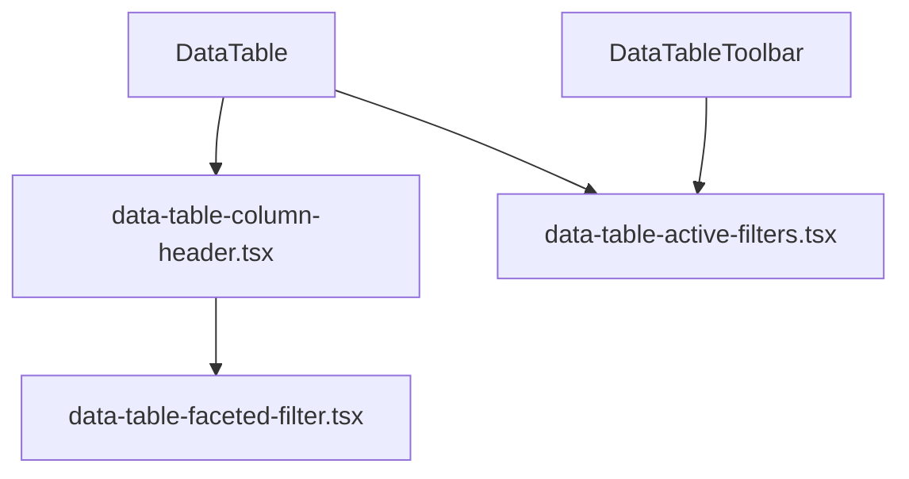

# Faceted column filters + chart-driven filtering

## Цель

| Область | Поведение |
|---------|-----------|
| Все `DataTable` | Фильтр по колонке через иконку в заголовке (как Excel): Popover, поиск значений, чекбоксы, «Выбрать все» / «Сбросить» |
| Сводки admin + public | Клик по категории в pie/bar chart → применяет/снимает соответствующий column filter в таблице ниже |
| Остальные страницы | Только column filters, без chart sync |

---

## Phase 1 — Примитивы DataTable

Новые файлы в [`components/data-table/`](components/data-table/):



### [`data-table-column-header.tsx`](components/data-table/data-table-column-header.tsx)
- Заголовок колонки + кнопка сортировки (ArrowUpDown) + кнопка фильтра (ListFilter)
- Если `column.getCanFilter()` и `meta.faceted !== false` — рендерит `DataTableFacetedFilter`
- Используется в `header` колонок: `header: ({ column }) => <DataTableColumnHeader column={column} title="Статус" />`

### [`data-table-faceted-filter.tsx`](components/data-table/data-table-faceted-filter.tsx)
Паттерн shadcn (Popover + Command + Checkbox):
- Уникальные значения из `column.getFacetedUniqueValues()` (TanStack Table)
- Поиск по списку значений
- Чекбоксы; «Выбрать все» / «Очистить»
- Badge с количеством активных значений на иконке фильтра
- `filterFn` на колонке: `(row, id, value: string[]) => !value?.length || value.includes(String(row.getValue(id)))`

### [`data-table-active-filters.tsx`](components/data-table/data-table-active-filters.tsx)
- Строка Badge-чипов активных column filters над таблицей («Статус: В работе ×», «Организация: X ×»)
- Кнопка «Сбросить все фильтры»

### Обновить [`data-table.tsx`](components/data-table/data-table.tsx)
- Добавить state `columnFilters` + `onColumnFiltersChange`
- Подключить `getFacetedRowModel()`, `getFacetedUniqueValues()`
- **Controlled mode** для chart sync:
  ```tsx
  columnFilters?: ColumnFiltersState
  onColumnFiltersChange?: (filters: ColumnFiltersState) => void
  ```
- Проброс `ActiveFilters` в toolbar
- Export новых компонентов из [`index.ts`](components/data-table/index.ts)

### Хелпер [`lib/data-table/faceted-column.ts`](lib/data-table/faceted-column.ts)
```tsx
export function facetedFilterFn(row, columnId, filterValue: string[]) { ... }
export const FACETED_COLUMN_META = { faceted: true } as const
```
Чтобы не дублировать `filterFn` / `enableColumnFilter` в каждой таблице.

---

## Phase 2 — Подключить faceted columns во все DataTable

| Таблица | Faceted-колонки |
|---------|-----------------|
| [`admin-dashboard-matrix.tsx`](components/admin/admin-dashboard-matrix.tsx) | org, order, status |
| [`public-measures-table.tsx`](components/public/public-measures-table.tsx) | orderTitle, status (+ subdivisionName когда есть) |
| [`orders-table.tsx`](components/admin/orders-table.tsx) | organization |
| [`measures-table.tsx`](components/admin/measures-table.tsx) | — (только global search; даты/текст без faceted) |
| [`organizations-manager.tsx`](components/admin/organizations-manager.tsx) | subdivisions (accessorFn → joined names) |
| [`order-detail-client.tsx`](components/admin/order-detail-client.tsx) | status, subdivision |

Для каждой faceted-колонки:
- `accessorFn` / `accessorKey` возвращает **строку для фильтрации** (display value, не JSX)
- `header: DataTableColumnHeader`
- `filterFn: facetedFilterFn`, `enableColumnFilter: true`

**Public measures:** убрать toolbar-Select статуса ([`public-measures-table.tsx`](components/public/public-measures-table.tsx) lines 136–153) — заменяется column filter на «Статус».

**Public org scope:** добавить `subdivisionName` в [`PublicItem`](components/public/public-measures-table.tsx) и сериализацию в [`app/(public)/p/[token]/page.tsx`](app/(public)/p/[token]/page.tsx), чтобы bar chart «по подразделениям» мог фильтровать таблицу.

---

## Phase 3 — Chart → table sync (только сводки)

### Client wrapper [`components/dashboard/scoped-dashboard-view.tsx`](components/dashboard/scoped-dashboard-view.tsx)

Объединяет charts + table + shared `columnFilters` state:

```tsx
const [columnFilters, setColumnFilters] = useState<ColumnFiltersState>(
  initialFilters // из ?overdue=1 → [{ id: "status", value: ["Просрочено"] }]
)
```

Toggle-логика: повторный клик по той же категории снимает фильтр.

### [`lib/dashboard/chart-filters.ts`](lib/dashboard/chart-filters.ts)

Маппинг chart click → `ColumnFiltersState` по scope:

| Chart | Admin global | Public org | Public subdivision |
|-------|-------------|------------|-------------------|
| Status pie | `status: [label]` | `status: [label]` | `status: [label]` |
| Overdue bar | `organization: [label]` | `subdivisionName: [label]` | `orderTitle: [label]` |
| Completion bar (completed) | `organization` + `status: [Выполнено]` | `subdivisionName` + `status: [Выполнено]` | `orderTitle` + `status: [Выполнено]` |
| Completion bar (active) | `organization` + `status: [К исполнению, В работе, Просрочено]` | аналогично | аналогично |

### Обновить [`scoped-dashboard-charts.tsx`](components/dashboard/scoped-dashboard-charts.tsx)
- Props: `onStatusClick`, `onOverdueBarClick`, `onCompletionSegmentClick`, `activeFilters` (для highlight)
- Recharts: `cursor="pointer"`, `onClick` на `Pie`/`Bar`/`Cell`
- Визуальная подсветка активного сегмента (opacity / stroke)

### Страницы сводок

**Admin** [`app/(admin)/admin/(panel)/page.tsx`](app/(admin)/admin/(panel)/page.tsx):
- Убрать server-side `items.filter(overdue)` для matrix — передавать все items в `ScopedDashboardView`
- `?overdue=1` → initial column filter, кнопки «Все»/«Просроченные» обновляют URL (как сейчас) + initial state wrapper

**Public** [`public-dashboard-page.tsx`](components/public/public-dashboard-page.tsx) + [`page.tsx`](app/(public)/p/[token]/page.tsx):
- Аналогично: все items → wrapper, overdue через initial filter
- Charts + `PublicMeasuresTable` внутри wrapper с controlled `columnFilters`

---

## Phase 4 — UX polish

- Toolbar: global search + active filter chips + column toggle (существующее)
- Pagination сбрасывается на page 0 при изменении filters (TanStack default)
- Empty state: «Нет строк по текущим фильтрам» + кнопка сброса
- KPI cards (`DashboardStatCards`) **не** фильтруются — показывают полный срез (как Excel summary vs filtered rows)

---

## DoD

- На всех DataTable с категориальными колонками — faceted filter в header (shadcn Popover/Checkbox)
- На admin/public сводке: клик pie/bar применяет фильтр таблицы; повторный клик снимает; активный сегмент подсвечен
- `?overdue=1` по-прежнему работает через initial column filter
- `npm run typecheck && lint && build`
