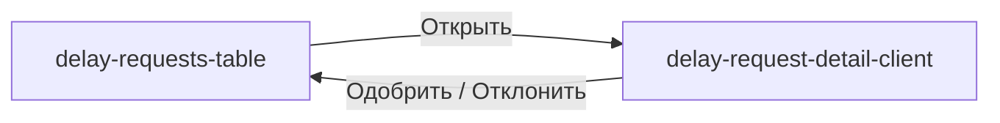

# Компактная таблица переносов

## Контекст

Сейчас [`components/admin/delay-requests-table.tsx`](components/admin/delay-requests-table.tsx) содержит **9 колонок**: Организация, Поручение, Мера, Текущий срок, Новый срок, **Запрошено**, **Статус**, **approve/reject**, **ChevronRight**. На ширине экрана таблица не помещается.

Страница детали [`components/admin/delay-request-detail-client.tsx`](components/admin/delay-request-detail-client.tsx) уже содержит статус, дату запроса, обоснование и кнопки «Одобрить» / «Отклонить» — inline-действия в таблице дублируют её.

## Целевые колонки

| Колонка | Поведение |
|---------|-----------|
| Организация | `truncate` + `title` с полным текстом |
| Поручение | ссылка на поручение, `truncate` |
| Мера | ссылка на меру, `truncate` (приоритет — самые длинные названия) |
| Текущий срок | `dd.MM.yyyy`, фикс. ширина |
| Новый срок | `dd.MM.yyyy`, фикс. ширина |
| Статус | компактный `Badge` (как сейчас) |
| Действие | одна кнопка «Открыть» + `ChevronRightIcon` → `/panel/delay-requests/{id}` |

**Убрать из таблицы:**
- колонку «Запрошено» (`createdAt`)
- колонку с icon-кнопками approve/reject
- отдельную icon-колонку «Подробнее» (объединить в одну)

Фильтры по статусу на [`app/(admin)/admin/(panel)/delay-requests/page.tsx`](app/(admin)/admin/(panel)/delay-requests/page.tsx) остаются без изменений.

## Изменения в коде

### 1. [`components/admin/delay-requests-table.tsx`](components/admin/delay-requests-table.tsx)

**Колонки** — оставить 7, удалить `createdAt`, `actions` (approve/reject), `details`.

**Truncation** — локальный helper (без нового файла):

```tsx
function TruncatedCell({ text, className }: { text: string; className?: string }) {
  return (
    <span className={cn("block min-w-0 truncate", className)} title={text}>
      {text}
    </span>
  )
}
```

Применить к ячейкам Организация / Поручение / Мера. Ссылки сохранить, текст внутри — `TruncatedCell`.

**Layout таблицы** — передать в `DataTable` prop `className` или обернуть: на `<Table>` добавить `table-fixed`, чтобы truncate работал предсказуемо. Для текстовых `<TableCell>` — `className="max-w-0"` (стандартный паттерн для ellipsis в table).

**Колонка «Действие»** — по образцу [`components/public/public-orders-list-page.tsx`](components/public/public-orders-list-page.tsx):

```tsx
<Button variant="ghost" size="sm" asChild>
  <Link href={`/panel/delay-requests/${row.original.id}`}>
    Открыть
    <ChevronRightIcon data-icon="inline-end" />
  </Link>
</Button>
```

**Cleanup** — удалить неиспользуемое после упрощения:
- `processingId`, `reviewDelay`, `CheckIcon`, `XIcon`
- импорт `notify` (если больше не нужен в этом файле)

### 2. [`components/data-table/data-table.tsx`](components/data-table/data-table.tsx) — опционально, минимально

Если `className` на `DataTable` уже прокидывается на корень, достаточно добавить `table-fixed` через prop на `<Table>` внутри `DelayRequestsTable` — **не менять** общий `DataTable`, если можно обойтись `className` на обёртке + стилями ячеек в одном файле.

Предпочтительный минимальный diff: только `delay-requests-table.tsx`, без правок shared DataTable.

## Навигация



## Definition of Done

- Таблица: Организация, Поручение, Мера, Текущий срок, Новый срок, Статус, кнопка «Открыть»
- Длинные названия мер (и org/order) обрезаются с `…`, полный текст в `title`
- «Запрошено» и inline approve/reject убраны из таблицы
- `npm run typecheck && npm run lint && npm run build`
