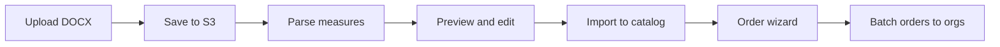
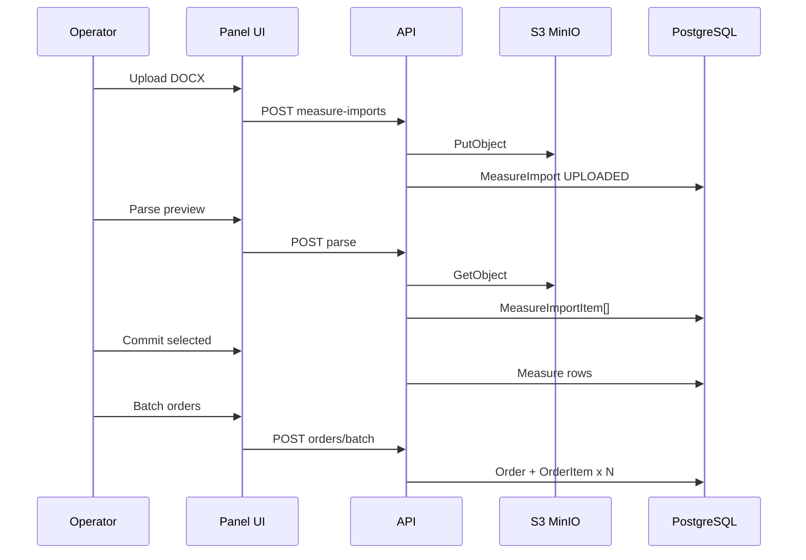

# Импорт мер из DOCX — пофазный план

## Анализ примеров из [`.external/docx_examples/`](.external/docx_examples/)

| Файл | Тип | Структура | Что импортировать |
|------|-----|-----------|-------------------|
| [`240 93 4164.docx`](.external/docx_examples/240%2093%204164.docx) | Письмо с мерами | Секции `1.`, `2.`, `3.` (контекст угроз) + **листовые пункты `1.1`–`1.7`, `2.x`…** (~17 нумерованных блоков) | Листовые пункты → меры; код = `1.1`, `2.3` |
| [`240 93 4165.docx`](.external/docx_examples/240%2093%204165.docx) | Письмо об уязвимостях | Плоский список **`1.`–`5.`** с BDU-кодами | 5 мер; код = `BDU:2026-08030` (regex) |
| [`Приложение 240 93 4164.docx`](.external/docx_examples/Приложение%20240%2093%204164.docx) | IoC-приложение | ~150 строк SHA256, без нумерации мер | **1 сводная мера** + файл в S3 (выбор пользователя) |

**Общие метаданные писем** (regex из текста):
- Номер: из имени файла / паттерн `240/93/4164`
- Заголовок: «О мерах по повышению защищенности…»
- Срок отчёта: «до DD месяца YYYY» в footer
- Email отчётности: `otd93@fstec.ru`

**Технический вывод:** DOCX = ZIP + `word/document.xml`. Парсинг через параграфы (не split по `\n` из raw XML — там разбитые слова). Библиотека: `mammoth` (HTML/текст) или `jszip` + свой walker по `w:p` (предпочтительнее для нумерации).

---

## Целевой пользовательский цикл



**Сейчас в коде:**
- Меры: ручной CRUD — [`MeasureForm`](components/platform/measure-form.tsx), поля `name`, `code`, `description` — [`prisma/schema.prisma`](prisma/schema.prisma)
- Поручение: **1 организация** за раз — [`OrderCreateForm`](components/platform/order-create-form.tsx) → `POST /api/orders` — [`createOrder`](lib/orders/index.ts)
- S3: только image attachments для отчётов — [`lib/storage/config.ts`](lib/storage/config.ts)

**Gap:** нет сущности «регуляторный документ», нет DOCX upload, нет batch orders.

---

## Модель данных (новое)

```prisma
enum MeasureImportStatus { UPLOADED PARSED IMPORTED FAILED }
enum MeasureImportKind { LETTER APPENDIX }

model MeasureImport {
  id             Int
  kind           MeasureImportKind
  status         MeasureImportStatus
  documentNumber String?      // "240/93/4164"
  title          String?
  reportDueAt    DateTime?
  storageKey     String       // S3
  originalName   String
  mimeType       String
  sizeBytes      Int
  sha256         String?
  parentImportId Int?         // appendix → letter
  uploadedById   Int
  importedAt     DateTime?
  items          MeasureImportItem[]
  measures       Measure[]    // created from this import
}

model MeasureImportItem {
  id          Int
  importId    Int
  code        String?        // "1.1" | "BDU:2026-08030"
  name        String
  description String?
  sortOrder   Int
  included    Boolean @default(true)  // user toggles in preview
  measureId   Int?           // set after commit
}
```

Расширение `Measure`: опционально `sourceImportId`, `sourceImportItemId` — для трассировки «откуда мера».

---

## Фазы (маленький diff, branch `fstec/phase-NN-slug`)

### Phase 31 — Data layer + S3 для DOCX

| Sub | Scope | Files |
|-----|-------|-------|
| **31.1** | Prisma models + migration | `prisma/schema.prisma`, migration |
| **31.2** | `lib/regulatory-docs/storage.ts` — upload/read DOCX в S3 (`regulatory-docs/{importId}/…`), расширить MIME allowlist | `lib/storage/config.ts` или отдельный config |
| **31.3** | `lib/measure-imports/index.ts` — CRUD import record, link parent/child | `lib/measure-imports/` |

**DoD:** migrate OK; unit smoke upload mock to MinIO.

---

### Phase 32 — DOCX parser (lib + tests)

| Sub | Scope | Files |
|-----|-------|-------|
| **32.1** | Paragraph extractor из DOCX XML | `lib/measure-imports/parse-docx.ts` |
| **32.2** | Heuristic: numbered items `^\d+(\.\d+)+\.` = measure; top-level `^\d+\.$` без sub = section intro (skip or attach as description prefix) | same + `detect-import-kind.ts` |
| **32.3** | Metadata: doc number, title, due date, BDU codes | `lib/measure-imports/extract-metadata.ts` |
| **32.4** | Fixture tests на 3 файла из `.external/docx_examples/` | `lib/measure-imports/__tests__/parse-docx.test.ts` |

**Ожидаемый результат парсинга 4164:** ~10–15 листовых мер (1.1, 1.2…), не секции-контекст «1. Хакерскими группировками…».

**4165:** 5 мер с `code=BDU:…`.

**Приложение:** `kind=APPENDIX`, 0 parsed items → UI предложит сводную меру.

**DoD:** tests green; snapshot кол-ва items для каждого fixture.

---

### Phase 33 — Upload API + список импортов

| Sub | Scope | Files |
|-----|-------|-------|
| **33.1** | `POST /api/measure-imports` — multipart upload (OPERATOR+) | `app/api/measure-imports/route.ts` |
| **33.2** | `GET /api/measure-imports`, `GET /api/measure-imports/[id]` | route handlers |
| **33.3** | UI: `/panel/measures/imports` — таблица документов | page + `measure-imports-table.tsx` |
| **33.4** | UI: `/panel/measures/imports/new` — drag-drop DOCX | upload form + `loading.tsx` |

Nav: пункт «Импорт» в разделе Меры — [`lib/nav/platform-nav.ts`](lib/nav/platform-nav.ts) (permission `measuresWrite`).

**DoD:** upload 4165.docx → запись в БД + файл в S3; список виден в UI.

---

### Phase 34 — Parse preview + commit в каталог

| Sub | Scope | Files |
|-----|-------|-------|
| **34.1** | `POST /api/measure-imports/[id]/parse` — запуск парсера, сохранение `MeasureImportItem[]`, status=PARSED | API |
| **34.2** | Preview UI: таблица items (checkbox, edit name/code/description inline) | `measure-import-preview.tsx` |
| **34.3** | `POST /api/measure-imports/[id]/commit` — создать `Measure` для included items; dedupe по `code` (update existing if same code) | `lib/measure-imports/commit.ts` |
| **34.4** | Appendix flow: если `kind=APPENDIX` — одна мера «Проверить файловые индикаторы (приложение {docNumber})» + `description` со ссылкой на S3 | commit logic branch |

**DoD:** 4165 → preview 5 мер → commit → видны в `/panel/measures`; повторный commit не дублирует по BDU code.

---

### Phase 35 — Связь импорт → мастер поручения

| Sub | Scope | Files |
|-----|-------|-------|
| **35.1** | Расширить [`OrderCreateDraft`](components/platform/order-create-draft.tsx): `sourceImportId`, `documentNumber`, prefill title/due | draft types |
| **35.2** | На `/panel/measures/imports/[id]` кнопка «Создать поручение» → `/panel/orders/new?importId=` | navigation |
| **35.3** | [`OrderCreateForm`](components/platform/order-create-form.tsx): загрузить меры import (`measureId[]`), prefill title «Поручение по письму 240/93/4165», due from `reportDueAt` | form |
| **35.4** | Badge/link «Источник: письмо …» на карточке меры (optional) | measure detail |

**DoD:** import → order wizard с уже выбранными мерами и сроком.

---

### Phase 36 — Пакетное создание поручений (multi-org)

| Sub | Scope | Files |
|-----|-------|-------|
| **36.1** | `POST /api/orders/batch` — `{ titleTemplate, organizationTargets: [{orgId, subdivisionId?}], defaultDueAt, measureIds[] }` → N orders в transaction | `lib/orders/batch-create.ts`, validation |
| **36.2** | UI step «Кому назначить»: multi-select orgs + optional subdivision per org (matrix/checkbox grid) | `order-batch-targets.tsx` |
| **36.3** | Progress toast + redirect to orders list filtered by import tag | UX polish |
| **36.4** | Optional: `Order.sourceImportId` для фильтра «поручения по документу» | schema + list filter |

**DoD:** один import → 5 org × 5 measures = 5 orders одной кнопкой.

---

### Phase 37 — Appendix linking + polish + docs

| Sub | Scope | Files |
|-----|-------|-------|
| **37.1** | Upload appendix с выбором parent import (letter) | UI + API |
| **37.2** | Download original DOCX from S3 (presigned GET) на странице import | API + button |
| **37.3** | Error states: corrupt DOCX, empty parse → manual fallback (add items by hand in preview) | UI |
| **37.4** | README section «Импорт из DOCX» + update master plan phase table | docs |

**DoD:** letter + appendix связаны; полный цикл на fixture-доках за ≤5 минут оператора.

---

## Архитектура потока данных



---

## Риски и mitigations

| Риск | Mitigation |
|------|------------|
| DOCX с таблицами/колонтитулами ломает нумерацию | Parser tests + ручная правка в preview (Phase 34) |
| Word split runs (`Хакерск` + `ими`) | Парсить на уровне `w:p`, не raw text dump |
| Дубликаты мер между письмами | Dedupe by `code`; UI показывает «обновить существующую» |
| Большие appendix (150+ hashes) | Одна сводная мера, файл только в S3 |
| Batch orders partial failure | Single DB transaction per batch request |

---

## Зависимости npm

- `jszip` — чтение DOCX (или `mammoth` если проще для MVP; предпочтение jszip для контроля параграфов)
- dev: fixtures из `.external/docx_examples/` в tests (не коммитить бинарники в repo — добавить в `.gitignore` или `docs/fixtures/` по решению; сейчас файлы локальные)

---

## Что не входит в v1

- PDF / scanned documents (OCR)
- Авто-отправка отчёта на otd93@fstec.ru
- Парсинг вложенных `.doc` inside zip
- AI/LLM extraction

---

## Критерии готовности (полный цикл)

1. Оператор загружает `240 93 4165.docx`
2. Видит 5 мер в preview, правит при необходимости, commit
3. «Создать поручения» → выбирает 3+ организации/подразделения
4. Получает N поручений с одинаковым набором мер и сроком из письма
5. Оригинал DOCX доступен для скачивания из S3
6. Appendix → 1 свodная мера + файл привязан к письму
