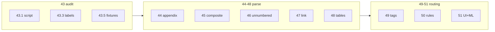

# План: DOCX-парсер и маршрутизация (миниподфазы)

**Принцип:** одна миниподфаза = один PR, **1–3 файла**, тесты рядом с логикой. Не смешивать parser + UI + prisma в одном diff.

**Скоуп:** DOCX + routing. Excel в продукте — [xlsx_report_forms.plan.md](./xlsx_report_forms.plan.md) (deferred).

---

## Карта миниподфаз

---

## 43 — Аудит корпуса (6 миниподфаз)

| ID | Diff | Файлы |
|----|------|-------|
| **43.1** | Скелет audit-скрипта | `scripts/audit-docx-corpus.mjs` |
| **43.2** | Pattern classification в скрипте | тот же файл |
| **43.3** | Labels extractor offline | `scripts/extract-labels-dataset.mjs` |
| **43.4** | Wiring | `.gitignore`, `package.json` script `corpus:audit` |
| **43.5** | Первые 5 fixtures | `.external/docx_examples/corpus/*` |
| **43.6** | Остальные fixtures по audit | копирование файлов |

**DoD блока 43:** `npm run corpus:audit` → summary JSON; 12–15 fixtures; `labels-dataset.jsonl` локально.

---

## 44 — Appendix kind (5 миниподфаз)

| ID | Diff | Файлы |
|----|------|-------|
| **44.1** | `classifyAppendixKind()` pure | `parse-docx.ts`, `parse-docx.test.ts` |
| **44.2** | Подключить в `detectImportKind` | `parse-docx.ts` |
| **44.3** | Fixture 1409 appendix 38 мер | `parse-docx.test.ts`, corpus file |
| **44.4** | Import pipeline RECOMMENDATIONS | `index.ts` |
| **44.5** | Mock test import | `index.test.ts` |

**Не трогать:** Prisma enum в 44 — kind остаётся `APPENDIX`/`LETTER` в БД; различие только в parse-ветке (меньше миграций).

---

## 45 — Composite 6837 (6 миниподфаз)

| ID | Diff | Файлы |
|----|------|-------|
| **45.1** | Regex + boilerplate helper | `parse-docx.ts` или `parse-composite.ts`, tests |
| **45.2** | `stripThreatPreamble` | +tests isolated |
| **45.3** | `splitCompositeBlock` unit test на raw block | +tests |
| **45.4** | `expandCompositeBlocks` в pipeline | `parse-docx.ts` |
| **45.5** | Fixture 6837 + коды `2.1`… | `parse-docx.test.ts`, corpus |
| **45.6** | Regression 4164/4165 counts | `parse-docx.test.ts` only |

**Порядок:** 45.1→45.3 без изменения публичного API; 45.4 одна строчка в pipeline.

---

## 46 — Unnumbered (4 миниподфазы)

| ID | Diff | Файлы |
|----|------|-------|
| **46.1** | BDU-inline parser | `parse-unnumbered.ts` (новый, маленький) |
| **46.2** | Imperative list parser | тот же файл |
| **46.3** | Orchestrator + hook | `parse-docx.ts` (3–5 строк) |
| **46.4** | Fixtures 2386, 1423 | tests + corpus |

---

## 47 — Letter↔appendix + regression (6 миниподфаз)

| ID | Diff | Файлы |
|----|------|-------|
| **47.1** | `needsAppendix` в metadata extract | `extract-metadata.ts`, test |
| **47.2** | Поле в БД | `prisma/schema.prisma`, migrate |
| **47.3** | UI баннер | `measure-import-detail-client.tsx` |
| **47.4** | Auto parent на child upload | `createMeasureImportUpload` / API route |
| **47.5** | Corpus test suite | `parse-docx.test.ts` |
| **47.6** | Mail-inbox pairing | `lib/mail-inbox/fetch.ts` (опционально) |

---

## 48 — Таблицы DOCX (2 миниподфазы, conditional)

| ID | Diff | Файлы |
|----|------|-------|
| **48.1** | Table walker | `parse-docx-tables.ts` |
| **48.2** | Merge в extract (feature flag / if zero numbered) | `parse-docx.ts` |

**Skip 48.*** если audit 43.2 показывает `<3` table-only писем.

---

## 49 — Теги мер (5 миниподфаз)

| ID | Diff | Файлы |
|----|------|-------|
| **49.1** | Pure tagger + tests | `tag-measure.ts`, `tag-measure.test.ts` |
| **49.2** | Prisma `tags` | schema + migrate |
| **49.3** | Write tags on parse | `index.ts` |
| **49.4** | API expose tags | route handler или existing GET |
| **49.5** | Preview UI badges | client component only |

---

## 50 — Rule routing (5 миниподфаз)

| ID | Diff | Файлы |
|----|------|-------|
| **50.1** | Build profiles script | `scripts/build-routing-profiles.mjs` |
| **50.2** | Static profiles config | `routing-profiles.ts` |
| **50.3** | `suggestRouting()` pure | `suggest-routing.ts`, tests |
| **50.4** | API route | `app/api/measure-imports/[id]/routing-suggestions/route.ts` |
| **50.5** | Integration test 6837 | test file |

**MVP routing:** остановиться на 50.5 без 51.6–51.7.

---

## 51 — Per-subdivision batch + ML optional (7 миниподфаз)

| ID | Diff | Файлы |
|----|------|-------|
| **51.1** | Zod schema | `validations/orders.ts` |
| **51.2** | Batch create logic | `batch-create.ts` |
| **51.3** | Unit tests | `batch-create.test.ts` |
| **51.4** | Fetch suggestions in wizard | `order-create-client.tsx` |
| **51.5** | Matrix UI | component extract if diff большой |
| **51.6** | Train script offline | `scripts/train-routing-model.py` |
| **51.7** | Optional inference | `routing-model.ts` |

**51.1–51.5** не зависят от CatBoost. **51.6–51.7** только если 50.5 precision недостаточен.

---

## Рекомендуемые PR-цепочки

| PR | Миниподфазы | ~файлов |
|----|-------------|---------|
| corpus-tooling | 43.1–43.4 | 3 |
| corpus-fixtures | 43.5–43.6 | fixtures only |
| appendix-detect | 44.1–44.3 | 2 |
| appendix-import | 44.4–44.5 | 2 |
| composite-helpers | 45.1–45.3 | 2 |
| composite-pipeline | 45.4–45.6 | 2 |
| unnumbered | 46.1–46.4 | 3 |
| needs-appendix | 47.1–47.3 | 4 |
| appendix-link | 47.4–47.6 | 3 |
| tags-core | 49.1–49.3 | 4 |
| tags-ui | 49.4–49.5 | 2 |
| routing-rules | 50.1–50.5 | 5 |
| batch-per-sub | 51.1–51.5 | 5 |
| routing-ml | 51.6–51.7 | 2 |

---

## Вне скоупа

| Тема | План |
|------|------|
| XLSX в продукте | [xlsx_report_forms.plan.md](./xlsx_report_forms.plan.md) |
| SLA / mark.md | workflow |
| ФИО из «С ответственными» | нет данных |

---

## Риски (без изменений)

- Routing (49–51) только после стабильных текстов мер (44–46)
- Labels шумные — чистка в 43.3
- CatBoost опционален; rules fallback всегда
