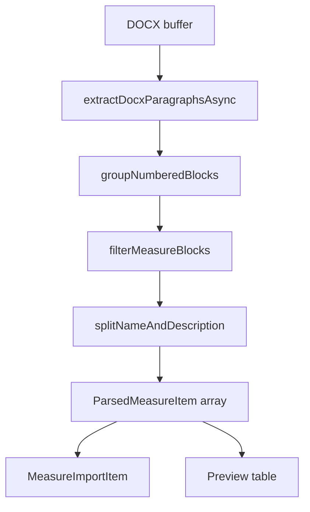

# План: блочный парсер мер из DOCX

## Диагностика текущей проблемы

Текущий [`lib/measure-imports/parse-docx.ts`](lib/measure-imports/parse-docx.ts) обрабатывает **каждый абзац отдельно**:

```49:68:lib/measure-imports/parse-docx.ts
export function parseMeasureItemsFromParagraphs(
  paragraphs: string[]
): ParsedMeasureItem[] {
  // ...
    const isLeafMeasure =
      code.includes(".") ||
      BDU_CODE_RE.test(body) ||
      isActionMeasureText(body)

    if (!isLeafMeasure) continue
```

Из-за этого для [`240 93 4164.docx`](.external/docx_examples/240%2093%204164.docx):

| Что теряется | Пример |
|---|---|
| Продолжения абзацев | URL после `1.8.`, SHA256 после `1.9.`, подпункты Kaspersky/Dr.Web после `1.2.`, Windows/Linux после `1.7.` |
| Секции 2–8 | Абзацы начинаются с «Хакерской группировкой…» — не проходят `isLeafMeasure` |
| Полный текст | `description` всегда `null`, `name` обрезается до 500 символов |

Для [`240 93 4165.docx`](.external/docx_examples/240%2093%204165.docx) каждый пункт — один абзац; теряются «Рекомендуется реализовать…» (после п.2), «В целях предотвращения уязвимостей 1–3…» (после п.3), блок про Windows 4–5 (после п.5).

**Ожидаемый результат блочного алгоритма** (проверено на XML документов):

- **4164**: 16 мер — `1.1`…`1.9` (9) + `2`…`8` (7); вводный блок `1.` (контекст угрозы) **не** мера
- **4165**: 5 мер с 2–6 абзацами в каждой



---

## Фаза 38 — Блочная группировка абзацев

**Файл:** [`lib/measure-imports/parse-docx.ts`](lib/measure-imports/parse-docx.ts)

Добавить внутренний тип и функцию:

```typescript
type NumberedBlock = { code: string; paragraphs: string[] }

function groupNumberedBlocks(paragraphs: string[]): NumberedBlock[]
```

**Правило:** абзац с `^(\d+(?:\.\d+)*)\.\s` открывает блок; все следующие абзацы без такого префикса **присоединяются** к текущему блоку, пока не встретится следующий нумерованный.

Не менять [`extractDocxParagraphsAsync`](lib/measure-imports/parse-docx.ts) — извлечение XML уже корректное.

---

## Фаза 39 — Фильтрация «что считать мерой»

Заменить `parseMeasureItemsFromParagraphs` на двухшаговый pipeline: `groupNumberedBlocks` → `filterMeasureBlocks`.

**Включать блок, если выполняется хотя бы одно:**

1. Код содержит точку (`1.1`, `1.8` …) — подпункты мер
2. В тексте блока есть `BDU:\d{4}-\d{5}` — письма об уязвимостях (4165)
3. Блок — **верхнеуровневый раздел** (`2`, `3`, … `8`) и **нет** подпунктов `N.\d` для того же `N` (для 4164: есть `1.1`, значит блок `1` — контекст, **исключаем**; блоки `2`–`8` — **включаем**)

**Исключать:** служебные абзацы до первого нумерованного (шапка, «Субъектам КИИ…», подпись).

**Код меры (`code`):**
- 4165: `BDU:2026-08030` из текста блока (как сейчас)
- 4164 подпункты: `1.1`, `1.8`, …
- 4164 разделы: `2`, `3`, … `8`

---

## Фаза 40 — name / description

**Файл:** [`lib/measure-imports/parse-docx.ts`](lib/measure-imports/parse-docx.ts)

```typescript
function splitBlockContent(block: NumberedBlock): { name: string; description: string | null }
```

| Поле | Содержимое |
|---|---|
| `name` | Первая строка блока **без** префикса номера; обрезка до 500 символов с `…` |
| `description` | Полный текст блока: абзацы через `\n\n`; если один абзац и он совпадает с `name` — `null` |

**Проверки содержимого (тесты):**
- `1.8` → description содержит `192[.]3[.]171[.]223` и `hxxp[:]//`
- `1.9` → description содержит оба SHA256
- `4` → description содержит ≥3 хэша
- `2` → description содержит `vniir-monitor[.]space`
- 4165 п.2 → description содержит «Рекомендуется реализовать»
- 4165 п.5 → description содержит «Windows» и «240/91/3526`

Поле `description` уже есть в [`MeasureImportItem`](prisma/schema.prisma) и прокидывается в [`commit.ts`](lib/measure-imports/commit.ts) → `Measure.description` — схема менять не нужно.

---

## Фаза 41 — UI превью импорта

**Файл:** [`components/platform/measure-import-detail-client.tsx`](components/platform/measure-import-detail-client.tsx)

Сейчас таблица показывает только `code` + `name` (2 строки textarea). Добавить колонку **«Описание»** с `Textarea rows={4}` для `description`, чтобы оператор видел URL/хэши до коммита.

Опционально: счётчик «N мер» в шапке (уже есть `includedCount`).

---

## Фаза 42 — Тесты и регрессия

**Файл:** [`lib/measure-imports/__tests__/parse-docx.test.ts`](lib/measure-imports/__tests__/parse-docx.test.ts)

Заменить слабые пороги `minMeasures: 8` на точные проверки:

**4164:**
- `items.length === 16`
- коды: `1.1`…`1.9`, `2`…`8`
- `1.8.description` matches URL pattern
- `1.9.description` matches `/[a-f0-9]{64}/`
- `6.description` matches `levelgeo`

**4165:**
- `items.length === 5`
- все коды начинаются с `BDU:`
- п.2 description length > name length
- п.3 description содержит «1-3» или «1–3»

**Приложение:** без изменений — [`detectImportKind`](lib/measure-imports/parse-docx.ts) + одна сводная мера в [`index.ts`](lib/measure-imports/index.ts).

Запуск: `npm run test:parse-docx`.

---

## Вне scope (можно позже)

- **Fan-out** общих абзацев («уязвимостей 1–3») во все затронутые пункты — в v2 достаточно привязать к блоку, после которого абзац идёт (п.3 получит текст про 1–3)
- **Inline-разбор приложения**: подстановка хэшей из linked appendix при фразе «указанных в приложении» — требует связки parent/child import при parse
- **Structured artifacts** (отдельные поля для IoC/URL) — избыточно, пока description хранит полный текст

---

## DoD (критерии готовности)

1. Re-parse `240 93 4164.docx` → 16 мер; в превью у `1.8`, `1.9`, `4`, `6` видны адреса и хэши в description
2. Re-parse `240 93 4165.docx` → 5 мер; у п.2 и п.5 description длиннее одного абзаца
3. `npm run test:parse-docx` проходит с новыми assertions
4. Commit в каталог сохраняет `description` на `Measure`
