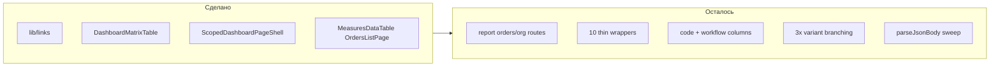

# DRY Audit Phase 2 — усиление реюзабельности

## Аудит того, что уже сделано (фазы 31–36)

| Область | Статус | Оценка |
|---------|--------|--------|
| `lib/links/*`, `ORDER_ITEM_DETAIL_INCLUDE` | Done | Полный выигрыш |
| `DashboardMatrixTable` + `PlatformDashboardMatrix` / `ReportDashboardMatrix` | Done | Matrix unified, но **columns всё ещё inline** |
| `ScopedDashboardPageShell` + `OverdueFilterActions` | Done | Panel вызывает shell напрямую; public/report — через wrappers |
| `MeasuresDataTable`, `OrdersListPage`, `OrderMeasuresPage` | Done | Shared core есть, wrappers остались |
| Column factories (org/order/measure/due/context) | Partial | Только platform tables; **matrix + measures table не мигрированы** |
| API helpers (`public-guard`, `parse-body`, attachment redirect, `revalidate-panel`) | Partial | ~6 routes migrated, ~14+ ещё с boilerplate |
| Item detail cards, `ShareLinkActions`, legacy rename | Done | |
| Report orders routes (Phase 3 DoD) | **Not done** | Компоненты и lib есть, **route pages отсутствуют** |



---

## P0 — Критично: report routes + активация мёртвого кода

**Проблема:** [`report-dashboard-matrix.tsx`](components/report/report-dashboard-matrix.tsx) и [`report-item-detail.tsx`](components/report/report-item-detail.tsx) ссылаются на `/report/${token}/orders/...` и `/organizations/...`, но в `app/(public)/report/` есть только `page.tsx`, `layout.tsx`, `items/[id]/page.tsx` — **404**.

**Мёртвый код (0 imports):**
- [`report-measures-table.tsx`](components/report/report-measures-table.tsx) — удалить
- [`report-orders-list-page.tsx`](components/report/report-orders-list-page.tsx), [`report-order-page.tsx`](components/report/report-order-page.tsx) — подключить к routes

**Lib готова, не вызывается:**
- `getOrderForReportToken`, `getOrganizationOrdersForReportToken` в [`lib/report-links/validate-token.ts`](lib/report-links/validate-token.ts)

### Добавить маршруты (выбор: full routes)

| Route | Pattern | Component |
|-------|---------|-----------|
| `app/(public)/report/[token]/organizations/[id]/page.tsx` | org orders list | `ReportOrdersListPage` + `getOrganizationOrdersForReportToken` |
| `app/(public)/report/[token]/orders/[orderId]/page.tsx` | order measures | `ReportOrderPage` + `getOrderForReportToken` + `mapOrderItemsToPublicItems` |
| `loading.tsx` для обоих | `public-table` variant | по аналогии с `/p/[token]/orders/` |

**DoD:** клики из report matrix и item-detail не 404; `npm run typecheck && npm run build`

---

## P1 — Column factories: довести до конца (UI reusability)

Сейчас factories в [`lib/data-table/columns/`](lib/data-table/columns/) используются в delay/responses/orders/measures/order-detail, но **не** в:

### 1.1 Новые factories (из оригинального плана, не сделаны)

| Factory | Файл | Дубль |
|---------|------|-------|
| `createCodeColumn` | `lib/data-table/columns/code-column.tsx` | [`measures-data-table.tsx`](components/shared/measures-data-table.tsx) L129-139, [`measures-table.tsx`](components/platform/measures-table.tsx) L49-57 |
| `createWorkflowStatusColumn` | `lib/data-table/columns/workflow-status-column.tsx` | matrix L85-98, measures-data-table L150-163, order-detail L164-180 |

`createWorkflowStatusColumn` принимает:
```ts
getRow: (row) => { isOverdue: boolean; displayStatus: string }
// или accessor + getDisplayStatusName
```

### 1.2 Мигрировать потребителей

1. [`dashboard-matrix-table.tsx`](components/dashboard/dashboard-matrix-table.tsx) — заменить 5 inline columns на factories (~55 строк)
2. [`measures-data-table.tsx`](components/shared/measures-data-table.tsx) — order/measure/code/due/status через factories (~50 строк)
3. [`measures-table.tsx`](components/platform/measures-table.tsx) — code column
4. [`order-detail-client.tsx`](components/platform/order-detail-client.tsx) — status column

### 1.3 `createSubdivisionColumn` (опционально, P2)

Subdivision column в measures-data-table (~15 строк) — factory если появится 3-й consumer.

---

## P1 — Удалить thin wrappers, вызывать shared из routes

**Эталон:** [`app/(platform)/panel/page.tsx`](app/(platform)/panel/page.tsx) вызывает `ScopedDashboardPageShell` напрямую.

| Wrapper (удалить/схлопнуть) | Заменить на |
|------------------------------|-------------|
| [`public-dashboard-page.tsx`](components/public/public-dashboard-page.tsx) | `ScopedDashboardPageShell` в [`p/[token]/page.tsx`](app/(public)/p/[token]/page.tsx) |
| [`report-dashboard-page.tsx`](components/report/report-dashboard-page.tsx) | shell в [`report/[token]/page.tsx`](app/(public)/report/[token]/page.tsx) |
| [`public-measures-table.tsx`](components/public/public-measures-table.tsx) | `MeasuresDataTable` в `scoped-dashboard-view` + перенос типов |
| [`report-measures-table.tsx`](components/report/report-measures-table.tsx) | **удалить** (dead) |
| [`platform-dashboard-matrix.tsx`](components/platform/platform-dashboard-matrix.tsx) | `linkTargetsForDashboard("platform")` helper |
| [`report-dashboard-matrix.tsx`](components/report/report-dashboard-matrix.tsx) | `linkTargetsForDashboard("report", token)` |
| [`public-orders-list-page.tsx`](components/public/public-orders-list-page.tsx) | `OrdersListPage` + breadcrumb hook в route или tiny `PublicBreadcrumbEffect` |
| [`report-orders-list-page.tsx`](components/report/report-orders-list-page.tsx) | inline в report org route |
| [`public-order-page.tsx`](components/public/public-order-page.tsx) | `OrderMeasuresPage` + breadcrumbs в route |
| [`report-order-page.tsx`](components/report/report-order-page.tsx) | inline в report order route |

### Новые shared helpers

**`lib/dashboard/link-targets.ts`:**
```ts
export function dashboardMatrixLinkTargets(
  variant: "platform" | "report",
  token?: string
): DashboardMatrixLinkTargets
```

**`lib/public/types.ts`** (или re-export из `measures-data-table`):
- `MeasuresTableItem`, `MeasuresTableStatus` — canonical types
- Dashboard перестаёт импортировать из `components/public/public-measures-table`

**`components/public/public-breadcrumb-effect.tsx`** (~15 строк):
- Client component только для `usePublicBreadcrumbLabel/Middle` — вместо 2 page wrappers

**Экономия:** ~200 строк, −8 файлов.

---

## P1 — Dashboard variant unification

Сейчас `variant === "admin" | "report" | "public"` трижды:

| Файл | Строки |
|------|--------|
| [`dashboard-page-shell.tsx`](components/dashboard/dashboard-page-shell.tsx) L60-92 | shell → interactive |
| [`dashboard-interactive.tsx`](components/dashboard/dashboard-interactive.tsx) L74-111 | interactive → view |
| [`scoped-dashboard-view.tsx`](components/dashboard/scoped-dashboard-view.tsx) L139-161 | view → table/matrix |

**Предложение:** [`lib/dashboard/variant-config.ts`](lib/dashboard/variant-config.ts):
```ts
type DashboardVariant = "platform" | "public" | "report"
// tableKind: "matrix" | "measures"
// needsStatuses, needsToken, linkTargets factory
```

- `ScopedDashboardView` — единственная точка variant dispatch
- `DashboardInteractive` — только KPI + filters, передаёт variant config вниз
- `DashboardPageShell` — только layout (header, overdue, empty alert)
- Переименовать `AdminDashboardInteractiveProps` → `PlatformDashboardInteractiveProps`, `AdminShellProps` → `PlatformShellProps`

**Экономия:** ~60–80 строк structural dup; проще добавлять 4-й variant.

---

## P2 — Item detail: последние 50 строк

Уже есть [`components/shared/item-detail/*`](components/shared/item-detail/).

Осталось:
- **`getItemDetailStatusVariant(isOverdue, isPendingReview, completed)`** в `lib/ui/item-detail-status.ts` — dup в public/report item detail
- **`ItemResponseCard`** (read-only) — dup блока «Отчёт о выполнении» в [`report-item-detail.tsx`](components/report/report-item-detail.tsx) L101-140; public может переиспользовать для completed state

---

## P2 — API / lib cleanup (механический sweep)

### parseJsonBody — ещё ~12 routes
[`orders/route.ts`](app/api/orders/route.ts), [`measures/*`](app/api/measures/), [`subdivisions/*`](app/api/subdivisions/), [`organizations/route.ts`](app/api/organizations/route.ts), [`settings/route.ts`](app/api/settings/route.ts), panel presign [`orders/.../presign`](app/api/orders/[id]/items/[itemId]/attachments/presign/route.ts), etc.

### revalidatePanel* — ~14 routes
Расширить [`revalidate-panel.ts`](lib/api/revalidate-panel.ts):
```ts
revalidatePanelOrderMutation(orderId, { responses?: boolean, delays?: boolean })
```
Заменить inline blocks в delay-requests, responses, order item mutations.

### Domain handlers (Phase 5.3, не сделано)
- `lib/attachments/presign-handler.ts` — public + panel presign (~30 dup lines)
- `lib/responses/handle-submit-response.ts` — panel response route shell
- `lib/access-links/revoke-from-request.ts` — org + subdivision link DELETE

### validateAccessToken removal
Заменить 2 caller:
- [`app/api/public/[token]/route.ts`](app/api/public/[token]/route.ts) → `fetchPublicOrderSummaries` + statuses (легче)
- [`lib/attachments/index.ts`](lib/attachments/index.ts) → `validateAccessLink` + scope check

Удалить deprecated mega-query из [`validate-token.ts`](lib/public/validate-token.ts) L103-160.

### withApiHandler (опционально)
`lib/api/with-handler.ts` — ~105 строк try/catch в 35 routes. Низкий риск, низкий приоритет.

---

## P2 — Skeleton merge (plan 6.5)

[`table-page-skeleton.tsx`](components/shared/skeletons/table-page-skeleton.tsx) vs [`public-table-page-skeleton.tsx`](components/shared/skeletons/public-table-page-skeleton.tsx) — отличие только `showBack` vs `showActions`.

Объединить:
```ts
TablePageSkeleton({ showBack?, showActions?, columns?, rows? })
```
`PublicTablePageSkeleton` → re-export alias с `showBack`.

---

## Порядок реализации

```
phase-37-report-routes        P0 — fix 404, delete dead report-measures-table
phase-38-column-factories   P1 — code + workflow columns, migrate matrix/measures
phase-39-wrapper-collapse     P1 — link-targets, types, inline routes, breadcrumb effect
phase-40-dashboard-variant    P1 — variant-config, rename Admin* props
phase-41-api-skeleton-cleanup P2 — parseJsonBody sweep, revalidate, presign handler, skeleton merge
```

---

## Что сознательно НЕ трогаем

- `public-shell` vs `report-shell` — разный UX
- Platform CRUD dialogs / delete hooks
- `order-detail-client` reports dropdown / delay counts — только shared columns
- Subdivision column factory — пока 1 consumer

---

## Верификация

```bash
npm run typecheck && npm run lint && npm run build
```

Ручные проверки:
- `/report/[token]` — matrix links → org orders, order detail, item detail
- `/panel`, `/p/[token]` — regression после wrapper collapse
- Public API `GET /api/public/[token]` — lighter payload после validateAccessToken removal
