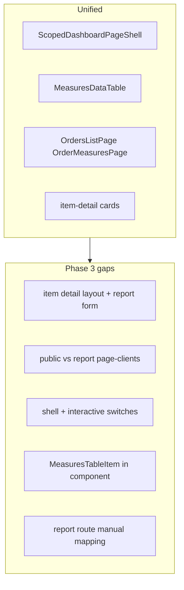

# DRY Audit Phase 3 — реюзабельность интерфейса

## Базовая линия (Phase 2 — done)

В uncommitted diff уже выполнено:

| Область | Результат |
|---------|-----------|
| Report routes | [`app/(public)/report/[token]/organizations/[id]/page.tsx`](app/(public)/report/[token]/organizations/[id]/page.tsx), [`orders/[orderId]/page.tsx`](app/(public)/report/[token]/orders/[orderId]/page.tsx) + `loading.tsx` |
| Wrappers удалены | `public-dashboard-page`, `report-measures-table`, `platform-dashboard-matrix` и др. — 0 references |
| Column factories | [`createCodeColumn`](lib/data-table/columns/code-column.tsx), [`createWorkflowStatusColumn`](lib/data-table/columns/workflow-status-column.tsx) — matrix + measures migrated |
| Dashboard config | [`lib/dashboard/variant-config.ts`](lib/dashboard/variant-config.ts), [`lib/dashboard/link-targets.ts`](lib/dashboard/link-targets.ts) |
| Shared pages | [`OrdersListPage`](components/shared/orders-list-page.tsx), [`OrderMeasuresPage`](components/shared/order-measures-page.tsx), [`ScopedDashboardPageShell`](components/dashboard/dashboard-page-shell.tsx) |
| API/lib | `presign-handler`, `handle-submit-response`, `revoke-from-request`, `validateAccessToken` removed, skeleton merged |



---

## P0 — Item detail: общий layout + report workflow card

**Проблема:** [`public-item-detail.tsx`](components/public/public-item-detail.tsx) (~315 строк) и [`report-item-detail.tsx`](components/report/report-item-detail.tsx) (~100 строк) дублируют блок header + `ItemMeasureInfoCard` + `ItemDueStatusCard` + вычисление `isOverdue` / `displayStatus` / `statusVariant`. В public — inline Card «Отчёт о выполнении» (L231–304), хотя [`ItemResponseCard`](components/shared/item-detail/item-response-card.tsx) уже есть для report.

### 1.1 `lib/ui/item-detail-display.ts` — shared display state

```ts
export function getItemDetailDisplayState(item, latestResponse?) {
  // isOverdue, isPendingReview, completed, displayStatus, statusVariant
}
```

Используется в public и report item detail — убирает ~25 строк dup.

### 1.2 `ItemDetailOverview` — shared layout shell

Новый [`components/shared/item-detail/item-detail-overview.tsx`](components/shared/item-detail/item-detail-overview.tsx):

- `PageHeader` (title, description, backHref/backLabel, actions)
- Grid 2-col: `ItemMeasureInfoCard` + `ItemDueStatusCard` с optional `footer` / `children` (public: кнопки «Взять в работу», «Запросить перенос»)

Report item detail сжимается до ~40 строк; public — layout вынесен, остаётся только workflow-логика.

### 1.3 `ItemReportWorkflowCard` — форма + readonly states

Новый [`components/shared/item-detail/item-report-workflow-card.tsx`](components/shared/item-detail/item-report-workflow-card.tsx):

| Mode | UI |
|------|-----|
| `completed` | placeholder text (как сейчас) |
| `pending_review` | placeholder text |
| `blocked` | «Сначала возьмите в работу» |
| `rejected` | Alert выше карточки (остаётся в public) |
| `form` | FieldGroup + `CommentaryAttachmentsField` + submit |
| `readonly_response` | делегирует в `ItemResponseCard` |

Public: при `completed` + `latestResponse` показывать `ItemResponseCard` (read-only), как report — единый вид отчёта.

**DoD:** public item detail — submit/start/delay работают; report item detail без регрессий; `npm run typecheck && npm run build`.

---

## P1 — Token-scoped order page clients

**Проблема:** [`public-page-clients.tsx`](components/public/public-page-clients.tsx) и [`report-page-clients.tsx`](components/report/report-page-clients.tsx) — thin wrappers над shared pages с разными `basePath`, labels, breadcrumbs.

### Решение: `components/shared/scoped-orders-clients.tsx`

```ts
type ScopedOrdersContext =
  | { scope: "public"; token: string }
  | { scope: "report"; token: string; organizationName: string }

export function ScopedOrdersListClient({ context, orders, ... })
export function ScopedOrderDetailClient({ context, order, items, statuses, showSubdivisionColumn })
```

Конфиг labels/backHref/breadcrumbs в [`lib/nav/scoped-orders-config.ts`](lib/nav/scoped-orders-config.ts) (или inline record — ~20 строк).

- Public routes → `ScopedOrdersListClient` с `scope: "public"` + `PublicBreadcrumbLabel/Middle` только для public
- Report routes → `scope: "report"` без breadcrumb provider

**Экономия:** −1 файл, ~40 строк; единая точка для 4-го контекста (если появится).

---

## P1 — Dashboard: убрать двойной variant switch

**Проблема:** [`variant-config.ts`](lib/dashboard/variant-config.ts) есть, но discriminated union всё ещё разворачивается в двух местах:

- [`dashboard-page-shell.tsx`](components/dashboard/dashboard-page-shell.tsx) L70–102
- [`dashboard-interactive.tsx`](components/dashboard/dashboard-interactive.tsx) L75–101

[`scoped-dashboard-view.tsx`](components/dashboard/scoped-dashboard-view.tsx) уже использует `getDashboardVariantConfig` для `tableKind`.

### Решение

1. **`DashboardInteractive`** — убрать ternary, передать props напрямую:
   ```tsx
   <ScopedDashboardView {...props} columnFilters={...} onColumnFiltersChange={...} />
   ```
   Union types `DashboardInteractiveProps` и `ScopedDashboardView` props должны совпадать по variant fields (platform/report/public).

2. **`ScopedDashboardPageShell`** — аналогично:
   ```tsx
   <DashboardInteractive key={interactiveKey} {...pickVariantProps(props)} overdueOnly={overdueOnly} stats={stats} />
   ```
   Helper `pickVariantProps` (~10 строк) или spread после destructuring layout-only fields.

3. **`ScopedDashboardView`** — заменить `props.variant === "public" ? Measures : Matrix` на `variantConfig.tableKind`:
   ```tsx
   {variantConfig.tableKind === "measures" ? <MeasuresDataTable basePath={`/p/${token}`} ... /> : <DashboardMatrixTable ... />}
   ```

**Экономия:** ~50–60 строк; добавление variant — правка только `variant-config.ts`.

---

## P1 — Типы: canonical layer в `lib/`

**Проблема:** [`MeasuresTableItem`](components/shared/measures-data-table.tsx) / `MeasuresTableStatus` определены в UI-компоненте; [`lib/public/types.ts`](lib/public/types.ts) re-export'ит из компонента — нарушение AGENTS.md (domain types в `lib/`).

### Решение

1. Создать [`lib/measures/table-types.ts`](lib/measures/table-types.ts) с `MeasuresTableItem`, `MeasuresTableStatus`
2. [`lib/public/types.ts`](lib/public/types.ts) — `PublicItem`, `PublicStatus` extends/aliases от table types
3. Re-export из `measures-data-table` для backward compat (deprecated comment) или обновить 4 импортёра: `order-measures-page`, `report-page-clients`, `lib/public/types`, dashboard shell

---

## P2 — Report routes: serialize parity

**Проблема:** Public routes используют [`serializePublicOrderDetail`](lib/public/serialize-public.ts), [`serializePublicStatuses`](lib/public/serialize-public.ts); report routes — ручной map + `JSON.parse(JSON.stringify(...))`:

- [`report/.../organizations/[id]/page.tsx`](app/(public)/report/[token]/organizations/[id]/page.tsx) L15–26
- [`report/.../orders/[orderId]/page.tsx`](app/(public)/report/[token]/orders/[orderId]/page.tsx) L21–41

### Решение

- Расширить `serialize-public.ts` (или `lib/report/serialize-report.ts`):
  - `serializeOrderListRows(orders)` — общий для public + report org list
  - `serializeMeasuresTableItems(items)` — thin wrapper над `mapOrderItemsToPublicItems` output
- Report order page: передавать items напрямую из `mapOrderItemsToPublicItems` без strip-fields map
- Убрать `JSON.parse(JSON.stringify(...))` — Next.js RSC уже сериализует plain objects

**Экономия:** ~30 строк, единый контракт данных public/report.

---

## P2 — Column factory: subdivision (optional)

Subdivision column inline в [`measures-data-table.tsx`](components/shared/measures-data-table.tsx) (~15 строк). Factory `createSubdivisionColumn` — только если появится 3-й consumer (platform order-detail уже имеет inline subdivision). **Отложить**, пока 2 consumer.

---

## P2 — API tail cleanup (низкий риск, вне UI)

Оставшиеся inline patterns (не блокируют UI, но завершают Phase 2 sweep):

| Route | Issue | Fix |
|-------|-------|-----|
| [`users/route.ts`](app/api/users/route.ts), [`auth/login`](app/api/auth/login/route.ts), [`auth/change-password`](app/api/auth/change-password/route.ts) | raw `request.json()` | `parseJsonBody` + schema |
| [`account/route.ts`](app/api/account/route.ts), [`users/route.ts`](app/api/users/route.ts), [`report-links/route.ts`](app/api/report-links/route.ts) | inline `revalidatePath` | `revalidatePanelUsers`, `revalidatePanelSettings`, `revalidatePanelDashboard` |

`withApiHandler` — сознательно **не** трогаем (низкий ROI).

---

## Сознательно НЕ трогаем

- [`public-shell.tsx`](components/public/public-shell.tsx) vs [`report-shell.tsx`](components/report/report-shell.tsx) — разный UX (sidebar vs header-only)
- Platform CRUD dialogs, reports dropdown в [`order-detail-client.tsx`](components/platform/order-detail-client.tsx)
- Auth routes security semantics — только mechanical parseJsonBody, без рефакторинга auth flow

---

## Порядок реализации

```
phase-42-item-detail       P0 — display state, overview, workflow card, ItemResponseCard in public
phase-43-scoped-clients    P1 — merge public/report page-clients
phase-44-dashboard-dispatch P1 — collapse variant switches, tableKind dispatch
phase-45-table-types       P1 — lib/measures/table-types.ts
phase-46-report-serialize  P2 — serialize helpers, remove JSON hacks
phase-47-api-tail          P2 — parseJsonBody + revalidatePanel (optional same PR as 46)
```

Рекомендуемая ветка: `fstec/phase-42-item-detail-dry` (по одной фазе = один PR для critic gate).

---

## Верификация

```bash
npm run typecheck && npm run lint && npm run build
```

Ручные проверки:
- `/p/[token]/items/[id]` — start work, submit report, completed view with ItemResponseCard
- `/report/[token]/items/[id]` — read-only response card
- `/p/[token]`, `/report/[token]`, `/panel` — dashboard filters после dispatch collapse
- Report org/order list pages — данные без регрессий

**Оценка выигрыша Phase 3:** ~250–350 строк UI + устойчивость к 4-му dashboard variant.
