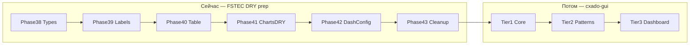
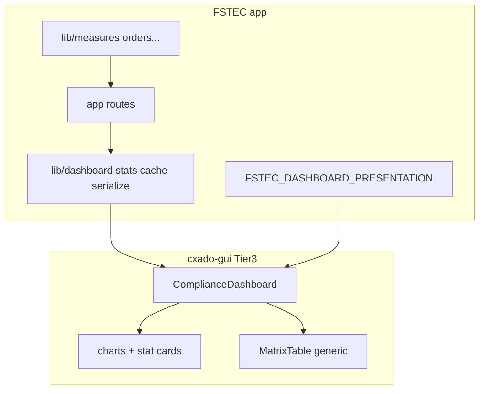

# DRY-prep FSTEC + дорожная карта cxado-gui

## Контекст

Основной DRY (фазы 31–36 audit + P0–P7) **завершён**. Остаётся **prep-work**: отвязать shared/dashboard слои от FSTEC-домена, чтобы charts и dashboard можно было забрать в `cxado-gui` позже.

**Принцип:** сначала чистим и абстрагируем **внутри FSTEC**, не создавая репозиторий. Репозиторий `cxado-gui` — только после фаз 38–43.

**Ритм:** ветка `fstec/phase-NN-slug` → PR → critic → merge → обновить [docs/plans/fstec_master.plan.md](docs/plans/fstec_master.plan.md).

**DoD каждой фазы:**
```bash
npm run typecheck && npm run lint && npm run build
```
+ ручной smoke: `/panel`, `/p/{token}`, `/report/{token}` — KPI, charts, matrix, overdue toggle.



---

## Часть A — FSTEC DRY-prep (фазы 38–43)

### Phase 38 — Prisma-free shared types

**Ветка:** `fstec/phase-38-decouple-prisma`

**Проблема:** `@prisma/client` протекает в UI-слой, блокируя вынос в npm/submodule.

| Файл | Действие |
|------|----------|
| Новый [`lib/ui/review-status.ts`](lib/ui/review-status.ts) | `type ReviewStatus = "PENDING" \| "ACCEPTED" \| "REJECTED"` + guards |
| [`lib/ui/item-detail-display.ts`](lib/ui/item-detail-display.ts) | импорт из `review-status`, не из Prisma |
| [`components/shared/item-detail/item-report-workflow-card.tsx`](components/shared/item-detail/item-report-workflow-card.tsx) | то же |
| [`components/shared/item-detail/item-response-card.tsx`](components/shared/item-detail/item-response-card.tsx) | то же |

**DoD:** `grep @prisma/client components/shared` → 0 совпадений.

---

### Phase 39 — Column labels config

**Ветка:** `fstec/phase-39-table-labels`

**Проблема:** русские доменные строки захардкожены в column factories (`"Мера"`, `"Поручение"`, `"Статус"`).

| Файл | Действие |
|------|----------|
| Новый [`lib/ui/table-labels.ts`](lib/ui/table-labels.ts) | `FSTEC_TABLE_LABELS` const + `TableLabels` type |
| [`lib/data-table/columns/*.tsx`](lib/data-table/columns/) | `opts?.title ?? labels.measure` (и т.д.) |
| [`components/shared/measures-data-table.tsx`](components/shared/measures-data-table.tsx) | search placeholder из config |

Дефолты остаются FSTEC-специфичными — меняется только **точка конфигурации**, не текст.

---

### Phase 40 — Generic tracked-items table

**Ветка:** `fstec/phase-40-tracked-items-table`

**Проблема:** [`lib/measures/table-types.ts`](lib/measures/table-types.ts) и [`MeasuresDataTable`](components/shared/measures-data-table.tsx) названы доменно, но по сути — generic «tracked compliance item».

| Файл | Действие |
|------|----------|
| Новый [`lib/ui/tracked-item-types.ts`](lib/ui/tracked-item-types.ts) | `TrackedItemRow`, `TrackedItemStatus` (generic names) |
| [`lib/measures/table-types.ts`](lib/measures/table-types.ts) | re-export alias `MeasuresTableItem = TrackedItemRow` (backward compat) |
| Новый [`components/shared/tracked-items-data-table.tsx`](components/shared/tracked-items-data-table.tsx) | generic table + `TrackedItemsColumnPreset` |
| [`components/shared/measures-data-table.tsx`](components/shared/measures-data-table.tsx) | thin wrapper с FSTEC preset (колонки measure/order/subdivision) |

**Не трогаем:** platform CRUD tables, import UI.

---

### Phase 41 — Chart sections DRY (главный шаг для dashboard)

**Ветка:** `fstec/phase-41-chart-sections-dry`

**Проблема:** [`completion-breakdown-chart-section.tsx`](components/dashboard/completion-breakdown-chart-section.tsx) и [`overdue-breakdown-chart-section.tsx`](components/dashboard/overdue-breakdown-chart-section.tsx) — ~70% идентичного кода; отличаются только `stackOrder` и пара констант.

| Файл | Действие |
|------|----------|
| Новый [`components/dashboard/stacked-status-breakdown-chart.tsx`](components/dashboard/stacked-status-breakdown-chart.tsx) | общий stacked bar: props `{ stackOrder, scope, statusDistribution, statusBreakdown, columnFilters, visibleChartStatuses, onOverdueBarClick, onStatusBreakdownClick, size }` |
| `completion-breakdown-chart-section.tsx` | thin wrapper: `stackOrder={DASHBOARD_STATUS_ORDER}` |
| `overdue-breakdown-chart-section.tsx` | thin wrapper: `stackOrder={OVERDUE_STACK_ORDER}` |
| [`status-pie-chart-section.tsx`](components/dashboard/status-pie-chart-section.tsx) | вынести `buildFullDistribution(statusOrder)` в [`dashboard-chart-shared.tsx`](components/dashboard/dashboard-chart-shared.tsx) |

**DoD:** визуально charts не изменились; diff в completion/overdue — mostly deleted lines.

---

### Phase 42 — Dashboard presentation config

**Ветка:** `fstec/phase-42-dashboard-presentation-config`

**Проблема:** dashboard-компоненты импортируют [`lib/statuses/workflow.ts`](lib/statuses/workflow.ts) напрямую — смешение **бизнес-логики** (isOverdue) и **презентации** (порядок статусов, hints на карточках).

| Файл | Действие |
|------|----------|
| Новый [`lib/dashboard/presentation-config.ts`](lib/dashboard/presentation-config.ts) | единый объект `FSTEC_DASHBOARD_PRESENTATION`: `statusOrder`, `overdueStackOrder`, `statCardMeta`, `chartEmptyLabel`, `pieColors` |
| [`dashboard-stat-cards.tsx`](components/dashboard/dashboard-stat-cards.tsx) | `CARD_META` из presentation-config |
| [`dashboard-interactive.tsx`](components/dashboard/dashboard-interactive.tsx), chart sections, `status-pie-chart-section` | `statusOrder` из config, не прямой import `DASHBOARD_STATUS_ORDER` |
| [`dashboard-chart-shared.tsx`](components/dashboard/dashboard-chart-shared.tsx) | `ChartEmptyState` текст из config |

**Важно:** `lib/statuses/workflow.ts` остаётся для **вычислений** (`isOrderItemOverdue`, `getDisplayStatusName`). Config — только для UI.

Это создаёт **adapter surface** для будущего Tier 3:

```ts
// будущий cxado-gui consumer в FSTEC
<ComplianceDashboard presentation={FSTEC_DASHBOARD_PRESENTATION} ... />
```

---

### Phase 43 — Cleanup и границы слоёв

**Ветка:** `fstec/phase-43-extraction-boundaries`

| Задача | Файлы |
|--------|-------|
| Branding boundary | [`lib/ui/branding.ts`](lib/ui/branding.ts) — только app-level; matrix labels через `table-labels` / `presentation-config` |
| Убрать deprecated skeleton re-exports | [`components/platform/page-skeleton.tsx`](components/platform/page-skeleton.tsx), [`components/public/public-page-skeleton.tsx`](components/public/public-page-skeleton.tsx) → прямые импорты `RouteSkeleton` |
| Shared item-detail: общий hook | Новый `lib/ui/use-item-detail-display.ts` — dedupe логики из [`public-item-detail.tsx`](components/public/public-item-detail.tsx) / [`report-item-detail.tsx`](components/report/report-item-detail.tsx) |
| Документация границ | Новый `docs/architecture/ui-layers.md` — что остаётся в FSTEC vs что уедет в cxado-gui |
| Master plan | Добавить фазы 38–43 в [fstec_master.plan.md](docs/plans/fstec_master.plan.md) |

**DoD:** `npm run test` green; нет deprecated re-export aliases.

---

## Часть B — cxado-gui по тирам (после Phase 43)

**Подключение:** git submodule `shared/gui` в [cxado](https://github.com/butbeautifulv/cxado) + `npm link` / workspace в FSTEC. **Без публикации в npm registry** на первых порах.

### Tier 1 — Core UI (низкий риск, ~2 PR)

**Репозиторий:** `butbeautifulv/cxado-gui`

**Содержимое:**
- `ui/` — 35 shadcn components из [`components/ui/`](components/ui/)
- `motion/` — [`components/motion/`](components/motion/)
- `theme/` — [`theme-provider.tsx`](components/theme-provider.tsx), [`theme-toggle.tsx`](components/theme-toggle.tsx), [`lib/theme/`](lib/theme/), CSS tokens из [`app/globals.css`](app/globals.css)
- `shell/` — [`components/shell/`](components/shell/)
- `skeletons/` — [`components/shared/skeletons/`](components/shared/skeletons/)
- `data-table/` — [`components/data-table/`](components/data-table/) + generic [`lib/data-table/`](lib/data-table/) (без domain columns)
- `utils/` — `cn()`, [`hooks/use-mobile.ts`](hooks/use-mobile.ts)

**Scaffold:**
```
cxado-gui/
├── package.json          # exports: ".", "./ui", "./shell", "./motion", ...
├── tailwind.preset.css   # @theme tokens + shadcn import
├── tsconfig.json
└── src/
```

**FSTEC миграция:** заменить `@/components/ui/*` → `@cxado/gui/ui/*` по одному модулю; `tailwind.css` импортирует preset.

**cxado meta-repo:** `shared/gui` submodule + `make gui-install` в Makefile.

---

### Tier 2 — Compliance patterns (средний риск, ~2–3 PR)

**Содержимое:**
- `forms/` — [`FormCardLayout`](components/shared/form-card-grid.tsx), [`form-actions-bar`](components/shared/form-actions-bar.tsx), [`commentary-attachments-field`](components/shared/commentary-attachments-field.tsx) (generic, max count через prop)
- `layout/` — [`page-header`](components/shared/page-header.tsx), [`overflow-text`](components/shared/overflow-text.tsx), share-link components
- `charts/` — [`dashboard-chart-shared.tsx`](components/dashboard/dashboard-chart-shared.tsx), [`chart-category-viewport.tsx`](components/dashboard/chart-category-viewport.tsx), [`chart-card-layout.ts`](components/dashboard/chart-card-layout.ts), [`stacked-status-breakdown-chart`](components/dashboard/stacked-status-breakdown-chart.tsx) (из Phase 41), `components/ui/chart.tsx`
- `columns/` — generic column factories из [`lib/data-table/columns/`](lib/data-table/columns/) с `TableLabels` prop (из Phase 39)
- `tables/` — [`tracked-items-data-table`](components/shared/tracked-items-data-table.tsx) (из Phase 40)

**FSTEC остаётся:** FSTEC presets (`FSTEC_TABLE_LABELS`, `MeasuresDataTable` wrapper).

---

### Tier 3 — Compliance dashboard framework (высокий ROI, ~3 PR)

**Условие входа:** Tier 2 готов + Phase 42 `presentation-config` стабилен.

**Содержимое:**
- `dashboard/` — shell components: `ScopedDashboardPageShell`, `DashboardStatCards`, `OverdueFilterActions`, `DashboardPeriodControl`, `DashboardMatrixTable` (generic row type), `ScopedDashboardCharts`, `StatusPieChartSection`
- `dashboard/types.ts` — generic `CompliancePresentationConfig`, `ComplianceDashboardStats`, `LinkTargets<TRow>`
- `dashboard/ComplianceDashboard.tsx` — orchestrator с injectable config

**FSTEC adapter:**
- [`lib/dashboard/presentation-config.ts`](lib/dashboard/presentation-config.ts) → передаётся в gui
- [`lib/dashboard/stats.ts`](lib/dashboard/stats.ts), [`serialize-dashboard.ts`](lib/dashboard/serialize-dashboard.ts), [`cache.ts`](lib/dashboard/cache.ts) — **остаются в FSTEC** (data layer)
- [`components/dashboard/dashboard-matrix-section.tsx`](components/dashboard/dashboard-matrix-section.tsx) — server data fetch остаётся в FSTEC route



**Veil/Veneno:** свой `presentation-config` + свой data lib, тот же gui dashboard.

---

## Что сознательно НЕ выносим

| Остаётся в FSTEC | Причина |
|------------------|---------|
| `lib/measures`, `orders`, `responses`, `measure-imports` | Домен АО МАШ |
| `components/platform/*` | CRUD, импорт DOCX |
| `components/public/*` (кроме thin wrappers) | Token portal UX |
| `prisma/`, `app/api/` | Backend |
| `lib/statuses/workflow.ts` | FSTEC workflow rules (gui получает только labels/order) |

---

## Оценка объёма

| Блок | PR | Строк diff (оценка) |
|------|-----|-------------------|
| Phase 38–43 (DRY prep) | 6 | ~400 удалено / ~300 добавлено |
| Tier 1 cxado-gui | 2 | move + import rewrites |
| Tier 2 | 2–3 | move + presets |
| Tier 3 | 3 | adapter + dashboard extraction |

**Итого до первого рабочего gui в FSTEC:** ~6 prep PR + 2 Tier 1 PR ≈ **8 PR**, двигаясь малыми шагами.
