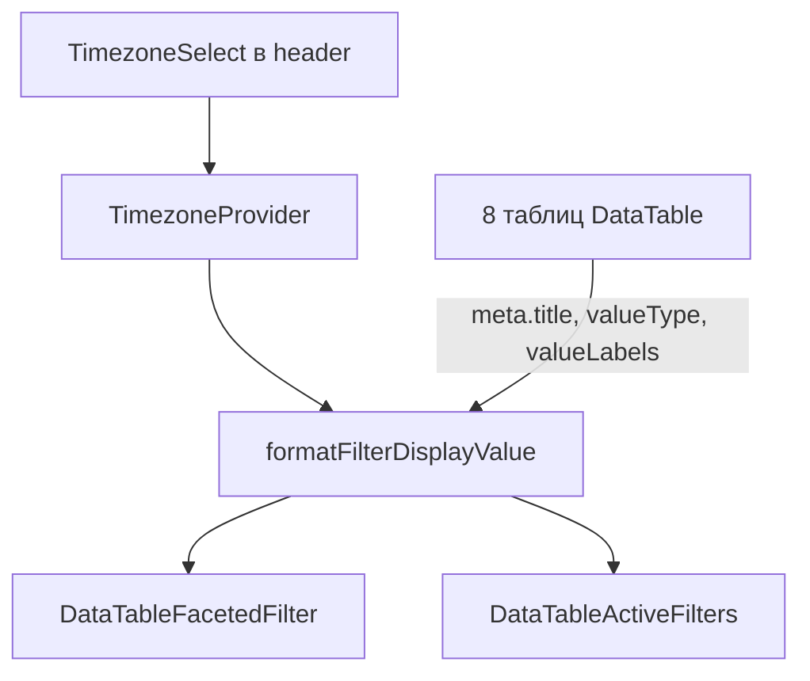

# Фильтры, часовой пояс, узкий сайдбар

## Проблема

1. **Даты в фильтрах** — [`data-table-faceted-filter.tsx`](components/data-table/data-table-faceted-filter.tsx) и [`data-table-active-filters.tsx`](components/data-table/data-table-active-filters.tsx) показывают `String(rawValue)` → `2024-06-01T00:00:00.000Z`, тогда как ячейки используют `format(..., "dd.MM.yyyy")`.
2. **Английские названия** — active filters берут `meta.title ?? filter.id` → `issuedAt`, `currentDue`, `organization` и т.д., хотя заголовок колонки на русском.
3. **Enum-значения** — в delay-requests фильтр статуса показывает `PENDING` / `APPROVED` вместо «Ожидает» / «Одобрен».
4. **Сайдбар** — сейчас `24rem` / `calc(var(--spacing) * 96)` (384px), нужно чуть уже.

## Архитектура



---

## 1. Часовой пояс (дефолт UTC+3)

**Новые файлы:**

| Файл | Назначение |
|------|------------|
| [`lib/datetime/timezones.ts`](lib/datetime/timezones.ts) | Список зон (Москва UTC+3, Калининград, Самара, Екатеринбург, …), `DEFAULT_TIMEZONE = "Europe/Moscow"` |
| [`lib/datetime/format.ts`](lib/datetime/format.ts) | `formatDisplayDate(iso, timeZone)` → `dd.MM.yyyy` через `Intl.DateTimeFormat`; `formatDisplayDateTime` для дат со временем |
| [`components/timezone-provider.tsx`](components/timezone-provider.tsx) | Context + `localStorage` key `fstec_timezone`, hook `useTimezone()` |
| [`components/timezone-select.tsx`](components/timezone-select.tsx) | Компактный `Select` / dropdown в header: «Москва (UTC+3)» |

**Интеграция:**
- [`app/layout.tsx`](app/layout.tsx) — обернуть в `TimezoneProvider` (рядом с `ThemeProvider`)
- [`components/shell/app-shell.tsx`](components/shell/app-shell.tsx) — `<TimezoneSelect />` рядом с `ThemeToggle`

Фильтрация по-прежнему сравнивает **raw ISO-значения**; меняется только **отображение** label в popover и badge.

---

## 2. Центральное форматирование значений фильтра

**[`lib/data-table/faceted-column.ts`](lib/data-table/faceted-column.ts)** — расширить `ColumnMeta`:

```ts
valueType?: "date" | "datetime"
valueLabels?: Record<string, string>  // PENDING → Ожидает
```

**Новый [`lib/data-table/format-filter-value.ts`](lib/data-table/format-filter-value.ts):**

```ts
export function formatFilterDisplayValue(
  value: unknown,
  meta: ColumnMeta | undefined,
  timeZone: string
): string
```

Логика:
- `null` / `""` → `—`
- `meta.valueLabels[value]` → перевод enum
- `meta.valueType === "date"` или regex `/^\d{4}-\d{2}-\d{2}T/` → `formatDisplayDate`
- иначе `String(value)`

**Обновить:**
- [`data-table-faceted-filter.tsx`](components/data-table/data-table-faceted-filter.tsx) — `label` через formatter; сортировка options по label
- [`data-table-active-filters.tsx`](components/data-table/data-table-active-filters.tsx) — title из `meta.title`; value через formatter
- [`data-table-column-toggle.tsx`](components/data-table/data-table-column-toggle.tsx) — fallback `meta.title ?? column.id`

**Helper для колонок** — [`lib/data-table/column-meta.ts`](lib/data-table/column-meta.ts):

```ts
export function colMeta(title: string, opts?: { valueType?, valueLabels?, faceted?, cellClassName? })
```

---

## 3. Русские `meta.title` + типы значений — аудит всех таблиц

Добавить `meta: colMeta("…", { valueType: "date" })` (или `{ ...FACETED_COLUMN_META, title, valueType }`) на **каждую** filterable колонку:

| Файл | Колонки (id → meta.title) |
|------|---------------------------|
| [`orders-table.tsx`](components/admin/orders-table.tsx) | `title`→Название, `organization` (есть), `items`→Мер, `issuedAt`→Дата + date |
| [`measures-table.tsx`](components/admin/measures-table.tsx) | `name`→Название, `code`→Код, `createdAt`→Создана + date |
| [`organizations-manager.tsx`](components/admin/organizations-manager.tsx) | `name`→Организация, `shortCode`→Код, `subdivisions` (есть) |
| [`delay-requests-table.tsx`](components/admin/delay-requests-table.tsx) | `organization`→Организация, `order`→Поручение, `measure`→Мера, `currentDue`/`requestedDueAt` + date, `status`→Статус + `DELAY_STATUS_LABELS` |
| [`order-detail-client.tsx`](components/admin/order-detail-client.tsx) | `dueAt`→Срок + date; остальные (есть) |
| [`admin-dashboard-matrix.tsx`](components/admin/admin-dashboard-matrix.tsx) | `dueAt`→Срок + date; остальные (есть) |
| [`public-measures-table.tsx`](components/public/public-measures-table.tsx) | `dueAt`→Срок + date; остальные (есть) |
| [`public-orders-list-page.tsx`](components/public/public-orders-list-page.tsx) | `title`→Поручение, `issuedAt`→Выдано + date, `items`→Мер |

Колонки `actions` — явно `enableColumnFilter: false` там, где ещё не отключено.

---

## 4. Сузить сайдбар

| Файл | Было | Станет |
|------|------|--------|
| [`components/ui/sidebar.tsx`](components/ui/sidebar.tsx) | `SIDEBAR_WIDTH = "24rem"` | `"22rem"` (352px) |
| [`components/shell/app-shell.tsx`](components/shell/app-shell.tsx) | `calc(var(--spacing) * 96)` | `calc(var(--spacing) * 88)` |

---

## Definition of Done

- Фильтры дат показывают `15.03.2024`, не ISO с `T`/`Z`
- Active filter badges: «Дата: 15.03.2024», не «issuedAt: 2024-…»
- Статусы переносов в фильтрах на русском
- Выбор часового пояса в header, дефолт Москва UTC+3, сохранение в localStorage
- Сайдбар ~22rem
- `npm run typecheck && npm run lint && npm run build`
