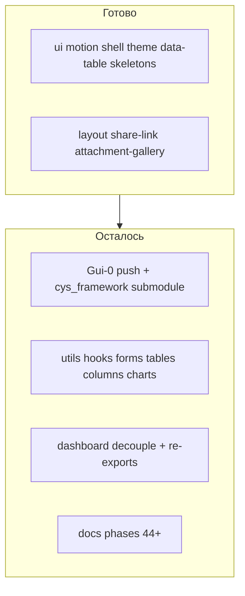

# Доделать миграцию cxado-gui

## Фактическое состояние vs план

План [.cursor/plans/cxado-gui_migration_audit_28280e66.plan.md](.cursor/plans/cxado-gui_migration_audit_28280e66.plan.md) помечен completed, но реализация частичная:

| Волна | Сделано | Осталось |
|-------|---------|----------|
| Gui-0 | `git init`, CI, `.gitignore` в [cxado-gui](/home/bbv/Desktop/fstec/cxado-gui) | **Нет commit/push**; в [cys_framework](/home/bbv/Desktop/cys_framework) **нет** `shared/gui`, `link-gui.sh`, Makefile/bootstrap |
| Gui-2a/b | ~80 re-export'ов: `ui/`, `motion/`, `shell/`, `theme/`, `data-table/`, `skeletons/`, `globals.css` | `lib/utils.ts`, `hooks/*` |
| Gui-3 | layout re-exports (page-header, share-link, attachment-gallery, …) | `form-error-slot`, `commentary-attachments-field`, `tracked-items-data-table`, `lib/data-table/columns/*`, chart primitives |
| Gui-4 | [ComplianceDashboard.tsx](file:///home/bbv/Desktop/fstec/cxado-gui/src/dashboard/ComplianceDashboard.tsx) (типы + shell), [fstec-adapter.ts](file:///home/bbv/Desktop/fstec/fstec/lib/cxado-gui/fstec-adapter.ts) | **11 файлов** `src/dashboard/**` с `@/` импортами; dashboard **исключён** из typecheck; FSTEC `components/dashboard/*` — **25 локальных файлов** |
| Gui-5 | [gui-consumer.md](file:///home/bbv/Desktop/fstec/cxado-gui/docs/gui-consumer.md), [ui-layers.md](file:///home/bbv/Desktop/fstec/fstec/docs/architecture/ui-layers.md) (устарел) | phases 44+ в master plan, veil pilot в link-gui, актуализация ui-layers |



---

## Wave 1 — Gui-0: репозиторий + meta-repo

**cxado-gui** (`/home/bbv/Desktop/fstec/cxado-gui`):

1. Initial commit (все untracked файлы).
2. `git remote add origin https://github.com/butbeautifulv/cxado-gui.git` → push `main`.
3. Убедиться, что CI workflow проходит (`npm run typecheck`).

**cys_framework** — по образцу [link-skills.sh](file:///home/bbv/Desktop/cys_framework/scripts/link-skills.sh):

1. `git submodule add https://github.com/butbeautifulv/cxado-gui.git shared/gui`
2. Новый [`scripts/link-gui.sh`](file:///home/bbv/Desktop/cys_framework/scripts/link-gui.sh):
   - проверка `shared/gui/package.json`
   - symlink `node_modules/@cxado/gui` → `shared/gui` в пилотных проектах (`projects/veil`, опционально FSTEC)
   - или `npm install file:../../shared/gui` — выбрать один паттерн, зафиксировать в `gui-consumer.md`
3. [Makefile](file:///home/bbv/Desktop/cys_framework/Makefile): `gui-link`, `gui-install`; вызов `link-gui.sh` в [bootstrap.sh](file:///home/bbv/Desktop/cys_framework/scripts/bootstrap.sh)
4. [cxado.code-workspace](file:///home/bbv/Desktop/cys_framework/cxado.code-workspace): folder `{ "path": "shared/gui", "name": "GUI Hub" }`
5. [AGENTS.md](file:///home/bbv/Desktop/cys_framework/AGENTS.md) + README: строка про `shared/gui` hub

**FSTEC dependency** — оставить `file:../cxado-gui` (sibling) для обратной совместимости; в docs указать альтернативу `file:../../cys_framework/shared/gui` после submodule. Не ломать текущий dev workflow.

---

## Wave 2 — Закрыть пробелы strangler re-exports (Gui-2/3)

Паттерн уже работает (пример [button.tsx](file:///home/bbv/Desktop/fstec/fstec/components/ui/button.tsx)):

```ts
export * from "@cxado/gui/ui/button"
```

### 2a — utils + hooks

| FSTEC | Re-export |
|-------|-----------|
| [lib/utils.ts](file:///home/bbv/Desktop/fstec/fstec/lib/utils.ts) | `@cxado/gui/utils` |
| [hooks/use-mobile.ts](file:///home/bbv/Desktop/fstec/fstec/hooks/use-mobile.ts) | `@cxado/gui/hooks/use-mobile` |
| [hooks/use-compact-shell.ts](file:///home/bbv/Desktop/fstec/fstec/hooks/use-compact-shell.ts) | `@cxado/gui/hooks/use-compact-shell` |

### 2b — Tier 2 patterns

| FSTEC | Re-export / wrapper |
|-------|---------------------|
| [form-error-slot.tsx](file:///home/bbv/Desktop/fstec/fstec/components/shared/form-error-slot.tsx) | `@cxado/gui/layout/form-error-slot` |
| [commentary-attachments-field.tsx](file:///home/bbv/Desktop/fstec/fstec/components/shared/commentary-attachments-field.tsx) | thin wrapper → `@cxado/gui/forms/commentary-attachments-field` + `maxAttachments={MAX_ATTACHMENTS_PER_RESPONSE}` из `lib/storage/config` |
| [tracked-items-data-table.tsx](file:///home/bbv/Desktop/fstec/fstec/components/shared/tracked-items-data-table.tsx) | `@cxado/gui/tables/tracked-items-data-table` |
| [measures-data-table.tsx](file:///home/bbv/Desktop/fstec/fstec/components/shared/measures-data-table.tsx) | **остаётся FSTEC wrapper** — передаёт `labels={FSTEC_TABLE_LABELS}`, `getDisplayStatusName` / `isOverdue` из `lib/statuses/workflow` |
| `lib/data-table/columns/*` (10 файлов + index) | `@cxado/gui/columns/*` |
| Chart primitives: `chart-category-viewport`, `chart-card-layout`, `dashboard-chart-shared`, `stacked-status-breakdown-chart` | `@cxado/gui/charts/*` |
| `completion-breakdown-chart-section`, `overdue-breakdown-chart-section` | thin FSTEC wrappers (как сейчас) поверх gui chart |

**Не трогать:** `dashboard-matrix-section.tsx` (server fetch + Prisma) — остаётся в FSTEC.

---

## Wave 3 — Gui-4: dashboard decouple + re-exports

**Проблема:** [dashboard-interactive.tsx](file:///home/bbv/Desktop/fstec/cxado-gui/src/dashboard/dashboard-interactive.tsx) импортирует `@/components/dashboard/*` и `@/lib/dashboard/*`, которых в gui нет. `tsconfig` исключает `src/dashboard/**`.

**Шаги в cxado-gui:**

1. Скопировать из FSTEC в gui **только presentational** dashboard-файлы, отсутствующие в gui (~13 из 25):
   - `dashboard-filters-bar`, `dashboard-period-section`, `dashboard-scoped-table`
   - `dashboard-chart-card`, `*-skeleton`, `charts-lazy-boundary`, `dashboard-chart-status-faceted-filter`
2. Скопировать generic lib-типы (без Prisma/server):
   - `interactive-props.ts`, `period-range.ts`, `variant-config.ts` → `src/lib/dashboard/`
3. Переписать все `@/` в `src/dashboard/**` на `@cxado/gui/*` или относительные пути внутри пакета.
4. Убрать `presentation` hardcode (`FSTEC_DASHBOARD_PRESENTATION`) — только через props (`presentation: DashboardPresentationConfig`).
5. Убрать `"exclude": ["src/dashboard/**"]` из [tsconfig.json](file:///home/bbv/Desktop/fstec/cxado-gui/tsconfig.json) → `npm run typecheck` green для всего пакета.

**Шаги в FSTEC:**

1. Client dashboard components → one-line re-exports из `@cxado/gui/dashboard/*` (где компонент есть в gui).
2. [fstec-adapter.ts](file:///home/bbv/Desktop/fstec/fstec/lib/cxado-gui/fstec-adapter.ts) — экспортировать `fstecCompliancePresentation` как `CompliancePresentationConfig` (согласовать типы с gui).
3. Server-only (`dashboard-matrix-section`, data layer в `lib/dashboard/stats.ts`, `cache.ts`, …) — **не выносить**.

**Не в scope этой волны:** полная замена страницы dashboard на `<ComplianceDashboard presentation={...} />` — только инфраструктура + re-exports; runtime wire-up можно сделать отдельным PR.

---

## Wave 4 — Gui-5: документация

1. [docs/architecture/ui-layers.md](file:///home/bbv/Desktop/fstec/fstec/docs/architecture/ui-layers.md):
   - таблица «re-exported via strangler» vs «остаётся в FSTEC»
   - ссылка на `shared/gui` submodule
2. [docs/plans/fstec_master.plan.md](file:///home/bbv/Desktop/fstec/fstec/docs/plans/fstec_master.plan.md): phases **44–49** (Gui-0 … Gui-5) с DoD
3. [cxado-gui/docs/gui-consumer.md](file:///home/bbv/Desktop/fstec/cxado-gui/docs/gui-consumer.md): дополнить meta-repo секцию (`make gui-link`, tsconfig paths, veil pilot)
4. cys_framework [AGENTS.md](file:///home/bbv/Desktop/cys_framework/AGENTS.md): `make gui-link` в Shared hubs

---

## Verification (DoD)

```bash
# cxado-gui — полный пакет, включая dashboard
cd /home/bbv/Desktop/fstec/cxado-gui && npm run typecheck
grep -r 'from "@/' src | wc -l   # ожидание: 0

# FSTEC
cd /home/bbv/Desktop/fstec/fstec && npm run typecheck && npm run lint && npm run build

# cys_framework
cd /home/bbv/Desktop/cys_framework && make bootstrap && make gui-link
```

**Известные pre-existing ошибки typecheck в FSTEC** (не от gui): `measure-imports/[id]/page.tsx`, `stats-legacy.test.ts`, `suggest-routing.ts`, `batch-targets.ts` — не блокируют миграцию gui, но зафиксировать в PR/коммите если build падает.

**Smoke:** `/panel`, `/p/{token}`, `/report/{token}` после build.

---

## Порядок PR / коммитов

1. **cxado-gui** — dashboard decouple (Gui-4 lib + components) + typecheck green
2. **cxado-gui** — initial commit + push (Gui-0)
3. **cys_framework** — submodule + link-gui + Makefile (Gui-0)
4. **fstec** — оставшиеся re-exports (Gui-2/3) + docs (Gui-5)

Файл плана `.cursor/plans/cxado-gui_migration_audit_28280e66.plan.md` **не редактировать** (по запросу пользователя).
