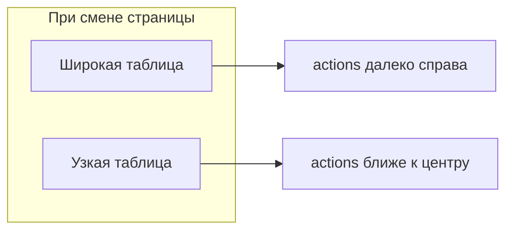

# Фикс jitter колонки действий в DataTable

## Диагностика

При переключении admin/public страниц правая кнопка смещается из‑за трёх несогласованностей:

| Фактор | Сейчас |
|--------|--------|
| Размер кнопки | [`DataTableRowLink`](components/data-table/data-table-row-link.tsx) — `icon-xs` (24px); [`TableRowActions`](components/admin/crud/table-row-actions.tsx) — `icon-sm` (28px) |
| Ширина колонки `actions` | `w-10` только в public/delay; **нет** в [`orders-table`](components/admin/orders-table.tsx), [`measures-table`](components/admin/measures-table.tsx), [`organizations-manager`](components/admin/organizations-manager.tsx), [`order-detail-client`](components/admin/order-detail-client.tsx) |
| Layout | `table-fixed` только у delay/orgs; остальные — auto width → правая граница зависит от контента строк |



## Решение: централизация в DataTable + helper meta

### 1. Helper `actionsColumnMeta()` — [`lib/data-table/column-meta.ts`](lib/data-table/column-meta.ts)

```ts
export const ACTIONS_COLUMN_ID = "actions"

export function actionsColumnMeta(extra?: string) {
  return {
    faceted: false,
    role: "actions" as const,
    cellClassName: cn("w-10 min-w-10 max-w-10 p-0", extra),
  }
}
```

Расширить `ColumnMeta` в [`faceted-column.ts`](lib/data-table/faceted-column.ts): `role?: "actions"`.

### 2. Авто-стили в [`data-table.tsx`](components/data-table/data-table.tsx)

Для колонок с `column.id === "actions"` **или** `meta.role === "actions"` применять к **TableHead и TableCell**:

```ts
const isActionsColumn = column.id === ACTIONS_COLUMN_ID || meta?.role === "actions"

cn(
  meta?.cellClassName,
  isActionsColumn && "sticky right-0 z-10 w-10 min-w-10 max-w-10 bg-background p-0 text-right shadow-[-4px_0_6px_-4px] shadow-border/80"
)
```

Обёртка содержимого ячейки:

```tsx
<div className={isActionsColumn ? "flex justify-end" : undefined}>
  {flexRender(...)}
</div>
```

Эффект: колонка actions **всегда прижата к правому краю** scroll-контейнера таблицы, независимо от ширины других колонок.

На `<Table>` добавить дефолт `className="w-full"` (table-fixed **не** включать глобально — ломает таблицы с truncate-процентами; sticky достаточно).

### 3. Унифицировать размер кнопок

[`table-row-actions.tsx`](components/admin/crud/table-row-actions.tsx): `size="icon-sm"` → **`size="icon-xs"`** (как у `DataTableRowLink`).

### 4. Аудит всех таблиц с `id: "actions"`

Заменить разрозненный meta на `actionsColumnMeta()`:

| Файл |
|------|
| [`orders-table.tsx`](components/admin/orders-table.tsx) |
| [`measures-table.tsx`](components/admin/measures-table.tsx) |
| [`organizations-manager.tsx`](components/admin/organizations-manager.tsx) |
| [`order-detail-client.tsx`](components/admin/order-detail-client.tsx) |
| [`delay-requests-table.tsx`](components/admin/delay-requests-table.tsx) |
| [`public-measures-table.tsx`](components/public/public-measures-table.tsx) |
| [`public-orders-list-page.tsx`](components/public/public-orders-list-page.tsx) |

Убрать локальные `meta: { faceted: false, cellClassName: "w-10" }` — достаточно `meta: actionsColumnMeta()`.

### 5. Что не меняем

- Таблицы **без** колонки `actions` ([`admin-dashboard-matrix.tsx`](components/admin/admin-dashboard-matrix.tsx)) — вне scope.
- Dropdown `TableRowActions` vs chevron `DataTableRowLink` — оба остаются, но в одной колонке одного размера и позиции.

## Definition of Done

- При переключении страниц правая кнопка (`...` или `>`) на одной горизонтальной позиции (sticky right, 40px)
- `TableRowActions` и `DataTableRowLink` — одинаковый `icon-xs`
- Все `actions`-колонки используют `actionsColumnMeta()`
- `npm run typecheck && npm run lint && npm run build`
