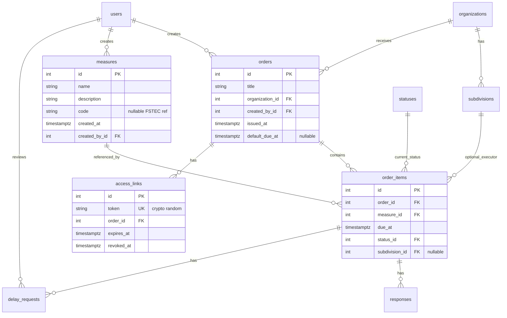
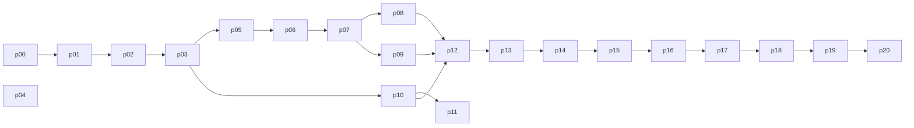

# План переезда ib-measures → fstec (v2)

## Что не так со старой моделью

Старый проект смешивает **определение меры** и **её исполнение конкретным ДЗО**. Из-за этого нельзя нормально отслеживать статусы среди дочерних обществ.

| Проблема | Где в ib-measures | Почему ломает домен |
|----------|-------------------|---------------------|
| Статус и дедлайн на самой мере | `security_measures.status_id`, `date_to_perform` | Одна мера ФСТЭК → одна запись → один статус. Нельзя: «ООО А» выполнило, «ООО Б» — нет |
| ДЗО не связаны с мерами | `organizations` только у `users` | Нет org-scoped исполнения |
| `assigns` = user ↔ measure | таблица `assigns` | ДЗО работает по **ссылке**, без аккаунтов исполнителей |
| `responses`/`delays` → `user_id` | response/delay models | Публичный flow не может писать без user |
| `roles` + JSON permissions | over-engineering | MVP: один тип пользователя — admin |
| `fields: string` | неструктурированно | Ок для MVP как `description`, но не JSON |

**Вывод:** не портируем схему 1:1. Берём **идеи и сущности**, но проектируем заново.

---

## Исправленная модель данных

Разделение на **каталог** (что требует ФСТЭК) и **исполнение** (как конкретное ДЗО это делает в рамках поручения).



### Таблицы (новая схема)

| Таблица | Назначение | Откуда в ib-measures |
|---------|------------|----------------------|
| `organizations` | ДЗО | `organizations` (+ optional `short_code`) |
| `subdivisions` | Подразделения внутри ДЗО | **новое** |
| `users` | Только admin-пользователи | `users` упрощённо (без org_id) |
| `measures` | Каталог мер ФСТЭК | `security_measures` **без** status/deadline |
| `statuses` | Справочник статусов исполнения | `statuses` (+ optional `sort_order`) |
| `orders` | Поручение для ДЗО | **новое** |
| `order_items` | Мера в составе поручения + её статус/дедлайн | заменяет `assigns` + поля с `security_measures` |
| `access_links` | Уникальная ссылка на поручение | **новое** |
| `responses` | Отчёт об исполнении | `responses` → FK на `order_item_id` |
| `delay_requests` | Запрос переноса срока | `delays` → с workflow approve/reject |

### Что выбрасываем из старой схемы

- `assigns` — заменено `order_items` + `access_links`
- `roles` — enum `UserRole.ADMIN` на `users`
- `security_measures.status_id`, `date_to_perform` — перенесены на `order_items`
- JWT-регистрация ДЗО-пользователей — не нужна в MVP

### Маппинг полей (если когда-нибудь мигрировать данные)

| Старое | Новое |
|--------|-------|
| `security_measures.name` | `measures.name` |
| `security_measures.fields` | `measures.description` |
| `security_measures.date_to_perform` | `order_items.due_at` (при создании поручения) |
| `security_measures.status_id` | `order_items.status_id` |
| `assigns(measure_id, user_id)` | `order_items(order_id, measure_id)` + `orders.organization_id` |
| `responses(measure_id, user_id)` | `responses(order_item_id, submitted_by_label?)` |
| `delays(...)` | `delay_requests(...)` + admin review |

---

## Целевая архитектура

Full-stack Next.js 16 (выбрано ранее): Route Handlers + `lib/` domain logic.

```
app/
  (public)/p/[token]/           # ДЗО по ссылке
  (admin)/admin/                  # админ-панель
  api/                            # Route Handlers
lib/
  db/           prisma client
  auth/         admin session
  measures/     catalog CRUD
  orders/       поручения + items
  access-links/ token generate/validate
  public/       scoped queries by token
  validations/  zod
prisma/schema.prisma
docker-compose.yml
```

**Контексты (Fish):** `public` | `admin` | `api` | `lib`

---

## Принцип подфаз: маленький diff

Каждая подфаза = **отдельная ветка** `fstec/phase-NN-slug`, **≤15 файлов**, **одна ответственность**, merge после critic.

**DoD каждой подфазы:**
```text
npm run typecheck && npm run lint && npm run build
```
+ smoke из acceptance criteria подфазы.

---

## Подфазы (20 штук)

### Блок A — Foundation (00–04)

#### 00-docker-env
**Branch:** `fstec/phase-00-docker-env`
**Scope (~3 файла):** `docker-compose.yml`, `.env.example`, `.gitignore` (data/)
**Acceptance:** `docker compose up -d db` поднимает Postgres

#### 01-prisma-core
**Branch:** `fstec/phase-01-prisma-core`
**Scope (~4 файла):** `prisma/schema.prisma` — `organizations`, `subdivisions`, `statuses`, `users`, `measures`; первая миграция; `package.json` scripts (`db:migrate`, `db:generate`)
**Acceptance:** migrate OK, 5 таблиц в БД

#### 02-prisma-workflow
**Branch:** `fstec/phase-02-prisma-workflow`
**Scope (~3 файла):** дополнить schema — `orders`, `order_items`, `access_links`, `responses`, `delay_requests`; вторая миграция
**Acceptance:** полная ER-схема в БД, FK + unique `(order_id, measure_id)` на `order_items`

#### 03-seed-db-client
**Branch:** `fstec/phase-03-seed-db-client`
**Scope (~4 файла):** `prisma/seed.ts` (admin user, базовые statuses: «Не начато», «В работе», «Выполнено», «Просрочено»), `lib/db/client.ts`, `lib/db/index.ts`
**Acceptance:** `npm run db:seed` создаёт admin + statuses

#### 04-agent-docs
**Branch:** `fstec/phase-04-agent-docs`
**Scope (~10 файлов):** Fish→fstec в `.agents/rules/*`, `docs/plans/fstec_master.plan.md`, обновить `AGENTS.md`, `README.md`
**Acceptance:** правила ссылаются на fstec paths, не fish

---

### Блок B — Admin auth (05–07)

#### 05-auth-lib
**Branch:** `fstec/phase-05-auth-lib`
**Scope (~4 файла):** `lib/auth/password.ts`, `lib/auth/session.ts`, `lib/validations/auth.ts`
**Acceptance:** unit-level: hash/verify password, seal/unseal session

#### 06-auth-api-mw
**Branch:** `fstec/phase-06-auth-api-mw`
**Scope (~4 файла):** `app/api/auth/login/route.ts`, `logout/route.ts`, `proxy.ts` или middleware для `/panel/*`
**Acceptance:** curl login → Set-Cookie; без cookie → 401/redirect

#### 07-admin-shell
**Branch:** `fstec/phase-07-admin-shell`
**Scope (~6 файлов):** `app/(admin)/admin/layout.tsx`, sidebar, placeholder pages, `app/(admin)/admin/login/page.tsx`
**Acceptance:** login UI → redirect to `/admin`; logout works

---

### Блок C — Справочники (08–09)

#### 08-orgs-api-ui
**Branch:** `fstec/phase-08-orgs-api-ui`
**Scope (~8 файлов):** `lib/organizations/*`, API routes, admin pages: org list + create/edit, subdivisions nested или отдельная вкладка
**Acceptance:** admin CRUD org + subdivision

#### 09-statuses-api-ui
**Branch:** `fstec/phase-09-statuses-api-ui`
**Scope (~6 файлов):** `lib/statuses/*`, API, `/panel/settings/statuses` — table + dialog
**Acceptance:** admin CRUD statuses

---

### Блок D — Каталог мер (10–11)

#### 10-measures-api
**Branch:** `fstec/phase-10-measures-api`
**Scope (~5 файлов):** `lib/measures/*`, `app/api/measures/route.ts`, `[id]/route.ts`, zod schemas
**Acceptance:** curl CRUD measure (catalog only, no status/deadline)

#### 11-measures-ui
**Branch:** `fstec/phase-11-measures-ui`
**Scope (~6 файлов):** `/panel/measures` table, `/panel/measures/new`, `[id]/edit` — shadcn Form, Textarea для description
**Acceptance:** admin создаёт/редактирует меру через UI

---

### Блок E — Поручения и ссылки (12–14)

#### 12-orders-lib-api
**Branch:** `fstec/phase-12-orders-lib-api`
**Scope (~6 файлов):** `lib/orders/create.ts` (order + order_items batch), `list.ts`, API `POST/GET /api/orders`
**Acceptance:** curl создаёт поручение с N мерами, каждая → `order_item` с default status

#### 13-orders-ui
**Branch:** `fstec/phase-13-orders-ui`
**Scope (~6 файлов):** `/panel/orders` list, `/panel/orders/new` wizard: select org → pick measures (checkbox) → set due dates
**Acceptance:** admin создаёт поручение через UI

#### 14-access-links
**Branch:** `fstec/phase-14-access-links`
**Scope (~5 файлов):** `lib/access-links/*`, `POST /api/orders/[id]/links`, `/panel/orders/[id]` — copy URL `/p/{token}`, revoke button
**Acceptance:** ссылка генерируется, revoke блокирует доступ

---

### Блок F — Public flow (15–18)

#### 15-public-read
**Branch:** `fstec/phase-15-public-read`
**Scope (~5 файлов):** `lib/public/validate-token.ts`, `GET /api/public/[token]`, `app/(public)/p/[token]/page.tsx` — read-only cards
**Acceptance:** valid token → список мер поручения; invalid/expired → 404

#### 16-public-status
**Branch:** `fstec/phase-16-public-status`
**Scope (~4 файла):** `PATCH /api/public/[token]/items/[id]/status`, status Select на public page
**Acceptance:** ДЗО меняет статус; admin видит на `/panel/orders/[id]`

#### 17-public-response
**Branch:** `fstec/phase-17-public-response`
**Scope (~5 файлов):** `POST /api/public/[token]/items/[id]/responses`, form: result + commentary + optional subdivision + submitter name
**Acceptance:** response сохраняется, виден admin

#### 18-public-delay
**Branch:** `fstec/phase-18-public-delay`
**Scope (~6 файлов):** public POST delay_request; admin UI approve/reject; upon approve → update `order_items.due_at`
**Acceptance:** полный цикл delay request

---

### Блок G — Dashboard + polish (19–20)

#### 19-dashboard
**Branch:** `fstec/phase-19-dashboard`
**Scope (~5 файлов):** `/admin` dashboard: matrix org × measure status, filter overdue (`due_at < now()` AND status not done)
**Acceptance:** сводка по ДЗО отображается корректно

#### 20-polish
**Branch:** `fstec/phase-20-polish`
**Scope (~6 файлов):** `error.tsx`, `loading.tsx`, rate limit helper on public API, empty states
**Acceptance:** build green, public API rate-limited

---

## Зависимости подфаз



`p04-agent-docs` можно параллельно с `p01–p03` (нет runtime-зависимости).

---

## UI (с нуля, shadcn)

| Route | Подфаза |
|-------|---------|
| `/panel/login` | 07 |
| `/panel/organizations` | 08 |
| `/panel/settings/statuses` | 09 |
| `/panel/measures` | 11 |
| `/panel/orders`, `/panel/orders/new`, `/panel/orders/[id]` | 13–14 |
| `/p/[token]` | 15–18 |
| `/admin` dashboard | 19 |

Skills: [`next-best-practices`](.agents/skills/next-best-practices/SKILL.md), [`shadcn`](.agents/skills/shadcn/SKILL.md).

---

## Fish → fstec (кратко)

| Fish | FSTEC |
|------|-------|
| `fish/phase-*` | `fstec/phase-NN-slug` (см. подфазы выше) |
| `fish_master.plan.md` | `docs/plans/fstec_master.plan.md` |
| `lib/audit` | `lib/measures`, `lib/orders`, `lib/public` |
| `data/fish.db` | PostgreSQL |
| Public audit landing | `/p/[token]` |
| Security | token crypto-random, expiry, revoke, rate limit |

---

## Что НЕ переносим

- Python/FastAPI, Alembic, Redis, MinIO stub
- Vite SPA frontend
- Таблицы `assigns`, `roles` в прежнем виде
- JWT для исполнителей ДЗО
- Kafka, RAG из aspirational README

---

## Reference (старый проект)

- Init schema: [`.external/ib-measures-master/ibm_api/alembic/versions/059091b2362d_init_up.py`](.external/ib-measures-master/ibm_api/alembic/versions/059091b2362d_init_up.py)
- Measure model (что исправляем): [`.external/ib-measures-master/ibm_api/src/ibm_api/security_measures/measures/models.py`](.external/ib-measures-master/ibm_api/src/ibm_api/security_measures/measures/models.py)
- Postman (API reference): [`.external/ib-measures-master/postman/IBM_api.postman_collection.json`](.external/ib-measures-master/postman/IBM_api.postman_collection.json)
