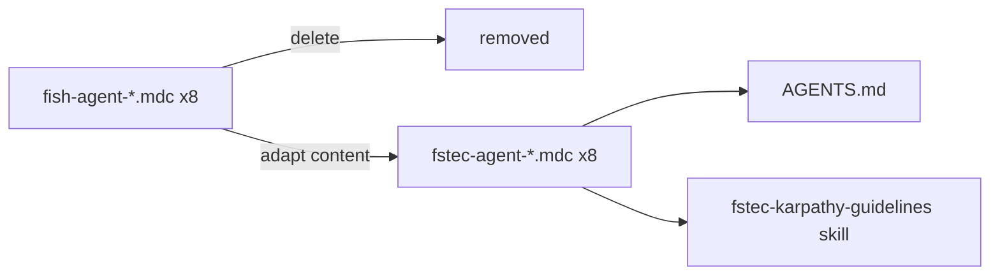

# FSTEC rules + shadcn UI

## Текущее состояние

**Rules:** 8 файлов `fish-agent-*.mdc` + `fish-karpathy-guidelines.mdc` всё ещё ссылаются на Fish-домен (`fish/phase-*`, `fish_master.plan.md`, `lib/audit`, `data/fish.db`). Частично созданы 3 fstec-файла ([`fstec-agent-workflow.mdc`](.agents/rules/fstec-agent-workflow.mdc), [`fstec-karpathy-guidelines.mdc`](.agents/rules/fstec-karpathy-guidelines.mdc), [`fstec-agent-security.mdc`](.agents/rules/fstec-agent-security.mdc)) — урезанные, без critic/subagents/kaizen/documentation/parallel-branches.

**UI:** В [`components/ui/`](components/ui/) только 7 hand-rolled компонентов (input, table, card…). CLI shadcn падал из‑за недоступности registry. В коде:
- native `<select>` — [`order-create-form.tsx`](components/admin/order-create-form.tsx), [`organizations-manager.tsx`](components/admin/organizations-manager.tsx), [`public-order-page.tsx`](components/public/public-order-page.tsx)
- `alert()` вместо toast — [`public-order-page.tsx`](components/public/public-order-page.tsx)
- кастомный sidebar — [`admin-sidebar.tsx`](components/admin/admin-sidebar.tsx) вместо shadcn `Sidebar`

[`components.json`](components.json) настроен (`radix-nova`, RSC) — проект готов к CLI.

---

## Блок 1 — Миграция rules (удалить fish, полный fstec)

### Действия

1. **Удалить** все 8 fish-файлов:
   - `fish-agent-workflow.mdc`, `fish-agent-critic.mdc`, `fish-agent-subagents.mdc`
   - `fish-agent-kaizen.mdc`, `fish-agent-documentation.mdc`, `fish-agent-parallel-branches.mdc`
   - `fish-agent-security.mdc`, `fish-karpathy-guidelines.mdc`

2. **Создать/расширить** полный набор fstec-правил (1:1 по структуре Fish, но FSTEC-домен):

| Новый файл | Источник | Ключевые замены |
|------------|----------|-----------------|
| [`fstec-agent-workflow.mdc`](.agents/rules/fstec-agent-workflow.mdc) | fish-agent-workflow | `fstec/phase-*`, `fstec_master.plan.md`, contexts: `public`/`admin`/`api`/`lib` |
| `fstec-agent-critic.mdc` | fish-agent-critic | smokes: token flow, admin CRUD; security checklist для public links |
| `fstec-agent-subagents.mdc` | fish-agent-subagents | prompt template: FSTEC implementer |
| `fstec-agent-kaizen.mdc` | fish-agent-kaizen | gemba: `npm run dev`, curl `/api/public/{token}`, Postgres |
| `fstec-agent-documentation.mdc` | fish-agent-documentation | README, `.env.example`, phase plans |
| `fstec-agent-parallel-branches.mdc` | fish-agent-parallel-branches | `fstec/phase-NN-slug` |
| [`fstec-agent-security.mdc`](.agents/rules/fstec-agent-security.mdc) | fish-agent-security | tokens, SESSION_SECRET, rate limit, no `FISH_*` |
| [`fstec-karpathy-guidelines.mdc`](.agents/rules/fstec-karpathy-guidelines.mdc) | fish-karpathy | master plan path, branch naming |

3. **Skill:** скопировать [`.agents/skills/fish-karpathy-guidelines/`](.agents/skills/fish-karpathy-guidelines/) → `.agents/skills/fstec-karpathy-guidelines/SKILL.md` с FSTEC-путями; правила ссылаются на новый skill.

4. **Обновить** [`AGENTS.md`](AGENTS.md):
   - явный список всех `fstec-agent-*.mdc`
   - пункт: UI — shadcn skill обязателен; не писать кастомные компоненты если есть в registry



**DoD:** `rg fish-agent` и `rg fish_master` в `.agents/` → 0 совпадений (кроме git history).

---

## Блок 2 — shadcn CLI: установка компонентов

Следовать [`.agents/skills/shadcn/SKILL.md`](.agents/skills/shadcn/SKILL.md): `npx shadcn@latest add … -y`.

**Команда (батчами при сетевых сбоях):**

```bash
npx shadcn@latest add select field dialog alert sonner sidebar separator skeleton checkbox spinner -y
```

При ошибке registry — fallback `npx shadcn@4.10.0 add …` (как советует CLI).

**Перезаписать** hand-rolled файлы официальными версиями CLI:
- `input`, `label`, `textarea`, `badge`, `card`, `table` — заменить текущие stub-файлы в [`components/ui/`](components/ui/)

**Root layout** [`app/layout.tsx`](app/layout.tsx): добавить `<Toaster />` из sonner.

**DoD:** `npx shadcn@latest info --json` показывает установленные компоненты; build green.

---

## Блок 3 — Рефакторинг UI на shadcn (маленькие diff)

### 3a — Admin shell → Sidebar

- Заменить [`components/admin/admin-sidebar.tsx`](components/admin/admin-sidebar.tsx) + [`app/(admin)/admin/(panel)/layout.tsx`](app/(admin)/admin/(panel)/layout.tsx) на shadcn `SidebarProvider` + `Sidebar` + `SidebarMenu` (skill: compose, don't reinvent).
- Logout — `SidebarMenuButton` или `DropdownMenu`.

### 3b — Формы → FieldGroup + Field

По [forms.md](.agents/skills/shadcn/rules/forms.md):

| Файл | Изменения |
|------|-----------|
| [`app/(admin)/admin/login/page-client.tsx`](app/(admin)/admin/login/page-client.tsx) | `FieldGroup` + `Field` + `FieldLabel` |
| [`components/admin/measure-form.tsx`](components/admin/measure-form.tsx) | то же |
| [`components/admin/order-create-form.tsx`](components/admin/order-create-form.tsx) | `Select` для ДЗО; `Checkbox` для мер |
| [`components/admin/organizations-manager.tsx`](components/admin/organizations-manager.tsx) | `Select` для выбора ДЗО |
| [`components/admin/statuses-manager.tsx`](components/admin/statuses-manager.tsx) | `FieldGroup` |

### 3c — Public page

[`components/public/public-order-page.tsx`](components/public/public-order-page.tsx):
- `Select` + `SelectItem` + `SelectGroup` вместо native `<select>`
- `toast()` из sonner вместо `alert()`
- loading → `Skeleton`; empty/error → `Alert`
- формы → `FieldGroup` + `Field`

### 3d — Admin tables polish

- [`app/(admin)/admin/page.tsx`](app/(admin)/admin/page.tsx) и списки: empty state через shadcn `Alert` или `Empty` (если добавим)
- overdue badge — shadcn `Badge` variants (уже есть, проверить после CLI overwrite)

**DoD:** `rg '<select|alert\(' components/` → 0; все формы используют Field/Select.

---

## Подфазы (ветки)

| # | Branch | Scope | Files |
|---|--------|-------|-------|
| 21 | `fstec/phase-21-rules-migration` | delete fish + create 8 fstec rules + skill + AGENTS.md | ~12 |
| 22 | `fstec/phase-22-shadcn-install` | CLI add + overwrite ui stubs + Toaster | ~15 |
| 23 | `fstec/phase-23-shadcn-admin-ui` | Sidebar, forms, Select | ~8 |
| 24 | `fstec/phase-24-shadcn-public-ui` | public page Select + sonner + Skeleton | ~3 |

Зависимости: 21 ∥ 22 (параллельно) → 23 → 24.

**Verify каждой подфазы:**
```bash
npm run typecheck && npm run lint && npm run build
```

---

## Риски

| Риск | Митигация |
|------|-----------|
| shadcn registry недоступен | retry; pin `@4.10.0`; offline — скопировать из shadcn docs вручную с тем же API |
| radix-nova Field API отличается от classic | читать `npx shadcn@latest docs field` перед рефактором форм |
| Sidebar требует client wrapper | `(panel)/layout.tsx` → thin server shell + `AdminShell` client component |
