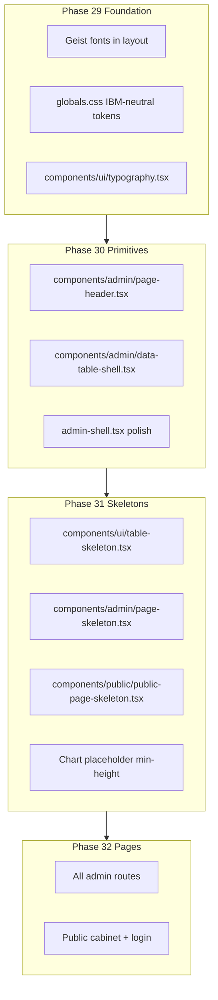

# FSTEC UI polish (ib-measures → shadcn)

## Контекст и диагноз

**Референс:** [`.external/ib-measures-master/ibm_frontend`](.external/ib-measures-master/ibm_frontend) — тот же shadcn-стек, но с дисциплиной:

| Паттерн ib-measures | Где | Проблема в FSTEC сейчас |
|---|---|---|
| Geist + нейтральная палитра | [`index.css`](.external/ib-measures-master/ibm_frontend/src/index.css) | Inter + оранжевый primary в [`app/layout.tsx`](app/layout.tsx) / [`globals.css`](app/globals.css) |
| Typography-компоненты | [`typography.tsx`](.external/ib-measures-master/ibm_frontend/src/components/ui/typography.tsx) | Ad-hoc `text-xl font-medium` на каждой странице |
| Таблица в `rounded-md border` | [`Measures.tsx`](.external/ib-measures-master/ibm_frontend/src/pages/measures/Measures.tsx) | «Голые» `<Table>` без рамки |
| Table skeleton (15 строк, фикс. высота) | `TableSkeletonRow` в Measures.tsx | Admin loading = текст «Загрузка...» ([`loading.tsx`](app/(admin)/admin/(panel)/loading.tsx)) |
| Detail skeleton | [`MeasureSkeleton.tsx`](.external/ib-measures-master/ibm_frontend/src/pages/measures/measure/MeasureSkeleton.tsx) | Нет skeleton на detail/form страницах |
| `space-y-8` / `text-2xl font-bold` заголовки | AppLayout, Measures | Разный rhythm: `gap-6`, `text-xl font-medium` |

**Источники layout shift (CLS):**
- Client-fetch public page: skeleton не повторяет финальную таблицу ([`public-order-page.tsx`](components/public/public-order-page.tsx))
- Charts: пустое состояние = текст, с данными = `aspect-square` chart ([`dashboard-charts.tsx`](components/admin/dashboard-charts.tsx))
- Client forms (`order-create-form`, `measure-picker`): данные подгружаются после mount → форма «растёт»
- Кнопки действий в header без резервирования места
- Таблицы без min-height → скачок при появлении строк

---

## Design direction (frontend-design skill)

**Предмет:** реестр мер ФСТЭК и исполнение поручений ДЗО — институциональный, точный, без «стартап-шума».

**Палитра (адаптация IBM, через shadcn tokens):**
- Background `#FFFFFF` / dark `oklch(0.145)`
- Foreground near-black `oklch(0.145)`
- Primary neutral black/white swap (как IBM), убрать оранжевый accent
- Muted borders `oklch(0.922)` — спокойные data-surfaces

**Типографика:**
- Display/body: **Geist** (как IBM, не Inter)
- Utility/mono: **Geist Mono** для кодов мер, токенов ссылок
- Scale: page title `text-2xl font-bold tracking-tight`, section `text-lg font-semibold`, lead `text-muted-foreground text-sm`

**Signature (один акцент):** page chrome с нижней hairline-границей у заголовка (паттерн `TypographyH2` из IBM) — ощущение реестра/документа, без лишнего декора.

**Layout concept:**
```
[Sidebar fixed] | [Header h-12 fixed]
                | [Page: max-w-5xl optional, space-y-6]
                |   PageHeader (title + actions, min-h-12)
                |   Toolbar (search/filters, min-h-10)
                |   DataTableShell (border, min-h-[480px])
```

---

## Архитектура (shadcn-only)



---

## Phase 29 — Foundation

**Файлы:** [`app/layout.tsx`](app/layout.tsx), [`app/globals.css`](app/globals.css), новый [`components/ui/typography.tsx`](components/ui/typography.tsx)

1. Заменить Inter на `Geist` + `Geist_Mono` (`next/font/google`)
2. Синхронизировать CSS variables с IBM [`index.css`](.external/ib-measures-master/ibm_frontend/src/index.css): neutral primary, sidebar tokens, chart colors
3. Портировать typography-компоненты из IBM (H1, H2, Lead, Muted, InlineCode) — thin wrappers, без новых зависимостей
4. Base layer: `html { font-sans }`, selection styles как в IBM

---

## Phase 30 — Layout primitives

**Новые компоненты:**

- **`PageHeader`** — `{ title, description?, actions? }`, классы: `flex items-start justify-between gap-4 border-b pb-4`, title через `TypographyH2`-equivalent
- **`DataTableShell`** — `rounded-md border` wrapper + optional toolbar slot (поиск/фильтры сверху, как IBM Measures)
- **`EmptyState`** — центрированная ячейка `py-12 text-muted-foreground` для пустых таблиц

**Обновить:**
- [`admin-shell.tsx`](components/admin/admin-shell.tsx): content area `max-w-6xl` (optional centering), единый `space-y-6`, header breadcrumb через `TypographyMuted`
- Все list-страницы ([`measures/page.tsx`](app/(admin)/admin/(panel)/measures/page.tsx), [`orders/page.tsx`](app/(admin)/admin/(panel)/orders/page.tsx), dashboard, organizations, statuses) — перейти на `PageHeader` + `DataTableShell`

---

## Phase 31 — Skeleton system (anti-CLS)

**Портировать паттерны IBM:**

| Компонент | Основа | Использование |
|---|---|---|
| `TableSkeleton` | IBM `TableSkeletonRow` × N | Admin loading, client tables |
| `PageSkeleton` | header skeleton + table skeleton | [`loading.tsx`](app/(admin)/admin/(panel)/loading.tsx) |
| `DetailSkeleton` | IBM `MeasureSkeleton` | order detail, measure edit, org links |
| `FormSkeleton` | card + field skeletons | order-create (пока грузятся measures/orgs) |
| `PublicPageSkeleton` | header + toolbar + table rows | public cabinet fetch |
| `ChartSkeleton` | `Skeleton className="h-64 w-full rounded-lg"` | dashboard charts client mount |

**Правила стабильности:**
- Skeleton row count = **10** (admin) / **8** (public) — фиксированно
- Row height: `h-10` (совпадает с `TableHead`)
- Chart cards: always `min-h-[280px]` — empty/text/chart same box
- `PageHeader` actions: `min-w-[140px]` skeleton или `visibility` placeholder
- Public fetch: skeleton **до** swap на data, без изменения outer height

**Route-level loading:**
- Заменить текст в [`loading.tsx`](app/(admin)/admin/(panel)/loading.tsx) на `PageSkeleton`
- Добавить `loading.tsx` для `orders/[id]`, `organizations/[id]`, `measures/[id]/edit` (по необходимости)

---

## Phase 32 — Page polish

### Admin list pages
- Measures, Orders, Organizations, Statuses, Dashboard table — единый chrome
- Dashboard: stats cards row (IBM [`StatsCards`](.external/ib-measures-master/ibm_frontend/src/components/security_measures/StatsCards.tsx)) над charts + table
- Filter buttons («Все / Просроченные») — `size="sm"`, фиксированная высота toolbar

### Admin detail / forms
- [`order-detail-client.tsx`](components/admin/order-detail-client.tsx): PageHeader + bordered table
- [`order-create-form.tsx`](components/admin/order-create-form.tsx): FormSkeleton until API data; fields in Card
- [`organizations-manager.tsx`](components/admin/organizations-manager.tsx), [`org-links-panel.tsx`](components/admin/org-links-panel.tsx): consistent cards spacing

### Public cabinet
- Layout: `max-w-5xl mx-auto p-6 space-y-6` (как IBM AppLayout)
- [`public-page-skeleton.tsx`](components/public/public-page-skeleton.tsx) matching final table structure
- Toolbar (search + select) always visible — фильтрация не меняет высоту header block

### Login
- [`page-client.tsx`](app/(admin)/admin/login/page-client.tsx): CardDescription + TypographyMuted, error alert reserves space (`min-h` when no error optional)

---

## Что НЕ переносим

- Vite/React Router architecture — остаёмся на Next.js RSC
- TanStack Table — пока shadcn Table достаточно; pagination можно позже
- Top navigation IBM — сохраняем sidebar FSTEC, переносим только **внутренний** page styling

---

## DoD

- `npm run typecheck && npm run lint && npm run build`
- Навигация admin → measures/orders/dashboard: skeleton → content **без скачка** header/table
- Public `/p/[token]`: skeleton повторяет таблицу, фильтры не ломают layout
- Charts: карточки одинаковой высоты с данными и без
- Типографика: все page titles через `TypographyH2` / `PageHeader`, шрифт Geist

---

## Подфазы (ветки)

| # | Branch | Scope |
|---|---|---|
| 29 | `fstec/phase-29-ui-foundation` | fonts, tokens, typography.tsx |
| 30 | `fstec/phase-30-ui-primitives` | PageHeader, DataTableShell, shell |
| 31 | `fstec/phase-31-ui-skeletons` | skeleton components + loading.tsx |
| 32 | `fstec/phase-32-ui-pages` | migrate all pages + public + login |

Зависимости: 29 → 30 → 31 → 32 (строго последовательно — каждая фаза строится на предыдущей).
