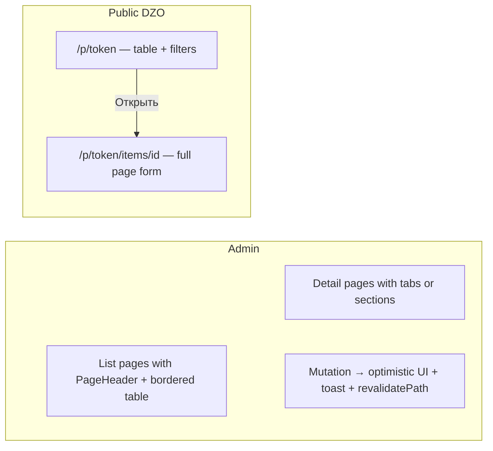

# FSTEC unified UX/UI

## Что не так сейчас (конкретно)

| Жалоба | Корневая причина в коде |
|--------|--------------------------|
| Ссылка подразделения не появляется без F5 | API `createSubdivisionAccessLink` возвращает link **без** `subdivision`; UI ищет `l.subdivision?.id` ([`org-links-panel.tsx`](components/admin/org-links-panel.tsx) L41–45) |
| Мера после редактирования «не обновляется» | PUT [`/api/measures/[id]`](app/api/measures/[id]/route.ts) не вызывает `revalidatePath`; `router.refresh()` не инвалидирует RSC-список |
| Алерты/toasts кривые | `richColors` + дефолтный sonner без единого стиля; нет toast при сохранении меры; inline `<Alert>` в формах сдвигает layout |
| Ответы в кривом окне | Dialog с `max-w-lg` поверх дефолта `sm:max-w-sm` ([`dialog.tsx`](components/ui/dialog.tsx) L64); нет `ScrollArea`, pending delays **внутри** ячейки таблицы ([`order-detail-client.tsx`](components/admin/order-detail-client.tsx) L122–152) |
| Меры ДЗО через боковую панель | [`PublicItemSheet`](components/public/public-item-sheet.tsx) — Sheet справа; **вы выбрали:** отдельная страница |
| ДЗО — разорванный flow | Подразделения на [`/admin/organizations`](app/(admin)/admin/(panel)/organizations/page.tsx), ссылки на [`/admin/organizations/[id]`](app/(admin)/admin/(panel)/organizations/[id]/page.tsx) — два экрана без связи |
| Скачки / нет skeletons | [`loading.tsx`](app/(admin)/admin/(panel)/loading.tsx) = текст «Загрузка...»; client-fetch без layout-matched skeleton; charts меняют высоту |

**Цвета не трогаем** — текущие tokens в [`globals.css`](app/globals.css) остаются.

---

## Design direction (frontend-design skill)

**Предмет:** реестр мер ФСТЭК, поручения ДЗО, кабинет исполнителя.

**Одна сигнатура:** единый **page chrome** — заголовок + описание + hairline снизу (паттерн `TypographyH2` из IBM). Всё остальное спокойно и одинаково.

**Типографика (единственное визуальное изменение из IBM):**
- Geist Sans + Geist Mono вместо Inter ([`app/layout.tsx`](app/layout.tsx))
- [`components/ui/typography.tsx`](components/ui/typography.tsx) — H1/H2/Lead/Muted/InlineCode (порт из [IBM typography](.external/ib-measures-master/ibm_frontend/src/components/ui/typography.tsx))
- Scale: page title `text-2xl font-bold tracking-tight`, description `TypographyMuted`

**Единый UX-flow:**

---

## Phase 33 — Bug fixes (state & cache)

**Приоритет: сразу, маленький diff.**

1. **Subdivision links** — в [`lib/access-links/index.ts`](lib/access-links/index.ts) `createSubdivisionAccessLink` / `createOrganizationAccessLink`: `include: { subdivision: true }` в return; в [`org-links-panel.tsx`](components/admin/org-links-panel.tsx) fallback: `l.subdivisionId === subdivisionId`
2. **Measure edit refresh** — в PUT/POST measures API: `revalidatePath('/admin/measures')`; в [`measure-form.tsx`](components/admin/measure-form.tsx): `toast.success('Мера сохранена')` перед redirect
3. **Org link revoke/create** — убрать лишний `router.refresh()` где state уже обновлён; единый helper `normalizeLink()` для client state
4. **Order detail delays** — вынести pending approve/reject из ячейки таблицы в Dialog «Переносы» (как ответы)

**DoD:** создать ссылку подразделения → кнопки сразу; отредактировать меру → новое имя в списке без F5.

---

## Phase 34 — Typography & page chrome

**Без изменения цветов.**

- Geist fonts в [`app/layout.tsx`](app/layout.tsx)
- Новый [`components/ui/typography.tsx`](components/ui/typography.tsx)
- Новый [`components/admin/page-header.tsx`](components/admin/page-header.tsx): `{ title, description?, actions?, backHref? }` — фиксированная структура, `border-b pb-4`, `min-h-[72px]`
- Новый [`components/admin/data-table-shell.tsx`](components/admin/data-table-shell.tsx): `rounded-md border` (как [IBM Measures](.external/ib-measures-master/ibm_frontend/src/pages/measures/Measures.tsx) L130)
- Применить на все list-страницы: measures, orders, organizations, statuses, dashboard

---

## Phase 35 — Skeletons & anti-CLS

Портировать **структуру** skeleton из IBM, не цвета:

| Компонент | Файл | Где |
|-----------|------|-----|
| `TableSkeleton` | `components/ui/table-skeleton.tsx` | 10 строк × `h-10` |
| `PageSkeleton` | `components/admin/page-skeleton.tsx` | header + table |
| `FormSkeleton` | `components/admin/form-skeleton.tsx` | order-create, measure form load |
| `PublicPageSkeleton` | `components/public/public-page-skeleton.tsx` | public table layout |

- Заменить [`loading.tsx`](app/(admin)/admin/(panel)/loading.tsx) на `PageSkeleton`
- [`order-create-form.tsx`](components/admin/order-create-form.tsx): `FormSkeleton` пока грузятся measures/orgs
- [`dashboard-charts.tsx`](components/admin/dashboard-charts.tsx): `min-h-[280px]` на все chart cards (empty = тот же box)
- [`public-order-page.tsx`](components/public/public-order-page.tsx): skeleton = toolbar + table rows (не 3 random blocks)

---

## Phase 36 — Unified flows

### 36a. ДЗО — один экран организации

Объединить [`organizations-manager.tsx`](components/admin/organizations-manager.tsx) и [`org-links-panel.tsx`](components/admin/org-links-panel.tsx) в **Org detail page** с shadcn `Tabs`:

- **Tab «Подразделения»** — список + добавление
- **Tab «Ссылки»** — org link + таблица subdivision links

List page `/admin/organizations` — только таблица ДЗО, клик по строке → `/admin/organizations/[id]`.

Убрать отдельную кнопку «Ссылки» без контекста; убрать orphan-форму «добавить подразделение» с главной страницы.

### 36b. Public cabinet — страница меры (ваш выбор)

- [`public-measures-table.tsx`](components/public/public-measures-table.tsx): «Открыть» → `Link` на `/p/[token]/items/[id]`
- Новая страница [`app/(public)/p/[token]/items/[id]/page.tsx`](app/(public)/p/[token]/items/[id]/page.tsx) + [`public-item-detail.tsx`](components/public/public-item-detail.tsx)
- Удалить [`public-item-sheet.tsx`](components/public/public-item-sheet.tsx) (Sheet)
- Back link «← К списку мер» на table page
- `PageHeader` pattern для public (org name, subdivision badge)

### 36c. Admin dialogs & feedback

- Новый [`components/admin/response-list-dialog.tsx`](components/admin/response-list-dialog.tsx): `Dialog` + `ScrollArea` + structured cards (ФИО, дата, result, commentary, subdivision)
- Аналогично `delay-list-dialog.tsx` с approve/reject actions **внутри** dialog
- Toasts: единый wrapper [`lib/ui/feedback.ts`](lib/ui/feedback.ts) — `notify.success/error` с русскими сообщениями; tune [`sonner.tsx`](components/ui/sonner.tsx): `position="bottom-right"`, `toastOptions={{ duration: 4000 }}`, убрать `richColors` если ломает стиль
- Form errors: reserved slot `min-h-[52px]` под Alert — не сдвигает кнопки

### 36d. Order detail polish

- [`order-detail-client.tsx`](components/admin/order-detail-client.tsx): `PageHeader`, `DataTableShell`, чистые колонки (без inline pending UI)
- Link «Ссылки ДЗО» → tab links на org detail page

---

## Phase 37 — Consistency pass

- Все mutations: toast + `revalidatePath` / optimistic state (statuses, orgs, orders, links, measures)
- Sidebar [`admin-sidebar.tsx`](components/admin/admin-sidebar.tsx): active state для nested routes (`/admin/organizations/123` → ДЗО active)
- Public + admin: один `space-y-6` rhythm, все titles через `PageHeader`

---

## Что НЕ делаем

- Перенос палитры IBM / смена primary
- TanStack Table / pagination (можно позже)
- Top nav вместо sidebar

---

## DoD

- `npm run typecheck && lint && build`
- Subdivision link без F5; measure edit обновляет список; toast при каждом save
- Public: table → full page item → back, без Sheet
- Org: один detail с tabs
- Responses dialog: фиксированная ширина, scroll, не ломает viewport
- Navigation: skeleton → content без скачка header/table
- Typography: Geist + PageHeader на всех страницах

---

## Подфазы

| # | Branch | Scope |
|---|--------|-------|
| 33 | `fstec/phase-33-ux-bugfixes` | links API, revalidatePath, delays out of table cell |
| 34 | `fstec/phase-34-typography-chrome` | Geist, typography, PageHeader, DataTableShell |
| 35 | `fstec/phase-35-skeletons-cls` | skeleton components, loading.tsx, chart min-height |
| 36 | `fstec/phase-36-unified-flows` | org tabs, public item page, dialogs, toasts |
| 37 | `fstec/phase-37-consistency` | revalidate everywhere, sidebar active, final pass |

**33 первым** (баги без дизайна), затем 34→35 параллельно с 36a/36c, 36b после 35.

Старый план [`fstec_ui_polish_995842b1.plan.md`](.cursor/plans/fstec_ui_polish_995842b1.plan.md) **заменяется** этим.
