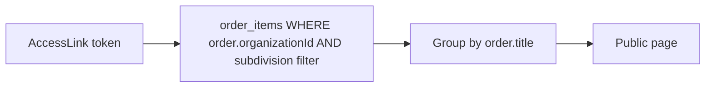

# FSTEC UX improvements v2

## Диагностика текущих проблем

| Жалоба | Причина в коде |
|--------|----------------|
| Статусы нельзя редактировать | API [`PUT/DELETE /api/statuses`](app/api/statuses/route.ts) есть, UI [`statuses-manager.tsx`](components/admin/statuses-manager.tsx) — только add + table |
| Кнопка «Добавить» съехала | `Field orientation="horizontal"` + вложенный `flex-col` — ломает выравнивание |
| Ответы ДЗО — одна строка | [`order-detail-client.tsx`](components/admin/order-detail-client.tsx) показывает `responses[0].result.slice(0, 80)` без ФИО/даты |
| Выбор мер — plain checkbox list | [`order-create-form.tsx`](components/admin/order-create-form.tsx) — нет поиска, нет кода меры |
| Исполнитель видит «меры в ряд» | [`public-order-page.tsx`](components/public/public-order-page.tsx) — N полных Card с формами сразу |
| Ссылка на поручение, а не на ДЗО | [`AccessLink.orderId`](prisma/schema.prisma) — scope одного order, не агрегация |

---

## 1. Модель: ссылки на ДЗО / подразделение

### Изменение схемы

Заменить привязку `AccessLink` с `orderId` на org/subdivision scope:

```prisma
model AccessLink {
  id             Int
  token          String   @unique
  organizationId Int      @map("organization_id")
  subdivisionId  Int?     @map("subdivision_id")  // null = ссылка ДЗО целиком
  expiresAt      DateTime?
  revokedAt      DateTime?
  createdAt      DateTime @default(now())
  organization   Organization @relation(...)
  subdivision    Subdivision? @relation(...)

  @@unique([organizationId, subdivisionId]) // одна активная логическая пара
}
```

- **Ссылка ДЗО** (`subdivisionId = null`): все `order_items` из всех `orders` где `order.organizationId = X`
- **Ссылка подразделения** (`subdivisionId = Y`): только items где `orderItem.subdivisionId = Y` (вы выбрали `assigned_only`)

### Назначение подразделения при создании поручения

Расширить [`createOrderSchema`](lib/validations/orders.ts):

```ts
items: [{ measureId, dueAt, subdivisionId?: number | null }]
```

В wizard поручения: опциональный `Select` подразделения (per-item или «для всех выбранных» bulk).

### Public API

Переписать [`lib/public/validate-token.ts`](lib/public/validate-token.ts):



Ответ API: `{ organization, subdivision?, orders: [{ title, issuedAt, items[] }], statuses[] }`

### Admin: управление ссылками

- Новая страница [`/admin/organizations/[id]`](app/(admin)/admin/(panel)/organizations/[id]/page.tsx):
  - Ссылка ДЗО + copy/revoke
  - Таблица подразделений: каждое — своя ссылка
- Убрать генерацию ссылки с [`order-detail-client.tsx`](components/admin/order-detail-client.tsx) (или показать «ссылки → страница ДЗО»)
- API: `POST/DELETE /api/organizations/[id]/links`, `POST /api/subdivisions/[id]/links`

**Миграция:** удалить `orderId` из `access_links`, data migration не нужна (MVP/dev).

---

## 2. Кабинет исполнителя (`/p/[token]`)

Заменить N Card-форм на компактный **DataTable + деталь**:

| Элемент | Реализация |
|---------|------------|
| Список мер | shadcn `Table`: мера, поручение, срок, статус-badge |
| Поиск | `Input` filter по name/code (client-side) |
| Фильтр статуса | `Select` «Все / Просрочено / …» |
| Действия | Кнопка «Открыть» → `Sheet` или `Dialog` с формой status/response/delay |
| Группировка | Секции по поручению (`order.title`) через `Accordion` или subheaders в таблице |

Файлы: [`components/public/public-order-page.tsx`](components/public/public-order-page.tsx) → split на `public-measures-table.tsx` + `public-item-sheet.tsx`.

---

## 3. Admin UX fixes

### 3a. Статусы — CRUD + fix layout

[`components/admin/statuses-manager.tsx`](components/admin/statuses-manager.tsx):

- Форма добавления: **vertical** `FieldGroup` (fix кнопки)
- Колонка «Действия»: `Dialog` edit (name, sortOrder, isTerminal checkbox), delete с confirm
- Использовать существующий `PUT/DELETE` API

### 3b. Детализация ответов ДЗО

[`components/admin/order-detail-client.tsx`](components/admin/order-detail-client.tsx):

- Колонка «Ответы»: badge с count → `Dialog` / expandable row
- Показывать: `submittedByLabel`, `result`, `commentary`, `submittedAt`, `subdivision.name`
- Аналогично для `delayRequests` (статус, дата, обоснование)

Расширить `getOrder()` — отдавать все responses, не `take: 3`.

### 3c. Выбор мер с поиском

Новый [`components/admin/measure-picker.tsx`](components/admin/measure-picker.tsx):

- shadcn `Command` + `Popover` (combobox pattern из skill)
- Поиск по `name` + `code`
- Checkbox multi-select, «Выбрать все / Снять все»
- Counter «Выбрано: N»
- Заменить `FieldSet` checkbox list в [`order-create-form.tsx`](components/admin/order-create-form.tsx)

---

## 4. Dashboard — 3 графика

Установить: `npx shadcn@latest add chart -y` (+ `recharts`).

Новый [`lib/dashboard/stats.ts`](lib/dashboard/stats.ts):

| График | Тип | Данные |
|--------|-----|--------|
| Распределение по статусам | Donut | `count(order_items) GROUP BY status.name` |
| Просроченные по ДЗО | Bar | `count WHERE isOverdue GROUP BY organization.name` |
| Выполнение по ДЗО | Stacked bar | terminal vs non-terminal per org |

Компонент [`components/admin/dashboard-charts.tsx`](components/admin/dashboard-charts.tsx) (client, `dynamic` ssr:false).

[`app/(admin)/admin/(panel)/page.tsx`](app/(admin)/admin/(panel)/page.tsx): charts row above table.

---

## Подфазы (маленький diff)

| # | Branch | Scope |
|---|--------|-------|
| 25 | `fstec/phase-25-access-links-org` | Prisma migration, lib/access-links, public API, org links UI |
| 26 | `fstec/phase-26-public-cabinet` | Public table + sheet, search/filter |
| 27 | `fstec/phase-27-admin-ux` | Status edit, response detail, measure combobox, subdivision on order items |
| 28 | `fstec/phase-28-dashboard-charts` | stats.ts + 3 charts |

Зависимости: 25 → 26; 27 параллельно с 25–26; 28 после 25 (stats reuse).

**DoD каждой:** `npm run typecheck && lint && build` + smoke: org link показывает меры из 2 поручений; subdivision link — только assigned items.

---

## Файлы (ключевые)

| Действие | Файлы |
|----------|-------|
| Schema | [`prisma/schema.prisma`](prisma/schema.prisma) |
| Links domain | [`lib/access-links/index.ts`](lib/access-links/index.ts), [`lib/public/validate-token.ts`](lib/public/validate-token.ts) |
| Org links UI | `app/(admin)/admin/(panel)/organizations/[id]/page.tsx`, `components/admin/org-links-panel.tsx` |
| Public UX | `components/public/*` |
| Admin fixes | `statuses-manager.tsx`, `order-detail-client.tsx`, `measure-picker.tsx`, `order-create-form.tsx` |
| Charts | `lib/dashboard/stats.ts`, `components/admin/dashboard-charts.tsx` |
