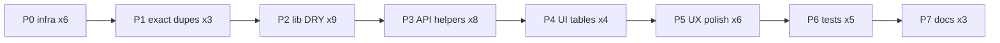

# Полный аудит проекта: code review и DRY-рефакторинг

## Контекст

Трёхконтекстная модель: `public` / `platform` / `api` → `lib/`. ~470 TS/TSX, 47 API routes.

**Принцип микро-фаз:** одна ветка = один атомарный diff (1–5 файлов). Каждая фаза заканчивается `typecheck + lint + build` (+ релевантный test/smoke).



---

## Резюме аудита (кратко)

| Область | Оценка | Главная проблема |
|---------|--------|------------------|
| Архитектура | Хорошо | public/platform/api/lib соблюдается |
| `lib/` | Средне | guards, upsert, notification fan-out |
| `app/api/` | Слабо | ~70× handleApiError без обёрток |
| `components/` | Средне | selection tables, skeleton flash |
| Тесты | Критично | 2 файла, нет CI |
| Infra/docs | Критично | migrations, env, README |

---

# Микро-фазы с diff

---

## P0 — Инфра-блокеры

### P0.1 — Prisma migrations в git

**Ветка:** `fstec/audit-p0-1-migrations`

| Файл | Δ |
|------|---|
| `prisma/migrations/20260621104500_measure_imports/migration.sql` | **add** (track) |
| `prisma/migrations/20260621120000_email_contacts_workflow/migration.sql` | **add** (track) |
| `README.md` | **+3 строки** в Quick Start: `npm run db:migrate && npm run db:generate`, restart dev |

**Diff (README):**
```diff
 ## Quick start
+После клонирования или pull с новыми миграциями:
+`npm run db:migrate && npm run db:generate` — затем перезапустить dev-сервер.
```

**DoD:** `git status` показывает migrations tracked; `prisma migrate status` = up to date.

**Verify:** `npm run typecheck && npm run build`

---

### P0.2 — TARGETS_CONFLICT → 400

**Ветка:** `fstec/audit-p0-2-targets-conflict`

| Файл | Δ |
|------|---|
| `lib/api/errors.ts` | **+4 строки** после `INVALID_TARGETS` block |
| `lib/orders/__tests__/batch-targets.test.ts` | **+8 строк** assert error message mapping (optional inline test) |

**Diff (`lib/api/errors.ts`):**
```diff
     if (error.message === "INVALID_TARGETS") {
       return jsonError("Некорректный список получателей поручения", 400)
     }
+    if (error.message === "TARGETS_CONFLICT") {
+      return jsonError(
+        "Нельзя выбрать организацию и её подразделение одновременно",
+        400
+      )
+    }
```

**DoD:** POST `/api/orders/batch` с org+sub conflict → 400, не 500.

**Verify:** `npm run test:batch-targets && npm run typecheck`

---

### P0.3 — `.env.production.example` в git

**Ветка:** `fstec/audit-p0-3-env-prod`

| Файл | Δ |
|------|---|
| `.gitignore` | **+1 строка** |
| `.env.production.example` | **new** (~40 строк, copy from `.env.example` + prod defaults) |

**Diff (`.gitignore`):**
```diff
 .env*
 !.env.example
+!.env.production.example
```

**Diff (`.env.production.example` — добавить vars отсутствующие сейчас):**
```diff
+# Email / notifications
+SMTP_HOST=
+SMTP_PORT=587
+SMTP_USER=
+SMTP_PASS=
+SMTP_FROM=
+APP_URL=https://example.com
+OPERATOR_NOTIFY_EMAIL=
+
+# Cron
+CRON_SECRET=
+
+# IMAP inbox import
+INBOX_IMAP_HOST=
+INBOX_IMAP_PORT=993
+INBOX_IMAP_USER=
+INBOX_IMAP_PASS=
+INBOX_IMAP_TLS=true
```

**DoD:** `git check-ignore -v .env.production.example` → not ignored.

**Verify:** `npm run typecheck`

---

### P0.4 — Umbrella `npm test`

**Ветка:** `fstec/audit-p0-4-npm-test`

| Файл | Δ |
|------|---|
| `package.json` | **+2 строки** в scripts |

**Diff:**
```diff
     "test:parse-docx": "tsx lib/measure-imports/__tests__/parse-docx.test.ts",
     "test:batch-targets": "tsx lib/orders/__tests__/batch-targets.test.ts",
+    "test": "npm run test:parse-docx && npm run test:batch-targets",
```

**DoD:** `npm test` exit 0.

---

### P0.5 — GitHub Actions CI

**Ветка:** `fstec/audit-p0-5-ci`

| Файл | Δ |
|------|---|
| `.github/workflows/ci.yml` | **new** (~35 строк) |

**Diff (новый файл):**
```yaml
name: CI
on: [push, pull_request]
jobs:
  verify:
    runs-on: ubuntu-latest
    steps:
      - uses: actions/checkout@v4
      - uses: actions/setup-node@v4
        with: { node-version: 20, cache: npm }
      - run: npm ci
      - run: npm run typecheck
      - run: npm run lint
      - run: npm run test
      - run: npm run build
        env:
          DATABASE_URL: postgresql://ci:ci@localhost:5432/ci
          SESSION_SECRET: ci-session-secret-min-32-chars-long
          S3_ENDPOINT: http://localhost:9000
          S3_ACCESS_KEY: ci
          S3_SECRET_KEY: ci-secret-key
          S3_BUCKET: ci
```

**DoD:** workflow green on PR.

**Verify:** push branch, check Actions tab.

---

### P0.6 — DOCX fixtures в git

**Ветка:** `fstec/audit-p0-6-fixtures`

| Файл | Δ |
|------|---|
| `.gitignore` | **+2 строки** whitelist |
| `.external/docx_examples/*.docx` | **add** (3 файла) |

**Diff (`.gitignore`):**
```diff
 .external/*
+!.external/docx_examples/
+!.external/docx_examples/**
```

**DoD:** clean clone → `npm run test:parse-docx` pass.

---

## P1 — Exact duplicates

### P1.1 — `ensurePortalLink` extraction

**Ветка:** `fstec/audit-p1-1-ensure-portal-link`

| Файл | Δ |
|------|---|
| `lib/access-links/ensure-portal-link.ts` | **new** (~20 строк) |
| `lib/access-links/index.ts` | **+1 export** |
| `lib/notifications/order-assigned.ts` | **−14 строк** local fn, **+1 import** |
| `lib/notifications/response-reviewed.ts` | **−14 строк** |
| `lib/notifications/due-reminders.ts` | **−14 строк** |

**Diff (new `ensure-portal-link.ts`):**
```ts
export async function ensurePortalLink(input: {
  organizationId: number
  subdivisionId: number | null
}) {
  if (input.subdivisionId != null) {
    const existing = await getActiveSubdivisionLink(input.subdivisionId)
    if (existing) return existing
    return createSubdivisionAccessLink(input.subdivisionId)
  }
  const existing = await getActiveOrgLink(input.organizationId)
  if (existing) return existing
  return createOrganizationAccessLink(input.organizationId)
}
```

**DoD:** 3 notification modules import from `@/lib/access-links`; no local `ensurePortalLink`.

**Verify:** `npm run typecheck && npm run build`

---

### P1.2 — Unified contact `[contactId]` route

**Ветка:** `fstec/audit-p1-2-contact-route`

| Файл | Δ |
|------|---|
| `app/api/contacts/[contactId]/route.ts` | **new** (move logic here) |
| `app/api/organizations/[id]/contacts/[contactId]/route.ts` | **replace** → re-export |
| `app/api/subdivisions/[id]/contacts/[contactId]/route.ts` | **replace** → re-export |

**Diff (re-export wrapper, ~3 строки каждый):**
```ts
export { PATCH, DELETE } from "@/app/api/contacts/[contactId]/route"
```

**Diff (new route — убрать unused `id` param concern):**
```diff
-type RouteContext = { params: Promise<{ id: string; contactId: string }> }
+type RouteContext = { params: Promise<{ contactId: string }> }
```

**DoD:** PATCH/DELETE работают на обоих legacy paths и новом `/api/contacts/:id`.

**Verify:** curl PATCH org contact + subdivision contact.

---

### P1.3 — Dead Route helpers

**Ветка:** `fstec/audit-p1-3-dead-helpers`

| Файл | Δ |
|------|---|
| `lib/responses/handle-submit-response.ts` | **−12 строк** `handleSubmitOrderItemResponseRoute` |
| `lib/access-links/revoke-from-request.ts` | **−8 строк** `revokeAccessLinkFromRequestRoute` |

**Diff:** удалить экспорт + функцию; grep подтверждает 0 imports.

**DoD:** `grep -r handleSubmitOrderItemResponseRoute` → 0 (кроме плана).

**Verify:** `npm run typecheck`

---

## P2 — lib/ domain DRY

### P2.1 — `listContacts()`

**Ветка:** `fstec/audit-p2-1-list-contacts`

| Файл | Δ |
|------|---|
| `lib/contacts/index.ts` | **+8 строк** fn, **~6 строк** refactor wrappers |

**Diff:**
```diff
+export function listContacts(input: {
+  organizationId?: number
+  subdivisionId?: number | null
+}) {
+  const where =
+    input.subdivisionId != null
+      ? { subdivisionId: input.subdivisionId }
+      : { organizationId: input.organizationId!, subdivisionId: null }
+  return prisma.contactPerson.findMany({
+    where,
+    orderBy: [{ role: "asc" }, { fullName: "asc" }],
+  })
+}
+
 export function listOrganizationContacts(organizationId: number) {
-  return prisma.contactPerson.findMany({ ... })
+  return listContacts({ organizationId })
 }
 export function listSubdivisionContacts(subdivisionId: number) {
-  return prisma.contactPerson.findMany({ ... })
+  return listContacts({ subdivisionId })
 }
```

**DoD:** behavior unchanged; 2 thin wrappers сохранены (backward compat).

---

### P2.2 — `assertImportEditableStatus()`

**Ветка:** `fstec/audit-p2-2-import-status`

| Файл | Δ |
|------|---|
| `lib/measure-imports/status.ts` | **new** (~10 строк) |
| `lib/measure-imports/commit.ts` | **−3 строки** if-block → call |
| `lib/measure-imports/index.ts` | **−3 строки** в `updateMeasureImportItems` |
| `lib/orders/batch-create.ts` | **−4 строки** → call + throw |

**Diff (new):**
```ts
export function assertImportEditableStatus(status: string) {
  if (status !== "PARSED" && status !== "IMPORTED") {
    throw new Error("IMPORT_INVALID_STATUS")
  }
}
```

**DoD:** grep `PARSED.*IMPORTED` → только в `status.ts`.

---

### P2.3 — `serializeMeasureImports`

**Ветка:** `fstec/audit-p2-3-serialize-imports`

| Файл | Δ |
|------|---|
| `lib/serialize/panel.ts` | **+25 строк** 2 fns |
| `app/(platform)/panel/measures/imports/page.tsx` | **−12 строк** manual map |
| `app/(platform)/panel/measures/imports/[id]/page.tsx` | **−18 строк** manual map |

**Diff (`panel.ts`):**
```ts
export function serializeMeasureImport(row: MeasureImportRow) {
  return { ...row, createdAt: row.createdAt.toISOString(), ... }
}
export function serializeMeasureImportDetail(row: MeasureImportDetailRow) { ... }
```

**DoD:** pages import from `@/lib/serialize/panel`.

---

### P2.4 — Move `batchCreateOrdersSchema`

**Ветка:** `fstec/audit-p2-4-batch-schema`

| Файл | Δ |
|------|---|
| `lib/validations/measure-imports.ts` | **−10 строк** (cut schema) |
| `lib/validations/orders.ts` | **+10 строк** (paste schema) |
| `app/api/orders/batch/route.ts` | **1 import** path change |
| `components/platform/order-create-client.tsx` | **1 import** if typed from validations |

**Diff:**
```diff
-import { batchCreateOrdersSchema } from "@/lib/validations/measure-imports"
+import { batchCreateOrdersSchema } from "@/lib/validations/orders"
```

---

### P2.5 — `RESPONSE_REVIEW_INCLUDE`

**Ветка:** `fstec/audit-p2-5-review-include`

| Файл | Δ |
|------|---|
| `lib/responses/review-response.ts` | **+15 строк** const, **−30 строк** duplicated includes |

**Diff:**
```diff
+const RESPONSE_REVIEW_INCLUDE = {
+  orderItem: { include: { order: { select: { ... } } } },
+  attachments: true,
+} as const
+
 // accept branch:
-  include: { orderItem: { ... huge tree ... } }
+  include: RESPONSE_REVIEW_INCLUDE
 // reject branch: same
```

---

### P2.6 — `findOrderItem()`

**Ветка:** `fstec/audit-p2-6-find-order-item`

| Файл | Δ |
|------|---|
| `lib/orders/find-order-item.ts` | **new** (~12 строк) |
| `lib/orders/index.ts` | **−20 строк** 3× findFirst → call |

**Diff:**
```ts
export function findOrderItem<T extends Prisma.OrderItemInclude>(
  orderId: number,
  itemId: number,
  include: T
) {
  return prisma.orderItem.findFirst({ where: { id: itemId, orderId }, include })
}
```

---

### P2.7 — `upsertMeasureFromImportItem()`

**Ветка:** `fstec/audit-p2-7-upsert-measure`

| Файл | Δ |
|------|---|
| `lib/measures/upsert-from-import.ts` | **new** (~35 строк) |
| `lib/measure-imports/commit.ts` | **−25 строк** loop body → call |

**Diff (commit.ts loop):**
```diff
       if (measureId == null) {
-        const existing = item.code != null ? await tx.measure.findFirst(...) : null
-        if (existing) { ... update ... } else { ... create ... }
+        measureId = (await upsertMeasureFromImportItem(item, importId, createdById, tx)).id
       }
```

---

### P2.8 — `buildOrderItemsCreate()`

**Ветка:** `fstec/audit-p2-8-order-items`

| Файл | Δ |
|------|---|
| `lib/orders/build-order-items.ts` | **new** (~15 строк) |
| `lib/orders/index.ts` | **−8 строк** |
| `lib/orders/batch-create.ts` | **−8 строк** |

---

### P2.9 — `sendToContacts()`

**Ветка:** `fstec/audit-p2-9-send-to-contacts`

| Файл | Δ |
|------|---|
| `lib/notifications/send-to-contacts.ts` | **new** (~25 строк) |
| `lib/notifications/order-assigned.ts` | **−10 строк** loop |
| `lib/notifications/response-reviewed.ts` | **−10 строк** |
| `lib/notifications/due-reminders.ts` | **−12 строк** |

**Diff (pattern):**
```diff
-for (const contact of contacts) {
-  await sendEmail({ to: contact.email, ... })
-}
+await sendToContacts(contacts, (c) => orderAssignedTemplate({ ... contact: c }))
```

---

## P3 — API helpers (инкрементально)

### P3.1 — `route-handler.ts` core

**Ветка:** `fstec/audit-p3-1-route-handler`

| Файл | Δ |
|------|---|
| `lib/api/route-handler.ts` | **new** (~30 строк) |

**Diff (new file):**
```ts
export function parseRouteId(raw: string): number {
  const id = Number(raw)
  if (Number.isNaN(id)) throw new Error("NOT_FOUND")
  return id
}

export function parseOptionalIntParam(raw: string | string[] | undefined): number | undefined {
  if (raw == null || Array.isArray(raw)) return undefined
  const n = Number(raw)
  return Number.isNaN(n) ? undefined : n
}
```

**DoD:** файл создан, 0 consumers yet — safe merge.

---

### P3.2 — `cronRoute()` + 2 routes

**Ветка:** `fstec/audit-p3-2-cron-route`

| Файл | Δ |
|------|---|
| `lib/api/route-handler.ts` | **+10 строк** |
| `app/api/cron/due-reminders/route.ts` | **−8 строк** → 1 liner |
| `app/api/cron/mail-inbox/route.ts` | **−8 строк** |

**Diff (route):**
```diff
-import { handleApiError, jsonOk } from "@/lib/api/errors"
-import { assertCronSecret } from "@/lib/cron/auth"
-import { sendDueReminders } from "@/lib/notifications/due-reminders"
-
-export async function POST(request: Request) {
-  try { assertCronSecret(request); ... } catch ...
-}
+export const POST = cronRoute(sendDueReminders)
```

---

### P3.3 — `parseRouteId` в measure-import routes

**Ветка:** `fstec/audit-p3-3-import-routes`

| Файл | Δ |
|------|---|
| 6× `app/api/measure-imports/[id]/**/route.ts` | **−2 строки** each, **+1 import** |

**Diff (each handler):**
```diff
-    const importId = Number(id)
-    if (Number.isNaN(importId)) return handleApiError(new Error("NOT_FOUND"))
+    const importId = parseRouteId(id)
```

**Files:** `[id]/route.ts`, `parse/route.ts`, `commit/route.ts`, `download/route.ts`, `items/route.ts` (×2 handlers).

---

### P3.4 — Contact collection shared handlers

**Ветка:** `fstec/audit-p3-4-contact-routes`

| Файл | Δ |
|------|---|
| `lib/contacts/route-handlers.ts` | **new** (~40 строк) |
| `app/api/organizations/[id]/contacts/route.ts` | **−25 строк** |
| `app/api/subdivisions/[id]/contacts/route.ts` | **−25 строк** |

**Diff:** factory `createContactCollectionHandlers(scope: "org" | "subdivision")` returning GET/POST.

---

### P3.5 — `queueNotification()`

**Ветка:** `fstec/audit-p3-5-queue-notification`

| Файл | Δ |
|------|---|
| `lib/notifications/queue.ts` | **new** (~8 строк) |
| `app/api/orders/[id]/items/[itemId]/responses/route.ts` | **−4 строки** |
| `app/api/public/[token]/items/[id]/responses/route.ts` | **−4 строки** |
| `app/api/responses/route.ts` | **−4 строки** |

**Diff:**
```diff
-void import("@/lib/notifications/response-submitted").then((m) =>
-  m.notifyResponseSubmitted(id).catch(console.error)
-)
+queueNotification(() => notifyResponseSubmitted(id))
```

---

### P3.6 — `guardPublicOrderItemWrite()`

**Ветка:** `fstec/audit-p3-6-public-guard`

| Файл | Δ |
|------|---|
| `lib/public/guard-order-item-write.ts` | **new** (~20 строк) |
| 4× `app/api/public/[token]/items/[id]/*/route.ts` | **−6 строк** each |

**Covers:** `status`, `delays`, `responses`, `attachments/presign`.

---

### P3.7 — Presign single error boundary

**Ветка:** `fstec/audit-p3-7-presign`

| Файл | Δ |
|------|---|
| `lib/attachments/presign-handler.ts` | **−6 строк** inner try/catch |
| `app/api/orders/[id]/items/[itemId]/attachments/presign/route.ts` | keep outer try/catch |
| `app/api/public/[token]/items/[id]/attachments/presign/route.ts` | keep outer try/catch |

**Diff (presign-handler):** remove try/catch wrapper; let errors bubble to route.

---

### P3.8 — `parseOptionalIntParam` в pages

**Ветка:** `fstec/audit-p3-8-import-id-pages`

| Файл | Δ |
|------|---|
| `app/(platform)/panel/orders/page.tsx` | **−4 строки** |
| `app/(platform)/panel/orders/new/page.tsx` | **−4 строки** |

**Diff:**
```diff
-  const importIdRaw = searchParams?.importId
-  const importId =
-    importIdRaw != null && !Number.isNaN(Number(importIdRaw))
-      ? Number(importIdRaw)
-      : undefined
+  const importId = parseOptionalIntParam(searchParams?.importId)
```

---

## P4 — UI tables DRY

### P4.1 — Selectable table helpers

**Ветка:** `fstec/audit-p4-1-selectable-helpers`

| Файл | Δ |
|------|---|
| `lib/data-table/selectable-table-helpers.ts` | **new** (~25 строк) |
| `components/platform/selectable-bulk-actions.tsx` | **new** (~30 строк) |

**Extract from measure-select-table:**
- `selectAllFiltered()`
- `toggleIdInSet()`
- `SelectableBulkActions` toolbar JSX

---

### P4.2 — Refactor selection tables

**Ветка:** `fstec/audit-p4-2-select-tables`

| Файл | Δ |
|------|---|
| `components/platform/measure-select-table.tsx` | **−40 строк** |
| `components/platform/batch-target-select-table.tsx` | **−40 строк** |

**Diff:** import helpers; keep column defs local (different accessors).

**DoD:** visual check `/panel/orders/new` — checkbox, bulk select, row highlight OK.

---

### P4.3 — Order-item table factory

**Ветка:** `fstec/audit-p4-3-order-item-factory`

| Файл | Δ |
|------|---|
| `components/platform/order-item-scoped-table-section.tsx` | **new** (~35 строк) |
| `components/platform/responses-table-section.tsx` | **−15 строк** |
| `components/platform/delay-requests-table-section.tsx` | **−15 строк** |

**Diff (sections become):**
```tsx
<OrderItemScopedTableSection
  listFn={listResponses}
  serializer={serializeResponses}
  Table={ResponsesTable}
/>
```

Tables themselves stay separate (different columns beyond shared context cols).

---

### P4.4 — `StaticCrudTable` shell

**Ветка:** `fstec/audit-p4-4-static-crud`

| Файл | Δ |
|------|---|
| `components/platform/crud/static-crud-table.tsx` | **new** (~40 строк) |
| `components/platform/org-contacts-panel.tsx` | **−20 строк** shell |
| `components/platform/org-links-panel.tsx` | **−20 строк** shell |

**Extract:** `DataTableShell` + `Table` + empty state + loading row pattern.

---

## P5 — UX polish

### P5.1 — `TableOnlySkeleton`

**Ветка:** `fstec/audit-p5-1-table-only-skeleton`

| Файл | Δ |
|------|---|
| `components/shared/skeletons/table-only-skeleton.tsx` | **new** (~15 строк) |
| `components/shared/skeletons/index.ts` | **+1 export** |

**Diff:** copy `TablePageSkeleton` minus `PageHeaderSkeleton`:
```tsx
export function TableOnlySkeleton({ columns, rows }) {
  return (
    <DataTableShell toolbar={<TableToolbarSkeleton />}>
      <TableSkeleton columns={columns} rows={rows} />
    </DataTableShell>
  )
}
```

---

### P5.2 — Suspense fallbacks fix (double header)

**Ветка:** `fstec/audit-p5-2-suspense-fallbacks`

| Файл | Δ |
|------|---|
| `app/(platform)/panel/orders/page.tsx` | **1 import** |
| `app/(platform)/panel/measures/page.tsx` | **1 import** |
| `app/(platform)/panel/measures/imports/page.tsx` | **1 import** |
| `components/platform/responses-table-section.tsx` | **1 import** |
| `components/platform/delay-requests-table-section.tsx` | **1 import** |

**Diff (each):**
```diff
-<Suspense fallback={<TablePageSkeleton />}>
+<Suspense fallback={<TableOnlySkeleton />}>
```

**DoD:** list pages — no double header flash during load.

---

### P5.3 — Import loaders → RouteSkeleton

**Ветка:** `fstec/audit-p5-3-import-loaders`

| Файл | Δ |
|------|---|
| `app/(platform)/panel/measures/imports/loading.tsx` | **rewrite** 3 lines |
| `app/(platform)/panel/measures/imports/new/loading.tsx` | **rewrite** |
| `app/(platform)/panel/measures/imports/[id]/loading.tsx` | **rewrite** variant |

**Diff:**
```diff
-import { TablePageSkeleton } from "@/components/shared/skeletons/table-page-skeleton"
-export default function Loading() {
-  return <TablePageSkeleton />
-}
+import { RouteSkeleton } from "@/components/shared/skeletons/route-skeleton"
+export default function Loading() {
+  return <RouteSkeleton variant="table" />
+}
```

`[id]/loading.tsx`: consider new `RouteSkeleton variant="import-detail"` or `form fields={4}`.

---

### P5.4 — Breadcrumb migration

**Ветка:** `fstec/audit-p5-4-breadcrumbs`

| Файл | Δ |
|------|---|
| `components/platform/order-detail-client.tsx` | **1 import** |
| `components/platform/delay-request-detail-client.tsx` | **1 import** |
| `components/platform/org-detail-client.tsx` | **1 import** |
| `components/platform/response-detail-client.tsx` | **2 imports** |
| `components/platform/org-breadcrumb.tsx` | **1 import** |

**Diff (each):**
```diff
-import { useAdminBreadcrumbLabel } from "@/components/platform/platform-breadcrumb"
+import { usePlatformBreadcrumbLabel } from "@/components/platform/platform-breadcrumb"
```

**Follow-up (optional P5.4b):** remove `@deprecated` aliases from `platform-breadcrumb.tsx` when grep = 0.

---

### P5.5 — Import detail header merge

**Ветка:** `fstec/audit-p5-5-import-header`

| Файл | Δ |
|------|---|
| `app/(platform)/panel/measures/imports/[id]/page.tsx` | **+actions slot** pass props |
| `components/platform/measure-import-detail-client.tsx` | **−30 строк** duplicate title/badges block |

**Approach:** page renders `PageHeader` with title; client receives `showActions` only for buttons (parse/commit/delete/download). Badges move to `PageHeader` metadata or single `ImportStatusBar` component.

---

### P5.6 — TruncatedCell import unify

**Ветка:** `fstec/audit-p5-6-truncated-cell`

| Файл | Δ |
|------|---|
| `lib/data-table/truncated-cell.tsx` | **delete** |
| ~4 files importing from `truncated-cell` | **import path** → `text-cell` |

**Diff:**
```diff
-import { TruncatedCell } from "@/lib/data-table/truncated-cell"
+import { TruncatedCell } from "@/lib/data-table/text-cell"
```

---

## P6 — Tests

### P6.1 — Vitest setup

**Ветка:** `fstec/audit-p6-1-vitest`

| Файл | Δ |
|------|---|
| `vitest.config.ts` | **new** |
| `package.json` | **+devDep vitest**, **+script** `test:unit` |
| `package.json` | update `test` script chain |

**Diff:**
```diff
+    "test:unit": "vitest run",
+    "test": "npm run test:unit && npm run test:parse-docx && npm run test:batch-targets",
```

---

### P6.2 — batch-create tests

**Ветка:** `fstec/audit-p6-2-test-batch-create`

| Файл | Δ |
|------|---|
| `lib/orders/__tests__/batch-create.test.ts` | **new** (~60 строк) |

**Cases:** TARGETS_CONFLICT throw, INVALID_TARGETS, empty measures, mock prisma.

---

### P6.3 — commit tests

**Ветка:** `fstec/audit-p6-3-test-commit`

| Файл | Δ |
|------|---|
| `lib/measure-imports/__tests__/commit.test.ts` | **new** (~80 строк) |

**Cases:** IMPORT_INVALID_STATUS, NO_ITEMS, upsert by code.

---

### P6.4 — contacts tests

**Ветка:** `fstec/audit-p6-4-test-contacts`

| Файл | Δ |
|------|---|
| `lib/contacts/__tests__/contacts.test.ts` | **new** (~50 строк) |

**Cases:** PRIMARY_CONTACT_EXISTS on duplicate primary.

---

### P6.5 — CI vitest

**Ветка:** `fstec/audit-p6-5-ci-vitest`

| Файл | Δ |
|------|---|
| `.github/workflows/ci.yml` | **ensure** `npm test` runs vitest |

**DoD:** CI green with all test suites.

---

## P7 — Docs

### P7.1 — README

**Ветка:** `fstec/audit-p7-1-readme`

| Файл | Δ |
|------|---|
| `README.md` | **~80 строк** changed |

**Sections to update:**
- API table: +measure-imports (6), +orders/batch, +contacts (4), +cron (2) → total 47
- Quick start: `docker compose up -d db redis minio mailpit`
- `lib/` modules: +contacts, email, notifications, measure-imports, mail-inbox, cron
- Env table: SMTP_*, CRON_SECRET, INBOX_IMAP_*, APP_URL

---

### P7.2 — AGENTS.md

**Ветка:** `fstec/audit-p7-2-agents`

| Файл | Δ |
|------|---|
| `AGENTS.md` | **~15 строк** |

**Diff (verify block):**
```diff
 npm run typecheck
 npm run lint
+npm run test
 npm run build
+
+После `prisma migrate dev` — `npm run db:generate` и restart dev-сервера.
```

**Diff (lib domain list):** +contacts, email, notifications, measure-imports, mail-inbox, cron.

---

### P7.3 — deployment.md

**Ветка:** `fstec/audit-p7-3-deployment`

| Файл | Δ |
|------|---|
| `docs/deployment.md` | **~30 строк** |

**Add:** cron scheduling options (systemd timer / k8s CronJob example), cross-ref to `.env.production.example` vars.

---

## Карта зависимостей микро-фаз

```mermaid
flowchart TD
  P0_1[P0.1 migrations] --> P0_2[P0.2 TARGETS_CONFLICT]
  P0_2 --> P0_3[P0.3 env prod]
  P0_3 --> P0_4[P0.4 npm test]
  P0_4 --> P0_5[P0.5 CI]
  P0_5 --> P0_6[P0.6 fixtures]

  P0_6 --> P1_1[P1.1 ensurePortalLink]
  P1_1 --> P1_2[P1.2 contact route]
  P1_2 --> P1_3[P1.3 dead helpers]

  P1_3 --> P2_1[P2.1 listContacts]
  P2_1 --> P2_2[P2.2 import status]
  P2_2 --> P2_3[P2.3 serialize]
  P2_3 --> P2_4[P2.4 batch schema]
  P2_4 --> P2_5[P2.5 review include]
  P2_5 --> P2_6[P2.6 findOrderItem]
  P2_6 --> P2_7[P2.7 upsert measure]
  P2_7 --> P2_8[P2.8 order items]
  P2_8 --> P2_9[P2.9 sendToContacts]

  P2_9 --> P3_1[P3.1 route-handler core]
  P3_1 --> P3_2[P3.2 cron]
  P3_2 --> P3_3[P3.3 import routes]
  P3_3 --> P3_4[P3.4 contact routes]
  P3_4 --> P3_5[P3.5 queue notification]
  P3_5 --> P3_6[P3.6 public guard]
  P3_6 --> P3_7[P3.7 presign]
  P3_7 --> P3_8[P3.8 importId pages]

  P3_8 --> P4_1[P4.1 selectable helpers]
  P4_1 --> P4_2[P4.2 select tables]
  P4_2 --> P4_3[P4.3 order-item factory]
  P4_3 --> P4_4[P4.4 static crud]

  P4_4 --> P5_1[P5.1 TableOnlySkeleton]
  P5_1 --> P5_2[P5.2 suspense fix]
  P5_2 --> P5_3[P5.3 import loaders]
  P5_3 --> P5_4[P5.4 breadcrumbs]
  P5_4 --> P5_5[P5.5 import header]
  P5_5 --> P5_6[P5.6 truncated cell]

  P5_6 --> P6_1[P6.1 vitest]
  P6_1 --> P6_2[P6.2 batch tests]
  P6_2 --> P6_3[P6.3 commit tests]
  P6_3 --> P6_4[P6.4 contacts tests]
  P6_4 --> P6_5[P6.5 CI vitest]

  P6_5 --> P7_1[P7.1 README]
  P7_1 --> P7_2[P7.2 AGENTS]
  P7_2 --> P7_3[P7.3 deployment]
```



**Параллелизация (независимые ветки после P0):**
- P1.1 ‖ P2.1 (разные lib модули)
- P4.* ‖ P5.1–P5.3 (UI, разные файлы)
- P7.* можно начать после P0.3 (docs не блокируют код)

---

## Риски (без изменений)

- API migration — регрессии RBAC → migrate по доменам (P3.3 → P3.4 → P3.5)
- UI table unification — manual test `/panel/orders/new`
- Legacy contact paths — P1.2 сохраняет re-export wrappers
- Motion WIP — commit отдельно до P4/P5

---

## Ожидаемый результат (38 микро-PR)

- ~150–200 строк удалённого дублирования
- 38 атомарных mergeable PR
- CI: typecheck + lint + test + build
- Clean clone onboarding работает
