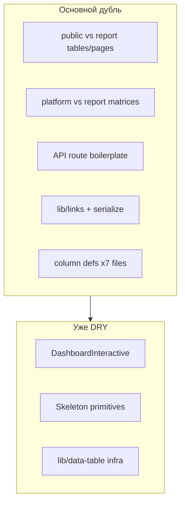

# Полный DRY-аудит FSTEC

## Текущее состояние

Миграция **admin → platform** уже выполнена ([`.cursor/plans/platform_dry_master_plan_dd36a828.plan.md`](.cursor/plans/platform_dry_master_plan_dd36a828.plan.md), Phase 29–30). Деревьев `components/admin/` и `app/(admin)/` **нет**. Канонический контекст — [`AGENTS.md`](AGENTS.md): `platform` (`/panel/*`), `public` (`/p/[token]`), `api`, `lib`.

Частичный DRY уже сделан:
- [`components/dashboard/dashboard-interactive.tsx`](components/dashboard/dashboard-interactive.tsx) — единая точка для admin/public/report
- [`components/shared/skeletons/*`](components/shared/skeletons/) — примитивы скелетонов
- [`lib/data-table/*`](lib/data-table/) — `TextCell`, `TableHeaderText`, `column-meta`, `column-width`
- [`components/shared/page-header.tsx`](components/shared/page-header.tsx), `form-actions-bar`, `share-link-actions`



---

## Карта дублирования (по приоритету)

| Приоритет | Область | Файлы | Оценка дубля |
|-----------|---------|-------|--------------|
| **P0** | Dashboard matrix | [`admin-dashboard-matrix.tsx`](components/platform/admin-dashboard-matrix.tsx) + [`report-dashboard-matrix.tsx`](components/report/report-dashboard-matrix.tsx) | ~98% |
| **P0** | `MatrixItem` type | 6 inline-типов в dashboard/matrix | 100% дубль типа |
| **P0** | lib/links | [`lib/access-links`](lib/access-links/index.ts), [`lib/report-links`](lib/report-links/index.ts), [`lib/public/validate-token.ts`](lib/public/validate-token.ts) | token gen + isActive x3 |
| **P1** | Measures table | [`public-measures-table.tsx`](components/public/public-measures-table.tsx) + [`report-measures-table.tsx`](components/report/report-measures-table.tsx) | ~85% |
| **P1** | Dashboard page shell | [`dashboard-page-shell.tsx`](components/dashboard/dashboard-page-shell.tsx), [`public-dashboard-page.tsx`](components/public/public-dashboard-page.tsx), [`report-dashboard-page.tsx`](components/report/report-dashboard-page.tsx) | ~80% |
| **P1** | Report orders (мёртвый код + битые ссылки) | matrix/item-detail ссылаются на `/report/.../orders/...`, маршрутов нет | баг + 2 неиспользуемых файла |
| **P2** | Orders list | [`public-orders-list-page.tsx`](components/public/public-orders-list-page.tsx) + [`report-orders-list-page.tsx`](components/report/report-orders-list-page.tsx) | ~95% |
| **P2** | Order detail page | [`public-order-page.tsx`](components/public/public-order-page.tsx) + [`report-order-page.tsx`](components/report/report-order-page.tsx) | ~75% |
| **P2** | Platform delay/responses | [`delay-requests-table.tsx`](components/platform/delay-requests-table.tsx) + [`responses-table.tsx`](components/platform/responses-table.tsx) — org/order/measure колонки | ~50% |
| **P2** | Column factories | org/order/measure/due/status в 7+ таблицах | copy-paste |
| **P3** | API helpers | rate-limit (5 routes), Zod parse (13+ routes), attachment redirect (3 routes), revalidation blocks (16 routes) | boilerplate |
| **P3** | Item detail cards | [`public-item-detail.tsx`](components/public/public-item-detail.tsx) + [`report-item-detail.tsx`](components/report/report-item-detail.tsx) | ~45% read-only UI |
| **P4** | Legacy rename | `AdminDashboardMatrix`, `useAdminMe`, `AdminShell`, deprecated re-exports | naming debt |
| **P4** | Docs | `README.md`, `.cursor/plans/*` ссылаются на удалённые `admin` пути | stale |

---

## Фаза 1 — Foundation: типы и lib/links (низкий риск)

**Цель:** единый источник правды для dashboard-строк и токенов.

### 1.1 Унифицировать `MatrixItem`
- Удалить 6 локальных `type MatrixItem` в dashboard/matrix-файлах
- Импортировать [`SerializedMatrixItem`](lib/dashboard/serialize-dashboard.ts) (или re-export `DashboardMatrixRow`)
- Затронутые файлы: `dashboard-interactive.tsx`, `dashboard-page-shell.tsx`, `scoped-dashboard-view.tsx`, оба matrix-файла, `report-dashboard-page.tsx`

### 1.2 `lib/links/` — общие примитивы
Создать:
- `lib/links/generate-token.ts` — `randomBytes(32).toString("base64url")`
- `lib/links/is-active.ts` — `isRevocableLinkActive(link)` (объединяет `isAccessLinkActive` / `isLinkActive`)
- `lib/links/active-where.ts` — Prisma `where` для неотозванных/неистёкших ссылок

Обновить: `lib/access-links/index.ts`, `lib/report-links/index.ts`, `lib/public/validate-token.ts`, `lib/report-links/validate-token.ts`

### 1.3 Order item detail query
- `lib/order-items/fetch-detail.ts` с константой `ORDER_ITEM_DETAIL_INCLUDE`
- Заменить дубли в `getPublicOrderItem` и `getOrderItemForReportToken`

**DoD:** `npm run typecheck && npm run lint`

---

## Фаза 2 — Dashboard DRY (высокий ROI)

**Цель:** одна matrix, один page shell, один overdue-toggle.

### 2.1 `DashboardMatrixTable`
Новый файл: [`components/dashboard/dashboard-matrix-table.tsx`](components/dashboard/dashboard-matrix-table.tsx)

```ts
type LinkTargets = {
  organization: (orgId: number) => string
  order: (orderId: number) => string
  measure: (row: SerializedMatrixItem) => string
}
```

- [`admin-dashboard-matrix.tsx`](components/platform/admin-dashboard-matrix.tsx) → thin wrapper с `/panel/...` links
- [`report-dashboard-matrix.tsx`](components/report/report-dashboard-matrix.tsx) → thin wrapper с `/report/${token}/...` links
- Обновить [`scoped-dashboard-view.tsx`](components/dashboard/scoped-dashboard-view.tsx)

### 2.2 `OverdueFilterActions`
Новый: `components/dashboard/overdue-filter-actions.tsx` — кнопки «Все / Просроченные» (сейчас triplicated в 3 page shell)

### 2.3 `ScopedDashboardPageShell`
Расширить [`dashboard-page-shell.tsx`](components/dashboard/dashboard-page-shell.tsx):
- props: `variant`, `baseHref`, `title`, `description`, `overdueOnly`, `stats`, `items`, `emptyMessage`, `extraActions?`, `headerBadge?`
- [`public-dashboard-page.tsx`](components/public/public-dashboard-page.tsx) и [`report-dashboard-page.tsx`](components/report/report-dashboard-page.tsx) → thin wrappers или удалить и вызывать shell из route pages

**DoD:** сводки `/panel`, `/p/[token]`, `/report/[token]` — KPI, overdue toggle, matrix/charts работают

---

## Фаза 3 — Public/Report tables + report orders routes

**Цель:** унифицировать таблицы и **добавить недостающие report order-маршруты** (выбор пользователя).

### 3.1 `MeasuresDataTable`
Новый: `components/shared/measures-data-table.tsx` (или `lib/data-table/columns/measures-columns.ts` + table)

Props:
- `basePath: string` (`/p/${token}` | `/report/${token}`)
- `showOrderColumn?`, `columnFilters?`, `actionLabel?`

Заменить: `public-measures-table.tsx`, `report-measures-table.tsx` → re-export/wrapper

### 3.2 Orders list + detail
- `lib/data-table/columns/order-list-columns.ts` — `createOrderListColumns(href)`
- `components/shared/order-measures-page.tsx` — общий layout (PageHeader + badge + measures table)
- `components/shared/orders-list-page.tsx` — параметризованный список

### 3.3 Новые report routes
Добавить по аналогии с `/p/[token]/orders/`:
- `app/(public)/report/[token]/orders/page.tsx`
- `app/(public)/report/[token]/orders/[orderId]/page.tsx`
- `loading.tsx` для обоих (variant `public-table`)

Использовать unified components с `basePath=/report/${token}`.

**DoD:** ссылки из report matrix и item-detail на orders больше не 404; typecheck green

---

## Фаза 4 — Column factories (platform tables)

**Цель:** убрать copy-paste колонок org/order/measure/due/status.

Новая директория: `lib/data-table/columns/`

| Factory | Использование |
|---------|---------------|
| `createOrganizationColumn(href)` | orders-table, matrices, delay/responses |
| `createOrderColumn(href)` | measures tables, orders lists, matrices |
| `createMeasureColumn(href, opts?)` | measures, matrices, order-detail |
| `createCodeColumn()` | measures tables |
| `createDueAtColumn()` | measures, matrices, order-detail |
| `createWorkflowStatusColumn(getRow)` | measures, matrices |
| `createOrderItemContextColumns(getContext)` | delay-requests, responses |

Порядок миграции (по одной таблице, smoke после каждой):
1. `delay-requests-table` + `responses-table`
2. `orders-table`
3. `measures-table`
4. `order-detail-client` (только shared columns, CRUD-логика остаётся)

**Не унифицировать:** platform CRUD dialogs, delete hooks, form dialogs — остаются локальными.

---

## Фаза 5 — API layer DRY

**Цель:** меньше boilerplate, единые ошибки.

### 5.1 Новые helpers в `lib/api/`
| Helper | Заменяет |
|--------|----------|
| `getClientIp(request)` + `assertPublicRateLimit(request, token, scope)` | 5 public routes |
| `parseJsonBody(request, schema)` | 13+ routes с `safeParse(await request.json())` |
| `createAttachmentRedirectHandler(resolve)` | 3 attachment routes |
| `revalidatePanelOrder(orderId?)`, `revalidatePanelDashboard()` | 16 `revalidatePath` блоков |

### 5.2 Расширить [`handleApiError`](lib/api/errors.ts)
Добавить коды из [`users/[id]/route.ts`](app/api/users/[id]/route.ts) и [`account/route.ts`](app/api/account/route.ts): `LAST_SUPER_ADMIN`, `CANNOT_DELETE_SELF`, `USER_HAS_DATA` — убрать ручные catch-блоки с разными русскими строками.

### 5.3 Domain handlers (опционально в этой фазе)
- `lib/responses/handle-submit-response.ts` — public + panel response routes
- `lib/attachments/presign-handler.ts` — public + panel presign routes
- `lib/access-links/revoke-from-request.ts` — org + subdivision link DELETE

### 5.4 `withApiHandler` (P4, если останется время)
Обёртка try/catch — механическая экономия ~100 строк, низкий риск.

**DoD:** curl smokes для public write, panel CRUD, attachment redirect; typecheck + lint

---

## Фаза 6 — Cleanup и docs

### 6.1 Переименование legacy admin-имён
| Было | Стало |
|------|-------|
| `AdminDashboardMatrix` | `PlatformDashboardMatrix` |
| `AdminDashboardPageShell` | `DashboardPageShell` (или `ScopedDashboardPageShell`) |
| `useAdminMe` | удалить deprecated alias, обновить 4 импорта |
| `AdminShell` | удалить deprecated alias |
| `public-dashboard-interactive.tsx` | удалить re-export |
| `report-link-panel.tsx` | удалить re-export (если есть) |

### 6.2 Item detail shared cards
`components/shared/item-detail/`:
- `item-measure-info-card.tsx`
- `item-due-status-card.tsx`
- `item-detail-header-actions.tsx`

Public сохраняет form/delay/submit; report — read-only wrapper.

### 6.3 `ShareLinkActions` в report button
[`report-share-button.tsx`](components/report/report-share-button.tsx) — заменить inline copy на [`share-link-actions.tsx`](components/shared/share-link-actions.tsx)

### 6.4 Docs sync
- [`README.md`](README.md) — `/panel/*`, `app/(platform)/panel/`
- Удалить deprecated helpers: `getOrderItemForToken`, `validateAccessToken` (если нет callers)

### 6.5 Skeleton re-exports (опционально)
Объединить `table-page-skeleton` + `public-table-page-skeleton` через props `showBack?` / `showActions?`; оставить re-export aliases для совместимости.

**DoD:** `npm run typecheck && npm run lint && npm run build`

---

## Что НЕ унифицировать (осознанно)

- **Shells:** [`public-shell.tsx`](components/public/public-shell.tsx) (sidebar) vs [`report-shell.tsx`](components/report/report-shell.tsx) (minimal header) — разный UX
- **Public item detail** form logic — только read-only cards, не весь компонент
- **`order-detail-client.tsx`** admin-специфика (reports dropdown, delay counts) — только shared columns
- **Platform forms** — уже на `FormCardLayout` + `useCrudSubmit`; дубля между формами нет

---

## Порядок веток (Karpathy rhythm)

Каждая фаза — отдельная ветка `fstec/phase-NN-dry-*`, PR, critic, merge:

```
phase-31-dry-lib-links
phase-32-dry-dashboard
phase-33-dry-public-report-tables
phase-34-dry-column-factories
phase-35-dry-api-helpers
phase-36-dry-cleanup
```

Оценка: **~6 PR**, ~1200–1500 строк удалённого/объединённого кода.

---

## Верификация (каждая фаза)

```bash
npm run typecheck
npm run lint
npm run build
```

Ручные проверки:
- `/panel` — KPI click → table filter, matrix links
- `/p/dev-sber` — measures table, orders list, item detail
- `/report/[token]` — dashboard, **новые** orders routes, item detail
- API: public response submit, panel measure CRUD, attachment download (3 контекста)
