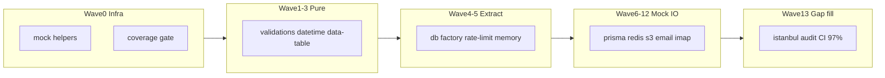

# 97%+ покрытие всего `lib/` — микро-шаги

## Текущее состояние

| Метрика | Значение |
|---|---|
| Test files | 19 |
| Test cases | 127 |
| Coverage (full `lib/`) | **13.5% lines** |
| Source files in `lib/` | ~137 (без `__tests__`) |

Цель: **97% lines / 90% branches** на `lib/**/*.ts` (включая Prisma CRUD, S3, SMTP, IMAP).

---

## Стратегия: маленький diff, повторяемые паттерны

### Правила каждого шага
- **1 test-файл** (или расширение существующего) на шаг
- **0–1 extract** ≤ 40 LOC только если без него mock невозможен
- **Не трогать** UI/components, API routes в `app/`
- После каждого шага: `npm run test:unit -- --coverage` — фиксировать % в PR description
- CI threshold **97%** включается только на **последнем шаге** (P13.2)

### Shared test infra (Wave 0)

Создать [`lib/__tests__/helpers/`](lib/__tests__/helpers/):

| Helper | Назначение |
|---|---|
| `mock-prisma.ts` | `createMockPrisma(delegates)`, `$transaction(cb => cb(mock))` |
| `mock-redis.ts` | in-memory Redis stub для `incr`/`expire` |
| `mock-s3.ts` | vi.mock `@aws-sdk/client-s3` + presigner |
| `mock-email.ts` | vi.mock `nodemailer` + prisma `emailDelivery` |
| `mock-imap.ts` | vi.mock `imapflow` minimal fetch |

Vitest [`vitest.config.ts`](vitest.config.ts):
- `setupFiles: ['lib/__tests__/helpers/vitest.setup.ts']` (reset env)
- `coverage.thresholds`: `{ lines: 97, branches: 90 }` — **только с P13.2**
- Зафиксировать `@vitest/coverage-v8@3.2.6` в [`package.json`](package.json)

---

## Wave 0 — Baseline (2 шага)

### P0.1 Mock helpers skeleton
- `lib/__tests__/helpers/mock-prisma.ts` — typed delegates: `organization`, `order`, `measure`, `contactPerson`, `measureImport`, `$transaction`
- `lib/__tests__/helpers/mock-redis.ts`
- Diff: ~80 LOC, 0 production changes

### P0.2 Coverage script + baseline report
- `npm run test:coverage` → `vitest run --coverage`
- README/AGENTS: как читать отчёт
- Зафиксировать baseline JSON в PR (не коммитить `coverage/`)

---

## Wave 1 — Добить уже начатое (4 шага, ~+8%)

| Step | Files | Action |
|---|---|---|
| P1.1 | [`api/errors.ts`](lib/api/errors.ts) | Добить все ветки `handleApiError` (~25 кодов) |
| P1.2 | [`api/route-handler.ts`](lib/api/route-handler.ts) | `cronRoute` с mock Request + `assertCronSecret` |
| P1.3 | [`data-table/selectable-table-helpers.ts`](lib/data-table/selectable-table-helpers.ts) | `selectAllFiltered` с mock `Table` |
| P1.4 | [`contacts/index.ts`](lib/contacts/index.ts) | `createContact`/`updateContact`/`deleteContact` — mock prisma + PRIMARY guard |

---

## Wave 2 — Pure helpers (6 шагов, ~+12%)

| Step | Test file | Sources |
|---|---|---|
| P2.1 | `lib/validations/__tests__/schemas.test.ts` | + `account`, `auth`, `measures`, `organizations`, `public`, `settings`, `users` |
| P2.2 | `lib/datetime/__tests__/datetime.test.ts` | [`format.ts`](lib/datetime/format.ts), [`timezones.ts`](lib/datetime/timezones.ts), [`filter-timezone.ts`](lib/datetime/filter-timezone.ts) |
| P2.3 | `lib/data-table/__tests__/column-helpers.test.ts` | `column-meta`, `column-visibility`, `column-width`, `sort-helpers` |
| P2.4 | `lib/data-table/__tests__/filter-helpers.test.ts` | `faceted-column`, `format-filter-value`, `columns/order-item-context-columns` |
| P2.5 | `lib/links/__tests__/links.test.ts` | [`active-where.ts`](lib/links/active-where.ts), [`generate-token.ts`](lib/links/generate-token.ts) |
| P2.6 | `lib/i18n/__tests__/locales.test.ts`, `lib/utils.test.ts` | [`locales.ts`](lib/i18n/locales.ts), [`utils.ts`](lib/utils.ts) |

---

## Wave 3 — Serialize + UI domain (4 шага, ~+10%)

| Step | Test file | Sources |
|---|---|---|
| P3.1 | `lib/serialize/__tests__/panel-core.test.ts` | `serializeForClient`, `serializeOrders`, `serializeMeasures` |
| P3.2 | `lib/serialize/__tests__/panel-entities.test.ts` | `serializeMeasureImports`, delays, responses, users |
| P3.3 | `lib/ui/__tests__/item-detail-display.test.ts` | [`item-detail-display.ts`](lib/ui/item-detail-display.ts), `delay-status`, `response-review-status`, `sidebar-brand` |
| P3.4 | `lib/public/__tests__/serialize-public.test.ts` | [`map-public-items.ts`](lib/public/map-public-items.ts), [`serialize-public.ts`](lib/public/serialize-public.ts) |

---

## Wave 4 — Dashboard + nav (4 шага, ~+8%)

| Step | Test file | Sources |
|---|---|---|
| P4.1 | `lib/dashboard/__tests__/stats.test.ts` | [`buildScopedStatsFromItems`](lib/dashboard/stats.ts) — fixtures с overdue/completed |
| P4.2 | `lib/dashboard/__tests__/chart-filters.test.ts` | [`chart-filters.ts`](lib/dashboard/chart-filters.ts), [`build-matrix.ts`](lib/dashboard/build-matrix.ts) |
| P4.3 | `lib/dashboard/__tests__/serialize-dashboard.test.ts` | `serialize-dashboard`, `interactive-props`, `link-targets`, `variant-config` |
| P4.4 | `lib/nav/__tests__/nav.test.ts` | `build-nav-orders`, `scoped-orders-config`, `platform-nav` permission filter |

---

## Wave 5 — Minimal extracts для тестируемости (3 шага, ~+5%)

| Step | Extract | Test |
|---|---|---|
| P5.1 | [`lib/db/prisma-factory.ts`](lib/db/prisma-factory.ts) ← `createPrismaClient`, `isStaleClient` из [`client.ts`](lib/db/client.ts) | `lib/db/__tests__/prisma-factory.test.ts` |
| P5.2 | [`lib/public/rate-limit-memory.ts`](lib/public/rate-limit-memory.ts) ← `checkRateLimitMemory` | `lib/public/__tests__/rate-limit.test.ts` (+ Redis path mock) |
| P5.3 | [`lib/cache/redis-config.ts`](lib/cache/redis-config.ts) ← TTL/env helpers из [`redis.ts`](lib/cache/redis.ts) | `lib/cache/__tests__/redis-config.test.ts` |

---

## Wave 6 — Auth cluster (4 шага, ~+7%)

| Step | Test | Mock |
|---|---|---|
| P6.1 | `lib/auth/__tests__/password.test.ts` | real bcrypt (fast) |
| P6.2 | `lib/auth/__tests__/platform-session.test.ts` | env vars |
| P6.3 | `lib/auth/providers/__tests__/providers.test.ts` | `local.ts` mock prisma+bcrypt; stubs AD/Keycloak status |
| P6.4 | `lib/auth/__tests__/session.test.ts` | mock `iron-session`, cookies, prisma user lookup |

---

## Wave 7 — Orders + measures (5 шагов, ~+10%)

| Step | Test | Notes |
|---|---|---|
| P7.1 | `lib/orders/__tests__/find-order-item.test.ts` | mock prisma `findFirst` |
| P7.2 | `lib/orders/__tests__/batch-create.test.ts` | mock `$transaction`, `getDefaultStatusId`, import status |
| P7.3 | `lib/orders/__tests__/index.test.ts` | `listOrders`, `createOrder`, `deleteOrder` |
| P7.4 | `lib/orders/__tests__/order-create-context.test.ts` | mock org/import loaders |
| P7.5 | `lib/measures/__tests__/index.test.ts` | CRUD + `MEASURE_IN_USE` guard |

---

## Wave 8 — Contacts + orgs + users + settings (5 шагов, ~+12%)

| Step | Test |
|---|---|
| P8.1 | `lib/contacts/__tests__/route-handlers.test.ts` | mock Request + auth + prisma |
| P8.2 | `lib/organizations/__tests__/index.test.ts` | CRUD + `ORG_HAS_ORDERS` |
| P8.3 | `lib/users/__tests__/index.test.ts` | create/update/delete + `LAST_SUPER_ADMIN`, `EMAIL_EXISTS` |
| P8.4 | `lib/settings/__tests__/index.test.ts` | get/set appSettings |
| P8.5 | `lib/delays/__tests__/index.test.ts` | list/approve/reject |

---

## Wave 9 — Responses + links (4 шага, ~+8%)

| Step | Test |
|---|---|
| P9.1 | `lib/responses/__tests__/submit-response.test.ts` | mock tx, attachments, status guards |
| P9.2 | `lib/responses/__tests__/review-response.test.ts` | approve/reject + `REVIEW_NOTE_REQUIRED` |
| P9.3 | `lib/responses/__tests__/index.test.ts` + `handle-submit-response.test.ts` | list + route parse |
| P9.4 | `lib/access-links/__tests__/index.test.ts`, `lib/report-links/__tests__/index.test.ts` | create/revoke/validate |

---

## Wave 10 — Measure imports + statuses (3 шага, ~+6%)

| Step | Test |
|---|---|
| P10.1 | `lib/measure-imports/__tests__/commit.test.ts` | mock tx + upsert + status |
| P10.2 | `lib/measure-imports/__tests__/index.test.ts` | upload pipeline mock S3 + prisma |
| P10.3 | `lib/statuses/__tests__/index.test.ts` | `getDefaultStatusId` mock cache/prisma |

---

## Wave 11 — Notifications + email (3 шага, ~+6%)

| Step | Test |
|---|---|
| P11.1 | `lib/notifications/__tests__/send-to-contacts.test.ts` | mock `sendEmail` |
| P11.2 | `lib/notifications/__tests__/templates.test.ts` | `order-assigned`, `response-submitted`, `response-reviewed`, `due-reminders` |
| P11.3 | `lib/email/__tests__/send.test.ts` + `templates.test.ts` | mock nodemailer + prisma dedupe; HTML builders |

---

## Wave 12 — Storage + attachments + public IO (4 шага, ~+8%)

| Step | Test |
|---|---|
| P12.1 | `lib/storage/__tests__/config.test.ts` | mime/size helpers |
| P12.2 | `lib/storage/__tests__/s3.test.ts` | mock AWS SDK put/get/presign |
| P12.3 | `lib/attachments/__tests__/index.test.ts` + `presign-handler.test.ts` | mock s3 + prisma |
| P12.4 | `lib/public/__tests__/validate-token.test.ts`, `reports.test.ts`, `guard-order-item-write.test.ts` | mock redis/prisma/rate-limit |

---

## Wave 13 — Cache + mail-inbox + API glue (4 шага, ~+7%)

| Step | Test |
|---|---|
| P13.1 | `lib/cache/__tests__/json-cache.test.ts`, `list-measures.test.ts`, `panel-counts.test.ts`, `workflow-statuses.test.ts` | mock redis + fetcher |
| P13.2 | `lib/mail-inbox/__tests__/fetch.test.ts` | mock imapflow + prisma + import pipeline |
| P13.3 | `lib/api/__tests__/parse-body.test.ts`, `public-guard.test.ts`, `attachment-redirect.test.ts`, `revalidate-panel.test.ts` | Request mocks |
| P13.4 | `lib/regulatory-docs/__tests__/`, `lib/order-items/__tests__/`, `lib/nav/sidebar-orders.test.ts` | remaining gaps |

---

## Wave 14 — Gap fill + CI gate (2 шага)

### P14.1 Coverage gap audit
- `npm run test:coverage` → список файлов < 97%
- Точечные тесты или `/* istanbul ignore next */` **только** для:
  - [`lib/db/client.ts`](lib/db/client.ts) singleton side-effect at import (если factory tests не покрывают)
  - [`lib/theme/blocking-script.ts`](lib/theme/blocking-script.ts) string constant
  - dev-only branches в `redis.ts`

### P14.2 CI threshold
- [`vitest.config.ts`](vitest.config.ts): `thresholds: { lines: 97, branches: 90 }`
- [`.github/workflows/ci.yml`](.github/workflows/ci.yml): `npm run test:coverage` вместо `npm run test`
- DoD: clean clone → **97%+ lines** на `lib/`

---

## Ожидаемая динамика coverage

| После wave | Оценка lines |
|---|---|
| Сейчас | 13% |
| Wave 0–2 | ~35% |
| Wave 3–5 | ~55% |
| Wave 6–8 | ~75% |
| Wave 9–11 | ~88% |
| Wave 12–14 | **97%+** |

---

## Оценка объёма

| | |
|---|---|
| Микро-шагов | ~45 |
| Новых test files | ~35 (+ расширение 19 существующих) |
| Test cases (итого) | ~400–500 |
| Production extracts | ~6 файлов, ≤200 LOC суммарно |
| Средний diff/шаг | 80–150 LOC |

---

## Порядок выполнения (рекомендуемый)

1. **P0.1–P0.2** — infra (блокирует всё остальное)
2. **P1.* → P2.* → P3.* → P4.*** — быстрые pure wins, растёт coverage без mock сложности
3. **P5.*** — extracts только где застряли
4. **P6–P13** — по доменным cluster'ам, параллелить разные wave между разработчиками
5. **P14.*** — gate только когда локально стабильно 97%+

---

## Что не входит

- E2E / Playwright
- `app/api/**` route handlers (не `lib/`)
- `components/**`
- Рефакторинг бизнес-логики «для красоты» — только extract ради тестов
