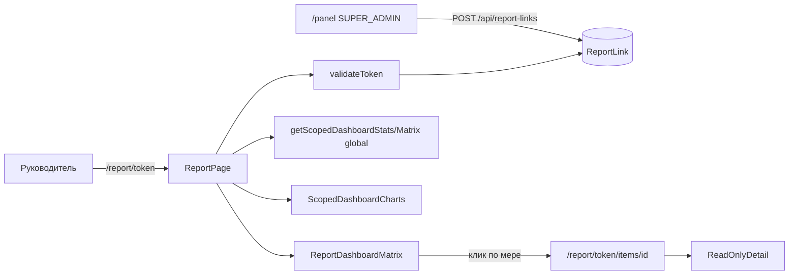

# Отчётная ссылка без сайдбара (глобальная сводка)

## Цель

Руководитель открывает ссылку вида `/report/{token}` и видит то же, что на главной [`/panel`](app/(platform)/panel/page.tsx): KPI, интерактивные графики, фильтруемую таблицу мер/поручений по всем организациям — **без сайдбара и без авторизации**. Из таблицы можно открыть **read-only карточку меры** (без «Взять в работу», отчёта, переноса).

## Почему не переиспользовать `/p/{token}`

Существующий [`AccessLink`](prisma/schema.prisma) жёстко привязан к `organizationId` и даёт операционный портал с сайдбаром ([`PublicShell`](components/public/public-shell.tsx)) и write-API. Нужен **отдельный тип ссылки** с глобальным scope.



## 1. Модель и домен

**Prisma** — новая таблица `ReportLink` (по аналогии с `AccessLink`, но без org FK):

```prisma
model ReportLink {
  id        Int       @id @default(autoincrement())
  token     String    @unique
  revokedAt DateTime? @map("revoked_at")
  expiresAt DateTime? @map("expires_at")
  createdAt DateTime  @default(now()) @map("created_at")
  @@map("report_links")
}
```

**Новые модули:**
- [`lib/report-links/index.ts`](lib/report-links/index.ts) — `createReportLink()` (отзывает предыдущую активную), `revokeReportLink()`, `getActiveReportLink()`, `listReportLinks()`
- [`lib/report-links/validate-token.ts`](lib/report-links/validate-token.ts) — `validateReportToken(token)`, `getOrderItemForReportToken(token, itemId)` (глобальный доступ к любой мере после валидации токена)

Паттерн «одна активная ссылка» — как в [`lib/access-links/index.ts`](lib/access-links/index.ts).

## 2. API для генерации (только panel)

[`app/api/report-links/route.ts`](app/api/report-links/route.ts):
- `GET` — активная/все ссылки
- `POST` — создать новую (revoke старой)
- `DELETE ?linkId=` — отозвать

Права: `Permission.settingsWrite` (только SUPER_ADMIN) — глобальная ссылка раскрывает все организации.

## 3. Публичные маршруты без сайдбара

Новая route group в `app/(public)/report/[token]/`:

| Файл | Назначение |
|------|------------|
| `layout.tsx` | `validateReportToken`, обёртка [`ReportShell`](components/report/report-shell.tsx) |
| `page.tsx` | Загрузка `getScopedDashboardStats({ type: "global" })` + `getScopedDashboardMatrix({ type: "global" })` |
| `items/[id]/page.tsx` | Read-only карточка меры |

**`ReportShell`** — минимальный chrome: заголовок «Сводка по организациям», subtitle с датой/бейдж, `ThemeToggle`, без `SidebarProvider` и навигации. Контент на всю ширину.

Middleware менять не нужно — [`middleware.ts`](middleware.ts) защищает только `/panel/*`.

## 4. Переиспользование дашборда

Расширить существующие dashboard-компоненты новым вариантом `report` (минимальный diff):

**[`components/dashboard/dashboard-interactive.tsx`](components/dashboard/dashboard-interactive.tsx)**
- Добавить `variant: "report"` с `token`, `scope: { type: "global" }`, те же `stats`/`items`/`overdueOnly`

**[`components/dashboard/scoped-dashboard-view.tsx`](components/dashboard/scoped-dashboard-view.tsx)**
- Для `variant === "report"` рендерить `ReportDashboardMatrix` вместо `AdminDashboardMatrix` / `PublicMeasuresTable`
- Графики (`ScopedDashboardCharts`) — без изменений

**Новый [`components/report/report-dashboard-matrix.tsx`](components/report/report-dashboard-matrix.tsx)**
- Копия колонок из [`AdminDashboardMatrix`](components/platform/admin-dashboard-matrix.tsx): организация, поручение, мера, статус, срок
- Организация и поручение — **plain text** (без ссылок на `/panel`)
- Мера — ссылка на `/report/{token}/items/{orderItemId}`
- Без колонки actions

**[`components/report/report-dashboard-page.tsx`](components/report/report-dashboard-page.tsx)**
- Аналог [`AdminDashboardPageShell`](components/dashboard/dashboard-page-shell.tsx): `PageHeader`, переключатель «Все / Просроченные» с `baseHref=/report/{token}`, `DashboardInteractive variant="report"`

## 5. Read-only карточка меры

**[`components/report/report-item-detail.tsx`](components/report/report-item-detail.tsx)** — на базе [`PublicItemDetail`](components/public/public-item-detail.tsx), но:
- `readOnly`: нет кнопок start/submit/delay, нет форм
- Показать: описание меры, организация, подразделение, поручение, срок, статус
- Если есть `responses` — показать последний отчёт (текст + дата) read-only
- Кнопка «Назад к сводке» → `/report/{token}`

Страница [`items/[id]/page.tsx`](app/(public)/report/[token]/items/[id]/page.tsx) грузит данные через `getOrderItemForReportToken`.

## 6. UI генерации ссылки в panel

**[`components/report/report-link-panel.tsx`](components/report/report-link-panel.tsx)** — компактный блок:
- Показать активную ссылку `/report/{token.slice(0,16)}…`
- Кнопки: «Сгенерировать», «Копировать», «Отозвать»
- Копирование полного URL: `${origin}/report/{token}`

Встроить на [`app/(platform)/panel/page.tsx`](app/(platform)/panel/page.tsx) **только для пользователей с `settingsWrite`** (server-side check + conditional render). Альтернатива на будущее — отдельный пункт в Settings; для v1 достаточно блока на главной сводке.

## 7. Сериализация данных

Как на panel-странице: `JSON.parse(JSON.stringify(...))` для передачи Prisma-dates в client components.

## Definition of Done

1. SUPER_ADMIN на `/panel` видит блок «Ссылка на отчёт», может создать/скопировать/отозвать
2. `/report/{token}` открывается без логина, без сайдбара
3. KPI + 3 графика + таблица работают интерактивно (фильтры, поиск)
4. Клик по мере → read-only карточка, без write-действий
5. Отозванный/несуществующий токен → 404
6. `npm run typecheck && npm run lint && npm run build` проходят

## Вне scope (v1)

- Org/subdivision report links (отдельные от глобальной)
- Срок действия `expiresAt` в UI (поле в модели оставить для будущего)
- Блокировка write-API по report-токену (report-токен не используется в `/api/public/*`)
