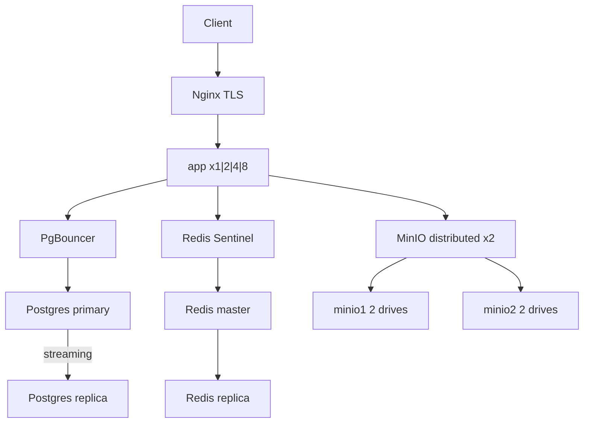

# HA Docker Compose: scale by powers of 2

## Целевая топология



| Компонент | Значения scale | Как |
|-----------|----------------|-----|
| **app** | 1, 2, 4, 8 | `docker compose --scale app=N` (уже есть dynamic upstream в nginx) |
| **Postgres** | 1 или 2 | profile `single` vs `ha`: primary + hot-standby replica |
| **Redis** | 1 или 2 | profile `ha`: master + replica + Sentinel |
| **MinIO** | 1 или 2 | profile `ha`: distributed 2-node / 4-drive erasure set |
| **nginx** | 1 | reverse proxy, не scale |

Единый переключатель: **`SCALE_TIER`** (0–3) в [`.env.production.example`](.env.production.example):

- `SCALE_TIER=0` → profile `single`, app=1
- `SCALE_TIER=1` → profile `ha`, app=2
- `SCALE_TIER=2` → profile `ha`, app=4
- `SCALE_TIER=3` → profile `ha`, app=8

---

## 1. Compose: profiles single vs ha

Рефакторинг [`docker-compose.prod.yml`](docker-compose.prod.yml) + новый overlay [`docker-compose.ha.yml`](docker-compose.ha.yml).

### Profile `single` (текущее поведение, tier 0)

Оставить как есть: `db`, `redis`, `minio`, `minio-init`.

### Profile `ha` (tier 1–3)

**Postgres x2** — новые файлы в `docker/postgres/`:

- `docker/postgres/primary/init/01-replication.sql` — роль `replicator`, `wal_level=replica`
- `docker/postgres/replica/entrypoint.sh` — `pg_basebackup` + standby.signal
- Сервисы: `db-primary`, `db-replica`
- **`pgbouncer`** ([`docker/pgbouncer/pgbouncer.ini`](docker/pgbouncer/pgbouncer.ini)) — единая точка входа для app/migrate/seed:
  - write pool → `db-primary:5432`
  - `pool_mode=transaction`, `default_pool_size=20` (важно при 8 app × Prisma pool)
- App env: `DATABASE_URL=postgresql://...@pgbouncer:6432/fstec`
- Опционально: `DATABASE_READ_URL=postgresql://...@pgbouncer:6433/fstec` (read pool → replica)

**Redis x2** — `docker/redis/`:

- `redis-master`, `redis-replica` (`replicaof`)
- `redis-sentinel` (1 инстанс для compose-bench; в комментарии — 3 для real prod quorum)
- App env:
  - single: `REDIS_URL=redis://redis:6379`
  - ha: `REDIS_SENTINELS=redis-sentinel:26379`, `REDIS_MASTER_NAME=fstec-master`

**MinIO x2** — distributed mode (4 drives, EC):

- `minio1`, `minio2` — по 2 volume каждый
- Command: `server http://minio{1...2}/data{1...2} --console-address ":9001"`
- `minio-init` → alias на любой node кластера
- App env: `S3_ENDPOINT=http://minio1:9000` (любой node кластера)

### Зависимости и migrate

- `migrate` / `seed` → только `db-primary` (или pgbouncer write pool)
- `app.depends_on`: pgbouncer + redis-sentinel (ha) / db+redis (single)
- `nginx.depends_on`: app healthy (все реплики)

---

## 2. Скрипт масштабирования

Заменить/расширить [`docker/scripts/prod-up.sh`](docker/scripts/prod-up.sh) → **`docker/scripts/prod-scale.sh`**:

```sh
# SCALE_TIER=0 → --profile single --scale app=1
# SCALE_TIER=3 → --profile ha --scale app=8
```

- Валидация: `SCALE_TIER` ∈ {0,1,2,3}, `APP_REPLICAS=2^TIER`
- Запрет `--scale` для stateful (только явные сервисы в profile `ha`)
- Вывод итоговой топологии (`docker compose ps`)

Обновить комментарии в [`.env.production.example`](.env.production.example):

```env
SCALE_TIER=0          # 0=1x app single-node | 1=2x | 2=4x | 3=8x + HA data layer
NGINX_BENCH_MODE=0    # 1 = ослабить rate limit для load test
```

---

## 3. App-код: готовность к multi-instance

### 3a. Redis Sentinel — [`lib/cache/redis.ts`](lib/cache/redis.ts)

Поддержать оба режима:

```typescript
// REDIS_URL → standalone (single profile)
// REDIS_SENTINELS + REDIS_MASTER_NAME → new Redis({ sentinels, name })
```

Без изменений в [`lib/dashboard/cache.ts`](lib/dashboard/cache.ts) — уже shared cache.

### 3b. Rate limit → Redis — [`lib/public/rate-limit.ts`](lib/public/rate-limit.ts)

In-memory `Map` ломает лимиты при N app. Переписать на Redis `INCR` + `EXPIRE` (atomic pipeline), fallback на Map если Redis недоступен.

Затронут только [`lib/api/public-guard.ts`](lib/api/public-guard.ts) — интерфейс `checkRateLimit` сохранить.

### 3c. Postgres read replica (optional, high value) — [`lib/db/client.ts`](lib/db/client.ts)

```typescript
export const prismaRead = process.env.DATABASE_READ_URL
  ? new PrismaClient({ datasources: { db: { url: process.env.DATABASE_READ_URL }}})
  : prisma
```

Использовать `prismaRead` в read-heavy путях:

- [`lib/dashboard/fetch-scoped-items.ts`](lib/dashboard/fetch-scoped-items.ts)
- public fetch helpers в `lib/public/` (read-only list/detail)

Writes / transactions остаются на `prisma` (primary). Invalidate cache после мутаций — без изменений.

### 3d. Prisma connection budget

В ha-mode добавить в `DATABASE_URL`:

`?connection_limit=5&pool_timeout=10` — чтобы 8 app не исчерпали Postgres (PgBouncer компенсирует, но лимит на клиенте полезен).

---

## 4. Nginx: bench mode

Проблема прошлого бенча: `limit_req 20r/s` в [`docker/nginx/nginx.conf`](docker/nginx/nginx.conf) маскирует scale-out app.

- Шаблон [`docker/nginx/nginx.conf.template`](docker/nginx/nginx.conf.template) + envsubst в entrypoint **или** отдельный snippet `rate-limit-bench.conf` включаемый через volume override
- `NGINX_BENCH_MODE=1` → `rate=200r/s`, burst=400 (только для load test)
- [`docker-compose.prod.yml`](docker-compose.prod.yml): передать env в nginx build/entrypoint

---

## 5. Benchmark script

Новый **`docker/scripts/benchmark-scale.sh`**:

| Прогон | Config | Метод |
|--------|--------|-------|
| A | tier 0 (1/1/1/1) | autocannon 30s c=20 direct `http://app:3000` |
| B | tier 3 (8/2/2/2) | то же |
| C | tier 0 через nginx | `NGINX_BENCH_MODE=1`, c=8 |
| D | tier 3 через nginx | то же |

Endpoints: `/login`, `/p/dev-rost` (после seed).

Вывод: markdown-таблица Req/sec, p50 latency, 200 count. Сохранять в `docker/benchmark-results/latest.txt`.

Warmup + cache priming перед каждым прогоном.

---

## 6. Что сознательно НЕ scale

| Сервис | Причина |
|--------|---------|
| nginx | один LB достаточно; второй нужен keepalived/VIP |
| migrate / seed / minio-init | one-shot jobs |
| postgres > 2 | streaming replication = 1 writer; sharding вне scope |
| redis > 2 master | нужен Redis Cluster (>=6 nodes), не x2 |

---

## Порядок реализации

1. **Infra files** — postgres replication, pgbouncer, redis sentinel, minio distributed configs
2. **Compose profiles** — `single` / `ha` overlay + env wiring
3. **`prod-scale.sh`** — SCALE_TIER mapping
4. **App code** — redis sentinel, redis rate limit, prismaRead, connection_limit
5. **Nginx bench mode**
6. **`benchmark-scale.sh`** — прогон tier0 vs tier3, отчёт

## DoD (Definition of Done)

- `SCALE_TIER=0` — стек поднимается как сейчас (backward compatible)
- `SCALE_TIER=3 sh docker/scripts/prod-scale.sh --build -d` — 8 app + 2 pg + 2 redis + 2 minio healthy
- Login + `/p/dev-rost` работают через HTTPS
- `benchmark-scale.sh` выводит сравнение tier0 vs tier3 с измеримым выигрышем на `/p/dev-rost` (direct path)
- `npm run typecheck` проходит

## Риски

- **Postgres replication init** — самая хрупкая часть; replica entrypoint должен ждать primary ready
- **MinIO 2-node** — требует ровно 4 drives; при `SCALE_TIER=0` остаётся single minio (проще)
- **Read replica lag** — dashboard после мутации полагается на Redis invalidation; без кеша возможен stale read ~100ms (приемлемо для bench)
