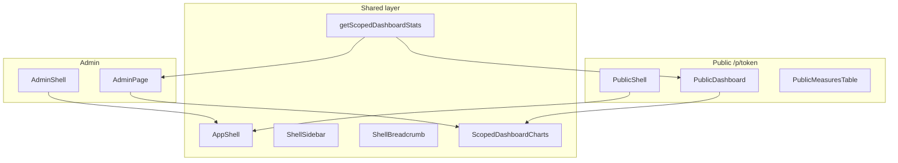

# Hardcoded statuses + public panel shell

## Контекст

**Статусы:** workflow уже зафиксирован в [`lib/statuses/workflow.ts`](lib/statuses/workflow.ts) и seed (3 статуса). Admin CRUD ([`/admin/settings/statuses`](app/(admin)/admin/(panel)/settings/statuses/page.tsx)) не нужен.

**Публичная панель:** сейчас [`public-order-page.tsx`](components/public/public-order-page.tsx) — голая страница с `PageHeader` + таблица, без sidebar/breadcrumbs/charts. Админка использует [`admin-shell.tsx`](components/admin/admin-shell.tsx) + [`dashboard-charts.tsx`](components/admin/dashboard-charts.tsx) + matrix.

Цель: **реюзабельный shell** для admin (как сейчас) и public (новое), charts/stats с **scope** org / subdivision по токену.



---

## Phase 1 — Hardcode statuses (убрать редактирование)

### Удалить
- [`app/(admin)/admin/(panel)/settings/statuses/page.tsx`](app/(admin)/admin/(panel)/settings/statuses/page.tsx)
- [`components/admin/statuses-manager.tsx`](components/admin/statuses-manager.tsx)
- [`components/admin/crud/status-dialog.tsx`](components/admin/crud/status-dialog.tsx)
- [`app/api/statuses/route.ts`](app/api/statuses/route.ts)
- [`lib/validations/statuses.ts`](lib/validations/statuses.ts)

### Обновить навигацию
- [`components/app-sidebar.tsx`](components/app-sidebar.tsx) — убрать пункт «Статусы»
- [`components/admin/admin-breadcrumb.tsx`](components/admin/admin-breadcrumb.tsx) — убрать ветку `/admin/settings/statuses`

### Упростить [`lib/statuses/index.ts`](lib/statuses/index.ts)
- Удалить `createStatus`, `updateStatus`, `deleteStatus`
- Оставить read-only: `getDefaultStatusId`, `getInProgressStatusId`, `getCompletedStatusId`, `listSelectableStatuses`
- Добавить `getWorkflowStatuses()` — `findMany` только по 3 именам из `WORKFLOW_STATUS` (для public/admin select)

### Заменить прямые `prisma.status.findMany`
- [`app/api/public/[token]/route.ts`](app/api/public/[token]/route.ts)
- [`app/(public)/p/[token]/items/[id]/page.tsx`](app/(public)/p/[token]/items/[id]/page.tsx)

**БД и seed не трогаем** — `status_id` FK остаётся; seed по-прежнему создаёт 3 статуса.

---

## Phase 2 — Reusable shell (admin + public)

### Новые shared-компоненты

| Файл | Назначение |
|------|------------|
| [`components/shell/app-shell.tsx`](components/shell/app-shell.tsx) | `SidebarProvider` + header (`SidebarTrigger`, separator, breadcrumb slot) + content padding |
| [`components/shell/shell-sidebar.tsx`](components/shell/shell-sidebar.tsx) | Generic sidebar: `brand`, `links[]`, `footer?` |
| [`components/shell/shell-breadcrumb.tsx`](components/shell/shell-breadcrumb.tsx) | `BreadcrumbProvider` + `buildCrumbs(pathname, config, dynamicLabel?)` |

### Рефактор admin (thin wrappers)
- [`admin-shell.tsx`](components/admin/admin-shell.tsx) → использует `AppShell` + admin sidebar config
- [`admin-breadcrumb.tsx`](components/admin/admin-breadcrumb.tsx) → re-export / thin wrapper над `ShellBreadcrumb` с admin `crumbConfig`
- [`app-sidebar.tsx`](components/app-sidebar.tsx) → config для `ShellSidebar` (logo, nav links, `NavUser`)

### Public shell
- [`components/public/public-shell.tsx`](components/public/public-shell.tsx) — `AppShell` + sidebar:
  - **Сводка** → `/p/[token]`
  - (опционально) scope badge: org name / subdivision name в header sidebar
- [`components/public/public-breadcrumb.tsx`](components/public/public-breadcrumb.tsx) — crumbs: `{Org}` → `Сводка` | `{Org}` → `{Subdivision}` → `Мера`
- [`app/(public)/p/[token]/layout.tsx`](app/(public)/p/[token]/layout.tsx) — оборачивает все public routes в `PublicShell`

Item detail [`public-item-detail.tsx`](components/public/public-item-detail.tsx): убрать дублирующий `PageHeader.backHref` padding (`max-w-2xl p-6`) — back через breadcrumb + shell content area.

---

## Phase 3 — Scoped dashboard stats & charts

### Рефактор [`lib/dashboard/stats.ts`](lib/dashboard/stats.ts)

```ts
type DashboardScope =
  | { type: "global" }
  | { type: "organization"; organizationId: number }
  | { type: "subdivision"; organizationId: number; subdivisionId: number }

getScopedDashboardStats(scope)
getScopedDashboardMatrix(scope)  // в lib/orders или рядом
```

**Агрегация по scope:**

| Scope | Pie «статусы» | Bar 2 | Bar 3 |
|-------|---------------|-------|-------|
| global (admin) | все меры | просрочка по org | выполнение по org |
| organization token | меры org | просрочка **по подразделениям** | выполнение **по подразделениям** |
| subdivision token | меры subdivision | просрочка **по поручениям** (order title) | KPI: completed vs active (одна группа) |

Использовать `getDisplayStatusName` из [`workflow.ts`](lib/statuses/workflow.ts) для pie (просрочка как label).

### Рефактор charts
- Переименовать/обобщить [`dashboard-charts.tsx`](components/admin/dashboard-charts.tsx) → [`components/dashboard/scoped-dashboard-charts.tsx`](components/dashboard/scoped-dashboard-charts.tsx)
- Props: `scope`, `statusDistribution`, `overdueBreakdown`, `completionBreakdown`, `labels` (titles)
- Admin page импортирует новый компонент (поведение без изменений)

### Public data loading
- Перевести [`/p/[token]`](app/(public)/p/[token]/page.tsx) на **SSR** (как admin dashboard): `validateAccessToken` + `getScopedDashboardStats` + matrix
- Удалить client-only fetch из [`public-order-page.tsx`](components/public/public-order-page.tsx) → заменить на `PublicDashboardPage` (server props + client charts/table)

---

## Phase 4 — Public dashboard UX (как admin)

Страница `/p/[token]`:

1. **PageHeader** — org name; subtitle = subdivision или «Все меры организации»
2. **ScopedDashboardCharts** — 2–3 карточки по scope
3. **Toggle «Просроченные»** — query `?overdue=1` (как [`admin/page.tsx`](app/(admin)/admin/(panel)/page.tsx))
4. **PublicMeasuresTable** — таблица мер (существующий компонент, display status через workflow)
5. Empty state если нет мер

[`items/[id]/page.tsx`](app/(public)/p/[token]/items/[id]/page.tsx) — наследует layout; breadcrumb: `{Org}` → `Сводка` → `{Measure name}` via `usePublicBreadcrumbLabel`.

---

## Phase 5 — Admin dashboard reuse (минимальный diff)

- [`app/(admin)/admin/(panel)/page.tsx`](app/(admin)/admin/(panel)/page.tsx) — вызов `getScopedDashboardStats({ type: "global" })` вместо `getDashboardStats()`
- [`getDashboardMatrix()`](lib/orders/index.ts) — делегировать в scoped matrix с global filter

---

## DoD

- Нет UI/API для создания/редактирования/удаления статусов; sidebar без «Статусы»
- Public `/p/[token]` имеет sidebar + breadcrumbs + charts + таблицу в shell
- Charts и stats корректно scoped: org-link vs subdivision-link
- Admin dashboard работает через те же shared stats/charts компоненты
- `npm run typecheck && lint && build`
