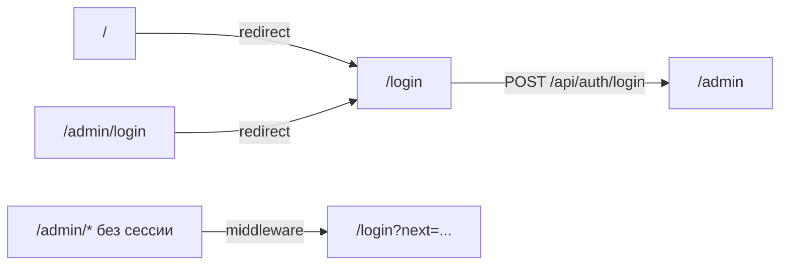

# Login + Sidebar refactor (shadcn blocks)

## Текущее состояние

| Маршрут | Сейчас |
|---------|--------|
| [`app/page.tsx`](app/page.tsx) | Лендинг с кнопкой «Вход» |
| [`app/login/page.tsx`](app/login/page.tsx) | Demo login-03 (Acme, OAuth, без auth) |
| [`app/(admin)/admin/login/page-client.tsx`](app/(admin)/admin/login/page-client.tsx) | Рабочий login → `/api/auth/login` |
| [`middleware.ts`](middleware.ts) | Редирект на `/admin/login` |
| [`components/admin/admin-sidebar.tsx`](components/admin/admin-sidebar.tsx) | Простой FSTEC sidebar (используется) |
| [`components/app-sidebar.tsx`](components/app-sidebar.tsx) | Demo sidebar-07 (Acme, не используется) |
| [`app/dashboard/page.tsx`](app/dashboard/page.tsx) | Demo sidebar-07 (лишний маршрут) |

**Конфликт имён:** оба sidebar-файла экспортируют `AppSidebar`.

---

## Целевой UX



---

## Phase 1 — Единый login (login-03)

### 1a. Редиректы

- [`app/page.tsx`](app/page.tsx): `redirect("/login")` (server component, без лендинга).
- [`app/(admin)/admin/login/page.tsx`](app/(admin)/admin/login/page.tsx): заменить на redirect в `/login`, сохраняя `?next=`.
- [`middleware.ts`](middleware.ts):
  - unauthenticated `/admin/*` → `/login?next=...` (вместо `/admin/login`);
  - `/admin/login` → `/login` (preserve query);
  - опционально: если сессия есть и pathname === `/login` → `/admin` (не показывать login залогиненному).

### 1b. Адаптировать login-03

[`components/login-form.tsx`](components/login-form.tsx) — client component с логикой из [`page-client.tsx`](app/(admin)/admin/login/page-client.tsx):

- Убрать Apple/Google, Sign up, Terms, Forgot password.
- Русские тексты: «Вход в систему», Email, Пароль, «Войти».
- `fetch("/api/auth/login")` + `router.push(searchParams.get("next") ?? "/admin")`.
- Ошибка через `Alert variant="destructive"`, loading через `Spinner` (как сейчас).
- `Suspense` wrapper в [`app/login/page.tsx`](app/login/page.tsx) для `useSearchParams`.

[`app/login/page.tsx`](app/login/page.tsx):

- Брендинг FSTEC (`ShieldIcon` + «FSTEC»), фон `bg-muted` из login-03.
- Убрать `Acme Inc.` и `href="#"`.

### 1c. Удалить дубликат

- Удалить [`app/(admin)/admin/login/page-client.tsx`](app/(admin)/admin/login/page-client.tsx) после redirect-страницы.

---

## Phase 2 — Sidebar sidebar-07 для admin

### 2a. Объединить sidebars

Переписать [`components/app-sidebar.tsx`](components/app-sidebar.tsx) под FSTEC (единственный `AppSidebar`):

- `collapsible="icon"` + `SidebarRail` (из sidebar-07).
- **Header:** лого FSTEC вместо [`TeamSwitcher`](components/team-switcher.tsx) — `SidebarMenuButton` с `ShieldIcon` + «FSTEC».
- **Content:** flat nav из текущего [`admin-sidebar.tsx`](components/admin/admin-sidebar.tsx) — 5 ссылок с `isActive` по `usePathname()` (без nested NavMain).
- **Footer:** [`NavUser`](components/nav-user.tsx), упрощённый:
  - user: `{ name: "Администратор", email: "admin@fstec.local" }` (статично, без avatar URL);
  - меню: только «Выйти» → `POST /api/auth/logout` → `/login`.

Обновить [`components/admin/admin-shell.tsx`](components/admin/admin-shell.tsx):

```tsx
import { AppSidebar } from "@/components/app-sidebar"
```

Удалить [`components/admin/admin-sidebar.tsx`](components/admin/admin-sidebar.tsx).

### 2b. NavUser wiring

[`components/nav-user.tsx`](components/nav-user.tsx):

- Убрать Upgrade/Account/Billing/Notifications.
- `LogOutIcon` + `onClick` logout (через prop `onLogout` или inline `useRouter`).

---

## Phase 3 — Cleanup demo-файлов

Удалить неиспользуемые shadcn demo-артефакты:

| Файл | Причина |
|------|---------|
| [`app/dashboard/page.tsx`](app/dashboard/page.tsx) | Demo; dashboard = `/admin` |
| [`components/team-switcher.tsx`](components/team-switcher.tsx) | Не нужен |
| [`components/nav-main.tsx`](components/nav-main.tsx) | Nested nav не используется |
| [`components/nav-projects.tsx`](components/nav-projects.tsx) | Не нужен |

Оставить: `breadcrumb`, `collapsible`, `avatar` (UI primitives уже установлены).

---

## Phase 4 — Logout / ссылки

Обновить все ссылки на login:

- Было: `/admin/login` → Стало: `/login`
- Проверить grep по репо после изменений.

---

## DoD

- `npm run typecheck && lint && build`
- `/` → `/login` без промежуточного лендинга
- Login работает (auth API, redirect на `/admin` или `?next=`)
- `/admin/login` → `/login`
- Admin shell использует sidebar-07 (collapsible icon + user footer)
- Нет demo `/dashboard`, нет дублирующего `AppSidebar`
