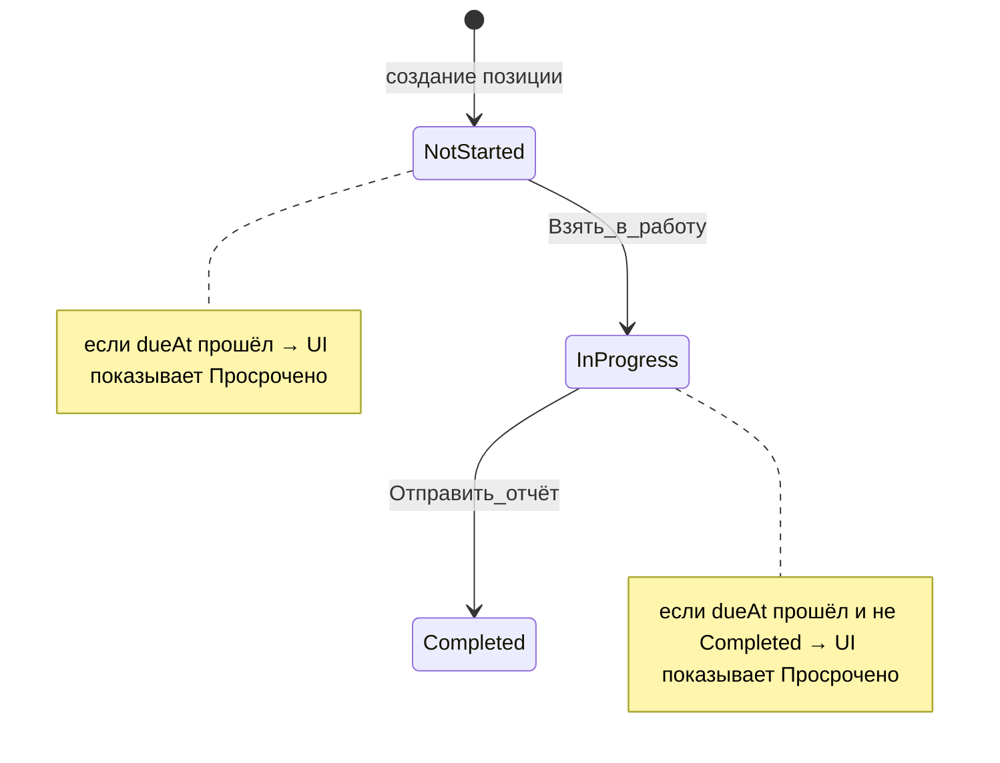

# Workflow меры: взять в работу, завершить через отчёт, авто-просрочка

## Текущее состояние

- В БД четыре статуса ([`prisma/seed.ts`](prisma/seed.ts)): «Не начато», «В работе», «Выполнено», «Просрочено».
- Просрочка **уже частично вычисляется** (`!isTerminal && dueAt < now`) в [`lib/orders/index.ts`](lib/orders/index.ts), [`public-measures-table.tsx`](components/public/public-measures-table.tsx), но в UI показывается **имя из БД** — исполнитель может вручную выбрать «Просрочено» через Select в [`public-item-detail.tsx`](components/public/public-item-detail.tsx).
- Отправка отчёта ([`app/api/public/.../responses/route.ts`](app/api/public/[token]/items/[id]/responses/route.ts)) **не меняет** статус.

## Целевое поведение



| Элемент | Поведение |
|---------|-----------|
| **Не начато → В работе** | Кнопка «Взять в работу» |
| **Завершение** | Только через отправку отчёта → статус «Выполнено» (отдельной кнопки «Завершить» нет) |
| **Просрочено** | Вычисляется: срок прошёл **и** статус не финальный; **не хранится** в `statusId` |

---

## Phase 1 — Общая логика workflow

Новый модуль [`lib/statuses/workflow.ts`](lib/statuses/workflow.ts):

```ts
export const WORKFLOW_STATUS = {
  NOT_STARTED: "Не начато",
  IN_PROGRESS: "В работе",
  COMPLETED: "Выполнено",
} as const

export const OVERDUE_LABEL = "Просрочено"

export function isOrderItemOverdue(item, now?)
export function getDisplayStatusName(item, now?)  // → OVERDUE_LABEL или item.status.name
export function getWorkflowStatusIdByName(name)   // server-side lookup
export function isSelectableWorkflowStatus(name)  // false для «Просрочено»
```

Расширить [`lib/statuses/index.ts`](lib/statuses/index.ts): `getInProgressStatusId()`, `getCompletedStatusId()` (по имени, как `getDefaultStatusId`).

Заменить дублирующиеся `terminalIds`/`isOverdue` в public-компонентах на импорт из `workflow.ts`.

---

## Phase 2 — Данные: убрать «Просрочено» как хранимый статус

В [`prisma/seed.ts`](prisma/seed.ts):
- Оставить только 3 workflow-статуса.
- Добавить миграцию данных в seed (idempotent): все `order_items` со статусом «Просрочено» → «В работе» (или «Не начато», если нет отчётов — можно упростить: всегда «В работе»).
- Удалить запись `Status` с name «Просрочено», если на неё больше нет ссылок.

---

## Phase 3 — API

### 3a. Действие «взять в работу»

Обновить [`app/api/public/[token]/items/[id]/status/route.ts`](app/api/public/[token]/items/[id]/status/route.ts):

- Принимать `{ action: "start" }` вместо произвольного `statusId` (или в дополнение — **только action для public**).
- Разрешить `start` только если текущий статус «Не начато» и не terminal.
- Установить `statusId` → «В работе».
- Отклонять попытки выставить «Просрочено» / «Выполнено» через этот endpoint.

Обновить [`lib/validations/public.ts`](lib/validations/public.ts): `statusActionSchema`.

### 3b. Завершение через отчёт

В [`app/api/public/[token]/items/[id]/responses/route.ts`](app/api/public/[token]/items/[id]/responses/route.ts):

- В транзакции: создать `Response` **и** обновить `statusId` → «Выполнено».
- Разрешить только если текущий статус «В работе» (не terminal).
- Вернуть обновлённый item/status в ответе (для обновления UI без reload).

---

## Phase 4 — Публичный UI

### [`public-item-detail.tsx`](components/public/public-item-detail.tsx)

**Убрать** Select статуса.

**Добавить** блок статуса:
- `Badge` с `getDisplayStatusName` (destructive если просрочено).
- Кнопка **«Взять в работу»** — только когда stored status = «Не начато»; `PATCH action: "start"`.
- Форма отчёта:
  - Активна когда status = «В работе» (в т.ч. при вычисленной просрочке).
  - Кнопка **«Отправить отчёт»** (primary) — disabled если пустой `result` или уже «Выполнено».
  - После успеха: очистка полей, обновление локального status → «Выполнено», toast «Отчёт отправлен, мера завершена».
- Если «Выполнено»: форма read-only / скрыта, показать badge «Выполнено».

Карточка срока: убрать дублирующий Badge «Просрочено» (достаточно в блоке статуса), дату оставить.

### [`public-measures-table.tsx`](components/public/public-measures-table.tsx)

- Колонка «Статус»: `getDisplayStatusName(row)` вместо `row.status.name`.
- Фильтр «Просрочено» оставить как computed (`overdue`), убрать «Просрочено» из списка статусов-by-id в фильтре (если статус удалён из БД — исчезнет автоматически).

---

## Phase 5 — Admin (согласованность)

- [`order-detail-client.tsx`](components/admin/order-detail-client.tsx), [`app/(admin)/admin/(panel)/page.tsx`](app/(admin)/admin/(panel)/page.tsx): Badge показывает `getDisplayStatusName` (просрочка видна и в админке).
- [`edit-order-item-dialog.tsx`](components/admin/crud/edit-order-item-dialog.tsx): в Select только 3 workflow-статуса (фильтр `isSelectableWorkflowStatus`); подсказка, что просрочка определяется автоматически по сроку.
- [`lib/dashboard/stats.ts`](lib/dashboard/stats.ts) (optional, low risk): в `statusDistribution` агрегировать по display name, чтобы просроченные «В работе» не дублировались в chart — **или** оставить stored names в chart (просрочка уже в отдельном overdue chart). Минимальный scope: только UI badges.

---

## DoD

- Публичная страница: нет Select со всеми статусами; есть «Взять в работу» и отчёт как единственный путь к завершению.
- «Просрочено» нельзя выставить вручную; отображается автоматически при `dueAt < now` и не-terminal.
- Seed/миграция: статус «Просрочено» удалён из workflow, старые записи переназначены.
- `npm run typecheck && lint && build`
