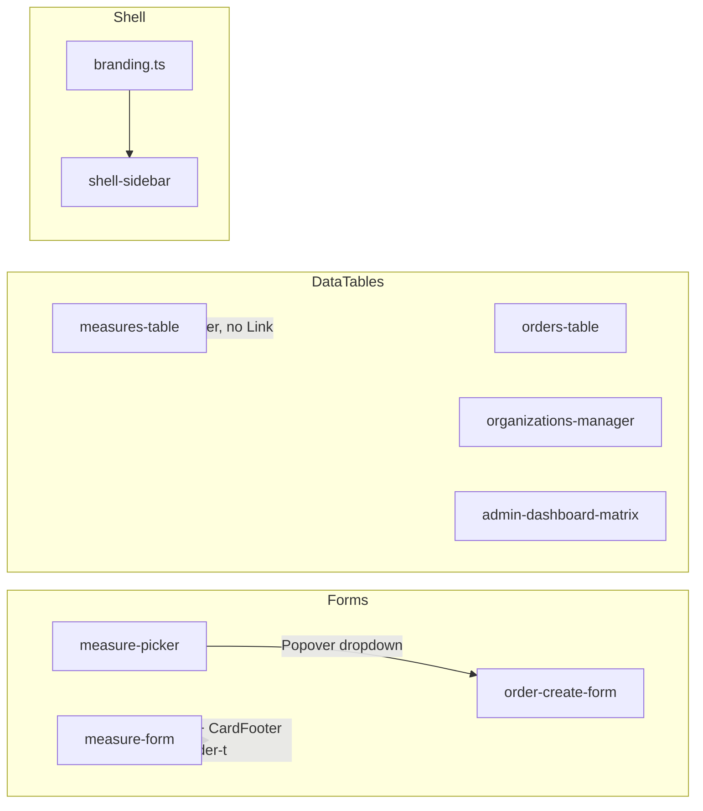

# Measures UX + tables + sidebar fixes

## Контекст

Все перечисленные проблемы уже диагностированы в коде; реализация ещё не начата (файлы `column-layout.ts`, `form-actions-bar.tsx`, `sort-helpers.ts` отсутствуют).



---

## 1. MeasurePicker → inline-таблица в блоке (сохранить 2 колонки)

**Файл:** [`components/admin/measure-picker.tsx`](components/admin/measure-picker.tsx)

Переписать с Popover/Command на inline-блок внутри существующей Card «Меры»:

- Убрать `Field` + `FieldLabel` «Меры» (заголовок уже в CardHeader [`order-create-form.tsx`](components/admin/order-create-form.tsx))
- Структура:
  - `Input` поиск по name/code
  - Toolbar: «Выбрать все» / «Снять все» + счётчик «Выбрано: N»
  - `ScrollArea max-h-72` + shadcn `Table` с checkbox-строками (название + код)
- Логика `Set<number>` / `toggle` / `selectAll` / `clearAll` — без изменений

**Layout в [`order-create-form.tsx`](components/admin/order-create-form.tsx):** оставить `grid gap-4 lg:grid-cols-2` — левая Card «Параметры», правая Card «Меры» с inline-таблицей. **Не** делать `col-span-2`, чтобы не ломать двухколоночную структуру.

---

## 2. Кнопки «Отмена / Сохранить» — убрать странный border

**Причина:** пустой `Card` + `CardFooter` с дефолтным `border-t bg-muted/50` из [`components/ui/card.tsx`](components/ui/card.tsx).

**Новый компонент:** [`components/admin/form-actions-bar.tsx`](components/admin/form-actions-bar.tsx)

```tsx
// flex row, без Card/CardFooter — только FormErrorSlot + кнопки
export function FormActionsBar({ error, children, className }: ...)
```

Заменить блок `<Card><CardFooter>...</CardFooter></Card>` на `<FormActionsBar>` в:

| Файл | Особенности |
|------|-------------|
| [`measure-form.tsx`](components/admin/measure-form.tsx) | error слева, кнопки справа |
| [`order-create-form.tsx`](components/admin/order-create-form.tsx) | только кнопки справа |
| [`organization-form.tsx`](components/admin/organization-form.tsx) | error + кнопки |

---

## 3. Сортировка дат и прочих колонок

**Новый файл:** [`lib/data-table/sort-helpers.ts`](lib/data-table/sort-helpers.ts)

- `dateSortFn` — сравнение через `new Date(...).getTime()`
- `numberSortFn` — для числовых колонок (кол-во мер)

**Правило:** любая сортируемая колонка → `header: ({ column }) => <DataTableColumnHeader column={column} title="..." />` + при необходимости `sortingFn`.

| Таблица | Колонки для сортировки |
|---------|------------------------|
| [`measures-table.tsx`](components/admin/measures-table.tsx) | name, code, createdAt (`dateSortFn`) |
| [`orders-table.tsx`](components/admin/orders-table.tsx) | title, organization (уже есть header), items (`numberSortFn`), issuedAt (`dateSortFn`) |
| [`organizations-manager.tsx`](components/admin/organizations-manager.tsx) | name, shortCode, subdivisions (уже есть header) |
| [`admin-dashboard-matrix.tsx`](components/admin/admin-dashboard-matrix.tsx) | measure, dueAt (`dateSortFn`) — org/order/status уже с header |
| [`order-detail-client.tsx`](components/admin/order-detail-client.tsx) | measure, dueAt |
| [`public-measures-table.tsx`](components/public/public-measures-table.tsx) | dueAt |

---

## 4. Кликабельные названия (как в организациях)

Паттерн из [`organizations-manager.tsx`](components/admin/organizations-manager.tsx):

```tsx
<Link href="..." className="font-medium hover:underline">{name}</Link>
```

| Таблица | Cell | Href |
|---------|------|------|
| [`measures-table.tsx`](components/admin/measures-table.tsx) | name | `/panel/measures/{id}/edit` (по выбору пользователя) |
| [`orders-table.tsx`](components/admin/orders-table.tsx) | title | `/panel/orders/{id}` |
| [`admin-dashboard-matrix.tsx`](components/admin/admin-dashboard-matrix.tsx) | measure.name | `/panel/measures/{measure.id}/edit` — расширить тип `measure: { id: number; name: string }` (id уже приходит из Prisma) |

Меню действий (`TableRowActions`) оставить без изменений — «Изменить» / «Открыть» как сейчас.

---

## 5. Сайдбар — название сервиса не вмещается

**Файлы:** [`components/shell/shell-sidebar.tsx`](components/shell/shell-sidebar.tsx), [`lib/ui/branding.ts`](lib/ui/branding.ts)

**Причина:** `SidebarMenuButton` применяет `[&>span:last-child]:truncate` только к прямым `span`-детям, а бренд использует вложенный `div.grid` без `min-w-0` — текст выталкивает sidebar вместо ellipsis.

**Fix в `shell-sidebar.tsx`:**
- На контейнер текста: `className="grid min-w-0 flex-1 text-left text-sm leading-tight"`
- На `Link`: `className="min-w-0"` (или `overflow-hidden`)
- `title={brand.title}` на span для tooltip при обрезке

CSS-fix без переименования сервиса. Если после fix всё ещё тесно — можно сократить `APP_NAME` в branding (отдельный шаг, не обязателен).

---

## 6. (Опционально) Единая сетка колонок

Если после сортировки колонки «пляшут» между вкладками — добавить [`lib/data-table/column-layout.ts`](lib/data-table/column-layout.ts) + `table-fixed` в [`data-table.tsx`](components/data-table/data-table.tsx). Это из существующего плана; включить только если визуально нужно — не блокирует основные фиксы.

---

## DoD

- Создание поручения: меры выбираются inline-таблицей в правой Card, grid `lg:grid-cols-2` сохранён
- Формы measure/order/org: action bar без верхней полоски border
- Все admin DataTable с датами/числами: кликабельная сортировка asc/desc в header
- Measures name → edit, Orders title → detail, Matrix measure → edit
- Sidebar: длинное «Сервис контроля мер ФСТЭК» обрезается ellipsis, не ломает layout
- `npm run typecheck && npm run lint && npm run build`
