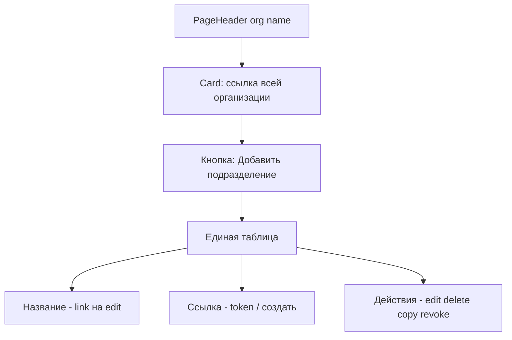

# Объединение вкладок подразделений и ссылок

## Проблема

Сейчас на [`org-detail-client.tsx`](components/admin/org-detail-client.tsx) два таба дублируют подразделения:

- **Подразделения** — таблица «название + edit/delete»
- **Ссылки** — [`OrgLinksPanel`](components/admin/org-links-panel.tsx) снова перечисляет те же подразделения для управления токенами

Пользователь видит одну сущность в двух местах без явной пользы от разделения.

## Целевой UX



**Выбранный вариант:** одна таблица + org-level link card сверху.

---

## 1. Рефакторинг [`org-links-panel.tsx`](components/admin/org-links-panel.tsx)

Превратить в единый компонент доступа (можно переименовать в `org-access-panel.tsx` или оставить имя, убрав `embedded`):

**Сверху** — без изменений по смыслу:
- Карточка «Ссылка {orgGenitive} (все меры организации)»: generate / copy / revoke / new link

**Ниже** — одна таблица подразделений с колонками:

| Название | Ссылка | Действия |
|----------|--------|----------|
| `Link` → `/admin/organizations/{orgId}/subdivisions/{id}/edit` | preview token + copy, или «—» | `TableRowActions`: Изменить, Удалить; в ячейке «Ссылка» — Создать / Отозвать |

- Перенести логику delete subdivision из `org-detail-client` сюда (или оставить delete в client и передать callback — проще держать всё в одном client-компоненте).
- Удалить вторую внутреннюю таблицу «Ссылки подразделений» — она сливается с основной.
- Удалить standalone-шапку (`!embedded` блок с `← orgs`) — компонент используется только из detail.
- Вынести `CopyLinkButton` и `getActiveForSubdivision` как есть (уже локальные helpers).

**Empty state:** одно сообщение «Нет подразделений» + кнопка «Добавить подразделение» (link на `/subdivisions/new`).

---

## 2. Упростить [`org-detail-client.tsx`](components/admin/org-detail-client.tsx)

- Убрать `Tabs`, `TabsList`, `TabsTrigger`, `TabsContent`.
- Убрать дублирующую таблицу подразделений и `ConfirmDeleteAlert` (перенести delete в unified panel).
- Оставить `PageHeader` + кнопку «Изменить» + кнопку «Добавить подразделение» (можно над таблицей в panel).
- Рендерить один `OrgLinksPanel` / unified panel с props: `organizationId`, `organizationName`, `initialSubdivisions`, `initialLinks`.
- Удалить prop `defaultTab`.

---

## 3. Убрать `?tab=links`

| Файл | Изменение |
|------|-----------|
| [`organizations/[id]/page.tsx`](app/(admin)/admin/(panel)/organizations/[id]/page.tsx) | Убрать `searchParams`, `defaultTab` |
| [`order-detail-client.tsx`](components/admin/order-detail-client.tsx) | Кнопка «Ссылки ДЗО»: `href=/admin/organizations/{id}` вместо `?tab=links` |

---

## 4. Проверка (DoD)

```bash
npm run typecheck && npm run lint && npm run build
```

**UI smoke:**
1. `/admin/organizations/{id}` — нет вкладок, видны org-link card + таблица.
2. Подразделение: edit/delete/create link/copy/revoke работают в одной строке.
3. «Добавить подразделение» → new page → возврат, строка появилась.
4. Кнопка «Ссылки ДЗО» на поручении открывает ту же объединённую страницу.
5. Нет импортов `Tabs` / `defaultTab` / `?tab=links` в org flow.

---

## Объём

- API не меняется.
- Breadcrumbs и маршруты subdivision new/edit — без изменений.
