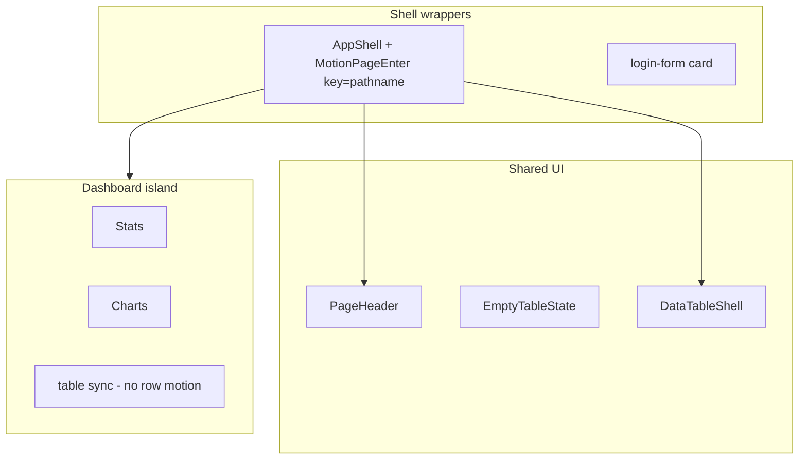

# Dashboard bar skeletons + cheap Motion app-wide

## Проблема

После lazy boundary карточка bar chart уже видна (header + expand), но `dynamic(..., { loading: () => null })` в [`scoped-dashboard-charts.tsx`](components/dashboard/scoped-dashboard-charts.tsx) оставляет **пустой CardContent** до загрузки chunk — «висит в воздухе».

Pie грузится sync и выглядит «живым»; bar charts нужен inner skeleton + лёгкий fade-in при появлении.

## Guardrails (не повторять старые грабли)

- **Не трогать** [`lib/dashboard/*`](lib/dashboard), matrix API, defer table, URL chart filters
- **Только GPU props:** `opacity`, `x`/`y`, `scale`, `rotate` — без `width`/`height`/`layout`
- **Не анимировать** строки DataTable, sidebar, inputs, 100+ элементов
- **`useReducedMotion`** — instant render без motion (как в [`overflow-text.tsx`](components/shared/overflow-text.tsx))
- Библиотека: **`motion/react`** (уже в [`package.json`](package.json)), не добавлять framer-motion

---

## Phase 1 — Motion kit (foundation)

Новая папка `components/motion/`:

| Файл | Назначение |
|------|------------|
| [`motion-presets.ts`](components/motion/motion-presets.ts) | `fadeInUp`, `fadeIn`, `pressable`, `staggerContainer` — duration 0.15–0.25s |
| [`motion-fade-in.tsx`](components/motion/motion-fade-in.tsx) | `MotionFadeIn`, `MotionStagger`, `MotionStaggerItem` — client, respects reduced motion |
| [`motion-pressable.tsx`](components/motion/motion-pressable.tsx) | `whileHover={{ scale: 1.02 }}` / `whileTap={{ scale: 0.98 }}` wrapper |
| [`index.ts`](components/motion/index.ts) | re-exports |

```tsx
// preset example
export const fadeInUp = {
  initial: { opacity: 0, y: 8 },
  animate: { opacity: 1, y: 0 },
  transition: { duration: 0.2, ease: "easeOut" },
} as const
```

---

## Phase 2 — Bar chart inner skeleton (immediate fix)

### 2.1 `DashboardChartBodySkeleton`

Новый [`dashboard-chart-body-skeleton.tsx`](components/dashboard/dashboard-chart-body-skeleton.tsx):
- Только **тело** карточки (chart area + legend grid) — без CardHeader
- Переиспользует [`DASHBOARD_CARD_CHART_HEIGHT_CLASS`](components/dashboard/chart-card-layout.tsx) + legend grid из [`dashboard-chart-card-skeleton.tsx`](components/dashboard/dashboard-chart-card-skeleton.tsx)
- Опционально: 4–6 вертикальных `Skeleton` «столбиков» в chart area для bar charts (визуально понятнее чем flat block)

Refactor [`DashboardChartCardSkeleton`](components/dashboard/dashboard-chart-card-skeleton.tsx) — compose header + `DashboardChartBodySkeleton` (DRY).

### 2.2 Dynamic loading fallback

В [`scoped-dashboard-charts.tsx`](components/dashboard/scoped-dashboard-charts.tsx):

```tsx
// было: loading: () => null
loading: () => <DashboardChartBodySkeleton />
```

Для **expanded dialog** — тот же skeleton в `dynamic` или inline fallback (если dialog открывается до load).

### 2.3 Fade-in loaded bar charts

В [`overdue-breakdown-chart-section.tsx`](components/dashboard/overdue-breakdown-chart-section.tsx) и [`completion-breakdown-chart-section.tsx`](components/dashboard/completion-breakdown-chart-section.tsx) — обернуть root в `<MotionFadeIn>` (один раз при mount).

---

## Phase 3 — Dashboard motion

| Компонент | Анимация |
|-----------|----------|
| [`dashboard-stat-cards.tsx`](components/dashboard/dashboard-stat-cards.tsx) | `MotionStagger` + `MotionStaggerItem` на каждую card (opacity + y, delay 0.04s) |
| [`status-pie-chart-section.tsx`](components/dashboard/status-pie-chart-section.tsx) | `MotionFadeIn` на chart area (как «radius chart прикольно грузится») |
| [`dashboard-chart-card.tsx`](components/dashboard/dashboard-chart-card.tsx) | Expand button → `MotionPressable` или `whileHover`/`whileTap` на ghost Button |
| [`charts-lazy-boundary.tsx`](components/dashboard/charts-lazy-boundary.tsx) | При swap skeleton → children: `MotionFadeIn` на children (opacity only, без layout) |

Pie card в grid — уже sync; bar cards — skeleton (IO) → inner skeleton (dynamic) → fade-in chart.

---

## Phase 4 — App-wide (high-leverage wrappers)

Не править 163 файла по одному — покрыть **общие точки входа**:



| Файл | Изменение |
|------|-----------|
| [`app-shell.tsx`](components/shell/app-shell.tsx) | Client wrapper `MotionPageEnter` вокруг `{children}`, `key={usePathname()}` — fade на каждой навигации (~0.2s) |
| [`page-header.tsx`](components/shared/page-header.tsx) | `"use client"` + `MotionFadeIn` на block (или thin `PageHeaderClient`) |
| [`empty-table-state.tsx`](components/platform/crud/empty-table-state.tsx) | `MotionFadeIn` |
| [`data-table-shell.tsx`](components/platform/data-table-shell.tsx) | `MotionFadeIn` на outer shell — **один** fade на всю таблицу, не на rows |
| [`login-form.tsx`](components/login-form.tsx) | Card `MotionFadeIn` + submit button `MotionPressable` |
| [`public-reports-revision-banner.tsx`](components/public/public-reports-revision-banner.tsx) | `MotionFadeIn` при mount |

**Public/report shells** — покрыты через общий `AppShell` (оба используют его).

### Explicit exclusions

- [`measures-data-table.tsx`](components/shared/measures-data-table.tsx) / [`data-table.tsx`](components/data-table/data-table.tsx) — без motion на rows
- Sidebar, breadcrumb, pagination controls — CSS hover достаточно
- Dialog radix — только если простой fade на content без ломания focus trap; иначе skip в v1

---

## Phase 5 — Verify

- `npm run typecheck` + `npm run build`
- Dashboard smoke: bar card shows **inner skeleton** (not empty) between IO mount and chunk load
- Chart filter click — no network refetch (unchanged)
- `prefers-reduced-motion: reduce` — no animation, instant content
- Tier 3 optional rebuild

### Rollback gate

Если page fade на каждой навигации раздражает — убрать `key={pathname}` из AppShell, оставить только dashboard + bar skeleton.

---

## Definition of Done

- Bar charts: never empty CardContent during chunk load
- Motion: opacity/y/scale only, reduced-motion safe
- Dashboard: stat cards stagger, pie fade, bar fade-in, expand micro-interaction
- App-wide: shell page enter + PageHeader + empty states + table shell wrapper
- Data layer и table sync mount **без изменений**

## Порядок

1. Motion kit + `DashboardChartBodySkeleton`
2. Bar dynamic fallback + chart fade-in
3. Dashboard stat cards / pie / chart card
4. AppShell + shared wrappers
5. Verify
