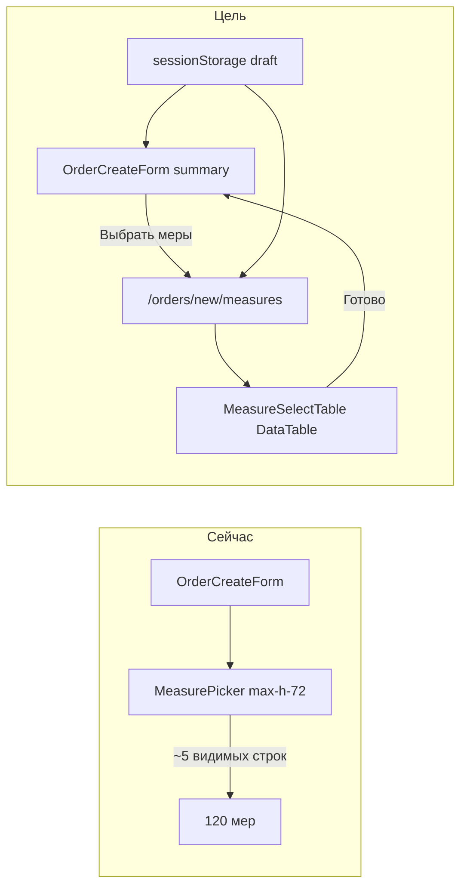

# Выбор мер при создании поручения

## Проблема

Сейчас в [`components/admin/measure-picker.tsx`](components/admin/measure-picker.tsx) все ~120 мер рендерятся в `ScrollArea` с `max-h-72` — видно ~5 строк. Поиск есть, но нет пагинации, сортировки по колонкам и колонки «Создана». API [`lib/measures/index.ts`](lib/measures/index.ts) уже отдаёт `createdAt` и сортирует `orderBy: { createdAt: "desc" }`, но форма [`components/admin/order-create-form.tsx`](components/admin/order-create-form.tsx) типизирует меры без даты и теряет UX.



---

## Решение: отдельная страница + DataTable

### 1. Черновик формы (sessionStorage + context)

**Новый файл:** [`components/admin/order-create-draft.tsx`](components/admin/order-create-draft.tsx)

- React context + hook `useOrderCreateDraft()`
- Ключ storage: `fstec:order-create-draft`
- Поля: `title`, `organizationId`, `defaultDue`, `bulkSubdivisionId`, `selectedMeasureIds: number[]`
- При mount: hydrate из `sessionStorage` (если есть)
- При изменении: debounced write в `sessionStorage` (~300ms)
- При успешном `POST /api/orders`: очистка storage

**Новый layout:** [`app/(admin)/admin/(panel)/orders/new/layout.tsx`](app/(admin)/admin/(panel)/orders/new/layout.tsx) — оборачивает `page.tsx` и `measures/page.tsx` в provider.

### 2. Главная форма создания — компактный блок «Меры»

**Изменить:** [`components/admin/order-create-form.tsx`](components/admin/order-create-form.tsx)

- Убрать inline [`MeasurePicker`](components/admin/measure-picker.tsx) и fetch мер из формы (данные подтянет страница выбора / provider)
- Layout: одна колонка `max-w-lg` для параметров (больше не нужен `lg:grid-cols-2`)
- Card «Меры»:
  - счётчик «Выбрано: N»
  - превью первых 3–5 названий + «и ещё N» (имена из кэша мер в draft или lazy fetch)
  - кнопка **«Выбрать меры»** → `/admin/orders/new/measures`
- Submit читает `selectedMeasureIds` из draft context
- `disabled` на submit если `selectedMeasureIds.length === 0`

### 3. Страница выбора мер

**Новый route:** [`app/(admin)/admin/(panel)/orders/new/measures/page.tsx`](app/(admin)/admin/(panel)/orders/new/measures/page.tsx)

- `PageHeader`: title «Выбор мер», back → `/admin/orders/new`, backLabel «Новое поручение»
- Рендерит `MeasureSelectTable`
- Sticky footer (или `FormActionsBar`): «Выбрано: N» + кнопка **«Готово»** → `router.push("/admin/orders/new")`

### 4. MeasureSelectTable — DataTable с чекбоксами

**Новый файл:** [`components/admin/measure-select-table.tsx`](components/admin/measure-select-table.tsx)

Переиспользовать паттерны из [`components/admin/measures-table.tsx`](components/admin/measures-table.tsx) + [`components/data-table/data-table.tsx`](components/data-table/data-table.tsx):

| Колонка | Поведение |
|---------|-----------|
| Checkbox | toggle строки; header — indeterminate «выбрать все на странице» |
| Название | sortable |
| Код | sortable, `font-mono` |
| Создана | sortable, `dateSortFn`, default **desc** (`initialState.sorting`) |

Toolbar (над таблицей, рядом с поиском):

- **«Выбрать все по фильтру»** — все id из `table.getFilteredRowModel()` (не только текущая страница)
- **«Снять все»** — очистить selection
- Счётчик «Выбрано: N»

Поведение строк:

- клик по строке toggles checkbox (как сейчас в MeasurePicker)
- pagination `pageSize={20}` (как в остальных таблицах)
- global search по name + code (тот же `globalFilterFn`, что в measures-table)

Props:

```ts
type MeasureSelectTableProps = {
  measures: MeasureRow[]
  selectedIds: Set<number>
  onSelectionChange: (next: Set<number>) => void
}
```

Fetch мер: один раз на странице выбора (`GET /api/measures`), передать в таблицу. Кэшировать список в draft context (для превью имён на главной форме).

### 5. Удалить MeasurePicker

[`components/admin/measure-picker.tsx`](components/admin/measure-picker.tsx) используется только в order-create-form — **удалить** после миграции (не оставлять мёртвый код).

### 6. API / backend

**Без изменений.** [`GET /api/measures`](app/api/measures/route.ts) уже возвращает `createdAt` и сортирует по дате создания.

---

## UX-поток (smoke)

1. `/admin/orders/new` — заполнить параметры, нажать «Выбрать меры»
2. `/admin/orders/new/measures` — поиск «М-», сортировка по «Создана», выбрать несколько мер с разных страниц
3. «Готово» → вернуться на форму, увидеть счётчик и превью
4. F5 на любой из двух страниц — черновик и выбор сохранены
5. «Создать поручение» → redirect на detail, storage очищен

---

## DoD

```bash
npm run typecheck && npm run lint && npm run build
```

- 120 мер доступны через поиск + пагинацию + сортировку
- Default sort: `createdAt desc`
- Выбор сохраняется между страницами и после F5 (sessionStorage)
- Inline MeasurePicker удалён

## Вне scope

- Редактирование существующего поручения (добавление мер post-create)
- Server-side pagination API (120 строк — client-side достаточно)
- Faceted filters по колонкам (можно добавить позже, если понадобится)
