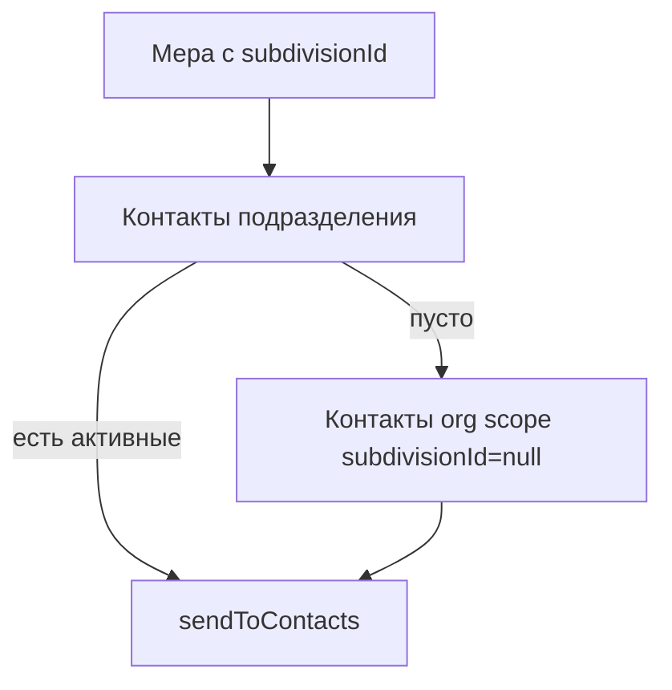

# Улучшение контактов для оповещений

## Диагностика

Текущая реализация — [`components/platform/org-contacts-panel.tsx`](components/platform/org-contacts-panel.tsx):

```127:176:components/platform/org-contacts-panel.tsx
<form className="grid gap-3 md:grid-cols-2 xl:grid-cols-3 2xl:grid-cols-6">
  ...
  <Select value={subdivisionScope}>   // SelectTrigger без w-full
  <Select value={role}>
```

**Почему «наезжает»:** на широких экранах все 6 полей в одной строке (`2xl:grid-cols-6`), а [`SelectTrigger`](components/ui/select.tsx) по умолчанию имеет `w-fit` — при выборе длинного названия подразделения триггер растягивается и перекрывает соседний select «Роль».

**Другие пробелы относительно проекта:**
- Нет `Field` / `FieldLabel` / `FieldDescription` (см. [`user-form.tsx`](components/platform/user-form.tsx), [`order-create-client.tsx`](components/platform/order-create-client.tsx))
- Таблица — [`StaticCrudTable`](components/platform/crud/static-crud-table.tsx) без поиска и фильтров (остальные списки — [`DataTable`](components/data-table/data-table.tsx))
- PATCH [`app/api/contacts/[contactId]/route.ts`](app/api/contacts/[contactId]/route.ts) есть, UI редактирования нет
- Не объяснена бизнес-логика [`resolveContactsForTarget`](lib/contacts/index.ts): для меры с подразделением берутся контакты подразделения; если их нет — fallback на контакты «Вся организация»
- Роли (`PRIMARY` / `RESPONSIBLE` / `NOTIFY`) без подсказок; ошибка `PRIMARY_CONTACT_EXISTS` уже обрабатывается API, но пользователь не видит контекста заранее



---

## Целевое UX

### 1. Форма добавления — стабильная вёрстка

Заменить 6-колоночный grid на **две логические строки** через `FieldGroup`:

| Строка | Поля |
|--------|------|
| 1 | ФИО · Email · Должность |
| 2 | Область (подразделение) · Роль · кнопка «Добавить» |

- Каждый `SelectTrigger`: `className="w-full min-w-0"` — фиксирует ширину ячейки, длинные названия обрезаются (`line-clamp-1` уже в select)
- `FieldLabel` + `FieldDescription` для:
  - **Область:** «Вся организация — резервные получатели, если у подразделения нет своих контактов»
  - **Роль:** краткие пояснения из `CONTACT_ROLE_LABELS` + «Главный — один на область»

Grid: `grid gap-4 md:grid-cols-2 lg:grid-cols-3` (макс. 3 колонки, без `2xl:grid-cols-6`).

### 2. Таблица — DataTable с фильтрами

Заменить `StaticCrudTable` на `DataTable` по образцу [`orders-table.tsx`](components/platform/orders-table.tsx):

| Колонка | Особенности |
|---------|-------------|
| ФИО | `TextCell`, sortable |
| Email | sortable, участвует в global search |
| Должность | `TruncatedCell` |
| Подразделение | faceted filter: «Вся организация» + каждое подразделение |
| Роль | faceted filter + `Badge` |
| Действия | Изменить · Удалить |

Toolbar: `searchPlaceholder="Поиск по ФИО, email, должности…"`, `globalFilterFn` по ФИО/email/должности/подразделению.

Сортировка по умолчанию: роль (PRIMARY → RESPONSIBLE → NOTIFY), затем ФИО — как в [`dedupeAndSortContacts`](lib/contacts/dedupe-contacts.ts).

### 3. Редактирование контакта (Dialog)

Новый компонент [`components/platform/contact-edit-dialog.tsx`](components/platform/contact-edit-dialog.tsx):
- Открывается из строки таблицы («Изменить»)
- Те же поля, что при добавлении (ФИО, email, должность, область, роль)
- `PATCH /api/contacts/{id}` — API уже готов
- При смене области: если контакт был org-level → subdivision-level, отправлять корректный scope (может потребоваться расширение PATCH: сейчас `updateContact` не меняет `subdivisionId` — **нужно добавить** в [`lib/contacts/index.ts`](lib/contacts/index.ts) + `updateContactSchema`)

**Важно:** проверить и при необходимости добавить поддержку смены `subdivisionId` в `updateContact` (сейчас update меняет только fullName/position/email/role/isActive). Без этого редактирование области невозможно.

### 4. Подсказки и валидация PRIMARY

- В форме добавления/редактирования: если в выбранной области уже есть PRIMARY, показывать `FieldDescription` с предупреждением (вычислять из `contacts` state)
- При ошибке API `PRIMARY_CONTACT_EXISTS` — показывать через `notify.error` (уже есть, текст понятный)
- Обновить `CardDescription` в [`org-detail-client.tsx`](components/platform/org-detail-client.tsx): кратко описать fallback org → subdivision

### 5. Структура файлов

| Файл | Изменение |
|------|-----------|
| [`components/platform/org-contacts-panel.tsx`](components/platform/org-contacts-panel.tsx) | Рефакторинг: форма + DataTable + state |
| [`components/platform/contact-edit-dialog.tsx`](components/platform/contact-edit-dialog.tsx) | **Новый** — dialog редактирования |
| [`components/platform/org-detail-client.tsx`](components/platform/org-detail-client.tsx) | Обновить описание карточки |
| [`lib/contacts/index.ts`](lib/contacts/index.ts) | `updateContact` — опционально `subdivisionId` + re-validate PRIMARY |
| [`lib/validations/contacts.ts`](lib/validations/contacts.ts) | `subdivisionId` в `updateContactSchema` (optional nullable) |
| [`lib/contacts/__tests__/contacts-crud.test.ts`](lib/contacts/__tests__/contacts-crud.test.ts) | Тест смены subdivision при update |

Extract shared field block (optional, если дублирование > ~30 строк): `ContactFormFields` внутри `org-contacts-panel.tsx` или отдельный файл — переиспользуется add-form и edit-dialog.

---

## Что сознательно не делаем

- `isActive` toggle — поле есть в БД, но не используется в UI/notifications consistently; вынести в отдельную задачу
- Combobox для подразделений — достаточно `w-full` select; combobox только если org с десятками подразделений
- Отдельная страница `/contacts` — контакты привязаны к org, текущее место верное

---

## Проверка

1. Выбрать длинное название подразделения — select не расширяется за пределы колонки, не наезжает на «Роль»
2. Фильтр по подразделению в таблице — показывает только нужные строки
3. Добавить контакт org-level + subdivision-level — оба видны, fallback понятен из подсказки
4. Редактировать email/роль/область — PATCH успешен, таблица обновляется
5. Второй PRIMARY в той же области — ошибка с понятным текстом
6. `npx vitest run lib/contacts` + smoke на `/panel/organizations/{id}`
