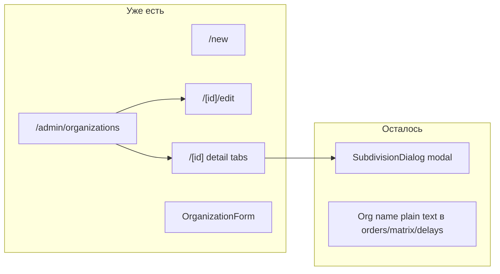

# Редактирование организаций без модалок + ссылки в таблицах

## Текущее состояние



- **Метаданные организации** (название, код) уже редактируются через страницы: [`organization-form.tsx`](components/admin/organization-form.tsx), [`/new`](app/(admin)/admin/(panel)/organizations/new/page.tsx), [`/[id]/edit`](app/(admin)/admin/(panel)/organizations/[id]/edit/page.tsx).
- **Подразделения** — единственный org-related modal: [`SubdivisionDialog`](components/admin/crud/subdivision-dialog.tsx) в [`org-detail-client.tsx`](components/admin/org-detail-client.tsx).
- **Клик по организации** в списке уже ведёт на detail ([`organizations-manager.tsx`](components/admin/organizations-manager.tsx)); в других таблицах — plain text.

**Целевой клик:** `/admin/organizations/{id}` (detail), как поручение → detail.

---

## 1. Страницы для подразделений (убрать модал)

По образцу [`measure-form.tsx`](components/admin/measure-form.tsx) + [`measures/new`](app/(admin)/admin/(panel)/measures/new/page.tsx):

**Новый компонент** [`components/admin/subdivision-form.tsx`](components/admin/subdivision-form.tsx):
- Props: `organizationId`, optional `subdivision?: { id, name }`
- `POST /api/subdivisions` / `PUT /api/subdivisions/{id}` (логика из dialog)
- После сохранения: `router.push(/admin/organizations/{organizationId})` + `router.refresh()`
- Layout: `Card` + `FormActionsBar` (как `OrganizationForm`, не `FormDialog`)

**Новые маршруты:**
- [`app/(admin)/admin/(panel)/organizations/[id]/subdivisions/new/page.tsx`](app/(admin)/admin/(panel)/organizations/[id]/subdivisions/new/page.tsx) — `getOrganization(id)`, `PageHeader`, `SubdivisionForm`
- [`app/(admin)/admin/(panel)/organizations/[id]/subdivisions/[subId]/edit/page.tsx`](app/(admin)/admin/(panel)/organizations/[id]/subdivisions/[subId]/edit/page.tsx) — загрузка подразделения, проверка `sub.organizationId === org.id`, иначе `notFound()`

**Lib:** добавить `getSubdivision(id)` в [`lib/organizations/index.ts`](lib/organizations/index.ts) для edit-страницы.

**Удалить:** [`subdivision-dialog.tsx`](components/admin/crud/subdivision-dialog.tsx) после миграции.

---

## 2. Обновить страницу организации (detail)

В [`org-detail-client.tsx`](components/admin/org-detail-client.tsx):

| Было | Станет |
|------|--------|
| `Button onClick → setDialogSub(null)` | `Button asChild` + `Link` → `.../subdivisions/new` |
| `TableRowActions onClick → setDialogSub(s)` | `href` → `.../subdivisions/{id}/edit` |
| `SubdivisionDialog` + state `dialogSub` | удалить |
| Нет кнопки редактирования org | `PageHeader.actions`: кнопка «Изменить» → `/admin/organizations/{id}/edit` |

Опционально: имя подразделения в ячейке — `Link` на edit (как мера в таблице мер); delete через `ConfirmDeleteAlert` оставить.

---

## 3. Breadcrumbs

Расширить блок organizations в [`admin-breadcrumb.tsx`](components/admin/admin-breadcrumb.tsx) по аналогии с measures:

- `/organizations/new` → «Новая {org}»
- `/organizations/[id]/edit` → «Редактирование»
- `/organizations/[id]/subdivisions/new` → `{orgName}` → «Новое подразделение»
- `/organizations/[id]/subdivisions/[subId]/edit` → `{orgName}` → «Редактирование подразделения`

На nested subdivision pages использовать `useAdminBreadcrumbMiddle` для крошки с именем организации.

---

## 4. Кликабельная организация в DataTable

Единый паттерн (как поручение в [`delay-requests-table.tsx`](components/admin/delay-requests-table.tsx)):

```tsx
<Link href={`/admin/organizations/${id}`} className="font-medium hover:underline">
  {name}
</Link>
```

| Файл | Изменение |
|------|-----------|
| [`orders-table.tsx`](components/admin/orders-table.tsx) | Тип: `organization: { id, name }`; Link в cell (данные уже приходят из Prisma) |
| [`admin-dashboard-matrix.tsx`](components/admin/admin-dashboard-matrix.tsx) | Тип: `organization: { id, name }`; Link в cell (`getScopedDashboardMatrix` уже `include: { organization: true }`) |
| [`delay-requests-table.tsx`](components/admin/delay-requests-table.tsx) | Обернуть `TruncatedCell` в Link (id уже в типе) |

**Вне scope DataTable, но согласованно:** в [`order-detail-client.tsx`](components/admin/order-detail-client.tsx) сделать `description={order.organization.name}` ссылкой на detail org (сейчас только кнопка «Ссылки ДЗО»).

API-изменения не нужны.

---

## 5. Проверка (DoD)

```bash
npm run typecheck && npm run lint && npm run build
```

**UI smoke:**
1. Список организаций → клик по имени → detail; «Изменить» → edit page; сохранение → возврат на detail.
2. Detail → «Добавить подразделение» → new page → сохранение → список обновлён.
3. Detail → edit subdivision через actions / клик по имени → edit page.
4. Таблицы поручений / сводки / переносов → клик по org → detail.
5. `SubdivisionDialog` нигде не импортируется.

---

## Объём вне задачи

- Модалки поручений (`EditOrderDialog`, `EditOrderItemDialog`) — отдельная задача.
- Перевод таблицы подразделений на `DataTable` — не требуется.
