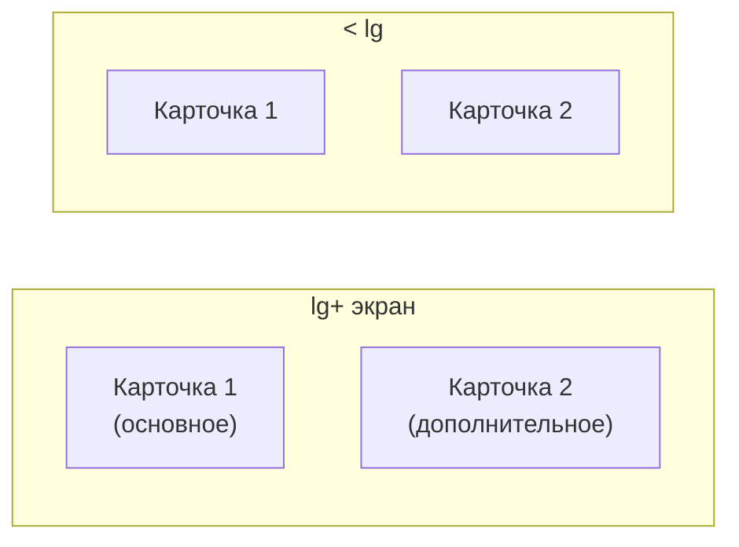

# Единая раскладка карточек и компактная таблица поручения

## Проблема

Сейчас в панели два противоречащих паттерна:

| Паттерн | Классы | Где |
|---------|--------|-----|
| **Эталон (хорошо)** | `grid gap-4 lg:grid-cols-2` | [`measure-form.tsx`](components/platform/measure-form.tsx), [`organization-form.tsx`](components/platform/organization-form.tsx) |
| **Узкая колонка (плохо)** | `max-w-lg` + вертикальный стек | [`order-create-form.tsx`](components/platform/order-create-form.tsx), [`account-settings-client.tsx`](components/platform/account-settings-client.tsx), [`user-form.tsx`](components/platform/user-form.tsx), [`general-settings-client.tsx`](components/platform/general-settings-client.tsx), [`subdivision-form.tsx`](components/platform/subdivision-form.tsx) |

На [`/panel/orders/1`](app/(platform)/panel/orders/[id]/page.tsx) таблица мер — 8 колонок без ограничений ширины, с `whitespace-nowrap` и широкими кнопками в колонках «Отчёты»/«Переносы» — не помещается на экран (в отличие от [`delay-requests-table.tsx`](components/platform/delay-requests-table.tsx)).

## Целевая конвенция



**Правила:**
- Формы с карточками: `FormCardGrid` — `grid gap-4 lg:grid-cols-2`
- Карточки идут **слева направо** на `lg+`, стекуются на мобильных
- **Одна карточка** — в левой колонке, правая пустая (выбор пользователя)
- `FormActionsBar` — **под** сеткой, на всю ширину
- Убрать `max-w-lg` с форм и карточек
- Breakpoint: `lg` (как в measure-form)

## 1. Общий компонент

Создать [`components/shared/form-card-grid.tsx`](components/shared/form-card-grid.tsx):

```tsx
export function FormCardGrid({ children, className }: { children: React.ReactNode; className?: string }) {
  return (
    <div className={cn("grid gap-4 lg:grid-cols-2", className)}>
      {children}
    </div>
  )
}
```

Экспорт из [`components/shared/index.ts`](components/shared/index.ts) (если есть barrel) или прямой импорт.

Обновить [`components/shared/form-skeleton.tsx`](components/shared/form-skeleton.tsx) — скелетон в виде 2 карточек в `FormCardGrid` (вместо узкого `max-w-lg`).

Краткая запись в [`AGENTS.md`](AGENTS.md) в секцию UI: «формы панели — `FormCardGrid`, 2 колонки с `lg`».

## 2. Миграция форм

### Уже соответствуют — только заменить inline grid на компонент

- [`measure-form.tsx`](components/platform/measure-form.tsx) — `<div className="grid gap-4 lg:grid-cols-2">` → `<FormCardGrid>`
- [`organization-form.tsx`](components/platform/organization-form.tsx) — то же

### Перевести с `max-w-lg` на `FormCardGrid`

| Файл | Карточки | Раскладка |
|------|----------|-----------|
| [`order-create-form.tsx`](components/platform/order-create-form.tsx) | Параметры \| Меры | 2 колонки; убрать `max-w-lg` с `<form>` |
| [`account-settings-client.tsx`](components/platform/account-settings-client.tsx) | Профиль \| Пароль | 2 колонки; убрать `max-w-lg` с Card |
| [`user-form.tsx`](components/platform/user-form.tsx) | Учётная запись \| Пароль | 2 колонки |
| [`general-settings-client.tsx`](components/platform/general-settings-client.tsx) | 1 карточка | левая колонка |
| [`subdivision-form.tsx`](components/platform/subdivision-form.tsx) | 1 карточка | левая колонка |

Структура после миграции (пример `order-create-form`):

```tsx
<form className="flex flex-col gap-4">
  <FormCardGrid>
    <Card>…Параметры…</Card>
    <Card>…Меры…</Card>
  </FormCardGrid>
  <FormActionsBar>…</FormActionsBar>
</form>
```

## 3. Компактная таблица `/panel/orders/[id]`

В [`order-detail-client.tsx`](components/platform/order-detail-client.tsx) применить паттерн из [`delay-requests-table.tsx`](components/platform/delay-requests-table.tsx):

**Добавить** локальный `TruncatedCell` (или вынести в `lib/data-table/truncated-cell.tsx` если дублируется третий раз).

**Ширины колонок** через `colMeta(..., { cellClassName })`:

| Колонка | cellClassName |
|---------|---------------|
| Мера | `max-w-0 min-w-[10rem] w-[28%]` + `TruncatedCell` |
| Подразделение | `max-w-0 w-[14%]` + truncate |
| Статус | `w-32` |
| Срок | `w-28` |
| Отчёты | `w-36` — компактнее: badge + `DataTableRowLink` или иконка вместо `Button`+текст |
| Переносы | `w-24` — только число + badge, без лишнего padding |
| actions | `actionsColumnMeta()` (уже есть) |

**Упростить ячейки:**
- «Отчёты»: ссылка-шеврон (`DataTableRowLink`) + badge статуса, без полноразмерной кнопки «N отчёта»
- «Переносы»: компактная кнопка с числом (как сейчас, но без лишней ширины)

Не включать глобальный `table-fixed` (по существующему решению в проекте — sticky actions + `max-w-0` + truncate).

## 4. Проверка

- `npm run typecheck && npm run lint && npm run build`
- Визуально:
  - `/panel/orders/new` — параметры слева, меры справа
  - `/panel/settings/account` — профиль слева, пароль справа
  - `/panel/measures/120/edit` — без регрессии
  - `/panel/settings/general` — одна карточка слева
  - `/panel/orders/1` — таблица без горизонтального «плывуна» на типичном экране

## Definition of Done

- Единый `FormCardGrid` используется во всех platform-формах с карточками
- Нет `max-w-lg` на multi-card формах панели
- Однокарточные формы — карточка в левой колонке
- Таблица мер на странице поручения уплотнена по образцу delay/responses tables
- Сборка зелёная
